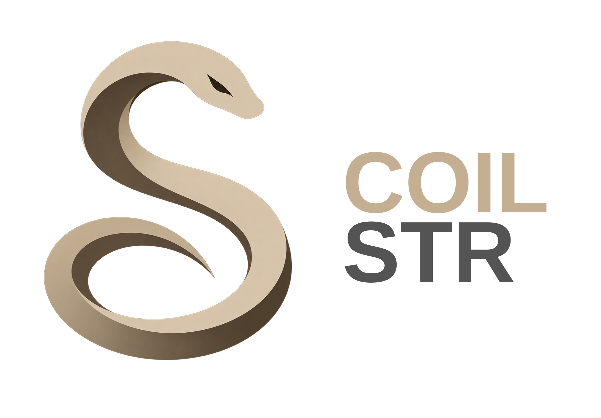

<!--
SPDX-FileCopyrightText: © 2026 Rafael V. Volkmer <rafael.v.volkmer@gmail.com>
SPDX-License-Identifier: GPL-3.0-only
-->

  [![Contributors][contributors-shield]][contributors-url]
  [![Forks][forks-shield]][forks-url]
  [![Stargazers][stars-shield]][stars-url]
  [![Issues][issues-shield]][issues-url]
  [![License][license-shield]][license-url]

---

  

  A secure no-stdlib, zero allocation, module-based string library for systems programming.

  Rafael V. Volkmer ·
  <a href="mailto:rafael.v.volkmer@gmail.com">rafael.v.volkmer@gmail.com</a>

---

...

---

<!-- BADGE LINKS -->

[contributors-shield]: https://img.shields.io/github/contributors/frostlanguage/coil.svg?style=flat-square&logo=changedetection&logoColor=white&label=Contributors&labelColor=1F2328&color=2F81F7
[contributors-url]: https://github.com/frostlanguage/coil/graphs/contributors

[forks-shield]: https://img.shields.io/github/forks/frostlanguage/coil.svg?style=flat-square&logo=forgejo&logoColor=white&label=Forks&labelColor=1F2328&color=F78166
[forks-url]: https://github.com/frostlanguage/coil/network/members

[stars-shield]: https://img.shields.io/github/stars/frostlanguage/coil.svg?style=flat-square&logo=riseup&logoColor=white&label=Stars&labelColor=1F2328&color=E3B341
[stars-url]: https://github.com/frostlanguage/coil/stargazers

[issues-shield]: https://img.shields.io/github/issues/frostlanguage/coil.svg?style=flat-square&logo=sentry&logoColor=white&label=Issues&labelColor=1F2328&color=DA3633
[issues-url]: https://github.com/frostlanguage/coil/issues

[license-shield]: https://img.shields.io/github/license/frostlanguage/coil.svg?style=flat-square&logo=libreofficeimpress&logoColor=white&label=License&labelColor=1F2328&color=3FB950
[license-url]: https://github.com/frostlanguage/coil/blob/main/LICENSE

<!-- EOF -->
