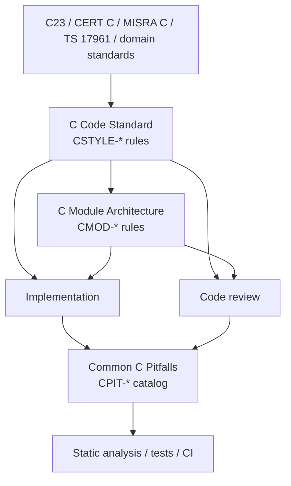

<!--
SPDX-FileCopyrightText: 2026 Rafael V. Volkmer <rafael.v.volkmer@gmail.com>
SPDX-License-Identifier: GPL-3.0-only
-->

<div align="center">

[![SEI CERT C Coding Standard][sei-cert-c-badge]][sei-cert-c]
[![MISRA C][misra-c-badge]][misra-c]
[![ISO/IEC TS 17961][iso-iec-ts-17961-badge]][iso-iec-ts-17961]
[![ISO/IEC 9899 C23][iso-iec-9899-c23-badge]][iso-iec-9899-c23]
[![NASA/JPL C][nasa-jpl-c-badge]][nasa-jpl-c]

</div>

---

# C code standard

This document defines the C coding standard for the project.

Goals:

- consistency
- readability
- maintainability
- predictable reviews

Follow this standard unless a module defines a stricter local rule.

---

## Standard usage

Read the numbered sections in order during module design. During review, open
its governing section and follow the `Related pitfalls` links for failure modes,
CWE mappings, and safety or security context.

Each project rule has a stable `CSTYLE-*` identifier. Use that identifier in
review notes, static-analysis suppressions, deviation records, and test names.
The heading states the rule. The identifier gives tooling and documentation a
stable reference independent of the prose.

The document keeps the `CSTYLE-*` prefix as a stable control namespace. The
file and title rename do not rename existing controls or break references in
CI, review records, or the pitfall catalog.

The standard separates concerns in this order:

1. style and local code shape;
2. interfaces, headers, data layout, and ABI;
3. preprocessor use and compiler extensions;
4. function contracts and control flow;
5. memory, strings, ownership, and unsafe APIs;
6. state, concurrency, casts, and pointer provenance;
7. arithmetic, bitwise operations, hardware access, and undefined behavior;
8. initialization.

---

## Document relationship

The project uses three C review documents. The [C Code Standard](./c-code-standard.md)
defines local C rules and stable `CSTYLE-*` controls. The
[C Module Architecture](./c-module-architecture.md) defines ownership, header,
build, callback, and symbol boundaries with stable `CMOD-*` controls.
[Common C Pitfalls](./c-common-pitfalls.md) maps failure modes to the controls
that prevent or constrain them.
The pitfall catalog also owns external CWE, OWASP, CAPEC, CISA KEV, CVE,
CVSS, and ISO vulnerability traceability. This standard remains the source of
normative `CSTYLE-*` implementation controls so field evidence does not rename
or destabilize coding-rule IDs.



### Common C pitfall catalog

The companion [Common C Pitfalls](./c-common-pitfalls.md) catalog covers
memory, pointers, undefined behavior, arithmetic, the standard library,
concurrency, embedded hardware, and trust boundaries. Each catalog entry points
to its primary `CSTYLE-*` rule. Catalog-linked rules include reverse links to
the related `CPIT-*` entries.

---

## Reading path

| Section                                                                                                      | Primary concern                                      | Continue with         |
| ------------------------------------------------------------------------------------------------------------ | ---------------------------------------------------- | --------------------- |
| [1. Style Practices](#1-style-practices)                                                                     | naming, formatting, declarations                     | interface rules       |
| [2. Interface and Header Practices](#2-interface-and-header-practices)                                       | module boundaries, headers, ABI                      | preprocessor rules    |
| [3. Preprocessor and Macro Practices](#3-preprocessor-and-macro-practices)                                   | macros, conditional compilation, extensions          | function contracts    |
| [4. Function Contracts and Control Flow](#4-function-contracts-and-control-flow)                             | validation, returns, SESE, loops, switches           | memory and ownership  |
| [5. Memory, Strings, and Ownership](#5-memory-strings-and-ownership)                                         | allocation, ownership, unsafe APIs, strings          | state and concurrency |
| [6. State, Concurrency, and Type Safety](#6-state-concurrency-and-type-safety)                               | shared state, synchronization, casts, provenance     | arithmetic and UB     |
| [7. Arithmetic, Bitwise, and Undefined Behavior Safety](#7-arithmetic-bitwise-and-undefined-behavior-safety) | overflow, shifts, hardware registers, floating point | initialization        |
| [8. Initialization Practices](#8-initialization-practices)                                                   | deterministic object and array state                 | summary and review    |

The numbered order moves from code shape to interfaces, behavior, ownership,
shared state, machine-level hazards, and deterministic initialization.

---

## Language model and control-flow rationale

This standard uses the imperative systems-language model for C. Program execution
uses an ordered sequence of statements that mutate state through assignments,
calls, branches, loops, and object-lifetime operations. Reviewers, compilers,
static analyzers, and tests need visible state transitions, ownership transfers,
side effects, and failure paths.

The project uses compile-time typing with weak checks. Translation assigns types
to expressions and objects. C permits implicit arithmetic conversions, explicit
casts, pointer arithmetic, implementation-defined behavior, unspecified
behavior, undefined behavior, manual storage-duration management, and direct
access to object representations. The project constrains pointers, casts,
integer conversions, macros, control flow, object lifetime, storage duration,
standard-library APIs, and target assumptions to reduce those risks.

The style follows the structured C tradition associated with
[Kernighan and Ritchie][kernighan-ritchie-c]. The second edition of *The C
Programming Language* describes ANSI C and shaped practical style and
vocabulary for generations of C programmers. [MISRA C][misra-c],
[SEI CERT C][sei-cert-c], [ISO/IEC TS 17961][iso-iec-ts-17961], and
[ISO/IEC 9899:2024 / C23][iso-iec-9899-c23] supply the project's safety and
security constraints.

At function level, the project uses Single Entry, Single Exit (SESE) for its
control-flow discipline. The standard prefers one entry point, one normal exit
label, one return path, a visible `ret` variable, and cleanup through
`function_output`. This discipline gives the project a concrete coding-rule
form of structured programming. Sequence, selection, and iteration stay
visible. The project avoids hidden exits, early returns, uncontrolled jumps,
and ad hoc cleanup paths.

A single normal exit makes resource ownership, cleanup, error propagation,
coverage, static analysis, proof obligations, and audits easier to inspect.
[Böhm and Jacopini's structured-flow work][bohm-jacopini-structured-programming]
provides one foundation. [Dijkstra's argument against unrestricted
`goto`][dijkstra-goto-harmful] supplies another. Ferrante, Ottenstein, and
Warren describe single-entry/single-exit regions in program dependence graphs
in [their PDG work][ferrante-pdg-sese].
[Program-structure-tree research][johnson-pst-sese] extends the SESE-region
model.

Follow this standard unless a module defines a stricter local rule.

---

## Safety-critical embedded domain traceability

These coding rules provide implementation-level controls for reusable C modules
in safety-critical, mission-critical, or regulated embedded software. The rules
support evidence for the domains identified by the badges above. Lifecycle
evidence, hazard analysis, threat modeling, certification artifacts, safety
cases, and approval from the applicable authority remain separate requirements.

---
Normative reference sections contain intentional requirement keywords,
identifiers, API names, standards names, and compact table cells. Spelling,
acronym, and prose checks scan this content with the rest of the document.

## 1. Style Practices

This section defines naming, organization, and formatting rules.

### 1.1 Naming and Project Structure

**Rule ID:** `CSTYLE-001-1-1-naming-and-project-structure`

#### 1.1.1 Variables

**Rule ID:** `CSTYLE-002-1-1-1-variables`

Use `snake_case`.

Use explicit unit suffixes when the variable stores a measurable quantity.

Prefer suffixes such as:

- `_ms`
- `_us`
- `_ns`
- `_bytes`
- `_count`
- `_idx`
- `_pct`

```c id=variables-example
int my_variable = 0;
size_t user_count = 0u;
size_t buffer_size_bytes = 0u;
uint32_t timeout_ms = 0u;
size_t payload_bytes = 0u;
```

#### 1.1.2 Functions

**Rule ID:** `CSTYLE-003-1-1-2-functions`

Use the visibility level to choose the module prefix.

Rules:

- public API functions use `MODULE_myFunction`
- `MODULE` uses `SCREAMING_CASE`
- module-internal and private functions use `module_myFunction`
- the internal `module` prefix uses lowercase project naming
- every function suffix uses `lowerCamelCase`
- symbol visibility and export controls, not spelling alone, define the ABI

```c id=functions-example
static int module_parseValue(int my_arg);
static inline int util_parseString(int my_arg);
int NETWORK_sendPacket(int my_arg);
```

The [C Module Architecture](./c-module-architecture.md#84-public-symbol-naming-must-reveal-only-the-public-api)
defines the matching public, internal, and private symbol levels.

#### 1.1.3 Types

**Rule ID:** `CSTYLE-004-1-1-3-types`

Use `snake_case` with `_t` suffix.

```c id=types-example
typedef enum MemoryStateMachine
{
    MEM_STATE_STOP  = 0u,
    MEM_STATE_START = 1u,
    MEM_STATE_IDLE  = 2u,
    MEM_STATE_MAX   = 3u
} mem_state_t;

typedef struct IntWrapper
{
    int value;
} int_wrapper_t;

typedef void (*callback_fn_t)(int_wrapper_t *item);
```

#### 1.1.4 Struct and Enum Tags

**Rule ID:** `CSTYLE-005-1-1-4-struct-and-enum-tags`

Use `UpperCamelCase` for struct and enum tags.

```c id=struct-and-enum-tags-example
typedef struct IntWrapper
{
    int value;
} int_wrapper_t;

typedef enum UserStatus
{
    USER_ACTIVE   = 0u,
    USER_INACTIVE = 1u,
    USER_MAX      = 2u
} user_status_t;
```

#### 1.1.5 Enum Constants

**Rule ID:** `CSTYLE-006-1-1-5-enum-constants`

Use `SCREAMING_CASE` with a module prefix.

```c id=enum-constants-example
typedef enum MemoryStateMachine
{
    MEM_STATE_STOP  = 0u,
    MEM_STATE_START = 1u,
    MEM_STATE_IDLE  = 2u,
    MEM_STATE_MAX   = 3u
} mem_state_t;
```

#### 1.1.6 Enum Sequence Rules

**Rule ID:** `CSTYLE-007-1-1-6-enum-sequence-rules`

Rules:

1. Numeric values must use lowercase `u`.
2. Align `=` vertically.
3. Include a final `*_MAX` entry for sequential enums.
4. `*_MAX` stores the element count and is not a normal value.
5. Write sequential numeric values explicitly.

```c id=enum-sequence-rules-example
typedef enum MemoryStateMachine
{
    MEM_STATE_STOP  = 0u,
    MEM_STATE_START = 1u,
    MEM_STATE_IDLE  = 2u,
    MEM_STATE_SLEEP = 3u,

    /* element count */
    MEM_STATE_MAX   = 4u
} mem_state_t;
```

#### 1.1.7 Labels

**Rule ID:** `CSTYLE-008-1-1-7-labels`

Use `snake_case`.

```c id=labels-example
goto function_output;

function_output:
    return ret;
```

#### 1.1.8 Macros and Defines

**Rule ID:** `CSTYLE-009-1-1-8-macros-and-defines`

Use `SCREAMING_CASE`.

Project identifiers must never begin with `__` or with `_` followed by an
uppercase letter. Those forms belong to namespaces reserved for the C
implementation.

When a project-defined macro or adapter symbol needs an explicit marker for
compiler, platform, or system-specific behavior, use the suffix `__` instead.
The suffix is part of the project naming convention and does not grant access
to implementation-reserved namespaces.

Compiler-provided spellings such as `__attribute__` and `__builtin_*` are not
project identifiers. They may appear only inside compiler adapter code and must
be hidden behind project-defined names before ordinary project code uses them.

```c id=macros-and-defines-example
#define MAX_LEN         ((size_t)(10U))
#define BUFFER_ALIGN    ((size_t)(8U))
#define VERSION_CHECK__ ((uint32_t)(100U))
```

#### 1.1.9 Macro Arguments

**Rule ID:** `CSTYLE-010-1-1-9-macro-arguments`

Use `snake_case` and end with `_`.

```c id=macro-arguments-example
#define STRINGIFY_TOKEN(token_) \
    #token_
```

#### 1.1.10 File Names

**Rule ID:** `CSTYLE-011-1-1-10-file-names`

Use `snake_case` for `.c` and `.h` file names.

Reasons:

- consistent with variable naming in C
- common in Unix-style projects
- easy to read
- avoids confusion on case-sensitive file systems

Examples:

```text
memory_manager.c
memory_manager.h
network_socket.c
network_socket.h
packet_parser.c
```

#### 1.1.11 Directory Names

**Rule ID:** `CSTYLE-012-1-1-11-directory-names`

Prefer `snake_case` for directory names.

This keeps module structure consistent with file naming and makes paths more
predictable.

Examples:

```text
src/
include/
memory_manager/
network_layer/
file_system/
```

Short directory names such as `src`, `net`, `mem`, or `util` are also
acceptable when they are already well understood in the project context.

#### 1.1.12 Repository Name

**Rule ID:** `CSTYLE-013-1-1-12-repository-name`

For repository names, prefer one of these patterns:

- `snake_case`
- `kebab-case`
- a single lowercase word

Examples:

```text
packet_router
memory_manager
network_stack
packet-router
memory-manager
network-stack
sqlite
redis
systemd
```

For this project family, prefer `snake_case` unless an external hosting or
distribution convention requires a different style.

### 1.2 Formatting and Local Code Style

**Rule ID:** `CSTYLE-014-1-2-formatting-and-local-code-style`

This section defines formatting and local declaration style rules.

#### 1.2.1 Line Length

**Rule ID:** `CSTYLE-015-1-2-1-line-length`

Never exceed 80 characters per line.

This improves:

- readability
- side-by-side diffs
- review quality

#### 1.2.2 Long Line Breaking

**Rule ID:** `CSTYLE-016-1-2-2-long-line-breaking`

Break long lines at logical boundaries:

- function parameters
- function calls
- long expressions
- struct initializers
- array initializers

```c id=long-line-breaking-example
int ret = EXIT_SUCCESS;

ret = EX_performComplexCalculation(input_value_a,
                                   input_value_b,
                                   input_value_c,
                                   config_ptr);
if (ret != EXIT_SUCCESS)
    goto function_output;
```

#### 1.2.3 Continued-Line Indentation

**Rule ID:** `CSTYLE-017-1-2-3-continued-line-indentation`

Indent continuation lines consistently.

Prefer:

- alignment with the opening expression, or
- one additional indentation level

```c id=continued-line-indentation-prefer
bool is_ready = false;

is_ready =
    has_input &&
    has_capacity &&
    is_initialized;
```

#### 1.2.4 Long Strings

**Rule ID:** `CSTYLE-018-1-2-4-long-strings`

Split long string literals with explicit concatenation.

```c id=long-strings-example
const char *msg =
    "This is a very long error message "
    "that needs to be split across multiple lines.";
```

#### 1.2.5 Brace Style

**Rule ID:** `CSTYLE-019-1-2-5-brace-style`

Use Allman style.

Correct:

```c id=brace-style-correct
void EX_example(void)
{
    if (condition)
    {
        EX_doSomething();
        EX_doSomething();
    }
    else
    {
        EX_doSomethingElse();
        EX_doSomethingElse();
    }
}
```

Not acceptable:

```c id=brace-style-not-acceptable
void EX_example(void) {
    if (condition) {
        EX_doSomething();
        EX_doSomething();
    } else {
        EX_doSomethingElse();
        EX_doSomethingElse();
    }
}
```

#### 1.2.6 Spaces Around Operators

**Rule ID:** `CSTYLE-020-1-2-6-spaces-around-operators`

Always use spaces around operators.

Correct:

```c id=spaces-around-operators-correct
#define EX_DEFAULT_VALUE  ((int)(10U))

bool is_equal = false;
bool is_ready = false;

is_equal = (value_a == value_b);
is_ready = is_enabled && has_input;

if (value == EX_DEFAULT_VALUE)
    EX_doSomething();
```

Not acceptable:

```c id=spaces-around-operators-not-acceptable
#define EX_DEFAULT_VALUE  ((int)(10U))

int sum=a+b;
int product=x*y;

if(value==EX_DEFAULT_VALUE)
    EX_doSomething();
```

#### 1.2.7 Parentheses in Expressions

**Rule ID:** `CSTYLE-021-1-2-7-parentheses-in-expressions`

Use parentheses to make precedence explicit in algebraic and logical
expressions.

Correct:

```c id=parentheses-in-expressions-correct
#define EX_VALUE_A  ((uint32_t)(1U))
#define EX_VALUE_B  ((uint32_t)(2U))
#define EX_VALUE_C  ((uint32_t)(3U))
#define EX_VALUE_D  ((uint32_t)(1U))

uint32_t total = 0u;

total =
    ((EX_VALUE_A + EX_VALUE_B) *
     (EX_VALUE_C - EX_VALUE_D));

if ((value_x > value_y) && (value_y != 0))
    EX_doSomething();
```

Not acceptable:

```c id=parentheses-in-expressions-not-acceptable
int total = value_a + value_b * value_c - value_d;

if (value_x > value_y && value_y != 0)
    EX_doSomething();
```

#### 1.2.8 Single-Line `if` and Loop Bodies

**Rule ID:** `CSTYLE-022-1-2-8-single-line-if-and-loop-bodies`

Rules:

- never put condition and action on the same line
- braces are optional only for a single statement
- if more than one statement exists, braces are mandatory

Correct:

```c id=single-line-if-and-loop-bodies-correct
size_t index = 0u;

if (flag)
    EX_doSomething();

for (index = 0u; index < count; index++)
    flags[index] = false;

if (flag)
{
    EX_doFirst();
    EX_doSecond();
}
```

Not acceptable:

```c id=single-line-if-and-loop-bodies-not-acceptable
#define EX_ERROR_VALUE  (-EINVAL)

size_t index = 0u;

if (flag) return EX_ERROR_VALUE;

for (index = 0u; index < count; index++) sum += array[index];

if (flag)
    EX_doFirst();
    EX_doSecond();
```

#### 1.2.9 Pointer Position

**Rule ID:** `CSTYLE-023-1-2-9-pointer-position`

Keep `*` attached to the variable name.

Correct:

```c id=pointer-position-correct
int data = 0;
int *ptr1 = (int *)(NULL);
int *ptr2 = (int *)(NULL);
char *buffer = (char *)(NULL);
int *const ptr = &data;
```

Not acceptable:

```c id=pointer-position-not-acceptable
int* ptr1, ptr2;
int * ptr1, * ptr2;
int* const ptr = NULL;
```

#### 1.2.10 Const Correctness

**Rule ID:** `CSTYLE-024-1-2-10-const-correctness`

Use `const` whenever possible.

This improves:

- intent clarity
- protection against accidental writes
- API readability
- compiler-assisted validation

Rules:

- use `const` for values that must not be modified
- use `*const` when the pointer address itself must not change
- use both when neither the pointed value nor the pointer address should
  change
- prefer the most restrictive correct form

```c id=const-correctness-example
#define EX_CONST_VALUE       ((int)(10U))
#define EX_READ_ONLY_VALUE   ((int)(20U))
#define EX_FIXED_VALUE       ((int)(30U))

const int value = EX_CONST_VALUE;

int data = 0;
int *const data_ptr = &data;

const int read_only_value = EX_READ_ONLY_VALUE;
const int *read_only_ptr = &read_only_value;

const int fixed_value = EX_FIXED_VALUE;
const int *const fixed_ptr = &fixed_value;
```

---

## 2. Interface and Header Practices

This section defines header, module boundary, and binary interface rules.

### 2.1 Header Inclusion and Visibility

**Rule ID:** `CSTYLE-025-2-1-header-inclusion-and-visibility`

#### 2.1.1 Header Inclusion Policy

**Rule ID:** `CSTYLE-026-2-1-1-header-inclusion-policy`

Use standard preprocessor include guards in project header files.

Rules:

- every project header must define one unique include guard
- derive the guard from the project, module, and header name when needed
- use `SCREAMING_CASE` and end header guard identifiers with `_H`
- use explicit `#if !defined(...)` instead of `#ifndef`
- do not use `#pragma once` as the project header-inclusion mechanism
- when touching an old project header, migrate `#pragma once` to an include
  guard unless an external or generated file must remain unchanged

Prefer:

```c id=header-inclusion-policy-example
#if !defined(APP_CONFIG_H)
#define APP_CONFIG_H

#include <stdint.h>

typedef struct AppConfig
{
    uint32_t id;
} app_config_t;

#endif
```

#### 2.1.2 Advantages of Include Guards

**Rule ID:** `CSTYLE-027-2-1-2-advantages-of-include-guards`

Include guards are the project default because they use standard C
preprocessing facilities and do not require a compiler-specific pragma.

Advantages:

- work through standard preprocessing directives across conforming toolchains
- keep header inclusion independent of compiler-specific `#pragma once`
  behavior
- give each public header an explicit and reviewable identity macro
- remain predictable in generated, copied, vendored, or unusual build layouts
- align with the project's explicit `defined(...)` preprocessor style

The guard name must be unique enough to avoid collisions with other project,
third-party, generated, or platform headers. Add a project or module prefix
when the file name alone does not provide sufficient uniqueness.

`#pragma once` is widely supported by common compilers, but it is not the
project default because ISO C does not standardize the `once` pragma semantics.
Portable project headers must not depend on that extension.

Avoid:

```c id=advantages-of-include-guards-avoid
#pragma once

#include <stdint.h>

typedef struct AppConfig
{
    uint32_t id;
} app_config_t;
```

#### 2.1.3 Include Order

**Rule ID:** `CSTYLE-028-2-1-3-include-order`

Headers must be included in the following order:

1. the module's own header
2. standard library headers
3. third-party library headers
4. project headers

Rules:

- separate each include group with one blank line
- headers inside each group must be ordered alphabetically
- include the module's own header first so it proves the header is
  self-contained

Why this order is preferred:

- the own header first exposes missing dependencies immediately
- standard library headers are stable and easy to identify
- third-party dependencies stay visually separated from project code
- project headers at the end make internal dependencies explicit
- alphabetical ordering reduces noisy diffs and makes missing includes easier
  to spot

Prefer:

```c id=include-order-prefer
#include "network_socket.h"

#include <errno.h>
#include <stdlib.h>
#include <string.h>

#include <openssl/ssl.h>

#include "memory_manager.h"
#include "packet_parser.h"
```

Avoid:

```c id=include-order-avoid
#include <stdlib.h>
#include "packet_parser.h"
#include "network_socket.h"
#include <string.h>
#include "memory_manager.h"
```

#### 2.1.4 External Dependency Wrappers

**Rule ID:** `CSTYLE-029-2-1-4-external-dependency-wrappers`

**Related pitfalls:**

- [CPIT-099: Homegrown cryptography](./c-common-pitfalls.md#cpit-099-homegrown-cryptography)

Do not spread third-party APIs directly across the codebase.

When using an external library, prefer local wrapper macros or wrapper
functions in a dedicated adapter header or module.

Prefer:

```c id=external-dependency-wrappers-prefer
#if !defined(SSL_WRAPPER_H)
#define SSL_WRAPPER_H

#include <errno.h>
#include <stdlib.h>

#include <openssl/ssl.h>

static inline int SSL_WRAP_ctxNew(SSL_CTX **ctx_out)
{
    int ret = EXIT_SUCCESS;

    SSL_CTX *ctx = (SSL_CTX *)(NULL);

    if (ctx_out == (SSL_CTX **)(NULL))
    {
        ret = -EINVAL;
        goto function_output;
    }

    if (*ctx_out != (SSL_CTX *)(NULL))
    {
        ret = -EINVAL;
        goto function_output;
    }

    ctx = SSL_CTX_new(TLS_client_method());
    if (ctx == (SSL_CTX *)(NULL))
    {
        ret = -EIO;
        goto function_output;
    }

    *ctx_out = ctx;

function_output:
    return ret;
}

static inline void SSL_WRAP_ctxFree(SSL_CTX **ctx)
{
    if ((ctx != (SSL_CTX **)(NULL)) &&
        (*ctx != (SSL_CTX *)(NULL)))
    {
        SSL_CTX_free(*ctx);
        *ctx = (SSL_CTX *)(NULL);
    }
}

#endif
```

Usage:

```c id=external-dependency-wrappers-usage
#include "ssl_wrapper.h"

#include <stdlib.h>

int APP_main(void)
{
    int ret = EXIT_SUCCESS;

    SSL_CTX *ctx = (SSL_CTX *)(NULL);

    ret = SSL_WRAP_ctxNew(&ctx);
    if (ret != EXIT_SUCCESS)
        goto function_output;

function_output:
    SSL_WRAP_ctxFree(&ctx);

    return ret;
}
```

Rules:

- do not expose third-party calls directly in unrelated modules
- prefer project-controlled wrappers for version-sensitive APIs
- prefix wrappers with a project or adapter namespace
- prefer `static inline` wrappers over macros when type safety matters
- document any wrapper that changes behavior, ownership, or casting

Why this rule exists:

- it isolates external API changes to one place
- it reduces namespace collisions from external macros and symbols
- it makes backend replacement or multi-platform support easier
- it keeps call sites consistent across the project

Why `static inline` is often better than `#define`:

- argument and return types are checked by the compiler
- the debugger can usually show the wrapper in call flow more clearly
- stepping in tools such as GDB is easier than with raw macro substitution
- it avoids accidental textual substitution problems from macros

### 2.2 Header Content and Interface Boundaries

**Rule ID:** `CSTYLE-030-2-2-header-content-and-interface-boundaries`

#### 2.2.1 File Size

**Rule ID:** `CSTYLE-031-2-2-1-file-size`

Very large files are harder to review, understand, and maintain.

Recommended limits:

- `.c` files: `<= 1000` lines
- `.h` files: `<= 500` lines

Rules:

- if a file grows beyond these limits, split the module into smaller units
- split by responsibility, not arbitrarily by line count
- prefer creating focused submodules over keeping one large mixed-purpose
  file

#### 2.2.2 Module Cohesion

**Rule ID:** `CSTYLE-032-2-2-2-module-cohesion`

Each module should have one clear responsibility.

Rules:

- a module must group closely related behavior, data, and interfaces
- avoid "god modules" that mix unrelated domains
- if a module starts handling unrelated responsibilities, split it into
  smaller focused modules
- file splitting must follow responsibility boundaries, not arbitrary naming

Why this rule exists:

- cohesive modules are easier to review, test, and replace
- clear boundaries reduce hidden coupling between unrelated features
- smaller focused modules improve long-term maintainability

#### 2.2.3 Header Content Rules

**Rule ID:** `CSTYLE-033-2-2-3-header-content-rules`

Headers must contain only the public interface of a module.

Allowed in headers:

- `typedef`
- `enum`
- required macros
- function prototypes
- small `static inline` functions when justified

Avoid in headers:

- mutable state
- file-scope variable definitions
- complex logic
- private implementation details that belong in the `.c` file

Avoid:

```c id=header-content-rules-avoid
static int global_value = 0;
```

Why this rule exists:

- the header is the visibility contract exported to other modules
- it tells other translation units what symbols and types they may use
- the linker resolves symbol definitions from compiled `.c` files, not from
  declarations alone
- putting mutable state or heavy logic in headers increases coupling and can
  create duplicated definitions across translation units
- keeping headers interface-only makes module boundaries clearer and binary
  linkage safer

#### 2.2.4 Self-Contained Headers

**Rule ID:** `CSTYLE-034-2-2-4-self-contained-headers`

Every header must be self-contained.

Rules:

- a header must compile correctly when included in an otherwise empty source
  file
- a header must include every dependency required by its own declarations
- do not rely on transitive includes from unrelated headers

Validation example:

```c id=self-contained-headers-example
#include "my_header.h"

int main(void)
{
    return 0;
}
```

Why this rule exists:

- it prevents hidden include dependencies
- it makes headers safer to reuse in other modules
- it exposes missing standard or project includes immediately

### 2.3 Data Layout and ABI

**Rule ID:** `CSTYLE-035-2-3-data-layout-and-abi`

#### 2.3.1 Explicit Integer Types

**Rule ID:** `CSTYLE-036-2-3-1-explicit-integer-types`

Prefer fixed-width integer types in data structures and externally visible
data layouts.

Prefer:

- `uint8_t`
- `uint16_t`
- `uint32_t`
- `uint64_t`
- `int8_t`
- `int16_t`
- `int32_t`
- `int64_t`

This is especially important for:

- protocols
- file formats
- network payloads
- binary layouts

Why this rule exists:

- it reduces portability bugs
- it makes storage size explicit
- it avoids ambiguity across compilers and architectures

#### 2.3.2 Enum vs Macro Constants

**Rule ID:** `CSTYLE-037-2-3-2-enum-vs-macro-constants`

Prefer `enum` when a group of constants shares the same domain context.

Prefer `enum` for:

- state machines
- command identifiers
- modes
- indexed collections
- any closed set of related values

Prefer macros for:

- compile-time constants without a shared domain
- bit masks
- preprocessor-controlled values
- typed literal helpers

Why this rule exists:

- `enum` expresses that values belong to the same conceptual set
- related constants become easier to review and maintain together
- enum-based groups work better with `_MAX` patterns and indexed arrays

Prefer:

```c id=enum-vs-macro-constants-prefer
typedef enum DeviceState
{
    DEVICE_STATE_OFF  = 0u,
    DEVICE_STATE_INIT = 1u,
    DEVICE_STATE_RUN  = 2u,

    /*< Enum max value >*/
    DEVICE_STATE_MAX  = 3u
} device_state_t;
```

Avoid:

```c id=enum-vs-macro-constants-avoid
#define DEVICE_STATE_OFF   (0u)
#define DEVICE_STATE_INIT  (1u)
#define DEVICE_STATE_RUN   (2u)
```

#### 2.3.3 Struct Serialization

**Rule ID:** `CSTYLE-038-2-3-3-struct-serialization`

**Related pitfalls:**

- [CPIT-028: Union pointer confusion](./c-common-pitfalls.md#cpit-028-union-pointer-confusion)

Never serialize a `struct` directly by copying its raw memory image.

Avoid:

```c id=struct-serialization-avoid
typedef struct Packet
{
    uint32_t id;
    uint16_t size;
} packet_t;

memcpy(packet_buffer, &packet, sizeof(packet));
```

Problems:

- compiler-inserted padding may be present
- endianness may differ
- ABI and layout may differ across compilers or platforms

Prefer explicit field-by-field serialization or a dedicated serialization
function.

Prefer:

```c id=struct-serialization-prefer
#define PACKET_SERIALIZED_SIZE_BYTES  ((size_t)(6U))

int PACKET_serialize(const packet_t *packet,
                     uint8_t *buffer,
                     size_t buffer_size)
{
    int ret = EXIT_SUCCESS;

    size_t offset = 0u;

    if ((packet == (const packet_t *)(NULL)) ||
        (buffer == (uint8_t *)(NULL)))
    {
        ret = -EINVAL;
        goto function_output;
    }

    if (buffer_size < PACKET_SERIALIZED_SIZE_BYTES)
    {
        ret = -ENOSPC;
        goto function_output;
    }

    ret = BYTE_writeU32Be(buffer,
                          buffer_size,
                          &offset,
                          packet->id);
    if (ret != EXIT_SUCCESS)
        goto function_output;

    ret = BYTE_writeU16Be(buffer,
                          buffer_size,
                          &offset,
                          packet->size);
    if (ret != EXIT_SUCCESS)
        goto function_output;

function_output:
    return ret;
}
```

Or:

```c id=struct-serialization-alternative
int PACKET_serialize(const packet_t *packet, uint8_t *buffer);
```

#### 2.3.4 Struct Layout Awareness

**Rule ID:** `CSTYLE-039-2-3-4-struct-layout-awareness`

Never depend on the implicit in-memory layout of a `struct`.

Rules:

- order fields by size whenever possible: `64-bit`, `32-bit`, `16-bit`,
  `8-bit`
- use explicit padding when a stable layout is required
- do not assume that field order alone removes all ABI risk

Prefer:

```c id=struct-layout-awareness-prefer
typedef struct Example
{
    uint64_t timestamp;
    uint32_t id;
    uint16_t size;
    uint8_t flags;
} example_t;
```

When a stable layout is required, explicit padding is acceptable:

```c id=struct-layout-awareness-example
typedef struct Data
{
    uint8_t flag;
    uint8_t pad[3];
    uint32_t value;
} data_t;
```

#### 2.3.5 Struct Comparison

**Rule ID:** `CSTYLE-040-2-3-5-struct-comparison`

Do not use `memcmp` to compare structs.

Why this rule exists:

- padding bytes may contain indeterminate values
- two logically equal structs may have different padding bytes

Prefer field-by-field comparison:

```c id=struct-comparison-example
bool is_equal = false;

is_equal =
    (data_a.flag == data_b.flag) &&
    (data_a.value == data_b.value);
```

#### 2.3.6 Public Struct ABI

**Rule ID:** `CSTYLE-041-2-3-6-public-struct-abi`

Be careful when exposing complete struct definitions in public headers.

If a struct is part of a public interface, its layout becomes part of the
module ABI and future changes may break binary compatibility.

Prefer opaque structs for public modules that may evolve:

```c id=public-struct-abi-example
typedef struct Config config_t;

config_t *CONFIG_create(void);
void CONFIG_destroy(config_t *cfg);
```

Implementation:

```c id=public-struct-abi-implementation
struct Config
{
    int timeout;
    int retries;
    int flags;
};
```

---

## 3. Preprocessor and Macro Practices

This section defines macro, conditional compilation, and preprocessor rules.

### 3.1 Macro Definition Style

**Rule ID:** `CSTYLE-042-3-1-macro-definition-style`

#### 3.1.1 Macro Literal and Structure Rules

**Rule ID:** `CSTYLE-043-3-1-1-macro-literal-and-structure-rules`

Rules:

- use uppercase suffixes for macro literals: `U`, `ULL`, `F`
- floats in macros must include a decimal point
- cast numeric values to the intended type
- wrap the full macro value in parentheses
- keep multi-line macro backslashes aligned consistently

```c id=macro-literal-and-structure-rules-example
#define MAX_COUNT   ((size_t)(100U))
#define LARGE_VALUE ((uint64_t)(1000ULL))
#define PI_APPROX   ((float)(3.14F))
#define BUFFER_SIZE ((size_t)(256U))
```

#### 3.1.2 Multi-Statement Macros

**Rule ID:** `CSTYLE-044-3-1-2-multi-statement-macros`

Use `do { ... } while (0)` for macros without return value.

```c id=multi-statement-macros-example
#define APP_ASSIGN_PAIR(first_ptr_, first_value_, \
                        second_ptr_, second_value_) \
    do                                                \
    {                                                 \
        *(first_ptr_) = (first_value_);               \
        *(second_ptr_) = (second_value_);             \
    } while (0)
```

Use `({ ... })` only when the compiler/project allows it and the macro must
return a value. Because this is compiler-specific behavior, the project macro
uses the trailing `__` adapter marker.

```c id=multi-statement-macros-example-2
#define MIN_VALUE__(value_a_, value_b_) \
    ({                                    \
        typeof(value_a_) value_a_tmp =    \
            (value_a_);                   \
        typeof(value_b_) value_b_tmp =    \
            (value_b_);                   \
        (value_a_tmp < value_b_tmp)       \
            ? value_a_tmp                 \
            : value_b_tmp;                \
    })
```

The temporary assignment pattern evaluates each macro argument only once.
This prevents repeated-evaluation bugs and preserves the original argument
type. Callers still must not pass side-effecting expressions into macro
arguments. The block-scoped temporaries in this GNU statement expression are
part of the documented compiler-adapter deviation and are not permitted in
ordinary project functions.

#### 3.1.3 Preprocessor Restrictions

**Rule ID:** `CSTYLE-045-3-1-3-preprocessor-restrictions`

Preprocessor usage must stay simple enough for review and static analysis.

Rules:

- do not use a function-like macro when `static inline` is possible
- do not redefine C keywords, standard names, or project public symbols
- do not write macros that depend on argument evaluation side effects
- do not generate `#include` targets through macros
- do not use conditional compilation to silently change public ABI
- every feature macro must have a documented default
- every generated symbol must use a project or module namespace

Avoid:

```c id=preprocessor-restrictions-avoid
#define malloc(size_)  MEM_malloc(size_)
#define INCLUDE_FILE(name_)  <name_>
#include INCLUDE_FILE(config.h)
```

Prefer:

```c id=preprocessor-restrictions-prefer
#if !defined(MEM_FEATURE_STATS)
#define MEM_FEATURE_STATS  ((int)(0))
#endif
```

#### 3.1.4 Magic Numbers

**Rule ID:** `CSTYLE-046-3-1-4-magic-numbers`

Magic numbers are prohibited.

Rules:

- do not place unnamed numeric literals directly in logic, conditions, or
  calculations
- move repeated or meaningful numeric values to named `#define` constants
- macro names for numeric constants must describe the domain meaning, not
  just the raw value
- exceptions are limited to obvious neutral literals such as `0`, `1`, and
  `NULL` when they are idiomatic and self-explanatory

Prefer:

```c id=magic-numbers-prefer
#define RETRY_LIMIT        ((uint32_t)(3U))
#define TEMPERATURE_MAX_C  ((int)(85U))

if (retry_count >= RETRY_LIMIT)
    EX_handleError();

if (temperature > TEMPERATURE_MAX_C)
    EX_shutdownOutput();
```

Avoid:

```c id=magic-numbers-avoid
if (retry_count >= 3U)
    EX_handleError();

if (temperature > 85)
    EX_shutdownOutput();
```

#### 3.1.5 Token Pasting and Stringification

**Rule ID:** `CSTYLE-047-3-1-5-token-pasting-and-stringification`

Use token pasting (`##`) only for controlled boilerplate generation.

The `##` operator concatenates preprocessor tokens. It does not create
strings; it creates code tokens.

Example:

```c id=token-pasting-and-stringification-example
#define MAKE_VAR(name_)  int module_##name_

MAKE_VAR(foo);
```

The example above expands to:

```c id=token-pasting-and-stringification-example-2
int module_foo;
```

Rules:

- always prefix generated symbols with a module or adapter namespace
- use only programmer-controlled tokens
- do not generate identifiers from external or runtime data
- keep generated names meaningful and domain-specific
- do not use token pasting to hide complex logic
- prefer `static inline`, arrays, structs, or normal functions when the
  macro becomes hard to read

Prefer:

```c id=token-pasting-and-stringification-prefer
#define APP_DECLARE_FLAG(name_, bit_) \
    enum                              \
    {                                 \
        APP_FLAG_##name_ =            \
            (1U << (bit_))            \
    }

APP_DECLARE_FLAG(READ, 0U);
APP_DECLARE_FLAG(WRITE, 1U);
```

Why this rule exists:

- namespaced generated symbols reduce collision risk
- controlled token generation keeps the produced identifiers valid and
  reviewable
- combining `##` with `#` can help debug generated symbols
- excessive token pasting harms readability and makes macro debugging harder

#### 3.1.6 No Side Effects in Macro Arguments

**Rule ID:** `CSTYLE-048-3-1-6-no-side-effects-in-macro-arguments`

Do not pass expressions with side effects into macros.

Rules:

- do not pass `i++`, `--value`, assignments, or function calls with side
  effects into macro arguments
- even when a macro appears safe, side-effecting arguments reduce
  readability and increase review risk
- prefer assigning the value to a temporary variable before invoking the
  macro

Avoid:

```c id=no-side-effects-in-macro-arguments-avoid
result = MAX(value_a++, value_b);
flags = SET_MASK(register_value, get_mask());
```

Prefer:

```c id=no-side-effects-in-macro-arguments-prefer
uint32_t mask = 0u;
uint32_t value_a_tmp = 0u;

value_a_tmp = value_a;
mask = MASK_getCurrent();

result = UTIL_MAX(value_a_tmp, value_b);
flags = REG_SET_MASK(register_value, mask);
```

### 3.2 Conditional Compilation

**Rule ID:** `CSTYLE-049-3-2-conditional-compilation`

#### 3.2.1 Preprocessor Conditionals

**Rule ID:** `CSTYLE-050-3-2-1-preprocessor-conditionals`

Preprocessor conditionals must use explicit `defined(...)` checks.

Rules:

- use `#if defined(MACRO_NAME)` instead of `#ifdef MACRO_NAME`
- use `#if !defined(MACRO_NAME)` instead of `#ifndef MACRO_NAME`
- do not use generic `#else` branches
- make the alternative branch explicit with `#elif !defined(...)` or another
  clear condition

Prefer:

```c id=preprocessor-conditionals-prefer
#if defined(CONFIG_FEATURE_X)
#define APP_FEATURE_X_ENABLED  ((int)(1))
#elif !defined(CONFIG_FEATURE_X)
#define APP_FEATURE_X_ENABLED  ((int)(0))
#endif
```

Avoid:

```c id=preprocessor-conditionals-avoid
#ifdef CONFIG_FEATURE_X
int feature_value = 1;
#else
int feature_value = 0;
#endif
```

Why this rule exists:

- conditions stay explicit in every branch
- review is easier because each branch states exactly why it is compiled
- it reduces ambiguity in complex nested preprocessor logic

#### 3.2.2 Macro Redefinition and `#undef`

**Rule ID:** `CSTYLE-051-3-2-2-macro-redefinition-and-undef`

Avoid `#undef` whenever possible.

Rules:

- do not use `#undef` as a normal flow-control mechanism for macros
- protect project macro definitions with explicit `#if !defined(...)`
- do not silently redefine an existing macro
- if a redefinition is truly necessary, isolate it locally and document why

Prefer:

```c id=macro-redefinition-and-undef-prefer
#if !defined(APP_BUFFER_SIZE)
#define APP_BUFFER_SIZE  ((size_t)(256U))
#endif
```

Avoid:

```c id=macro-redefinition-and-undef-avoid
#undef APP_BUFFER_SIZE
#define APP_BUFFER_SIZE  ((size_t)(256U))
```

Why this rule exists:

- macro state stays stable across translation units
- it reduces accidental symbol drift caused by header inclusion order
- it makes build behavior more deterministic
- it helps keep preprocessor-controlled binary content predictable during
  compilation and linkage

### 3.3 Compiler Extensions

**Rule ID:** `CSTYLE-052-3-3-compiler-extensions`

Compiler extensions are forbidden in portable implementation code.
Project headers use standard include guards under
`CSTYLE-026-2-1-1-header-inclusion-policy` and do not rely on `#pragma once`.

Compiler-specific tokens are allowed only behind portability macros or compiler
adapter headers:

- attributes
- builtins
- branch prediction hints
- checked arithmetic builtins
- alignment builtins

Project-defined adapter identifiers that expose compiler or platform behavior
use the trailing `__` marker. Project identifiers must never copy the reserved
leading-underscore form used by compiler-provided tokens.

GNU-only constructs such as `typeof` and `({ ... })` require a documented
deviation or must be isolated in compiler adapter headers.

The following definition belongs in a compiler adapter header. The
implementation-reserved token stays inside the adapter, while project code sees
only `MEM_ATTR_PRINTF__`.

Prefer:

```c id=compiler-extensions-prefer
#define MEM_ATTR_PRINTF__(fmt_idx_, arg_idx_) \
    __attribute__((format(printf, fmt_idx_, arg_idx_)))
```

Avoid using extension syntax directly in allocator logic:

```c id=compiler-extensions-avoid
#define MEM_MAX(a_, b_) \
    ({ typeof(a_) a_tmp = (a_); typeof(b_) b_tmp = (b_); \
       (a_tmp > b_tmp) ? a_tmp : b_tmp; })
```

---

## 4. Function Contracts and Control Flow

This section defines behavioral rules for functions, logic, and control flow.

### 4.1 Function Design and Control Flow

**Rule ID:** `CSTYLE-053-4-1-function-design-and-control-flow`

**Related pitfalls:**

- [CPIT-043: `longjmp` into dead frame](./c-common-pitfalls.md#cpit-043-longjmp-into-dead-frame)
- [CPIT-105: Improper access control](./c-common-pitfalls.md#cpit-105-improper-access-control)

#### 4.1.1 Function Size and Complexity

**Rule ID:** `CSTYLE-054-4-1-1-function-size-and-complexity`

**Related pitfalls:**

- [CPIT-045: Recursive unbounded call chain](./c-common-pitfalls.md#cpit-045-recursive-unbounded-call-chain)

Functions should be:

- short
- focused
- single-responsibility

#### Cyclomatic Complexity

**Rule ID:** `CSTYLE-055-cyclomatic-complexity`

Maximum recommended threshold: `10`

```c id=cyclomatic-complexity-example
int EX_complexFunction(int value_a, int value_b, int value_c)
{
    int ret = EXIT_SUCCESS;

    bool is_running = true;

    if (value_a > 0)
    {
        if (value_b > 0)
        {
            while ((value_c > 0) && is_running)
            {
                value_c--;
                if (value_c == 0)
                    is_running = false;
            }
        }
    }

function_output:
    return ret;
}
```

#### Cognitive Complexity

**Rule ID:** `CSTYLE-056-cognitive-complexity`

Maximum recommended threshold: `15`

```c id=cognitive-complexity-example
#define EX_ARRAY_MIN  ((int)(0U))
#define EX_ARRAY_MAX  ((int)(100U))

int EX_complexFunction(int *array, size_t size, int flag)
{
    int ret = EXIT_SUCCESS;

    size_t index_i = 0u;
    size_t index_j = 0u;

    if (array == (int *)(NULL))
    {
        ret = -EINVAL;
        goto function_output;
    }

    for (index_i = 0u; index_i < size; index_i++)
    {
        if (array[index_i] < EX_ARRAY_MIN)
        {
            array[index_i] = EX_ARRAY_MIN;
        }
        else if (flag != 0)
        {
            for (index_j = 0u; index_j < size; index_j++)
            {
                if ((index_i != index_j) &&
                    (array[index_j] > EX_ARRAY_MAX))
                {
                    array[index_i] = EX_ARRAY_MAX;
                }
            }
        }
    }

function_output:
    return ret;
}
```

#### 4.1.2 Parameter Count

**Rule ID:** `CSTYLE-057-4-1-2-parameter-count`

Prefer no more than `5` parameters.

Correct:

```c id=parameter-count-correct
int EX_calculateSum(int value_a, int value_b, int value_c);
```

Not acceptable:

```c id=parameter-count-not-acceptable
int EX_processData(int value_a,
                   int value_b,
                   int value_c,
                   int value_d,
                   int value_e,
                   int value_f);
```

#### 4.1.3 Argument Validation

**Rule ID:** `CSTYLE-058-4-1-3-argument-validation`

**Related pitfalls:**

- [CPIT-011: NULL pointer dereference](./c-common-pitfalls.md#cpit-011-null-pointer-dereference)
- [CPIT-057: `memcpy`/`memset` invalid pointer](./c-common-pitfalls.md#cpit-057-memcpymemset-invalid-pointer)
- [CPIT-090: Calibration out of range](./c-common-pitfalls.md#cpit-090-calibration-out-of-range)

Always validate:

- pointer arguments against `NULL`
- invalid sizes such as `0`
- other domain-specific invalid values when needed
- when comparing a pointer against `NULL`, cast `NULL` to the corresponding
  pointer type explicitly

Use the normal return path.

```c id=argument-validation-example
int EX_processItem(int *item, size_t size)
{
    int ret = EXIT_SUCCESS;

    if (item == (int *)(NULL))
    {
        ret = -EINVAL;
        goto function_output;
    }

    if (size == 0u)
    {
        ret = -EINVAL;
        goto function_output;
    }

function_output:
    return ret;
}
```

#### Untrusted Input Validation

**Rule ID:** `CSTYLE-059-untrusted-input-validation`

**Related pitfalls:**

- [CPIT-042: VLA with invalid bound](./c-common-pitfalls.md#cpit-042-vla-with-invalid-bound)
- [CPIT-067: `system` with external input](./c-common-pitfalls.md#cpit-067-system-with-external-input)
- [CPIT-089: Persistent config corruption](./c-common-pitfalls.md#cpit-089-persistent-config-corruption)
- [CPIT-091: Missing stale-data detection](./c-common-pitfalls.md#cpit-091-missing-stale-data-detection)
- [CPIT-092: Missing sequence or freshness check](./c-common-pitfalls.md#cpit-092-missing-sequence-or-freshness-check)
- [CPIT-094: Tainted size trusted](./c-common-pitfalls.md#cpit-094-tainted-size-trusted)
- [CPIT-101: Missing firmware signature check](./c-common-pitfalls.md#cpit-101-missing-firmware-signature-check)
- [CPIT-102: Missing anti-rollback](./c-common-pitfalls.md#cpit-102-missing-anti-rollback)
- [CPIT-104: Path traversal](./c-common-pitfalls.md#cpit-104-path-traversal)

Argument validation checks whether an API contract was respected. Untrusted
input validation checks whether data from outside the trust boundary is safe to
use.

Any value from file, network, IPC, environment variables, command line,
persistent storage, fuzzers, firmware blobs, corrupted metadata, or external
modules is untrusted.

Validate untrusted values before:

- allocation
- indexing
- pointer arithmetic
- casting
- enum conversion
- state-machine transition
- arithmetic used to derive sizes, offsets, or capacities

Prefer:

```c id=untrusted-input-validation-prefer
if (payload_size > MEM_PAYLOAD_MAX)
{
    ret = -EINVAL;
    goto function_output;
}
```

#### Enum Range Validation

**Rule ID:** `CSTYLE-060-enum-range-validation`

**Related pitfalls:**

- [CPIT-054: Enum conversion out of range](./c-common-pitfalls.md#cpit-054-enum-conversion-out-of-range)

Values converted from integers to enums must be range-checked first.

Avoid:

```c id=enum-range-validation-avoid
state = (mem_state_t)raw_value;
table[state]();
```

Prefer:

```c id=enum-range-validation-prefer
if ((raw_value < 0) || (raw_value >= (int)MEM_STATE_MAX))
{
    ret = -EINVAL;
    goto function_output;
}

state = (mem_state_t)raw_value;
```

#### 4.1.4 No Side Effects in Conditions

**Rule ID:** `CSTYLE-061-4-1-4-no-side-effects-in-conditions`

**Related pitfalls:**

- [CPIT-035: Unsequenced modification](./c-common-pitfalls.md#cpit-035-unsequenced-modification)

Conditions in `if`, `while`, and `for` must not contain side effects.

Rules:

- do not modify variables inside condition expressions
- do not hide assignments, increments, decrements, or stateful function calls
  inside conditions
- compute the condition in explicit steps before the control-flow statement

Avoid:

```c id=no-side-effects-in-conditions-avoid
if ((ret = FILE_read(buffer, size)) != EXIT_SUCCESS)
    goto function_output;

while (index++ < size)
    EX_doSomething();
```

Prefer:

```c id=no-side-effects-in-conditions-prefer
ret = FILE_read(buffer, size);
if (ret != EXIT_SUCCESS)
    goto function_output;

while (index < size)
{
    EX_doSomething();
    index++;
}
```

#### 4.1.5 Const Parameters

**Rule ID:** `CSTYLE-062-4-1-5-const-parameters`

Use `const` on input parameters whenever the function does not modify the
provided data.

Rules:

- pointer parameters used only for reading must be declared with pointed-data
  `const`
- scalar parameters may be declared `const` when it improves local clarity
- do not omit `const` from read-only inputs without reason

Prefer:

```c id=const-parameters-prefer
int FILE_writeBuffer(const uint8_t *buffer, size_t size);
int JSON_parse(const char *input, json_object_t *out);
```

Why this rule exists:

- it makes the function contract explicit
- it prevents accidental writes to caller-owned input data
- it improves compiler diagnostics and review clarity

#### 4.1.6 Output Buffer Contracts

**Rule ID:** `CSTYLE-063-4-1-6-output-buffer-contracts`

**Related pitfalls:**

- [CPIT-013: Out-of-bounds write](./c-common-pitfalls.md#cpit-013-out-of-bounds-write)
- [CPIT-029: Array-to-pointer decay](./c-common-pitfalls.md#cpit-029-array-to-pointer-decay)

Any function that writes into a caller-provided buffer must receive both the
buffer pointer and its size.

Rules:

- do not accept writable output buffers without an explicit size parameter
- validate the output buffer pointer and the size before writing
- document whether the function guarantees NUL termination when writing
  strings

Prefer:

```c id=output-buffer-contracts-prefer
int PATH_build(char *path, size_t path_size);
int FRAME_encode(uint8_t *buffer, size_t buffer_size);
```

Avoid:

```c id=output-buffer-contracts-avoid
int PATH_build(char *path);
int FRAME_encode(uint8_t *buffer);
```

#### 4.1.7 Return Convention

**Rule ID:** `CSTYLE-064-4-1-7-return-convention`

Default rule for fallible project operations:

- functions should return `int`
- use negative POSIX-style error codes
- avoid multiple returns
- use `ret`
- exit through `function_output`

Callbacks, interrupt handlers, and infallible accessors or predicates may use a
return type required by their domain contract. This exception does not permit
hidden failure channels or multiple ad hoc exits. If an operation can fail,
prefer the normal `ret` plus `function_output` convention.

```c id=return-convention-example
#include <errno.h>
#include <stdlib.h>

int EX_processItem(int *item, size_t size)
{
    int ret = EXIT_SUCCESS;

    if (item == (int *)(NULL))
    {
        ret = -EINVAL;
        goto function_output;
    }

    if (size == 0u)
    {
        ret = -EINVAL;
        goto function_output;
    }

function_output:
    return ret;
}
```

#### 4.1.8 Error Code Namespace

**Rule ID:** `CSTYLE-065-4-1-8-error-code-namespace`

Error codes must remain consistent and identifiable across modules.

Rules:

- prefer standard negative error codes such as `-EINVAL`, `-ENOMEM`, and
  `-EIO` when they match the failure
- if a module defines its own return type, prefix every error code with the
  module namespace
- convert external library errors into project or module error codes at the
  boundary
- do not leak third-party error namespaces through unrelated public APIs

Prefer:

```c id=error-code-namespace-prefer
typedef enum NetRet
{
    NET_RET_SUCCESS        = (int)(EXIT_SUCCESS),
    NET_RET_INVALID_ARG    = (int)(-EINVAL),
    NET_RET_IO             = (int)(-EIO),
    NET_RET_BACKEND_FAILED = (int)(-EFAULT)
} net_ret_t;
```

#### 4.1.9 Error Propagation

**Rule ID:** `CSTYLE-066-4-1-9-error-propagation`

**Related pitfalls:**

- [CPIT-068: Ignored return value](./c-common-pitfalls.md#cpit-068-ignored-return-value)
- [CPIT-087: Watchdog kicked too early](./c-common-pitfalls.md#cpit-087-watchdog-kicked-too-early)

Do not hide errors.

Rules:

- always check the return value of fallible functions
- if a callee fails, propagate the error explicitly
- do not ignore a return value unless the function contract guarantees that
  it cannot fail

Prefer:

```c id=error-propagation-prefer
ret = NETWORK_sendPacket(packet);
if (ret != EXIT_SUCCESS)
    goto function_output;
```

Avoid:

```c id=error-propagation-avoid
NETWORK_sendPacket(packet);
```

#### 4.1.10 Logging and Assertions

**Rule ID:** `CSTYLE-067-4-1-10-logging-and-assertions`

**Related pitfalls:**

- [CPIT-097: Secret logged](./c-common-pitfalls.md#cpit-097-secret-logged)
- [CPIT-119: Log injection or insufficient security logging](./c-common-pitfalls.md#cpit-119-log-injection-or-insufficient-security-logging)

Use logging and assertions for different purposes.

Rules:

- use assertions to catch programming errors and violated invariants
- use logs to report runtime events and diagnosable failures
- do not use `assert` for normal runtime error handling
- do not place side effects inside `assert`
- log messages must add context that helps diagnosis
- untrusted log fields must be encoded or structured so they cannot forge
  records, line boundaries, or field delimiters
- authentication, authorization, update, configuration, and integrity
  failures must be observable when the product security policy requires it
- logs must not contain secrets or raw sensitive payloads

Prefer:

```c id=logging-and-assertions-prefer
assert(buffer != (uint8_t *)(NULL));

ret = STORAGE_read(block_id, data);
if (ret != EXIT_SUCCESS)
{
    LOG_ERROR("STORAGE_read failed: block_id=%u ret=%d",
              block_id,
              ret);
    goto function_output;
}
```

Avoid:

```c id=logging-and-assertions-avoid
assert(STORAGE_read(block_id, data) == EXIT_SUCCESS);
```

Why this rule exists:

- assertions may be compiled out, so they must not contain required logic
- logs help diagnose field failures while assertions help catch developer
  mistakes early

#### Format String Safety

**Rule ID:** `CSTYLE-068-format-string-safety`

**Related pitfalls:**

- [CPIT-061: `printf` external format string](./c-common-pitfalls.md#cpit-061-printf-external-format-string)
- [CPIT-062: `printf("%s", NULL)`](./c-common-pitfalls.md#cpit-062-printfs-null)
- [CPIT-095: Format string injection](./c-common-pitfalls.md#cpit-095-format-string-injection)

External input must never be used as a format string.

Rules:

- external input must be passed as data, not as the format
- logging macros must require literal format strings where possible
- format arguments must match the promoted argument type
- logging wrappers must use compiler format attributes when supported
- every formatted write into a buffer must check truncation and failure

Avoid:

```c id=format-string-safety-avoid
printf(user_input);
MEM_log(level, user_input);
```

Prefer:

```c id=format-string-safety-prefer
if (user_input == (const char *)(NULL))
{
    ret = -EINVAL;
    goto function_output;
}

ret = MEM_log(level, "%s", user_input);
if (ret != EXIT_SUCCESS)
    goto function_output;
```

Example logging wrapper:

```c id=format-string-safety-wrapper-example
MEM_ATTR_PRINTF__(2, 3)
int MEM_log(mem_log_level_t level, const char *fmt, ...);
```

#### Analyzability

**Rule ID:** `CSTYLE-069-analyzability`

**Related pitfalls:**

- [CPIT-030: Hidden or encoded pointer](./c-common-pitfalls.md#cpit-030-hidden-or-encoded-pointer)

Rules must be written so a reviewer or static analysis tool can verify them.

Avoid subjective rules:

```text
Use good judgment with pointers.
```

Prefer diagnostic rules:

```text
Every public function that writes to a caller-provided buffer shall receive
a non-NULL buffer pointer and a size parameter.
```

Code must keep invariants visible through explicit branches, checked return
values, named constants, and simple expressions.

#### 4.1.11 Module-Specific Return Types

**Rule ID:** `CSTYLE-070-4-1-11-module-specific-return-types`

If a module defines its own return type:

- include `ret` in the type name
- keep values compatible with negative errno-style semantics
- still follow the `ret` + `function_output` pattern

```c id=module-specific-return-types-example
typedef enum FileOpRet
{
    FILE_OP_RET_SUCCESS      = (int)(EXIT_SUCCESS),
    FILE_OP_RET_INVALID_PATH = (int)(-EINVAL),
    FILE_OP_RET_IO_ERROR     = (int)(-EIO)
} file_op_ret_t;

file_op_ret_t FILE_openFile(const char *path)
{
    file_op_ret_t ret = FILE_OP_RET_SUCCESS;

    if (path == (const char *)(NULL))
    {
        ret = FILE_OP_RET_INVALID_PATH;
        goto function_output;
    }

function_output:
    return ret;
}
```

#### 4.1.12 Callback Contracts

**Rule ID:** `CSTYLE-071-4-1-12-callback-contracts`

**Related pitfalls:**

- [CPIT-026: Function pointer type mismatch](./c-common-pitfalls.md#cpit-026-function-pointer-type-mismatch)
- [CPIT-032: Borrowed pointer stored beyond lifetime](./c-common-pitfalls.md#cpit-032-borrowed-pointer-stored-beyond-lifetime)

Callbacks must document their execution contract explicitly.

Document:

- who owns the callback registration
- in which context the callback executes
- whether the callback may block
- whether the callback may reenter the module
- ownership rules for callback parameters

Why this rule exists:

- callback misuse often creates hidden reentrancy and lifetime bugs
- execution context must be clear in embedded and event-driven code

#### 4.1.13 Boolean Expression Simplification

**Rule ID:** `CSTYLE-072-4-1-13-boolean-expression-simplification`

To reduce cognitive complexity, simplify boolean conditions whenever doing so
improves clarity.

Rules:

- apply De Morgan’s laws when helpful
- remove double negations
- eliminate redundant terms
- factor common terms
- prefer readable intermediate booleans for long expressions

Examples:

```c id=boolean-expression-simplification-example
if ((!is_ready) || (!is_valid))
    EX_handleError();

if (flag)
    EX_doSomething();

if (is_enabled && (has_input || has_backup_input))
    EX_doSomething();
```

#### 4.1.14 Boolean Naming Semantics

**Rule ID:** `CSTYLE-073-4-1-14-boolean-naming-semantics`

Prefer boolean names that describe the active or allowed condition directly.

Rules:

- prefer positive boolean names such as `is_running`, `is_valid`, and
  `can_process`
- avoid negative names that force readers to mentally invert the condition
- avoid double-negation style logic in `if` and `while` when a positive form
  is available
- do not mix positive and negative boolean semantics in the same condition
  unless there is a strong reason

Prefer:

```c id=boolean-naming-semantics-prefer
bool is_running = true;

while (is_running)
{
    EX_doSomething();
    is_running = EX_shouldContinue();
}
```

Avoid:

```c id=boolean-naming-semantics-avoid
bool has_finished = false;

while (!has_finished)
    EX_doSomething();
```

Why this rule exists:

- positive boolean names are easier to read in control flow
- they reduce mental inversion during reviews
- they help prevent mistakes when conditions become larger over time

#### 4.1.15 Loop Control

**Rule ID:** `CSTYLE-074-4-1-15-loop-control`

**Related pitfalls:**

- [CPIT-016: Off-by-one](./c-common-pitfalls.md#cpit-016-off-by-one)
- [CPIT-046: Infinite loop without progress](./c-common-pitfalls.md#cpit-046-infinite-loop-without-progress)
- [CPIT-083: Unbounded blocking](./c-common-pitfalls.md#cpit-083-unbounded-blocking)

Do not use `break` or `continue` to alter loop control.

This prohibition applies to iteration statements. `break` remains permitted
and normally required to terminate `switch` cases under
`CSTYLE-075-4-1-16-switch-statements`.

Goals:

- explicit loop termination
- simpler control flow
- lower cognitive complexity

Prefer:

```c id=loop-control-prefer
bool condition_matches = false;
bool is_running = true;
bool should_continue = true;
size_t index = 0u;

while (is_running)
{
    EX_doSomething();
    is_running = EX_shouldContinue();
}

for (index = 0u;
     (index < size) && should_continue;
     index++)
{
    condition_matches = EX_checkCondition(array[index]);
    if (condition_matches)
        should_continue = false;
}
```

Avoid:

```c id=loop-control-avoid
while (true)
{
    if (done)
        break;

    EX_doSomething();
}
```

#### 4.1.16 Switch Statements

**Rule ID:** `CSTYLE-075-4-1-16-switch-statements`

Use `switch` statements in a strict and explicit form.

Rules:

- always include a `default` case
- every `case` must end with `break`, `return`, or `goto`
- avoid implicit fallthrough
- if fallthrough is truly required, document it explicitly with a comment

Prefer:

```c id=switch-statements-prefer
switch (state)
{
case STATE_IDLE:
    break;

case STATE_RUNNING:
    break;

default:
    ret = -EINVAL;
    goto function_output;
}
```

Avoid:

```c id=switch-statements-avoid
switch (state)
{
case STATE_IDLE:
    EX_prepareState();

case STATE_RUNNING:
    EX_runState();
    break;
}
```

---

## 5. Memory, Strings, and Ownership

### 5.1 Memory Management

**Rule ID:** `CSTYLE-076-5-1-memory-management`

Memory allocation must be explicit, checked, and owned clearly.

#### 5.1.1 Allocation Rules

**Rule ID:** `CSTYLE-077-5-1-1-allocation-rules`

**Related pitfalls:**

- [CPIT-004: Memory leak](./c-common-pitfalls.md#cpit-004-memory-leak)
- [CPIT-007: Mismatched allocator](./c-common-pitfalls.md#cpit-007-mismatched-allocator)

Always verify the result of dynamic allocation.

Prefer:

```c id=allocation-rules-prefer
int *buffer = (int *)(NULL);

size_t alloc_size = 0u;
bool has_overflow = false;

has_overflow = ARITH_mulSize(count,
                             sizeof(*buffer),
                             &alloc_size);
if (has_overflow)
{
    ret = -ENOMEM;
    goto function_output;
}

buffer = (int *)malloc(alloc_size);
if (buffer == (int *)(NULL))
{
    ret = -ENOMEM;
    goto function_output;
}
```

#### 5.1.2 Cast `void *` Return Values

**Rule ID:** `CSTYLE-078-5-1-2-cast-void-return-values`

When using functions that return `void *`, cast the returned value to the
destination pointer type explicitly.

Prefer:

```c id=cast-void-return-values-prefer
int *buffer = (int *)(NULL);

buffer = (int *)malloc(sizeof(*buffer));
if (buffer == (int *)(NULL))
{
    ret = -ENOMEM;
    goto function_output;
}
```

Avoid:

```c id=cast-void-return-values-avoid
int *buffer = NULL;

buffer = malloc(sizeof(*buffer) * count);
```

Why this rule is preferred:

- it makes the intended destination type explicit at the assignment site
- it improves readability during reviews
- it keeps pointer conversion visible and unambiguous
- it makes the allocation pattern look consistent across APIs that return
  `void *`

#### 5.1.3 Allocation Size Safety

**Rule ID:** `CSTYLE-079-5-1-3-allocation-size-safety`

Never write the pointed type manually in allocation expressions.

All allocation size arithmetic must be checked before use.

Use project checked-arithmetic helpers such as `ARITH_mulSize()` in ordinary
code. Compiler-specific overflow builtins belong behind the compiler adapter
layer defined by `CSTYLE-052-3-3-compiler-extensions`.

Prefer:

```c id=allocation-size-safety-prefer
item_t *ptr = (item_t *)(NULL);

size_t alloc_size = 0u;
bool has_overflow = false;

has_overflow = ARITH_mulSize(count,
                             sizeof(*ptr),
                             &alloc_size);
if (has_overflow)
{
    ret = -ENOMEM;
    goto function_output;
}

ptr = (item_t *)malloc(alloc_size);
if (ptr == (item_t *)(NULL))
{
    ret = -ENOMEM;
    goto function_output;
}
```

Avoid:

```c id=allocation-size-safety-avoid
ptr = malloc(sizeof(int) * count);
```

Use checked multiplication before calculating `count * sizeof(*ptr)`.

```c id=allocation-size-safety-checked-example
item_t *ptr = (item_t *)(NULL);

size_t alloc_size = 0u;
bool has_overflow = false;

has_overflow = ARITH_mulSize(count,
                             sizeof(*ptr),
                             &alloc_size);
if (has_overflow)
{
    ret = -ENOMEM;
    goto function_output;
}

ptr = (item_t *)malloc(alloc_size);
if (ptr == (item_t *)(NULL))
{
    ret = -ENOMEM;
    goto function_output;
}
```

#### 5.1.4 `realloc` Safety

**Rule ID:** `CSTYLE-080-5-1-4-realloc-safety`

**Related pitfalls:**

- [CPIT-008: Stale pointer after `realloc`](./c-common-pitfalls.md#cpit-008-stale-pointer-after-realloc)

Never assign the result of `realloc` directly to the original pointer.

Rules:

- store the result in an intermediate pointer
- only overwrite the original pointer after success
- preserve the original allocation on failure so it can still be used or
  freed safely

Prefer:

```c id=realloc-safety-prefer
int *tmp_ptr = (int *)(NULL);

size_t alloc_size = 0u;
bool has_overflow = false;

has_overflow = ARITH_mulSize(new_count,
                             sizeof(*buffer),
                             &alloc_size);
if (has_overflow)
{
    ret = -ENOMEM;
    goto function_output;
}

tmp_ptr = (int *)realloc(buffer, alloc_size);
if (tmp_ptr == (int *)(NULL))
{
    ret = -ENOMEM;
    goto function_output;
}

buffer = tmp_ptr;
```

Avoid:

```c id=realloc-safety-avoid
buffer = realloc(buffer, sizeof(*buffer) * new_count);
```

#### 5.1.5 No Hidden Allocations

**Rule ID:** `CSTYLE-081-5-1-5-no-hidden-allocations`

**Related pitfalls:**

- [CPIT-093: Dynamic allocation in critical path](./c-common-pitfalls.md#cpit-093-dynamic-allocation-in-critical-path)

Functions must not allocate memory implicitly unless that behavior is
clearly documented in the API contract.

Prefer APIs where the caller provides the output storage.

Prefer:

```c id=no-hidden-allocations-prefer
int JSON_parse(const char *input, json_object_t *out);
```

Avoid:

```c id=no-hidden-allocations-avoid
json_object_t *JSON_parse(const char *input);
```

Why this rule is preferred:

- ownership stays explicit
- allocation cost is visible to the caller
- cleanup responsibility is unambiguous
- embedded systems usually require predictable memory behavior

#### 5.1.6 Ownership Rules

**Rule ID:** `CSTYLE-082-5-1-6-ownership-rules`

**Related pitfalls:**

- [CPIT-002: Use-after-free](./c-common-pitfalls.md#cpit-002-use-after-free)
- [CPIT-003: Double free](./c-common-pitfalls.md#cpit-003-double-free)
- [CPIT-005: Ambiguous ownership](./c-common-pitfalls.md#cpit-005-ambiguous-ownership)
- [CPIT-009: Lost base pointer](./c-common-pitfalls.md#cpit-009-lost-base-pointer)
- [CPIT-031: Pointer to moved object](./c-common-pitfalls.md#cpit-031-pointer-to-moved-object)

Memory ownership must always be documented explicitly.

Rules:

- document who owns the returned pointer
- document who is responsible for `free`
- document when a returned pointer is module-owned and must not be freed
- do not force the reader to infer ownership from naming alone

Examples:

```c id=ownership-rules-example
/*
 * The caller owns the returned pointer and must free it.
 */
char *UTIL_createBuffer(size_t size);

/*
 * The buffer is owned by the module and must not be freed.
 */
const char *CONFIG_getPath(void);
```

#### 5.1.7 Caller-Owned DTOs

**Rule ID:** `CSTYLE-083-5-1-7-caller-owned-dtos`

Prefer the highest-level caller to define DTOs, buffers, and output objects
and pass them down to lower layers.

This keeps ownership, lifetime, and memory policy centralized in the caller
that has the full operation context.

#### 5.1.8 Local Memory Lifetime

**Rule ID:** `CSTYLE-084-5-1-8-local-memory-lifetime`

**Related pitfalls:**

- [CPIT-001: Dangling pointer](./c-common-pitfalls.md#cpit-001-dangling-pointer)
- [CPIT-033: Heap object points to stack memory](./c-common-pitfalls.md#cpit-033-heap-object-points-to-stack-memory)

Never return a pointer to local stack memory.

Avoid:

```c id=local-memory-lifetime-avoid
char *UTIL_getBuffer(void)
{
    char buffer[128] = { 0 };

    return buffer;
}
```

Prefer caller-provided storage:

```c id=local-memory-lifetime-example
int UTIL_getBuffer(char *buffer, size_t size);
```

Or return dynamically allocated memory only when ownership is documented:

```c id=local-memory-lifetime-example-2
char *UTIL_getBuffer(void);
```

### 5.2 Unsafe Language and Standard Library APIs

**Rule ID:** `CSTYLE-085-5-2-unsafe-language-and-standard-library-apis`

Avoid libc APIs that hide bounds, ownership, error handling, or overlap
semantics.

Use safer alternatives and keep buffer size explicit at the call site.

#### 5.2.1 Standard Library Policy

**Rule ID:** `CSTYLE-086-standard-library-policy`

**Related pitfalls:**

- [CPIT-006: Invalid free](./c-common-pitfalls.md#cpit-006-invalid-free)
- [CPIT-056: `memcpy` with overlap](./c-common-pitfalls.md#cpit-056-memcpy-with-overlap)
- [CPIT-059: `strcpy`/`strcat` unbounded copy](./c-common-pitfalls.md#cpit-059-strcpystrcat-unbounded-copy)
- [CPIT-064: `atoi` silent parse failure](./c-common-pitfalls.md#cpit-064-atoi-silent-parse-failure)
- [CPIT-065: `rand` for security](./c-common-pitfalls.md#cpit-065-rand-for-security)
- [CPIT-066: `tmpnam`/`mktemp`](./c-common-pitfalls.md#cpit-066-tmpnammktemp)
- [CPIT-096: Hardcoded secret](./c-common-pitfalls.md#cpit-096-hardcoded-secret)
- [CPIT-098: Missing secure erase](./c-common-pitfalls.md#cpit-098-missing-secure-erase)
- [CPIT-100: Weak random number](./c-common-pitfalls.md#cpit-100-weak-random-number)
- [CPIT-103: Command injection](./c-common-pitfalls.md#cpit-103-command-injection)

This standard-library policy complements:

- [C Code Standard](./c-code-standard.md)
- [Common C Pitfalls](./c-common-pitfalls.md)
- Test, Metrics, and Verification Architecture
- static-analysis configuration
- CI quality gates
- deviation records

This policy does not claim certification. It provides implementation-level
evidence for security review, static analysis, CI enforcement, deviation
control, and release gating.

---

##### 5.2.1.1 Purpose

Some C/C++ APIs are impossible to use safely in a general project policy because
they do not carry enough information to validate bounds, object lifetime,
formatting, parsing, ownership, or trust-boundary constraints. Other APIs can be
used safely only with strict preconditions, wrappers, or local proof.

This policy therefore classifies entries into enforcement actions.

| Action                      | Meaning                                                                                    | Default release policy            |
| --------------------------- | ------------------------------------------------------------------------------------------ | --------------------------------- |
| `ban`                       | The API or pattern must not appear in project code.                                        | Blocks CI/release unless removed. |
| `review`                    | The API may appear only with documented local justification or behind an approved wrapper. | Blocks new unreviewed use.        |
| `ban pattern`               | The API is not always banned, but a specific unsafe use pattern is banned.                 | Blocks unsafe pattern.            |
| `ban for new security code` | The API is not acceptable for new security-sensitive use.                                  | Blocks security-sensitive use.    |

The table in [Section 5.2.1.4](#5214-banned-and-reviewed-function-table) is the
canonical project source for naming the covered functions, API families, and
unsafe patterns.

---

##### 5.2.1.2 Source Baseline

| Source                                                    | What it gives you                                                                           | Use                                                                                            | Reference                                |
| --------------------------------------------------------- | ------------------------------------------------------------------------------------------- | ---------------------------------------------------------------------------------------------- | ---------------------------------------- |
| [MIT&#82;E CWE-242][cwe-source-242]                       | Defines the weakness class for inherently dangerous APIs.                                   | Use as an outright-ban source for APIs that cannot be made reliably safe at the call site.     | [CWE-242][cwe-source-242]                |
| [MIT&#82;E CWE-676][cwe-source-676]                       | Defines the weakness class for potentially dangerous APIs.                                  | Use as a review-or-ban source depending on whether project wrappers can enforce preconditions. | [CWE-676][cwe-source-676]                |
| SEI CERT C/C++                                            | Provides secure coding rules, noncompliant examples, compliant alternatives, and rationale. | Use for rule mapping, deviation justification, and safer-alternative rationale.                | [SEI CERT C][sei-cert-c]                 |
| [Microsoft banned.h][microsoft-banned-h]                  | Provides a practical banned-API reference used by Microsoft SDL-style policy.               | Use only as a reference source for the table and for cross-checking project policy.            | [banned.h][microsoft-banned-h]           |
| [Microsoft SDL banned.h guidance][microsoft-sdl-banned-h] | Explains the purpose and use model behind the banned-API reference.                         | Use for background justification when documenting why banned-API lists are useful.             | [SDL guidance][microsoft-sdl-banned-h]   |
| [Microsoft C28719][microsoft-c28719]                      | Documents a Microsoft code-analysis warning category for banned API usage.                  | Use as reference for Windows-specific banned or replacement-oriented APIs.                     | [C28719][microsoft-c28719]               |
| [StarlingX banned C functions][starlingx-banned-c]        | Provides an open-source banned-function policy derived from real security issues.           | Use as a ready-made baseline source for the table.                                             | [StarlingX policy][starlingx-banned-c]   |
| [Klocwork SV.BANNED rules][klocwork-sv-banned]            | Provides a commercial SAST-style taxonomy for banned-function diagnostics.                  | Use as inspiration for rule categories and detection naming.                                   | [SV.BANNED][klocwork-sv-banned]          |
| [OpenSSF hardening guidance][openssf-c-cpp-hardening]     | Provides compiler and linker hardening guidance for C/C++.                                  | Use as a complementary build-hardening reference beside the table.                             | [OpenSSF guide][openssf-c-cpp-hardening] |

---

##### 5.2.1.3 Reference Analysis

###### 5.2.1.3.1 CWE Sources

The CWE sources distinguish between APIs that are inherently dangerous and APIs
that are dangerous when used without strict preconditions. This document uses
that distinction to decide whether a row should be an outright ban, a reviewed
use, or a semantic pattern ban.

###### 5.2.1.3.2 CERT Sources

The CERT sources provide secure-coding rationale, noncompliant examples,
compliant alternatives, and rule-level justification. They are used here to
support project deviation records and safer-alternative requirements.

###### 5.2.1.3.3 Microsoft Sources

The Microsoft sources are treated as reference material for banned-API policy
design and for platform-specific entries in the table. This document does not
require the project to use any particular enforcement header. It only cites the
source as one input to the canonical table below.

###### 5.2.1.3.4 StarlingX Source

The StarlingX source is treated as a practical open-source baseline. Its value
is that it documents a real project policy aimed at reducing vulnerability
classes in C/C++ code.

###### 5.2.1.3.5 Klocwork Source

The Klocwork source is treated as a SAST taxonomy reference. Its value is the
classification model and naming style for diagnostics.

###### 5.2.1.3.6 OpenSSF Source

The OpenSSF source is treated as complementary hardening guidance. Function
policy is one layer; compiler and linker hardening are separate build controls.

---

##### 5.2.1.4 Banned and Reviewed Function Table

This table is the only canonical function/API list in this document. Prose
outside this table intentionally avoids repeating the table entries.

| Rule ID  | Function / API family / unsafe pattern            | Action                    | Source basis                                                                                                                                                                                    | Primary risk                                                 | Safer alternative / project policy                                     | Detection model         |
| -------- | ------------------------------------------------- | ------------------------- | ----------------------------------------------------------------------------------------------------------------------------------------------------------------------------------------------- | ------------------------------------------------------------ | ---------------------------------------------------------------------- | ----------------------- |
| CBAN-001 | `gets`                                            | ban                       | [MIT&#82;E CWE-242][cwe-source-242]; [MIT&#82;E CWE-676][cwe-source-676]; SEI CERT C; [Microsoft banned.h][microsoft-banned-h]; [StarlingX][starlingx-banned-c]; [Klocwork][klocwork-sv-banned] | unbounded input into caller-provided storage                 | bounded line-input wrapper with explicit capacity and status           | direct-call rule        |
| CBAN-002 | `_getts`                                          | ban                       | [Microsoft banned.h][microsoft-banned-h]; [Klocwork][klocwork-sv-banned]                                                                                                                        | unbounded platform/TCHAR input                               | bounded text-input wrapper with explicit capacity                      | direct-call rule        |
| CBAN-003 | `strcpy`                                          | ban                       | [MIT&#82;E CWE-676][cwe-source-676]; SEI CERT C; [Microsoft banned.h][microsoft-banned-h]; [StarlingX][starlingx-banned-c]; [Klocwork][klocwork-sv-banned]                                      | unbounded string copy                                        | project copy wrapper with destination capacity and status              | direct-call rule        |
| CBAN-004 | `wcscpy`                                          | ban                       | [Microsoft banned.h][microsoft-banned-h]; [StarlingX][starlingx-banned-c]; [Klocwork][klocwork-sv-banned]                                                                                       | unbounded wide-string copy                                   | wide-string copy wrapper with destination capacity and status          | direct-call rule        |
| CBAN-005 | `_tcscpy`                                         | ban                       | [Microsoft banned.h][microsoft-banned-h]                                                                                                                                                        | unbounded platform text copy                                 | platform text wrapper with destination capacity and status             | direct-call rule        |
| CBAN-006 | `_mbscpy`                                         | ban                       | [Microsoft banned.h][microsoft-banned-h]                                                                                                                                                        | unbounded multibyte copy                                     | encoding-aware bounded copy wrapper                                    | direct-call rule        |
| CBAN-007 | `lstrcpy`                                         | ban                       | [Microsoft banned.h][microsoft-banned-h]; [Microsoft C28719][microsoft-c28719]                                                                                                                  | unbounded platform string copy                               | platform bounded-copy wrapper                                          | direct-call rule        |
| CBAN-008 | <code>StrC&#112;y</code>                          | ban                       | [Microsoft banned.h][microsoft-banned-h]; [Microsoft C28719][microsoft-c28719]                                                                                                                  | unbounded shell/platform string copy                         | platform bounded-copy wrapper                                          | direct-call rule        |
| CBAN-009 | `strncpy`                                         | review                    | SEI CERT C; [StarlingX][starlingx-banned-c]; [Klocwork][klocwork-sv-banned]                                                                                                                     | termination ambiguity and truncation ambiguity               | project copy wrapper with explicit truncation status                   | direct-call review rule |
| CBAN-010 | `wcsncpy`                                         | review                    | SEI CERT C; [StarlingX][starlingx-banned-c]; [Klocwork][klocwork-sv-banned]                                                                                                                     | wide-string termination ambiguity                            | wide-string wrapper with explicit truncation status                    | direct-call review rule |
| CBAN-011 | `_tcsncpy`                                        | review                    | [Microsoft banned.h][microsoft-banned-h]; [Klocwork][klocwork-sv-banned]                                                                                                                        | platform text truncation ambiguity                           | platform wrapper with explicit status                                  | direct-call review rule |
| CBAN-012 | `_mbsncpy`                                        | review                    | [Microsoft banned.h][microsoft-banned-h]; [Klocwork][klocwork-sv-banned]                                                                                                                        | multibyte truncation and character-boundary ambiguity        | encoding-aware wrapper with explicit status                            | direct-call review rule |
| CBAN-013 | `strcat`                                          | ban                       | [MIT&#82;E CWE-676][cwe-source-676]; SEI CERT C; [Microsoft banned.h][microsoft-banned-h]; [StarlingX][starlingx-banned-c]; [Klocwork][klocwork-sv-banned]                                      | unbounded append                                             | project append wrapper with remaining capacity and status              | direct-call rule        |
| CBAN-014 | `wcscat`                                          | ban                       | [Microsoft banned.h][microsoft-banned-h]; [StarlingX][starlingx-banned-c]; [Klocwork][klocwork-sv-banned]                                                                                       | unbounded wide-string append                                 | wide-string append wrapper with remaining capacity                     | direct-call rule        |
| CBAN-015 | `_tcscat`                                         | ban                       | [Microsoft banned.h][microsoft-banned-h]                                                                                                                                                        | unbounded platform text append                               | platform append wrapper with remaining capacity                        | direct-call rule        |
| CBAN-016 | `_mbscat`                                         | ban                       | [Microsoft banned.h][microsoft-banned-h]                                                                                                                                                        | unbounded multibyte append                                   | encoding-aware bounded append wrapper                                  | direct-call rule        |
| CBAN-017 | `lstrcat`                                         | ban                       | [Microsoft banned.h][microsoft-banned-h]; [Microsoft C28719][microsoft-c28719]                                                                                                                  | unbounded platform append                                    | platform bounded-append wrapper                                        | direct-call rule        |
| CBAN-018 | `StrCat`                                          | ban                       | [Microsoft banned.h][microsoft-banned-h]; [Microsoft C28719][microsoft-c28719]                                                                                                                  | unbounded shell/platform append                              | platform bounded-append wrapper                                        | direct-call rule        |
| CBAN-019 | `strncat`                                         | review                    | SEI CERT C; [StarlingX][starlingx-banned-c]; [Klocwork][klocwork-sv-banned]                                                                                                                     | remaining-capacity confusion                                 | project append wrapper taking total destination capacity               | direct-call review rule |
| CBAN-020 | `wcsncat`                                         | review                    | SEI CERT C; [StarlingX][starlingx-banned-c]; [Klocwork][klocwork-sv-banned]                                                                                                                     | wide remaining-capacity confusion                            | wide append wrapper taking total destination capacity                  | direct-call review rule |
| CBAN-021 | `sprintf`                                         | ban                       | [MIT&#82;E CWE-676][cwe-source-676]; SEI CERT C; [Microsoft banned.h][microsoft-banned-h]; [StarlingX][starlingx-banned-c]; [Klocwork][klocwork-sv-banned]                                      | unbounded formatted write                                    | project formatter with explicit capacity and checked result            | direct-call rule        |
| CBAN-022 | `vsprintf`                                        | ban                       | SEI CERT C; [Microsoft banned.h][microsoft-banned-h]; [StarlingX][starlingx-banned-c]; [Klocwork][klocwork-sv-banned]                                                                           | unbounded variadic formatted write                           | project variadic formatter with explicit capacity and checked result   | direct-call rule        |
| CBAN-023 | `swprintf` without a size argument                | ban pattern               | [Microsoft banned.h][microsoft-banned-h]; SEI CERT C                                                                                                                                            | platform-dependent wide formatted write bounds               | project wide formatter with explicit capacity and checked result       | semantic rule           |
| CBAN-024 | `wsprintf`                                        | ban                       | [Microsoft banned.h][microsoft-banned-h]; [Microsoft C28719][microsoft-c28719]                                                                                                                  | unbounded platform formatted write                           | platform formatter with explicit capacity and checked result           | direct-call rule        |
| CBAN-025 | `wvsprintf`                                       | ban                       | [Microsoft banned.h][microsoft-banned-h]; [Microsoft C28719][microsoft-c28719]                                                                                                                  | unbounded platform variadic formatted write                  | platform variadic formatter with explicit capacity and checked result  | direct-call rule        |
| CBAN-026 | `snprintf` unchecked result                       | ban pattern               | SEI CERT C; [StarlingX][starlingx-banned-c]; [Klocwork][klocwork-sv-banned]                                                                                                                     | silent truncation or formatting failure                      | project formatter requiring result validation                          | semantic rule           |
| CBAN-027 | `vsnprintf` unchecked result                      | ban pattern               | SEI CERT C; [StarlingX][starlingx-banned-c]; [Klocwork][klocwork-sv-banned]                                                                                                                     | silent truncation or formatting failure                      | project variadic formatter requiring result validation                 | semantic rule           |
| CBAN-028 | `printf` with nonliteral format                   | ban pattern               | [MIT&#82;E CWE-134][cwe-source-134]; SEI CERT C                                                                                                                                                 | format-string injection                                      | literal format through project logging wrapper                         | semantic rule           |
| CBAN-029 | `fprintf` with nonliteral format                  | ban pattern               | [MIT&#82;E CWE-134][cwe-source-134]; SEI CERT C                                                                                                                                                 | format-string injection                                      | literal format through project logging wrapper                         | semantic rule           |
| CBAN-030 | `syslog` with nonliteral format                   | ban pattern               | [MIT&#82;E CWE-134][cwe-source-134]; SEI CERT C                                                                                                                                                 | format-string injection in diagnostics                       | literal format through project logging wrapper                         | semantic rule           |
| CBAN-031 | `err` with nonliteral format                      | ban pattern               | [MIT&#82;E CWE-134][cwe-source-134]; SEI CERT C                                                                                                                                                 | format-string injection in diagnostics                       | literal format through project logging wrapper                         | semantic rule           |
| CBAN-032 | `warn` with nonliteral format                     | ban pattern               | [MIT&#82;E CWE-134][cwe-source-134]; SEI CERT C                                                                                                                                                 | format-string injection in diagnostics                       | literal format through project logging wrapper                         | semantic rule           |
| CBAN-033 | format strings containing `%n`                    | ban pattern               | [MIT&#82;E CWE-134][cwe-source-134]; SEI CERT C                                                                                                                                                 | format-directed memory write                                 | do not use write-through formatting directives                         | semantic rule           |
| CBAN-034 | `scanf`                                           | ban                       | SEI CERT C; [StarlingX][starlingx-banned-c]; [Klocwork][klocwork-sv-banned]                                                                                                                     | unbounded or weakly checked input parsing                    | line-input wrapper plus checked conversion parser                      | direct-call rule        |
| CBAN-035 | `vscanf`                                          | ban                       | SEI CERT C; [StarlingX][starlingx-banned-c]; [Klocwork][klocwork-sv-banned]                                                                                                                     | unbounded variadic input parsing                             | line-input wrapper plus checked conversion parser                      | direct-call rule        |
| CBAN-036 | `fscanf`                                          | review                    | SEI CERT C; [StarlingX][starlingx-banned-c]; [Klocwork][klocwork-sv-banned]                                                                                                                     | strict preconditions on field widths and result count        | line-input wrapper plus checked conversion parser                      | direct-call review rule |
| CBAN-037 | `vfscanf`                                         | review                    | SEI CERT C; [StarlingX][starlingx-banned-c]; [Klocwork][klocwork-sv-banned]                                                                                                                     | strict preconditions on field widths and result count        | line-input wrapper plus checked conversion parser                      | direct-call review rule |
| CBAN-038 | `sscanf`                                          | review                    | SEI CERT C; [StarlingX][starlingx-banned-c]; [Klocwork][klocwork-sv-banned]                                                                                                                     | strict preconditions on field widths and result count        | checked parser with explicit ranges                                    | direct-call review rule |
| CBAN-039 | `vsscanf`                                         | review                    | SEI CERT C; [StarlingX][starlingx-banned-c]; [Klocwork][klocwork-sv-banned]                                                                                                                     | strict preconditions on field widths and result count        | checked parser with explicit ranges                                    | direct-call review rule |
| CBAN-040 | `atoi`                                            | ban                       | SEI CERT C; [StarlingX][starlingx-banned-c]; [Klocwork][klocwork-sv-banned]                                                                                                                     | no reliable error reporting                                  | checked integer parser with end-pointer, range, and domain validation  | direct-call rule        |
| CBAN-041 | `atol`                                            | ban                       | SEI CERT C; [StarlingX][starlingx-banned-c]; [Klocwork][klocwork-sv-banned]                                                                                                                     | no reliable error reporting                                  | checked integer parser with end-pointer, range, and domain validation  | direct-call rule        |
| CBAN-042 | `atoll`                                           | ban                       | SEI CERT C; [StarlingX][starlingx-banned-c]; [Klocwork][klocwork-sv-banned]                                                                                                                     | no reliable error reporting                                  | checked integer parser with end-pointer, range, and domain validation  | direct-call rule        |
| CBAN-043 | `atof`                                            | ban                       | SEI CERT C; [Klocwork][klocwork-sv-banned]                                                                                                                                                      | no reliable error reporting                                  | checked floating parser with end-pointer, range, and domain validation | direct-call rule        |
| CBAN-044 | `itoa`                                            | review                    | [Microsoft banned.h][microsoft-banned-h]; [StarlingX][starlingx-banned-c]; [Klocwork][klocwork-sv-banned]                                                                                       | nonstandard conversion with buffer hazards                   | project formatter with explicit capacity and checked result            | direct-call review rule |
| CBAN-045 | `_itoa`                                           | review                    | [Microsoft banned.h][microsoft-banned-h]; [Klocwork][klocwork-sv-banned]                                                                                                                        | nonstandard conversion with buffer hazards                   | project formatter with explicit capacity and checked result            | direct-call review rule |
| CBAN-046 | `ltoa`                                            | review                    | [Microsoft banned.h][microsoft-banned-h]; [StarlingX][starlingx-banned-c]; [Klocwork][klocwork-sv-banned]                                                                                       | nonstandard conversion with buffer hazards                   | project formatter with explicit capacity and checked result            | direct-call review rule |
| CBAN-047 | `_ltoa`                                           | review                    | [Microsoft banned.h][microsoft-banned-h]; [Klocwork][klocwork-sv-banned]                                                                                                                        | nonstandard conversion with buffer hazards                   | project formatter with explicit capacity and checked result            | direct-call review rule |
| CBAN-048 | `ultoa`                                           | review                    | [Microsoft banned.h][microsoft-banned-h]; [StarlingX][starlingx-banned-c]; [Klocwork][klocwork-sv-banned]                                                                                       | nonstandard conversion with buffer hazards                   | project formatter with explicit capacity and checked result            | direct-call review rule |
| CBAN-049 | `_ultoa`                                          | review                    | [Microsoft banned.h][microsoft-banned-h]; [Klocwork][klocwork-sv-banned]                                                                                                                        | nonstandard conversion with buffer hazards                   | project formatter with explicit capacity and checked result            | direct-call review rule |
| CBAN-050 | `strtok`                                          | ban                       | SEI CERT C; [StarlingX][starlingx-banned-c]; [Klocwork][klocwork-sv-banned]                                                                                                                     | hidden global state and destructive parsing                  | explicit parser state wrapper                                          | direct-call rule        |
| CBAN-051 | `strtok_r`                                        | review                    | SEI CERT C; [StarlingX][starlingx-banned-c]                                                                                                                                                     | destructive parsing and lifetime assumptions                 | explicit parser wrapper with documented ownership                      | direct-call review rule |
| CBAN-052 | `strsep`                                          | review                    | SEI CERT C; [StarlingX][starlingx-banned-c]                                                                                                                                                     | destructive parsing and empty-token ambiguity                | explicit parser wrapper with documented semantics                      | direct-call review rule |
| CBAN-053 | `strlen` on untrusted data                        | ban pattern               | SEI CERT C; [MIT&#82;E CWE-125][cwe-source-125]; [MIT&#82;E CWE-126][cwe-source-126]                                                                                                            | unbounded scan outside validated object                      | tracked length or bounded length wrapper                               | semantic rule           |
| CBAN-054 | `wcslen` on untrusted data                        | ban pattern               | SEI CERT C; [MIT&#82;E CWE-125][cwe-source-125]; [MIT&#82;E CWE-126][cwe-source-126]                                                                                                            | unbounded wide scan outside validated object                 | tracked length or bounded length wrapper                               | semantic rule           |
| CBAN-055 | `memcpy` with possible overlap                    | ban pattern               | SEI CERT C; [Microsoft banned.h][microsoft-banned-h] notes                                                                                                                                      | undefined behavior from overlapping ranges                   | overlap-safe move or validated copy wrapper                            | semantic rule           |
| CBAN-056 | `memcpy` with unvalidated size                    | ban pattern               | SEI CERT C; [MIT&#82;E CWE-787][cwe-source-787]                                                                                                                                                 | out-of-bounds read or write                                  | validated range-copy wrapper                                           | semantic rule           |
| CBAN-057 | `memmove` with unvalidated size                   | ban pattern               | SEI CERT C; [MIT&#82;E CWE-787][cwe-source-787]                                                                                                                                                 | out-of-bounds read or write                                  | validated range-move wrapper                                           | semantic rule           |
| CBAN-058 | `memset` for secret clearing                      | ban pattern               | SEI CERT C; [MIT&#82;E CWE-226][cwe-source-226]                                                                                                                                                 | optimizer may remove clearing                                | secure-zero wrapper with optimization barrier                          | semantic rule           |
| CBAN-059 | `bzero`                                           | review                    | SEI CERT C; legacy API policy                                                                                                                                                                   | legacy zeroing and secret-clearing ambiguity                 | project zeroing or secure-zero wrapper                                 | direct-call review rule |
| CBAN-060 | `memcmp` for secret comparison                    | ban pattern               | SEI CERT C; timing side-channel policy                                                                                                                                                          | timing-dependent comparison                                  | constant-time compare wrapper                                          | semantic rule           |
| CBAN-061 | `memcmp` on structs                               | ban pattern               | SEI CERT C; project layout policy                                                                                                                                                               | padding and representation ambiguity                         | field-by-field comparison                                              | semantic rule           |
| CBAN-062 | `bcopy`                                           | ban                       | legacy API policy; [Klocwork][klocwork-sv-banned]                                                                                                                                               | legacy copy semantics and portability risk                   | validated range-copy or range-move wrapper                             | direct-call rule        |
| CBAN-063 | `bcmp`                                            | ban                       | legacy API policy; [Klocwork][klocwork-sv-banned]                                                                                                                                               | legacy comparison semantics and portability risk             | field or byte comparison wrapper as appropriate                        | direct-call rule        |
| CBAN-064 | `alloca`                                          | ban                       | [StarlingX][starlingx-banned-c]; [Klocwork][klocwork-sv-banned]; SEI CERT C                                                                                                                     | unbounded stack consumption                                  | bounded automatic storage or project allocation policy                 | direct-call rule        |
| CBAN-065 | `_alloca`                                         | ban                       | [Microsoft banned.h][microsoft-banned-h]; [Klocwork][klocwork-sv-banned]                                                                                                                        | unbounded stack consumption                                  | bounded automatic storage or project allocation policy                 | direct-call rule        |
| CBAN-066 | `malloc` in critical path                         | review                    | SEI CERT C; project safety policy                                                                                                                                                               | unbounded latency, failure, or fragmentation                 | preallocated storage, pool, arena, or explicit failure policy          | semantic rule           |
| CBAN-067 | `calloc` in critical path                         | review                    | SEI CERT C; project safety policy                                                                                                                                                               | unbounded latency, failure, or fragmentation                 | preallocated storage, pool, arena, or explicit failure policy          | semantic rule           |
| CBAN-068 | `realloc`                                         | review                    | SEI CERT C; project memory policy                                                                                                                                                               | stale pointer, lost object, and alias invalidation           | project reallocation wrapper with temporary-owner pattern              | direct-call review rule |
| CBAN-069 | `free` outside owner API                          | ban pattern               | SEI CERT C; project ownership policy                                                                                                                                                            | invalid release, double release, or allocator mismatch       | project ownership/release API                                          | semantic rule           |
| CBAN-070 | `system`                                          | ban                       | SEI CERT C; [MIT&#82;E CWE-78][cwe-source-78]                                                                                                                                                   | shell command injection                                      | fixed argument-vector process wrapper                                  | direct-call rule        |
| CBAN-071 | `popen`                                           | review                    | SEI CERT C; [MIT&#82;E CWE-78][cwe-source-78]                                                                                                                                                   | shell interpretation and command injection                   | fixed argument-vector process wrapper                                  | direct-call review rule |
| CBAN-072 | `execlp`                                          | review                    | [MIT&#82;E CWE-78][cwe-source-78]; path-search policy                                                                                                                                           | ambient path lookup                                          | absolute-path execution wrapper with controlled environment            | direct-call review rule |
| CBAN-073 | `execvp`                                          | review                    | [MIT&#82;E CWE-78][cwe-source-78]; path-search policy                                                                                                                                           | ambient path lookup                                          | absolute-path execution wrapper with controlled environment            | direct-call review rule |
| CBAN-074 | `CreateProcess` with command-line string assembly | review                    | [Microsoft C28719][microsoft-c28719]; command injection policy                                                                                                                                  | argument-boundary loss and injection                         | platform process wrapper with fixed argument policy                    | semantic rule           |
| CBAN-075 | `dlopen` on untrusted path                        | review                    | dynamic load trust policy                                                                                                                                                                       | untrusted code loading                                       | trusted-path and provenance-checked loader policy                      | semantic rule           |
| CBAN-076 | `LoadLibrary` on untrusted path                   | review                    | Microsoft platform load policy                                                                                                                                                                  | search-order hijack or untrusted code loading                | trusted-path and provenance-checked loader policy                      | semantic rule           |
| CBAN-077 | `tmpnam`                                          | ban                       | SEI CERT C; [MIT&#82;E CWE-377][cwe-source-377]; [Microsoft banned.h][microsoft-banned-h]; [StarlingX][starlingx-banned-c]; [Klocwork][klocwork-sv-banned]                                      | predictable temporary path race                              | secure temporary-file wrapper                                          | direct-call rule        |
| CBAN-078 | `tempnam`                                         | ban                       | SEI CERT C; [MIT&#82;E CWE-377][cwe-source-377]; [StarlingX][starlingx-banned-c]; [Klocwork][klocwork-sv-banned]                                                                                | predictable temporary path race                              | secure temporary-file wrapper                                          | direct-call rule        |
| CBAN-079 | `mktemp`                                          | ban                       | SEI CERT C; [MIT&#82;E CWE-377][cwe-source-377]; [Microsoft banned.h][microsoft-banned-h]; [StarlingX][starlingx-banned-c]; [Klocwork][klocwork-sv-banned]                                      | predictable temporary path race                              | secure temporary-file wrapper                                          | direct-call rule        |
| CBAN-080 | `_mktemp`                                         | ban                       | [Microsoft banned.h][microsoft-banned-h]; [Klocwork][klocwork-sv-banned]                                                                                                                        | predictable temporary path race                              | secure temporary-file wrapper                                          | direct-call rule        |
| CBAN-081 | `fopen` with external path                        | review                    | [MIT&#82;E CWE-22][cwe-source-22]; [MIT&#82;E CWE-73][cwe-source-73]; SEI CERT C                                                                                                                | path traversal and path-control risk                         | project path wrapper with root and mode policy                         | semantic rule           |
| CBAN-082 | `open` with external path                         | review                    | [MIT&#82;E CWE-22][cwe-source-22]; [MIT&#82;E CWE-73][cwe-source-73]; SEI CERT C                                                                                                                | path traversal, symlink, and path-control risk               | project path wrapper with descriptor-based workflow                    | semantic rule           |
| CBAN-083 | `access` before use                               | review                    | [MIT&#82;E CWE-367][cwe-source-367]; SEI CERT C                                                                                                                                                 | time-of-check/time-of-use race                               | attempt operation directly and handle failure                          | semantic rule           |
| CBAN-084 | `stat` before use                                 | review                    | [MIT&#82;E CWE-367][cwe-source-367]; SEI CERT C                                                                                                                                                 | time-of-check/time-of-use race                               | descriptor-based validation workflow                                   | semantic rule           |
| CBAN-085 | `chmod` with external path                        | review                    | permission-control policy                                                                                                                                                                       | unintended permission broadening                             | project permission wrapper with allowlist                              | semantic rule           |
| CBAN-086 | `chown` with external path                        | review                    | permission-control policy                                                                                                                                                                       | unintended ownership change                                  | project ownership wrapper with allowlist                               | semantic rule           |
| CBAN-087 | `recv` unchecked result                           | ban pattern               | SEI CERT C; I/O correctness policy                                                                                                                                                              | partial read or error treated as complete data               | checked I/O wrapper                                                    | semantic rule           |
| CBAN-088 | `read` unchecked result                           | ban pattern               | SEI CERT C; I/O correctness policy                                                                                                                                                              | partial read or error treated as complete data               | checked I/O wrapper                                                    | semantic rule           |
| CBAN-089 | `write` unchecked result                          | ban pattern               | SEI CERT C; I/O correctness policy                                                                                                                                                              | partial write ignored                                        | checked write wrapper                                                  | semantic rule           |
| CBAN-090 | `fread` unchecked result                          | ban pattern               | SEI CERT C; I/O correctness policy                                                                                                                                                              | partial read ignored                                         | checked read wrapper                                                   | semantic rule           |
| CBAN-091 | `fwrite` unchecked result                         | ban pattern               | SEI CERT C; I/O correctness policy                                                                                                                                                              | partial write ignored                                        | checked write wrapper                                                  | semantic rule           |
| CBAN-092 | `rand` for security                               | ban pattern               | SEI CERT C; [MIT&#82;E CWE-338][cwe-source-338]                                                                                                                                                 | predictable pseudo-random output                             | project cryptographic-random wrapper                                   | semantic rule           |
| CBAN-093 | `srand` for security                              | ban pattern               | SEI CERT C; [MIT&#82;E CWE-338][cwe-source-338]                                                                                                                                                 | predictable pseudo-random seeding                            | project cryptographic-random wrapper                                   | semantic rule           |
| CBAN-094 | `random` for security                             | ban pattern               | [MIT&#82;E CWE-338][cwe-source-338]; project crypto policy                                                                                                                                      | non-cryptographic pseudo-random output                       | project cryptographic-random wrapper                                   | semantic rule           |
| CBAN-095 | `drand48` family for security                     | ban pattern               | [MIT&#82;E CWE-338][cwe-source-338]; project crypto policy                                                                                                                                      | non-cryptographic pseudo-random output                       | project cryptographic-random wrapper                                   | semantic rule           |
| CBAN-096 | `time` as randomness seed                         | ban pattern               | [MIT&#82;E CWE-338][cwe-source-338]; project crypto policy                                                                                                                                      | guessable seed material                                      | project cryptographic-random wrapper                                   | semantic rule           |
| CBAN-097 | `getenv` in privileged or security-sensitive code | review                    | SEI CERT C; environment trust policy                                                                                                                                                            | untrusted environment controls behavior                      | validated configuration wrapper                                        | semantic rule           |
| CBAN-098 | `putenv`                                          | review                    | SEI CERT C; environment lifecycle policy                                                                                                                                                        | global process state and storage lifetime ambiguity          | project environment wrapper                                            | direct-call review rule |
| CBAN-099 | `setenv` in library code                          | review                    | environment mutation policy                                                                                                                                                                     | global process state mutation                                | project environment wrapper                                            | semantic rule           |
| CBAN-100 | `unsetenv` in library code                        | review                    | environment mutation policy                                                                                                                                                                     | global process state mutation                                | project environment wrapper                                            | semantic rule           |
| CBAN-101 | `chdir` in library code                           | review                    | global process state policy                                                                                                                                                                     | global path-resolution state mutation                        | absolute-path workflow                                                 | semantic rule           |
| CBAN-102 | `umask` in library code                           | review                    | global process state policy                                                                                                                                                                     | global permission-state mutation                             | project file-creation wrapper                                          | semantic rule           |
| CBAN-103 | `signal`                                          | review                    | SEI CERT C; portability policy                                                                                                                                                                  | portable semantics and handler safety ambiguity              | project signal wrapper using defined handler policy                    | direct-call review rule |
| CBAN-104 | `longjmp` across unsafe context                   | review                    | SEI CERT C; control-flow policy                                                                                                                                                                 | nonlocal control flow breaks cleanup and lifetime reasoning  | structured error propagation                                           | semantic rule           |
| CBAN-105 | `fork` in multithreaded code                      | review                    | SEI CERT C; concurrency policy                                                                                                                                                                  | deadlock or inconsistent post-fork state                     | project process-spawn wrapper                                          | semantic rule           |
| CBAN-106 | `pthread_cancel`                                  | review                    | SEI CERT C; concurrency policy                                                                                                                                                                  | invariant and cleanup disruption                             | cooperative cancellation                                               | direct-call review rule |
| CBAN-107 | `crypt`                                           | ban for new security code | SEI CERT C; [MIT&#82;E CWE-327][cwe-source-327]                                                                                                                                                 | legacy password hashing policy risk                          | approved password-hashing wrapper                                      | direct-call review rule |
| CBAN-108 | `MD5` APIs for security                           | ban pattern               | [MIT&#82;E CWE-327][cwe-source-327]; project crypto policy                                                                                                                                      | obsolete digest for security properties                      | approved cryptographic digest wrapper                                  | semantic rule           |
| CBAN-109 | `SHA1` APIs for signatures or integrity security  | ban pattern               | [MIT&#82;E CWE-327][cwe-source-327]; project crypto policy                                                                                                                                      | weak collision resistance for security properties            | approved cryptographic digest wrapper                                  | semantic rule           |
| CBAN-110 | `DES` APIs                                        | ban for new security code | [MIT&#82;E CWE-327][cwe-source-327]; project crypto policy                                                                                                                                      | obsolete cipher policy risk                                  | approved cipher wrapper                                                | semantic rule           |
| CBAN-111 | `3DES` APIs                                       | ban for new security code | [MIT&#82;E CWE-327][cwe-source-327]; project crypto policy                                                                                                                                      | legacy cipher policy risk                                    | approved cipher wrapper                                                | semantic rule           |
| CBAN-112 | `ECB` mode crypto APIs                            | ban                       | [MIT&#82;E CWE-327][cwe-source-327]; project crypto policy                                                                                                                                      | deterministic block-pattern leakage                          | approved authenticated-encryption wrapper                              | semantic rule           |
| CBAN-113 | `isalpha` with plain signed character input       | ban pattern               | SEI CERT C                                                                                                                                                                                      | undefined behavior outside permitted argument domain         | cast-through wrapper or validated character API                        | semantic rule           |
| CBAN-114 | `isdigit` with plain signed character input       | ban pattern               | SEI CERT C                                                                                                                                                                                      | undefined behavior outside permitted argument domain         | cast-through wrapper or validated character API                        | semantic rule           |
| CBAN-115 | `tolower` with plain signed character input       | ban pattern               | SEI CERT C                                                                                                                                                                                      | undefined behavior outside permitted argument domain         | cast-through wrapper or validated character API                        | semantic rule           |
| CBAN-116 | `toupper` with plain signed character input       | ban pattern               | SEI CERT C                                                                                                                                                                                      | undefined behavior outside permitted argument domain         | cast-through wrapper or validated character API                        | semantic rule           |
| CBAN-117 | subtraction-based comparator passed to `qsort`    | ban pattern               | SEI CERT C; integer overflow policy                                                                                                                                                             | overflow and invalid ordering                                | explicit comparison wrapper returning ordered result                   | semantic rule           |
| CBAN-118 | `assert` for external input validation            | ban pattern               | SEI CERT C; release-build policy                                                                                                                                                                | validation disappears or aborts process                      | runtime validation with explicit error path                            | semantic rule           |
| CBAN-119 | `abort` in library code                           | review                    | project library API policy                                                                                                                                                                      | library terminates host process                              | error propagation or configured fatal policy                           | semantic rule           |
| CBAN-120 | `exit` in library code                            | review                    | project library API policy                                                                                                                                                                      | library terminates host process                              | error propagation or configured fatal policy                           | semantic rule           |
| CBAN-121 | `perror` in library code                          | review                    | project diagnostics policy                                                                                                                                                                      | unstructured output to global stream                         | project logging/error API                                              | semantic rule           |
| CBAN-122 | `strerror`                                        | review                    | SEI CERT C; thread-safety policy                                                                                                                                                                | thread-safety or static-buffer ambiguity                     | project error-string wrapper                                           | direct-call review rule |
| CBAN-123 | `asctime`                                         | ban                       | SEI CERT C; [Klocwork][klocwork-sv-banned]                                                                                                                                                      | static storage and reentrancy risk                           | project time-format wrapper                                            | direct-call rule        |
| CBAN-124 | `ctime`                                           | ban                       | SEI CERT C; [Klocwork][klocwork-sv-banned]                                                                                                                                                      | static storage and reentrancy risk                           | project time-format wrapper                                            | direct-call rule        |
| CBAN-125 | `localtime`                                       | review                    | SEI CERT C; [Klocwork][klocwork-sv-banned]                                                                                                                                                      | static storage and reentrancy risk                           | project time wrapper                                                   | direct-call review rule |
| CBAN-126 | `gmtime`                                          | review                    | SEI CERT C; [Klocwork][klocwork-sv-banned]                                                                                                                                                      | static storage and reentrancy risk                           | project time wrapper                                                   | direct-call review rule |
| CBAN-127 | `realpath` with unchecked external path           | review                    | path canonicalization policy                                                                                                                                                                    | allocation and canonicalization ambiguity                    | project canonical-path wrapper                                         | semantic rule           |
| CBAN-128 | `IsBadReadPtr`                                    | ban                       | [Microsoft banned.h][microsoft-banned-h]; [Microsoft C28719][microsoft-c28719]; [Klocwork][klocwork-sv-banned]                                                                                  | invalid pointer-validation model                             | ownership, bounds, and API contract validation                         | direct-call rule        |
| CBAN-129 | `IsBadWritePtr`                                   | ban                       | [Microsoft banned.h][microsoft-banned-h]; [Microsoft C28719][microsoft-c28719]; [Klocwork][klocwork-sv-banned]                                                                                  | invalid pointer-validation model                             | ownership, bounds, and API contract validation                         | direct-call rule        |
| CBAN-130 | `_splitpath`                                      | review                    | [Microsoft banned.h][microsoft-banned-h]; [Klocwork][klocwork-sv-banned]                                                                                                                        | path buffer truncation and component-size ambiguity          | project path wrapper with explicit capacities                          | direct-call review rule |
| CBAN-131 | `_makepath`                                       | review                    | [Microsoft banned.h][microsoft-banned-h]; [Klocwork][klocwork-sv-banned]                                                                                                                        | path buffer construction ambiguity                           | project path wrapper with explicit capacities                          | direct-call review rule |
| CBAN-132 | `_fullpath`                                       | review                    | [Microsoft banned.h][microsoft-banned-h]; [Klocwork][klocwork-sv-banned]                                                                                                                        | path canonicalization and buffer-size ambiguity              | project path wrapper with explicit capacities                          | direct-call review rule |
| CBAN-133 | `gets`-like custom project wrapper                | ban                       | [MIT&#82;E CWE-242][cwe-source-242]; project API policy                                                                                                                                         | unbounded input reproduced under a different name            | bounded line-input wrapper                                             | project semantic rule   |
| CBAN-134 | `strcpy`-like custom project wrapper              | ban                       | [MIT&#82;E CWE-676][cwe-source-676]; project API policy                                                                                                                                         | unbounded copy reproduced under a different name             | bounded copy wrapper with capacity and status                          | project semantic rule   |
| CBAN-135 | `sprintf`-like custom project wrapper             | ban                       | [MIT&#82;E CWE-676][cwe-source-676]; project API policy                                                                                                                                         | unbounded formatted output reproduced under a different name | bounded formatting wrapper with checked result                         | project semantic rule   |
| CBAN-136 | unchecked allocation result                       | ban pattern               | SEI CERT C; project memory policy                                                                                                                                                               | null dereference or fail-open path                           | checked allocation wrapper or explicit error path                      | semantic rule           |
| CBAN-137 | unchecked multiplication before allocation        | ban pattern               | [MIT&#82;E CWE-190][cwe-source-190]; [MIT&#82;E CWE-131][cwe-source-131]; SEI CERT C                                                                                                            | undersized allocation                                        | checked multiplication helper                                          | semantic rule           |
| CBAN-138 | unchecked addition before buffer operation        | ban pattern               | [MIT&#82;E CWE-190][cwe-source-190]; [MIT&#82;E CWE-787][cwe-source-787]; SEI CERT C                                                                                                            | range-validation bypass                                      | checked addition helper                                                | semantic rule           |
| CBAN-139 | unchecked narrowing conversion before size use    | ban pattern               | [MIT&#82;E CWE-681][cwe-source-681]; SEI CERT C                                                                                                                                                 | truncation into allocation or indexing domain                | checked conversion helper                                              | semantic rule           |
| CBAN-140 | ignored return from security-sensitive API        | ban pattern               | [MIT&#82;E CWE-252][cwe-source-252]; SEI CERT C                                                                                                                                                 | unchecked failure can leave security state incomplete        | check the return value and handle failure explicitly                   | semantic rule           |

### 5.3 String Handling

**Rule ID:** `CSTYLE-087-5-3-string-handling`

**Related pitfalls:**

- [CPIT-058: `strlen` on unterminated data](./c-common-pitfalls.md#cpit-058-strlen-on-unterminated-data)
- [CPIT-060: `strncpy` missing NUL](./c-common-pitfalls.md#cpit-060-strncpy-missing-nul)

String operations must preserve bounds and termination explicitly.

Rules:

- every writable string buffer must have a known size
- prefer `snprintf` for formatted output into buffers
- always check truncation behavior when using bounded formatting
- ensure destination strings remain NUL-terminated
- avoid repeated ad hoc pointer arithmetic for string assembly

Prefer:

```c id=string-handling-prefer
int written = 0;

if ((path == (char *)(NULL)) ||
    (dir_path == (const char *)(NULL)) ||
    (file_name == (const char *)(NULL)) ||
    (path_size == 0u))
{
    ret = -EINVAL;
    goto function_output;
}

written = snprintf(path,
                   path_size,
                   "%s/%s",
                   dir_path,
                   file_name);
if ((written < 0) ||
    ((size_t)written >= path_size))
{
    ret = -ENOSPC;
    goto function_output;
}
```

Why this rule exists:

- strings are a frequent source of silent memory corruption in C
- explicit size handling makes failures diagnosable and reviewable

---

## 6. State, Concurrency, and Type Safety

### 6.1 State Visibility

**Rule ID:** `CSTYLE-088-6-1-state-visibility`

Avoid global variables and function-level `static` variables whenever
possible.

Goals:

- avoid hidden state
- improve reusability
- improve testability
- reduce implicit coupling
- avoid uncontrolled global scope

Rules:

- avoid mutable global variables whenever possible
- if a file-scope global is truly necessary, prefer `static`
- if a mutable global is truly unavoidable, name it with `g_` prefix
- avoid `extern` for mutable state unless strictly required
- avoid function-level `static` variables
- pass state explicitly through parameters whenever possible
- internal helper functions that do not require external linkage must be
  declared `static`

Prefer:

```c id=state-visibility-prefer
typedef struct ExampleState
{
    uint32_t counter;
    bool is_initialized;
} example_state_t;

int EX_increment(example_state_t *state)
{
    int ret = EXIT_SUCCESS;

    if (state == (example_state_t *)(NULL))
    {
        ret = -EINVAL;
        goto function_output;
    }

    if (state->counter == UINT32_MAX)
    {
        ret = -ERANGE;
        goto function_output;
    }

    state->counter++;

function_output:
    return ret;
}
```

Avoid:

```c id=state-visibility-avoid
int global_counter = 0;
bool is_initialized = false;

void EX_increment(void)
{
    static int counter = 0;
    counter++;
}
```

### 6.2 Volatile Rules

**Rule ID:** `CSTYLE-089-6-2-volatile-rules`

**Related pitfalls:**

- [CPIT-075: Volatile used as synchronization](./c-common-pitfalls.md#cpit-075-volatile-used-as-synchronization)
- [CPIT-086: DMA cache coherency failure](./c-common-pitfalls.md#cpit-086-dma-cache-coherency-failure)

Use `volatile` only for objects whose value can change outside normal program
flow and whose access semantics are defined by the platform.

Allowed uses:

- MMIO registers
- objects modified by signal handlers where appropriate
- objects modified by hardware or ISR when required by the platform
- synchronization points with hardware-defined side effects

Rules:

- prefer `volatile` for direct hardware register access
- do not use `volatile` as a substitute for thread safety or atomicity
- document why a volatile object is required when the reason is not obvious
- keep volatile access isolated in low-level modules when practical
- do not use `volatile` to silence optimization-related warnings

`volatile` does not provide:

- atomicity
- mutual exclusion
- memory ordering
- thread safety

Why this rule exists:

- `volatile` tells the compiler not to optimize away observable accesses
- it is appropriate for hardware-facing state
- it does not guarantee mutual exclusion, ordering between threads, or
  atomic operations

Prefer:

```c id=volatile-rules-prefer
volatile uint32_t *reg_status =
    (volatile uint32_t *)(NULL);

reg_status = MMIO_getStatusRegister();
```

### 6.3 Thread Safety Documentation

**Rule ID:** `CSTYLE-090-6-3-thread-safety-documentation`

Public APIs must document their thread-safety guarantees.

Document each public API as one of:

- thread-safe
- not thread-safe
- requires external synchronization

Example:

```c id=thread-safety-documentation-example
/*
 * Thread-safe.
 */
int CACHE_getItem(int key, item_t *out);
```

Why this rule exists:

- it makes concurrency assumptions explicit
- it prevents misuse when the codebase grows or gains threads later
- it reduces ambiguity for callers and reviewers

### 6.4 Thread Lifecycle and Cleanup

**Rule ID:** `CSTYLE-091-6-4-thread-lifecycle-and-cleanup`

**Related pitfalls:**

- [CPIT-073: Destroying locked mutex](./c-common-pitfalls.md#cpit-073-destroying-locked-mutex)
- [CPIT-080: Thread-local storage leak](./c-common-pitfalls.md#cpit-080-thread-local-storage-leak)

Thread lifecycle must be explicit in modules that create, register, or use
threads.

Rules:

- document which module creates each thread
- document how a thread registers with runtime state
- document how a thread deregisters before exit
- clean up thread-local storage before thread termination
- define allocator behavior during shutdown
- do not destroy a synchronization object while another thread can still
  access it
- do not use `signal()` for multithreaded control flow; use platform wrappers
  with documented semantics

Prefer:

```c id=thread-lifecycle-and-cleanup-prefer
int cleanup_ret = EXIT_SUCCESS;

ret = MEM_threadRegister(thread_ctx);
if (ret != EXIT_SUCCESS)
    goto function_output;

/* Thread work. */

cleanup_ret = MEM_threadDeregister(thread_ctx);
if ((ret == EXIT_SUCCESS) &&
    (cleanup_ret != EXIT_SUCCESS))
{
    ret = cleanup_ret;
}

function_output:
    return ret;
```

### 6.5 Synchronization Rules

**Rule ID:** `CSTYLE-092-6-5-synchronization-rules`

**Related pitfalls:**

- [CPIT-069: Data race](./c-common-pitfalls.md#cpit-069-data-race)
- [CPIT-070: Improper locking](./c-common-pitfalls.md#cpit-070-improper-locking)
- [CPIT-071: Deadlock](./c-common-pitfalls.md#cpit-071-deadlock)
- [CPIT-072: Spurious wakeup bug](./c-common-pitfalls.md#cpit-072-spurious-wakeup-bug)
- [CPIT-074: Incorrect atomic memory order](./c-common-pitfalls.md#cpit-074-incorrect-atomic-memory-order)
- [CPIT-078: ABA problem](./c-common-pitfalls.md#cpit-078-aba-problem)
- [CPIT-079: Reentrancy violation](./c-common-pitfalls.md#cpit-079-reentrancy-violation)
- [CPIT-082: Concurrent double free](./c-common-pitfalls.md#cpit-082-concurrent-double-free)

Synchronization objects must have documented ownership and protected state.

Rules:

- every mutex must have a documented protected object set
- lock ordering must be documented for nested locks
- condition waits must always be in a loop
- mutexes must not be destroyed while locked or reachable
- atomics must use explicit memory order
- default to acquire/release for publication
- avoid holding locks across callbacks or external calls
- document deadlock-avoidance strategy for modules with multiple locks

Prefer:

```c id=synchronization-rules-prefer
bool is_locked = false;
int unlock_ret = EXIT_SUCCESS;

ret = THREAD_mutexLock(&queue_mutex);
if (ret != EXIT_SUCCESS)
    goto function_output;

is_locked = true;

while (queue_is_empty)
{
    ret = THREAD_condWait(&queue_cond, &queue_mutex);
    if (ret != EXIT_SUCCESS)
        goto function_output;
}

function_output:
    if (is_locked)
    {
        unlock_ret = THREAD_mutexUnlock(&queue_mutex);
        if ((ret == EXIT_SUCCESS) &&
            (unlock_ret != EXIT_SUCCESS))
        {
            ret = unlock_ret;
        }
    }

    return ret;
```

Atomic publication example:

```c id=synchronization-rules-atomic-example
atomic_store_explicit(&is_ready, true, memory_order_release);
ready = atomic_load_explicit(&is_ready, memory_order_acquire);
```

#### 6.5.1 Concurrency Hazard Map

**Rule ID:** `CSTYLE-093-6-5-1-concurrency-hazard-map`

Concurrency code must treat concurrency as part of the memory-safety contract.
The following hazards are mandatory review items for allocator core code,
thread caches, arenas, pools, free lists, refcounts, GC metadata, and runtime
shutdown paths.

| Hazard                        | Required style rule                                                                  | Fix pattern                                                                |
| ----------------------------- | ------------------------------------------------------------------------------------ | -------------------------------------------------------------------------- |
| `_Atomic` object misuse       | every atomic object must document the invariant it protects                          | wrap atomic access in named helpers and ban direct ad hoc access           |
| memory order mistake          | every atomic operation must use an explicit memory order                             | use release/acquire for publication; use relaxed only with a written proof |
| data race                     | every shared object must have one synchronization mechanism                          | mutex, atomic, critical section, message passing, or single-owner handoff  |
| mutex ownership ambiguity     | every mutex must document owner, protected object set, and unlock responsibility     | keep lock/unlock in one ownership path or use cleanup wrappers             |
| interrupt vs thread context   | every ISR-shared object must be listed and protected by a platform-approved protocol | use atomics, interrupt masking, or bounded critical sections               |
| lock ordering                 | nested locks must follow a documented global order                                   | define lock ranks and reject callbacks while locks are held                |
| deadlock                      | blocking calls must have bounded ownership and shutdown behavior                     | avoid external calls under lock and use timeouts in safety-critical paths  |
| reentrancy                    | public APIs must declare whether they are reentrant                                  | no hidden mutable state; use caller context or documented external locking |
| signal safety                 | signal handlers must not call allocator APIs unless explicitly async-signal-safe     | set an atomic flag and let normal context perform allocator work           |
| thread-local storage          | TLS ownership, registration, deregistration, and cleanup must be documented          | register on thread entry and clean TLS before exit or runtime shutdown     |
| ABA problem                   | lock-free pointer identity must include a lifetime or version strategy               | use tagged pointers, epochs, hazard pointers, or locks                     |
| refcount overflow             | reference increments must be checked before use                                      | saturate, reject, or fail before wrapping the counter                      |
| double-free under concurrency | free paths must make ownership transfer atomic                                       | use object state transitions, quarantine, or one-shot compare-exchange     |

Why this rule exists:

- Data structures mutate shared metadata in high-risk paths
- failures often become use-after-free, double-free, corruption, or deadlock
- safety/security reviews need explicit evidence for each concurrency hazard

### 6.6 Atomic and Interrupt Shared State

**Rule ID:** `CSTYLE-094-6-6-atomic-and-interrupt-shared-state`

**Related pitfalls:**

- [CPIT-076: ISR shared-state race](./c-common-pitfalls.md#cpit-076-isr-shared-state-race)

State shared between interrupt context and normal execution must be treated
explicitly.

Rules:

- do not assume `volatile` alone makes shared state safe
- document every variable shared between ISR and non-ISR context
- use atomic operations, critical sections, or interrupt masking when a
  read-modify-write sequence can race
- keep shared state small and isolated
- prefer one writer and clearly defined ownership when possible

Why this rule exists:

- interrupt-driven races are often timing-dependent and hard to reproduce
- `volatile` preserves accesses, but it does not make compound operations
  atomic

Prefer:

```c id=atomic-and-interrupt-shared-state-prefer
static volatile uint32_t g_event_flags = 0u;

void ISR_onEvent(void)
{
    ISR_ATOMIC_fetchOrU32(&g_event_flags, EVENT_FLAG_RX);
}
```

`ISR_ATOMIC_fetchOrU32()` represents a platform adapter whose contract must
prove that the read-modify-write operation is atomic and safe in interrupt
context on the supported target. `volatile` alone does not provide that
atomicity.

The read, clear, or update side in normal context must still use the same
platform-approved atomic or critical-section strategy.

### 6.7 Signal Handler Safety

**Rule ID:** `CSTYLE-095-6-7-signal-handler-safety`

**Related pitfalls:**

- [CPIT-077: Signal handler unsafe call](./c-common-pitfalls.md#cpit-077-signal-handler-unsafe-call)

Signal handlers must not call allocator APIs unless the API is explicitly
documented as async-signal-safe.

Forbidden in signal handlers:

- `malloc`, `free`, `realloc`, or allocator wrappers
- logging through standard I/O
- mutex lock or unlock
- non-atomic shared state access
- functions not documented as async-signal-safe by the target platform

Signal handler state must be limited to platform-approved atomic or
signal-safe mechanisms.

### 6.8 Cast Rules

**Rule ID:** `CSTYLE-096-6-8-cast-rules`

**Related pitfalls:**

- [CPIT-010: Interior pointer escape](./c-common-pitfalls.md#cpit-010-interior-pointer-escape)
- [CPIT-024: Invalid alignment](./c-common-pitfalls.md#cpit-024-invalid-alignment)
- [CPIT-027: Object pointer/function pointer mixing](./c-common-pitfalls.md#cpit-027-object-pointerfunction-pointer-mixing)

Avoid unnecessary casts.

Rules:

- never cast only to silence a compiler warning
- use casts only when the conversion is intentional and required
- dangerous casts must include a comment explaining why they are safe
- if a cast hides a type mismatch, fix the type mismatch instead
- narrowing integer conversions require explicit range checks
- signed/unsigned comparisons must be avoided or normalized
- enum/integer conversions require validation before casting
- pointer/integer conversions are forbidden outside low-level adapter modules
- pointer/integer conversions in adapter modules must document width,
  alignment, and provenance assumptions

The example below assumes `raw_value` is a signed integer type and that
`base_ptr` names suitably aligned object storage.

Prefer:

```c id=cast-rules-prefer
uint8_t *buffer_ptr = (uint8_t *)(NULL);

uint32_t value_u32 = 0u;
uint64_t checked_value = 0u;

if (raw_value < 0)
{
    ret = -ERANGE;
    goto function_output;
}

checked_value = (uint64_t)raw_value;
if (checked_value > (uint64_t)UINT32_MAX)
{
    ret = -ERANGE;
    goto function_output;
}

value_u32 = (uint32_t)checked_value;
buffer_ptr = (uint8_t *)base_ptr;
```

Avoid:

```c id=cast-rules-avoid
value_u32 = (uint32_t)ptr_value;
```

If a risky cast is truly required, document it:

```c id=cast-rules-avoid-2
/* Safe: the hardware register is 32-bit aligned and defined by the MCU. */
reg_ptr = (volatile uint32_t *)register_base;
```

### 6.9 Numeric Conversion Rules

**Rule ID:** `CSTYLE-097-6-9-numeric-conversion-rules`

**Related pitfalls:**

- [CPIT-025: Pointer truncation](./c-common-pitfalls.md#cpit-025-pointer-truncation)
- [CPIT-052: Narrowing conversion](./c-common-pitfalls.md#cpit-052-narrowing-conversion)
- [CPIT-053: Signed/unsigned mixing](./c-common-pitfalls.md#cpit-053-signedunsigned-mixing)
- [CPIT-063: `ctype.h` negative `char`](./c-common-pitfalls.md#cpit-063-ctypeh-negative-char)

Numeric conversions must preserve value and meaning.

Rules:

- narrowing conversions require explicit range checks
- conversions from signed to unsigned must reject negative values first
- conversions from wider to narrower integer types must check upper bounds
- signed/unsigned comparisons must be avoided or normalized to one domain
- casts must not be used to silence warnings
- enum/integer conversions require validation
- pointer/integer conversions are forbidden outside low-level modules

The example below assumes `value` is an `int32_t` or another signed integer
whose nonnegative values are representable in `uint32_t`.

Prefer:

```c id=numeric-conversion-rules-prefer
uint16_t value_u16 = 0u;
uint32_t value_u32 = 0u;

if (value < 0)
{
    ret = -ERANGE;
    goto function_output;
}

value_u32 = (uint32_t)value;
if (value_u32 > (uint32_t)UINT16_MAX)
{
    ret = -ERANGE;
    goto function_output;
}

value_u16 = (uint16_t)value_u32;
```

Avoid:

```c id=numeric-conversion-rules-avoid
value_u16 = (uint16_t)value;
```

### 6.10 Pointer Aliasing and Provenance Rules

**Rule ID:** `CSTYLE-098-6-10-pointer-aliasing-and-provenance-rules`

**Related pitfalls:**

- [CPIT-021: Pointer provenance violation](./c-common-pitfalls.md#cpit-021-pointer-provenance-violation)
- [CPIT-022: Strict aliasing violation](./c-common-pitfalls.md#cpit-022-strict-aliasing-violation)
- [CPIT-023: Invalid `restrict` aliasing](./c-common-pitfalls.md#cpit-023-invalid-restrict-aliasing)

Pointer aliasing must be explicit whenever two or more pointers may name the
same object, overlapping storage, allocator metadata, or hardware-visible
memory.

Rules:

- do not access an object through an incompatible effective type
- do not type-pun through pointer casts; use `memcpy()` for representation
  copies
- do not use `restrict` unless the caller can prove non-aliasing for the full
  required scope
- document whether input and output buffers may overlap
- use `memmove()` for intentionally overlapping byte ranges
- keep owning base pointers separate from cursors, interior pointers, and
  borrowed aliases
- do not retain aliases across `free()`, `realloc()`, arena reset, pool
  release, GC movement, or object state transitions
- do not reconstruct ordinary object pointers from integers or serialized
  addresses
- isolate hardware address conversions in low-level adapter modules
- document pointer provenance, alignment, lifetime, and ownership assumptions
  for every low-level adapter cast

Why this rule exists:

- C compilers optimize using aliasing and effective-type assumptions
- allocators are especially sensitive to stale aliases and interior pointers
- pointer aliasing mistakes often become use-after-free, double-free,
  out-of-bounds access, or optimizer-dependent miscompilation

Prefer:

```c id=pointer-aliasing-provenance-rules-prefer
memcpy(&value_u32, bytes, sizeof(value_u32));
```

Avoid:

```c id=pointer-aliasing-provenance-rules-avoid
value_u32 = *((uint32_t *)bytes);
```

---

## 7. Arithmetic, Bitwise, and Undefined Behavior Safety

### 7.1 Undefined Behavior Avoidance

**Rule ID:** `CSTYLE-099-7-1-undefined-behavior-avoidance`

**Related pitfalls:**

- [CPIT-014: Out-of-bounds read](./c-common-pitfalls.md#cpit-014-out-of-bounds-read)
- [CPIT-015: Buffer underflow](./c-common-pitfalls.md#cpit-015-buffer-underflow)
- [CPIT-017: One-past-end dereference](./c-common-pitfalls.md#cpit-017-one-past-end-dereference)

Code must avoid undefined behavior explicitly.

Common sources of undefined behavior:

- out-of-bounds array access
- use of uninitialized pointers
- dereference of `NULL`
- use-after-free and other dangling pointer access
- signed integer overflow
- invalid shift operations
- expressions with unclear modification order
- unsafe type punning

Avoid:

```c id=undefined-behavior-avoidance-avoid
int arr[5] = { 1, 2, 3, 4, 5 };
int value = arr[5];
```

```c id=undefined-behavior-avoidance-avoid-2
int *ptr = NULL;

*ptr = 42;
```

```c id=undefined-behavior-avoidance-example
int counter = 0;

counter = counter++ + 1;
```

Rules:

- validate array indexes before access
- initialize pointers to typed `NULL` or a valid address before use
- validate pointers before dereference
- set pointers to typed `NULL` after `free` when practical
- keep expressions simple and explicit
- never rely on signed overflow behavior
- never shift by a count greater than or equal to the type width
- use `memcpy` or another defined mechanism for bit reinterpretation

Prefer:

```c id=undefined-behavior-avoidance-prefer
if (index < ARRAY_MAX)
    value = arr[index];
```

```c id=undefined-behavior-avoidance-example-2
free(buffer);
buffer = (uint8_t *)(NULL);
```

```c id=undefined-behavior-avoidance-example-3
bool has_overflow = false;
int32_t result = 0;

has_overflow = ARITH_addInt32(value_a,
                              value_b,
                              &result);
if (has_overflow)
{
    ret = -ERANGE;
    goto function_output;
}
```

### 7.2 C Behavior Categories

**Rule ID:** `CSTYLE-100-7-2-c-behavior-categories`

**Related pitfalls:**

- [CPIT-019: Invalid pointer comparison](./c-common-pitfalls.md#cpit-019-invalid-pointer-comparison)
- [CPIT-020: Invalid pointer subtraction](./c-common-pitfalls.md#cpit-020-invalid-pointer-subtraction)
- [CPIT-037: Trap representation](./c-common-pitfalls.md#cpit-037-trap-representation)
- [CPIT-041: Invalid effective type access](./c-common-pitfalls.md#cpit-041-invalid-effective-type-access)
- [CPIT-044: Modified non-volatile local after `setjmp`](./c-common-pitfalls.md#cpit-044-modified-non-volatile-local-after-setjmp)

Project code must distinguish C behavior categories explicitly.

Rules:

- undefined behavior is prohibited
- implementation-defined behavior is allowed only when documented, tested on
  supported targets, and isolated behind adapter code
- unspecified behavior must not affect correctness
- locale-specific behavior must not affect parsing, serialization, ABI, or
  allocation decisions

Examples:

- signed integer overflow is undefined behavior
- integer representation details may be implementation-defined
- expression evaluation order can be unspecified
- character classification and formatted conversion can be locale-specific

Adapter code must document the exact implementation-defined behavior it
depends on.

### 7.3 Integer Overflow and Shift Safety

**Rule ID:** `CSTYLE-101-7-3-integer-overflow-and-shift-safety`

**Related pitfalls:**

- [CPIT-038: Signed integer overflow](./c-common-pitfalls.md#cpit-038-signed-integer-overflow)
- [CPIT-039: Invalid shift](./c-common-pitfalls.md#cpit-039-invalid-shift)

Arithmetic and shift operations must be checked when overflow is possible.

Rules:

- check signed arithmetic when limits may be reached
- validate shift counts before shifting
- prefer compiler built-ins for checked arithmetic when available
- use wider or unsigned types only when that choice matches the domain

Prefer:

```c id=integer-overflow-and-shift-safety-prefer
#define EX_UINT32_BIT_COUNT  ((uint32_t)(32U))

uint32_t result_u32 = 0u;
uint32_t value_u32 = 1u;

if (shift < EX_UINT32_BIT_COUNT)
{
    result_u32 = value_u32 << shift;
}
```

```c id=integer-overflow-and-shift-safety-example
int EX_addInt32(int32_t value_a,
                int32_t value_b,
                int32_t *result)
{
    int ret = EXIT_SUCCESS;

    bool has_overflow = false;

    if (result == (int32_t *)(NULL))
    {
        ret = -EINVAL;
        goto function_output;
    }

    has_overflow = ARITH_addInt32(value_a,
                                  value_b,
                                  result);
    if (has_overflow)
    {
        ret = -ERANGE;
        goto function_output;
    }

function_output:
    return ret;
}
```

### 7.4 Checked Integer Arithmetic

**Rule ID:** `CSTYLE-102-7-4-checked-integer-arithmetic`

**Related pitfalls:**

- [CPIT-018: Invalid pointer arithmetic](./c-common-pitfalls.md#cpit-018-invalid-pointer-arithmetic)
- [CPIT-047: Allocation multiplication overflow](./c-common-pitfalls.md#cpit-047-allocation-multiplication-overflow)
- [CPIT-048: Header plus payload overflow](./c-common-pitfalls.md#cpit-048-header-plus-payload-overflow)
- [CPIT-049: Offset plus size overflow](./c-common-pitfalls.md#cpit-049-offset-plus-size-overflow)
- [CPIT-050: Alignment rounding overflow](./c-common-pitfalls.md#cpit-050-alignment-rounding-overflow)
- [CPIT-081: Refcount overflow](./c-common-pitfalls.md#cpit-081-refcount-overflow)

All size, capacity, offset, and allocation calculations must be checked before
use.

Mandatory checked calculations include:

- `count * sizeof(*ptr)`
- `header_size + payload_size`
- `offset + size`
- `align_up(size, align)`
- `capacity + 1`

Rules:

- check every intermediate value, not only the final result
- reject arithmetic that would wrap, truncate, or exceed object limits
- keep allocation arithmetic in `size_t` unless a narrower domain is
  intentionally required
- use project checked-arithmetic helpers in ordinary code
- keep compiler-specific overflow builtins inside compiler adapters
- alignment helpers must reject zero and non-power-of-two alignments unless
  the API explicitly supports them

Prefer:

```c id=checked-integer-arithmetic-prefer
size_t total_size = 0u;
bool has_overflow = false;

has_overflow = ARITH_addSize(header_size,
                             payload_size,
                             &total_size);
if (has_overflow)
{
    ret = -ENOMEM;
    goto function_output;
}
```

Alignment example:

```c id=checked-integer-arithmetic-align-example
size_t alignment_adjustment = 0u;
bool has_overflow = false;

if ((align == 0u) ||
    ((align & (align - 1u)) != 0u))
{
    ret = -EINVAL;
    goto function_output;
}

alignment_adjustment = align - 1u;
has_overflow = ARITH_addSize(size,
                             alignment_adjustment,
                             &rounded_size);
if (has_overflow)
{
    ret = -ENOMEM;
    goto function_output;
}

rounded_size &= ~alignment_adjustment;
```

### 7.5 Division and Remainder Safety

**Rule ID:** `CSTYLE-103-7-5-division-and-remainder-safety`

**Related pitfalls:**

- [CPIT-040: Divide overflow](./c-common-pitfalls.md#cpit-040-divide-overflow)
- [CPIT-051: Division by zero](./c-common-pitfalls.md#cpit-051-division-by-zero)

Before using `/` or `%`, validate the operation.

Rules:

- divisor must not be zero
- signed division must reject `TYPE_MIN / -1`
- modulo must follow the same divisor validation
- calculations that derive divisors from external input must treat the divisor
  as untrusted

Prefer:

```c id=division-and-remainder-safety-prefer
if (divisor == 0)
{
    ret = -EDOM;
    goto function_output;
}

if ((dividend == INT_MIN) && (divisor == -1))
{
    ret = -ERANGE;
    goto function_output;
}

quotient = dividend / divisor;
remainder = dividend % divisor;
```

### 7.6 Bitwise and Mask Rules

**Rule ID:** `CSTYLE-104-7-6-bitwise-and-mask-rules`

Bitwise operations must use named masks and explicit intent.

Rules:

- never use unnamed bit masks in logic
- define every bit with a named macro or enum constant
- document the meaning of each bit
- document ownership of writable bits in hardware registers or protocol
  fields

Prefer:

```c id=bitwise-and-mask-rules-prefer
#define PERM_FLAG_READ   ((uint32_t)(1U << 0U)) /* bit 0 */
#define PERM_FLAG_WRITE  ((uint32_t)(1U << 1U)) /* bit 1 */
#define PERM_FLAG_EXEC   ((uint32_t)(1U << 2U)) /* bit 2 */

uint32_t permissions = 0u;

permissions = PERM_FLAG_READ | PERM_FLAG_WRITE;

if ((permissions & PERM_FLAG_EXEC) != 0u)
    EX_runExecutable();
```

Avoid:

```c id=bitwise-and-mask-rules-avoid
if ((permissions & 0x05u) != 0u)
    EX_runExecutable();
```

### 7.7 Hardware Register Read-Modify-Write Rules

**Rule ID:** `CSTYLE-105-7-7-hardware-register-read-modify-write-rules`

**Related pitfalls:**

- [CPIT-034: MMIO/DMA pointer treated as ordinary heap](./c-common-pitfalls.md#cpit-034-mmiodma-pointer-treated-as-ordinary-heap)
- [CPIT-084: Reserved register bits clobbered](./c-common-pitfalls.md#cpit-084-reserved-register-bits-clobbered)
- [CPIT-085: Read-clear register mishandled](./c-common-pitfalls.md#cpit-085-read-clear-register-mishandled)

Read-modify-write sequences on hardware registers must be handled
conservatively.

Rules:

- never modify register bits with unnamed literals
- preserve reserved bits unless the hardware manual explicitly allows
  otherwise
- use named masks for set, clear, and test operations
- avoid multiple independent writes when one masked update is sufficient
- document any register access with side effects on read or write
- prefer low-level helper functions or wrappers for repeated register update
  patterns

Prefer:

```c id=hardware-register-read-modify-write-rules-prefer
#define REG_CTRL_ENABLE_MASK  ((uint32_t)(1U << 0U))
#define REG_CTRL_MODE_MASK    ((uint32_t)(3U << 4U))

uint32_t reg_value = 0u;

/* REG_CTRL is documented as ordinary read/write; RMW is permitted. */
reg_value = *reg_ctrl;
reg_value &= ~REG_CTRL_MODE_MASK;
reg_value |= REG_CTRL_ENABLE_MASK;
*reg_ctrl = reg_value;
```

Why this rule exists:

- hardware registers may contain reserved or status bits that must not be
  overwritten blindly
- explicit masked updates reduce accidental corruption of unrelated bits

### 7.8 Floating Point

**Rule ID:** `CSTYLE-106-7-8-floating-point`

**Related pitfalls:**

- [CPIT-055: Floating-point in core allocator](./c-common-pitfalls.md#cpit-055-floating-point-in-core-allocator)

Floating point is forbidden in allocator core code.

Rationale:

- non-determinism across targets
- unnecessary dependency on FP runtime
- poor fit for memory layout and size calculations
- unnecessary complexity for allocator invariants

If a non-core tool or test uses floating point, it must not influence allocator
ABI, memory layout, size calculations, or portable runtime behavior.

- wrapper-based access makes hardware side effects easier to review

---

## 8. Initialization Practices

This section defines declaration and initialization rules.

### 8.1 Variable Initialization

**Rule ID:** `CSTYLE-107-8-1-variable-initialization`

**Related pitfalls:**

- [CPIT-012: Uninitialized pointer](./c-common-pitfalls.md#cpit-012-uninitialized-pointer)
- [CPIT-036: Indeterminate value read](./c-common-pitfalls.md#cpit-036-indeterminate-value-read)
- [CPIT-088: Unsafe default state](./c-common-pitfalls.md#cpit-088-unsafe-default-state)

Initialize variables at the beginning of the function, before argument
validation.

Rules:

- `int ret` must come first
- pointers start as typed `NULL`
- numeric values start from a zero-like literal with explicit suffix
- group declarations by category
- never declare or initialize variables inside loops or in scopes smaller
  than the function

Category order:

1. arrays
2. structs
3. enums
4. pointers
5. common scalar variables

Type order inside a category:

1. `void *`
2. module-specific types
3. other custom types
4. `char` and variants
5. `double` and variants
6. `float` and variants
7. `size_t`
8. `uintptr_t` and `intptr_t`
9. `uint8_t` to `uint64_t`
10. `int` and variants

If a variable needs a non-zero initial value:

- declare it first using the standard zero/`NULL` rule
- assign the actual value only after argument validation

When initializing or comparing a pointer with `NULL`, cast `NULL` to the
respective pointer type explicitly.

```c id=variable-initialization-example
#define EX_VALUE_F_DEFAULT  ((float)(7.7F))

int EX_myFunction(void *param)
{
    int ret = EXIT_SUCCESS;

    int arr[MAX_LEN] = { 0 };

    my_struct_t struct0 = { 0 };
    my_struct_t struct1 = { 0 };

    my_enum_t enum0 = MY_ENUM_DEFAULT;

    void *ptr = (void *)(NULL);
    int *ptr_int = (int *)(NULL);

    char option = '\0';
    double value_d = 0.0;
    float value_f = 0.0F;
    size_t iterator = 0u;
    int var0 = 0;

    if (param == (void *)(NULL))
    {
        ret = -EINVAL;
        goto function_output;
    }

    value_f = EX_VALUE_F_DEFAULT;

function_output:
    return ret;
}
```

### 8.2 Array Initialization

**Rule ID:** `CSTYLE-108-8-2-array-initialization`

Rules:

- use `{ 0 }` for portable whole-array zero initialization
- use designated initializers when assigning specific named elements
- do not use GNU range designators in portable project code
- never use VLA
- statically allocated arrays must have compile-time constant size

GNU range designators such as `[0 ... N]` are compiler extensions and require
an isolated adapter or a documented deviation under the compiler-extension
policy.

```c id=array-initialization-example
int arr[MAX_LEN] = { 0 };
```

For arrays indexed by enum values, prefer enum designators.

```c id=array-initialization-example-2
typedef enum Status
{
    STATUS_OFF = 0u,
    STATUS_ON  = 1u,
    STATUS_MAX = 2u
} status_t;

status_t status_array[STATUS_MAX] =
{
    [STATUS_OFF] = STATUS_ON,
    [STATUS_ON]  = STATUS_OFF,
};
```

---

## 9. Security Boundary Practices

This section adds application, service, parser, and runtime-loader controls found
while tracing the pitfall catalog against current CWE, OWASP, CAPEC, KEV/CVE,
and ISO security references. Existing `CSTYLE-001` through `CSTYLE-108` IDs are
unchanged.

### 9.1 Downstream Interpreter Boundaries

**Rule ID:** `CSTYLE-109-10-1-downstream-interpreter-boundaries`

**Related pitfalls:**

- [CPIT-095: Format string injection](./c-common-pitfalls.md#cpit-095-format-string-injection)
- [CPIT-103: Command injection](./c-common-pitfalls.md#cpit-103-command-injection)
- [CPIT-106: SQL injection](./c-common-pitfalls.md#cpit-106-sql-injection)
- [CPIT-107: Cross-site scripting output injection](./c-common-pitfalls.md#cpit-107-cross-site-scripting-output-injection)
- [CPIT-109: Code injection or dynamic evaluation](./c-common-pitfalls.md#cpit-109-code-injection-or-dynamic-evaluation)

Untrusted data must remain data when passed to another interpreter or language.

Rules:

- do not build SQL by concatenating or formatting untrusted values
- bind SQL values through the database driver's parameter interface
- do not build shell command strings from untrusted values
- when process launch is required, use a fixed executable and structured argv
- encode browser output for its exact HTML, attribute, URL, CSS, or script context
- do not pass untrusted text to dynamic evaluators, expression engines, or JITs
  unless that interpreter is an explicit isolated product feature
- format strings remain literals or otherwise trusted program data
- input validation does not replace interpreter-specific parameterization or
  output encoding

The same value can be safe in one context and unsafe in another. Validate the
value's domain first, then use the destination API that preserves the data/code
boundary.

---

### 9.2 Authentication and Authorization Gates

**Rule ID:** `CSTYLE-110-10-2-authentication-and-authorization-gates`

**Related pitfalls:**

- [CPIT-105: Improper access control](./c-common-pitfalls.md#cpit-105-improper-access-control)
- [CPIT-108: Cross-site request forgery](./c-common-pitfalls.md#cpit-108-cross-site-request-forgery)
- [CPIT-112: Missing authentication for critical function](./c-common-pitfalls.md#cpit-112-missing-authentication-for-critical-function)
- [CPIT-113: Incorrect authorization or user-controlled object key](./c-common-pitfalls.md#cpit-113-incorrect-authorization-or-user-controlled-object-key)

Critical operations must authenticate and authorize at the trusted boundary.

Rules:

- authentication establishes caller identity; authorization is a separate check
- deny privileged operations by default when required context is missing
- check the requested object/resource as well as the requested operation
- a valid user-controlled object ID does not prove authority over that object
- debug, factory, diagnostic, calibration, update, and secret-management paths
  follow the same authorization model as normal privileged APIs
- do not rely on UI visibility, network location, symbol hiding, or a magic value
  as the authorization decision
- state-changing cookie-authenticated web operations must use the project's
  approved request-intent/anti-CSRF mechanism
- authorization failure must leave protected state unchanged

Prefer narrow capability/context inputs over global implicit privilege state.

---

### 9.3 Untrusted Structured Input and File Ingress

**Rule ID:** `CSTYLE-111-10-3-untrusted-structured-input-and-file-ingress`

**Related pitfalls:**

- [CPIT-094: Tainted size trusted](./c-common-pitfalls.md#cpit-094-tainted-size-trusted)
- [CPIT-110: Unrestricted dangerous file upload](./c-common-pitfalls.md#cpit-110-unrestricted-dangerous-file-upload)
- [CPIT-111: Deserialization of untrusted data](./c-common-pitfalls.md#cpit-111-deserialization-of-untrusted-data)
- [CPIT-122: XML external entity or recursive entity expansion](./c-common-pitfalls.md#cpit-122-xml-external-entity-or-recursive-entity-expansion)

Decode untrusted structured input into explicit semantic data before it can
become runtime state.

Rules:

- enforce a total byte limit before parsing
- enforce field lengths, collection counts, nesting depth, and recursion limits
- validate schema/protocol version before constructing runtime objects
- decode into initialized DTOs; do not deserialize raw C object representations
- never restore pointers, function pointers, allocator metadata, or privileged
  state directly from untrusted bytes
- uploaded files need a content/format allowlist, size limit, generated storage
  name, and a non-executable/non-search-path destination
- do not trust client-supplied filename extensions or MIME labels as proof of
  content type
- disable XML external entities, DTD entity expansion, and network/file entity
  resolution unless the protocol explicitly requires and constrains them
- validate semantic relationships after syntactic parsing succeeds

A parser success status does not by itself make decoded data trusted.

---

### 9.4 Outbound Request Destination Validation

**Rule ID:** `CSTYLE-112-10-4-outbound-request-destination-validation`

**Related pitfalls:**

- [CPIT-114: Server-side request forgery](./c-common-pitfalls.md#cpit-114-server-side-request-forgery)

Externally influenced outbound requests require an explicit destination policy.

Rules:

- allow only required schemes/protocols
- constrain hosts, address ranges, and ports to the product contract
- reject loopback, link-local, metadata, management, multicast, and internal
  destinations unless they are explicitly required
- validate the resolved destination, not only the original textual hostname
- apply redirect limits and revalidate each redirect destination
- do not pass caller-controlled proxy configuration or credentials implicitly
- set connection, read, response-size, and redirect budgets

A URL parser validates syntax. It does not establish that a destination is safe.

---

### 9.5 Resource Budgets and Throttling

**Rule ID:** `CSTYLE-113-10-5-resource-budgets-and-throttling`

**Related pitfalls:**

- [CPIT-045: Recursive function without bound](./c-common-pitfalls.md#cpit-045-recursive-unbounded-call-chain)
- [CPIT-046: Infinite loop without progress guarantee](./c-common-pitfalls.md#cpit-046-infinite-loop-without-progress)
- [CPIT-083: Unbounded blocking](./c-common-pitfalls.md#cpit-083-unbounded-blocking)
- [CPIT-093: Dynamic allocation in critical path](./c-common-pitfalls.md#cpit-093-dynamic-allocation-in-critical-path)
- [CPIT-115: Unbounded resource consumption](./c-common-pitfalls.md#cpit-115-unbounded-resource-consumption)

Every externally influenced resource needs a hard engineering budget.

Budget as applicable:

- input and output bytes
- allocation size and total live allocation
- object, element, and file counts
- parser nesting and recursion depth
- queue depth and outstanding requests
- thread/task/process count
- retries and redirects
- open file/socket/handle count
- CPU/work units and wall-clock time

Checking arithmetic overflow is necessary but not sufficient. A mathematically
valid size can still exceed the product's safe resource budget.

---

### 9.6 Security Exception and Fail-Closed Behavior

**Rule ID:** `CSTYLE-114-10-6-security-exception-and-fail-closed-behavior`

**Related pitfalls:**

- [CPIT-068: Ignored return value](./c-common-pitfalls.md#cpit-068-ignored-return-value)
- [CPIT-088: Unsafe default state](./c-common-pitfalls.md#cpit-088-unsafe-default-state)
- [CPIT-120: Fail-open or sensitive error disclosure](./c-common-pitfalls.md#cpit-120-fail-open-or-sensitive-error-disclosure)

Security-sensitive failures must preserve the protected state.

Rules:

- failed authentication, authorization, integrity, signature, freshness,
  configuration, or policy checks deny the protected operation
- timeout, parser failure, storage failure, or missing context must not silently
  select a more permissive path
- initialize security state to the least-privileged valid state
- do not continue an update or privileged state transition after a failed check
- externally visible errors use stable status codes and minimal required detail
- do not expose secrets, raw pointers, stack data, internal paths, keys, or
  security-policy internals in error text
- preserve enough internal diagnostics for approved incident/support workflows

Fail-closed behavior must still satisfy safety requirements; when security and
safety responses differ, the module contract must define the safe degraded state.

---

### 9.7 Loader and Search-Path Safety

**Rule ID:** `CSTYLE-115-10-7-loader-and-search-path-safety`

**Related pitfalls:**

- [CPIT-118: Untrusted component or plugin inclusion](./c-common-pitfalls.md#cpit-118-untrusted-component-or-plugin-inclusion)
- [CPIT-121: Untrusted search path or environment-controlled loader](./c-common-pitfalls.md#cpit-121-untrusted-search-path-or-environment-controlled-loader)

Runtime code and privileged tools must not let untrusted search state choose
executable content.

Rules:

- use absolute or application-controlled locations for shared libraries, plugins,
  helpers, configuration, and executable resources
- do not search the current working directory for privileged/runtime components
- sanitize or ignore inherited loader/search environment variables when the
  security model does not trust the launching environment
- allowlist plugin/component identities and versions
- verify signatures, hashes, or another approved authenticity/integrity property
  before loading when required by the product threat model
- do not make a writable data/upload directory an executable/plugin search path
- keep loader policy centralized behind one adapter rather than scattered calls

See the [C Module Architecture](./c-module-architecture.md) for dependency,
artifact, and runtime-plugin boundary ownership.

---

<!-- ======================================================================= -->
<!-- Standards Links                                                         -->
<!-- ======================================================================= -->

[klocwork-sv-banned]: https://help.klocwork.com/2024/en-us/reference/sv.banned.required.sprintf.htm
[microsoft-banned-h]: https://github.com/x509cert/banned/blob/master/banned.h
[microsoft-c28719]: https://learn.microsoft.com/en-us/windows-hardware/drivers/devtest/28719-banned-api-usage-use-updated-function-replacement
[microsoft-sdl-banned-h]: https://www.microsoft.com/en-us/security/blog/2012/08/30/microsofts-free-security-tools-banned-h/
[cwe-source-22]: https://cwe.mitre.org/data/definitions/22.html
[cwe-source-73]: https://cwe.mitre.org/data/definitions/73.html
[cwe-source-78]: https://cwe.mitre.org/data/definitions/78.html
[cwe-source-125]: https://cwe.mitre.org/data/definitions/125.html
[cwe-source-126]: https://cwe.mitre.org/data/definitions/126.html
[cwe-source-131]: https://cwe.mitre.org/data/definitions/131.html
[cwe-source-134]: https://cwe.mitre.org/data/definitions/134.html
[cwe-source-190]: https://cwe.mitre.org/data/definitions/190.html
[cwe-source-226]: https://cwe.mitre.org/data/definitions/226.html
[cwe-source-242]: https://cwe.mitre.org/data/definitions/242.html
[cwe-source-252]: https://cwe.mitre.org/data/definitions/252.html
[cwe-source-327]: https://cwe.mitre.org/data/definitions/327.html
[cwe-source-338]: https://cwe.mitre.org/data/definitions/338.html
[cwe-source-367]: https://cwe.mitre.org/data/definitions/367.html
[cwe-source-377]: https://cwe.mitre.org/data/definitions/377.html
[cwe-source-676]: https://cwe.mitre.org/data/definitions/676.html
[cwe-source-681]: https://cwe.mitre.org/data/definitions/681.html
[cwe-source-787]: https://cwe.mitre.org/data/definitions/787.html
[openssf-c-cpp-hardening]: https://best.openssf.org/Compiler-Hardening-Guides/Compiler-Options-Hardening-Guide-for-C-and-C%2B%2B.html
[starlingx-banned-c]: https://wiki.openstack.org/wiki/StarlingX/Security/Banned_C_Functions
[bohm-jacopini-structured-programming]: https://www.cs.unibo.it/~martini/PP/bohm-jac.pdf
[dijkstra-goto-harmful]: https://homepages.cwi.nl/~storm/teaching/reader/Dijkstra68.pdf
[ferrante-pdg-sese]: https://www.csa.iisc.ac.in/~raghavan/CleanedPav2011/ferrante-pdg-1987.pdf
[johnson-pst-sese]: https://iss.oden.utexas.edu/Publications/Papers/PLDI1994.pdf
[kernighan-ritchie-c]: https://www.cs.sfu.ca/~ashriram/Courses/CS295/assets/books/C_Book_2nd.pdf
[asil-d-badge]: https://img.shields.io/badge/ASIL%20D-ISO%2026262-DA3633?style=flat-square&logo=bmw&logoColor=white&labelColor=1F2328
[dal-a-badge]: https://img.shields.io/badge/DAL%20A-DO--178C-DA3633?style=flat-square&logo=boeing&logoColor=white&labelColor=1F2328
[do-178c]: https://www.rtca.org/do-178/
[iec-61508]: https://webstore.iec.ch/en/publication/5517
[iec-62304]: https://www.iso.org/standard/38421.html
[iec-62304-class-c-badge]: https://img.shields.io/badge/Class%20C-IEC%2062304-DA3633?style=flat-square&logo=redcross&logoColor=white&labelColor=1F2328
[iso-13849]: https://www.iso.org/standard/73481.html
[iso-26262]: https://www.iso.org/publication/PUB200262.html
[iso-iec-9899-c23]: https://www.iso.org/standard/82075.html
[iso-iec-9899-c23-badge]: https://img.shields.io/badge/ISO%2FIEC%209899-C23-F78166?style=flat-square&logo=c&logoColor=white&labelColor=1F2328
[iso-iec-ts-17961]: https://www.iso.org/standard/61134.html
[iso-iec-ts-17961-badge]: https://img.shields.io/badge/ISO%2FIEC%20TS%2017961-2013-8957E5?style=flat-square&logo=iso&logoColor=white&labelColor=1F2328
[misra-c]: https://misra.org.uk/misra-c/
[misra-c-badge]: https://img.shields.io/badge/MISRA%20C-2025-3FB950?style=flat-square&logo=c&logoColor=white&labelColor=1F2328
[nasa-jpl-c]: https://spinroot.com/p10/
[nasa-jpl-c-badge]: https://img.shields.io/badge/NASA%20%2F%20JPL-C%20safety%20rules-0B3D91?style=flat-square&logo=nasa&logoColor=white&labelColor=1F2328
[pl-e-badge]: https://img.shields.io/badge/PL%20e-ISO%2013849-DA3633?style=flat-square&logo=target&logoColor=white&labelColor=1F2328
[sei-cert-c]: https://www.sei.cmu.edu/library/sei-cert-c-coding-standard-rules-for-developing-safe-reliable-and-secure-systems-2016-edition/
[sei-cert-c-badge]: https://img.shields.io/badge/SEI%20CERT%20C-2016-2F81F7?style=flat-square&logo=cmake&logoColor=white&labelColor=1F2328
[sil-4-badge]: https://img.shields.io/badge/SIL%204-IEC%2061508-DA3633?style=flat-square&logo=target&logoColor=white&labelColor=1F2328
<!-- EOF -->
