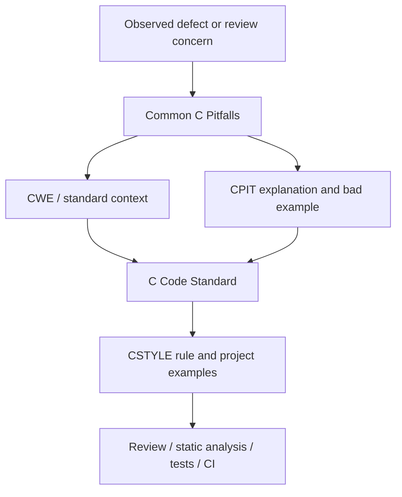

<!--
SPDX-FileCopyrightText: 2026 Rafael V. Volkmer <rafael.v.volkmer@gmail.com>
SPDX-License-Identifier: GPL-3.0-only
-->

<div align="center">

[![MITRE CWE][cwe-badge]][cwe]
[![CWE Top 25 2025][cwe-top25-2025-badge]][cwe-top25-2025]
[![OWASP Top 10 2025][owasp-top10-2025-badge]][owasp-top10-2025]
[![CISA KEV][cisa-kev-badge]][cisa-kev]
[![MITRE CAPEC][capec-badge]][capec]
[![CVE][cve-badge]][cve]
[![CVSS v4.0][cvss-v4-badge]][cvss-v4]
[![ISO/IEC 24772-1][iso-24772-1-badge]][iso-24772-1]
[![ISO/IEC TR 24772-3][iso-24772-3-badge]][iso-24772-3]

</div>

---

# Common C pitfalls

This catalog expands the former pointer checklist into a C failure-mode
reference for allocators, runtimes, embedded software, safety-critical software,
and security-sensitive code.

Each pitfall maps to:

- one or more [MITRE CWE][cwe] weakness classes;
- attack-pattern context from [MITRE CAPEC][capec] when a direct mapping exists;
- application-security context from [OWASP Top 10:2025][owasp-top10-2025];
- real-world evidence from [CISA KEV][cisa-kev] and [CVE][cve] when an
  appropriate representative vulnerability exists;
- [CVSS v4.0][cvss-v4] as the severity framework for concrete vulnerabilities,
  never as a synthetic score for a generic pitfall;
- relevant C, application-security, supply-chain, safety, or cybersecurity
  standards; and
- the primary `CSTYLE-*` and/or `CMOD-*` project control that prevents or
  constrains the failure mode.

Certification requires separate lifecycle evidence and approval from the
applicable authority. Reviewers, static-analysis tools, tests, and deviation
records can use this catalog for implementation-level evidence.

---


## External Security Reference Model

The catalog keeps weakness, attack, vulnerability, exploitation, and severity
concepts separate. They are related, but they are not interchangeable.

| Source | What it represents | How this catalog uses it |
| --- | --- | --- |
| [MITRE CWE][cwe] | weakness taxonomy | root-cause and failure-mode mapping |
| [CWE Top 25:2025][cwe-top25-2025] | prevalence/severity-ranked weakness set | coverage target and gap analysis |
| [OWASP Top 10:2025][owasp-top10-2025] | application-security risk categories | trust-boundary and service-facing context |
| [MITRE CAPEC][capec] | adversary attack patterns | exploitation mechanism and threat-model context |
| [CISA KEV][cisa-kev] | vulnerabilities known to be exploited in the wild | prioritization evidence for representative CVEs |
| [CVE][cve] | concrete publicly disclosed vulnerabilities | representative real-world examples |
| [CVSS v4.0][cvss-v4] | vulnerability severity framework | score/vector reference for concrete CVEs only |
| [ISO/IEC 9899:2024][c23] | C language syntax and semantics | language-level correctness and defined behavior |
| [ISO/IEC TS 17961:2013][ts-17961] | C secure coding rules | secure-C diagnostic and prevention context |
| [ISO/IEC 24772-1:2024][iso-24772-1] | language-independent vulnerability guidance | general vulnerability model |
| [ISO/IEC TR 24772-3:2020][iso-24772-3] | C-specific vulnerability manifestations | C-focused vulnerability guidance |
| [ISO/IEC 27034-1:2011][iso-27034-1] | application-security concepts and process | application boundary and lifecycle context |
| [ISO/IEC 27036-3:2023][iso-27036-3] | hardware/software/services supply-chain security | dependency and artifact integrity context |
| [ISO/IEC 15408-1:2026][iso-15408] | IT security evaluation model | security-property and assurance context |
| [ISO/SAE 21434:2021][iso-sae-21434] | road-vehicle cybersecurity engineering | automotive cybersecurity lifecycle context |

A `CPIT-*` entry is a generic engineering failure mode. A CVE is a concrete
vulnerability in a product. CISA KEV adds evidence of known exploitation to a
subset of CVEs. CVSS communicates severity for a concrete vulnerability and
must retain the version and vector published with that vulnerability. Do not
invent a CVSS score for a CWE, CAPEC pattern, OWASP category, or `CPIT-*` entry.

### CWE Top 25:2025 coverage

The 2025 CWE Top 25 is used as a coverage target, not as the complete scope of
this catalog. Existing low-level C pitfalls remain even when they are outside
that list.

| Rank | CWE | Weakness | Catalog coverage |
| ---: | --- | --- | --- |
| 1 | [CWE-79][cwe-79] | Cross-site scripting | [CPIT-107](#cpit-107-cross-site-scripting-output-injection) |
| 2 | [CWE-89][cwe-89] | SQL injection | [CPIT-106](#cpit-106-sql-injection) |
| 3 | [CWE-352][cwe-352] | Cross-site request forgery | [CPIT-108](#cpit-108-cross-site-request-forgery) |
| 4 | [CWE-862][cwe-862] | Missing authorization | [CPIT-105](#cpit-105-improper-access-control), [CPIT-113](#cpit-113-incorrect-authorization-or-user-controlled-object-key) |
| 5 | [CWE-787][cwe-787] | Out-of-bounds write | [CPIT-013](#cpit-013-out-of-bounds-write) |
| 6 | [CWE-22][cwe-22] | Path traversal | [CPIT-104](#cpit-104-path-traversal) |
| 7 | [CWE-416][cwe-416] | Use-after-free | [CPIT-002](#cpit-002-use-after-free) |
| 8 | [CWE-125][cwe-125] | Out-of-bounds read | [CPIT-014](#cpit-014-out-of-bounds-read) |
| 9 | [CWE-78][cwe-78] | OS command injection | [CPIT-103](#cpit-103-command-injection) |
| 10 | [CWE-94][cwe-94] | Code injection | [CPIT-109](#cpit-109-code-injection-or-dynamic-evaluation) |
| 11 | [CWE-120][cwe-120] | Classic buffer overflow | [CPIT-013](#cpit-013-out-of-bounds-write), [CPIT-059](#cpit-059-strcpystrcat-unbounded-copy) |
| 12 | [CWE-434][cwe-434] | Dangerous file upload | [CPIT-110](#cpit-110-unrestricted-dangerous-file-upload) |
| 13 | [CWE-476][cwe-476] | NULL pointer dereference | [CPIT-011](#cpit-011-null-pointer-dereference) |
| 14 | [CWE-121][cwe-121] | Stack-based buffer overflow | [CPIT-013](#cpit-013-out-of-bounds-write) |
| 15 | [CWE-502][cwe-502] | Deserialization of untrusted data | [CPIT-111](#cpit-111-deserialization-of-untrusted-data) |
| 16 | [CWE-122][cwe-122] | Heap-based buffer overflow | [CPIT-013](#cpit-013-out-of-bounds-write) |
| 17 | [CWE-863][cwe-863] | Incorrect authorization | [CPIT-113](#cpit-113-incorrect-authorization-or-user-controlled-object-key) |
| 18 | [CWE-20][cwe-20] | Improper input validation | [CPIT-094](#cpit-094-tainted-size-trusted), [CPIT-111](#cpit-111-deserialization-of-untrusted-data) |
| 19 | [CWE-284][cwe-284] | Improper access control | [CPIT-105](#cpit-105-improper-access-control) |
| 20 | [CWE-200][cwe-200] | Sensitive information exposure | [CPIT-097](#cpit-097-secret-logged), [CPIT-120](#cpit-120-fail-open-or-sensitive-error-disclosure) |
| 21 | [CWE-306][cwe-306] | Missing authentication for critical function | [CPIT-112](#cpit-112-missing-authentication-for-critical-function) |
| 22 | [CWE-918][cwe-918] | Server-side request forgery | [CPIT-114](#cpit-114-server-side-request-forgery) |
| 23 | [CWE-77][cwe-77] | Command injection | [CPIT-103](#cpit-103-command-injection) |
| 24 | [CWE-639][cwe-639] | Authorization bypass through user-controlled key | [CPIT-113](#cpit-113-incorrect-authorization-or-user-controlled-object-key) |
| 25 | [CWE-770][cwe-770] | Resource allocation without limits | [CPIT-115](#cpit-115-unbounded-resource-consumption) |

### OWASP Top 10:2025 coverage

OWASP is application-security oriented. These mappings apply when C code
implements or supports the corresponding web, service, update, parser,
management, or trust-boundary behavior.

| OWASP category | Primary catalog coverage |
| --- | --- |
| [A01 Broken Access Control][owasp-a01] | CPIT-104, CPIT-105, CPIT-108, CPIT-113, CPIT-114 |
| [A02 Security Misconfiguration][owasp-a02] | CPIT-096, CPIT-116, CPIT-120, CPIT-121, CPIT-122 |
| [A03 Software Supply Chain Failures][owasp-a03] | CPIT-101, CPIT-102, CPIT-117, CPIT-118 |
| [A04 Cryptographic Failures][owasp-a04] | CPIT-096, CPIT-098, CPIT-099, CPIT-100 |
| [A05 Injection][owasp-a05] | CPIT-095, CPIT-103, CPIT-106, CPIT-107, CPIT-109 |
| [A06 Insecure Design][owasp-a06] | CPIT-094, CPIT-110, CPIT-115, CPIT-116 |
| [A07 Authentication Failures][owasp-a07] | CPIT-096, CPIT-100, CPIT-112 |
| [A08 Software or Data Integrity Failures][owasp-a08] | CPIT-101, CPIT-102, CPIT-111, CPIT-118 |
| [A09 Security Logging and Alerting Failures][owasp-a09] | CPIT-097, CPIT-119 |
| [A10 Mishandling of Exceptional Conditions][owasp-a10] | CPIT-011, CPIT-036, CPIT-051, CPIT-068, CPIT-088, CPIT-120 |

### Representative KEV, CVE, and CVSS evidence

The examples below demonstrate why the catalog keeps links from generic failure
modes to concrete field evidence. They are examples, not a vulnerability list
for the project.

| Catalog entry | CISA KEV evidence | CVE record | Published CVSS |
| --- | --- | --- | --- |
| [CPIT-002](#cpit-002-use-after-free) | [CVE-2025-24085 in KEV][kev-cve-2025-24085] | [CVE-2025-24085][cve-2025-24085] | see CVE record |
| [CPIT-013](#cpit-013-out-of-bounds-write) | [CVE-2025-0282 mitigation/KEV evidence][kev-cve-2025-0282] | [CVE-2025-0282][cve-2025-0282] | CVSS 3.1 9.0 in CVE record |
| [CPIT-103](#cpit-103-command-injection) | [CVE-2025-59689 in KEV][kev-2025-09-29] | [CVE-2025-59689][cve-2025-59689] | see CVE record |
| [CPIT-104](#cpit-104-path-traversal) | [CVE-2025-8088 in KEV][kev-2025-08-12] | [CVE-2025-8088][cve-2025-8088] | see CVE record |
| [CPIT-106](#cpit-106-sql-injection) | [CVE-2024-29824 in KEV][kev-cve-2024-29824] | [CVE-2024-29824][cve-2024-29824] | see CVE record |
| [CPIT-111](#cpit-111-deserialization-of-untrusted-data) | [CVE-2025-10035 in KEV][kev-2025-09-29] | [CVE-2025-10035][cve-2025-10035] | CVSS 3.1 10.0 in CVE record |
| [CPIT-114](#cpit-114-server-side-request-forgery) | [CVE-2021-21311 in KEV][kev-2025-09-29] | [CVE-2021-21311][cve-2021-21311] | CVSS 3.1 7.2 in CVE record |

The `Published CVSS` column intentionally preserves the version published in
the CVE record. Use [CVSS v4.0][cvss-v4] for new project scoring when a concrete
vulnerability is being assessed; do not silently convert a historical score.

---

## Catalog usage

Start with the failure mode under review. The category table gives the CWE,
standards, and primary `CSTYLE-*` control. Open the pitfall explanation for a
concrete bad example. Follow its prevention link into the code standard.

All `EX_bad*` snippets are intentionally noncompliant failure examples. They
show the defect being cataloged and must not be copied as project patterns.



Each `CPIT-*` explanation contains a direct prevention link. The code standard
contains reverse links for the rules used by this catalog.

---

## Reading path

| Step | Area                                                                          | Review focus                                           |
| ---- | ----------------------------------------------------------------------------- | ------------------------------------------------------ |
| 1    | [Memory and pointer pitfalls](#memory-and-pointer-pitfalls)                   | ownership, lifetime, bounds, provenance, allocation    |
| 2    | [Undefined behavior pitfalls](#undefined-behavior-pitfalls)                   | invalid C semantics, object rules, shifts, aliasing    |
| 3    | [Integer and arithmetic pitfalls](#integer-and-arithmetic-pitfalls)           | overflow, truncation, sizes, shifts, division          |
| 4    | [Standard library pitfalls](#standard-library-pitfalls)                       | libc preconditions, strings, parsing, process APIs     |
| 5    | [Concurrency and execution pitfalls](#concurrency-and-execution-pitfalls)     | races, locks, threads, ISR, signals, timing            |
| 6    | [Embedded and hardware pitfalls](#embedded-and-hardware-pitfalls)             | MMIO, DMA, watchdogs, persistent state, safety outputs |
| 7    | [Security and trust-boundary pitfalls](#security-and-trust-boundary-pitfalls) | tainted input, secrets, firmware, paths, commands      |
| 8    | [Application, service, and supply-chain pitfalls](#application-service-and-supply-chain-pitfalls) | injection, auth, parsers, dependencies, resource abuse |

Use the [Review Checklist](#review-checklist) after the category review. A
failed checklist item should point to one category, one `CPIT-*`, and one
primary `CSTYLE-*` control.

---
Normative reference sections contain intentional requirement keywords,
identifiers, API names, standards names, and compact table cells. Spelling,
acronym, and prose checks scan this content with the rest of the document.

## Pitfall Index

| Area                                                                          | Primary risk                                                  | Main references                                                                          |
| ----------------------------------------------------------------------------- | ------------------------------------------------------------- | ---------------------------------------------------------------------------------------- |
| [Memory and pointer pitfalls](#memory-and-pointer-pitfalls)                   | object lifetime, ownership, aliasing, bounds, provenance      | [CERT C][cert-c], [MISRA C][misra-c], [TS 17961][ts-17961], [CWE][cwe]                   |
| [Undefined behavior pitfalls](#undefined-behavior-pitfalls)                   | non-portable or invalid C execution semantics                 | [C23][c23], [CERT C][cert-c], [MISRA C][misra-c], [ISO/IEC 24772][iso-24772]             |
| [Integer and arithmetic pitfalls](#integer-and-arithmetic-pitfalls)           | overflow, truncation, invalid shifts, divide-by-zero          | [CERT C][cert-c], [TS 17961][ts-17961], [CWE][cwe]                                       |
| [Standard library pitfalls](#standard-library-pitfalls)                       | libc precondition violations and unsafe APIs                  | [CERT C][cert-c], [MISRA C][misra-c], [CWE][cwe]                                         |
| [Concurrency and execution pitfalls](#concurrency-and-execution-pitfalls)     | races, improper locking, ISR/signal misuse, timing            | [CERT C][cert-c], [IEC 61508][iec-61508], [ISO 26262][iso-26262], [DO-178C][do-178c]     |
| [Embedded and hardware pitfalls](#embedded-and-hardware-pitfalls)             | MMIO, DMA, watchdogs, persistent state, safety outputs        | [IEC 61508][iec-61508], [ISO 26262][iso-26262], [IEC 62443][iec-62443], domain standards |
| [Security and trust-boundary pitfalls](#security-and-trust-boundary-pitfalls) | tainted input, format strings, secrets, firmware update risks | [IEC 62443][iec-62443], [CWE][cwe], [CERT C][cert-c], [ISO/IEC 15408][iso-15408]         |
| [Application, service, and supply-chain pitfalls](#application-service-and-supply-chain-pitfalls) | interpreters, authentication, authorization, parsing, dependencies | [OWASP Top 10:2025][owasp-top10-2025], [CWE Top 25:2025][cwe-top25-2025], [CAPEC][capec], [ISO/IEC 27034-1][iso-27034-1], [ISO/IEC 27036-3][iso-27036-3] |

---

## Memory and Pointer Pitfalls

All pointer, buffer, allocation, object-lifetime, and ownership problems live in
this section. Memory rules are centralized here so allocator and GC reviews do
not scatter pointer safety across unrelated sections.

| Pitfall                                   | Failure mode                                                       | [CWE][cwe] mapping                     | Standards / rules                                                  | Primary project control                                                                                                          |
| ----------------------------------------- | ------------------------------------------------------------------ | -------------------------------------- | ------------------------------------------------------------------ | ---------------------------------------------------------------------------------------------------------------------------- |
| Dangling pointer                          | pointer names storage whose lifetime has ended                     | [CWE-825][cwe-825], [CWE-416][cwe-416] | [CERT C][cert-c], [MISRA C][misra-c], [ISO/IEC 24772][iso-24772]   | [`CSTYLE-084-5-1-8-local-memory-lifetime`](./c-code-standard.md#518-local-memory-lifetime)                                      |
| Use-after-free                            | read or write through freed heap object                            | [CWE-416][cwe-416]                     | [CERT C][cert-c], [TS 17961][ts-17961], [ISO/IEC 24772][iso-24772] | [`CSTYLE-082-5-1-6-ownership-rules`](./c-code-standard.md#516-ownership-rules)                                                  |
| Double free                               | same allocation released twice                                     | [CWE-415][cwe-415]                     | [CERT C][cert-c], [TS 17961][ts-17961]                             | [`CSTYLE-082-5-1-6-ownership-rules`](./c-code-standard.md#516-ownership-rules)                                                  |
| Memory leak                               | allocation or resource loses release path                          | [CWE-401][cwe-401], [CWE-772][cwe-772] | [CERT C][cert-c], [IEC 62304][iec-62304], [ISO 26262][iso-26262]   | [`CSTYLE-077-5-1-1-allocation-rules`](./c-code-standard.md#511-allocation-rules)                                                |
| Ambiguous ownership                       | two modules believe they own or borrow the same object             | [CWE-664][cwe-664]                     | [CERT C][cert-c], [MISRA C][misra-c], [IEC 61508][iec-61508]       | [`CSTYLE-082-5-1-6-ownership-rules`](./c-code-standard.md#516-ownership-rules)                                                  |
| Invalid free                              | freeing stack, static, interior, or non-allocated memory           | [CWE-590][cwe-590]                     | [CERT C][cert-c], [TS 17961][ts-17961]                             | [`CSTYLE-086-standard-library-policy`](./c-code-standard.md#521-standard-library-policy)                                        |
| Mismatched allocator                      | allocation and deallocation families do not match                  | [CWE-762][cwe-762]                     | [CERT C][cert-c], [MISRA C][misra-c]                               | [`CSTYLE-077-5-1-1-allocation-rules`](./c-code-standard.md#511-allocation-rules)                                                |
| Stale pointer after `realloc`             | old pointer or aliases used after successful `realloc`             | [CWE-416][cwe-416], [CWE-825][cwe-825] | [CERT C][cert-c], [TS 17961][ts-17961]                             | [`CSTYLE-080-5-1-4-realloc-safety`](./c-code-standard.md#514-realloc-safety)                                                    |
| Lost base pointer                         | only an interior pointer remains, so object cannot be freed        | [CWE-401][cwe-401], [CWE-761][cwe-761] | [CERT C][cert-c], [ISO/IEC 24772][iso-24772]                       | [`CSTYLE-082-5-1-6-ownership-rules`](./c-code-standard.md#516-ownership-rules)                                                  |
| Interior pointer escape                   | subobject pointer outlives object or hides object ownership        | [CWE-825][cwe-825], [CWE-664][cwe-664] | [CERT C][cert-c], [MISRA C][misra-c]                               | [`CSTYLE-096-6-8-cast-rules`](./c-code-standard.md#68-cast-rules)                                                               |
| NULL pointer dereference                  | dereference of null pointer                                        | [CWE-476][cwe-476]                     | [CERT C][cert-c], [TS 17961][ts-17961], [MISRA C][misra-c]         | [`CSTYLE-058-4-1-3-argument-validation`](./c-code-standard.md#413-argument-validation)                                          |
| Uninitialized pointer                     | indeterminate pointer value is read or dereferenced                | [CWE-824][cwe-824], [CWE-457][cwe-457] | [CERT C][cert-c], [MISRA C][misra-c], [C23][c23]                   | [`CSTYLE-107-8-1-variable-initialization`](./c-code-standard.md#81-variable-initialization)                                     |
| Out-of-bounds write                       | write past object or array bounds                                  | [CWE-787][cwe-787], [CWE-120][cwe-120] | [CERT C][cert-c], [TS 17961][ts-17961], [ISO/IEC 24772][iso-24772] | [`CSTYLE-063-4-1-6-output-buffer-contracts`](./c-code-standard.md#416-output-buffer-contracts)                                  |
| Out-of-bounds read                        | read past object or array bounds                                   | [CWE-125][cwe-125]                     | [CERT C][cert-c], [TS 17961][ts-17961]                             | [`CSTYLE-099-7-1-undefined-behavior-avoidance`](./c-code-standard.md#71-undefined-behavior-avoidance)                           |
| Buffer underflow                          | access before buffer start                                         | [CWE-124][cwe-124]                     | [CERT C][cert-c], [TS 17961][ts-17961]                             | [`CSTYLE-099-7-1-undefined-behavior-avoidance`](./c-code-standard.md#71-undefined-behavior-avoidance)                           |
| Off-by-one                                | one element too many or too few                                    | [CWE-193][cwe-193]                     | [CERT C][cert-c], [ISO/IEC 24772][iso-24772]                       | [`CSTYLE-074-4-1-15-loop-control`](./c-code-standard.md#4115-loop-control)                                                      |
| One-past-end dereference                  | valid one-past pointer is dereferenced                             | [CWE-125][cwe-125], [CWE-787][cwe-787] | [C23][c23], [CERT C][cert-c], [MISRA C][misra-c]                   | [`CSTYLE-099-7-1-undefined-behavior-avoidance`](./c-code-standard.md#71-undefined-behavior-avoidance)                           |
| Invalid pointer arithmetic                | pointer moves outside its array object                             | [CWE-469][cwe-469], [CWE-129][cwe-129] | [C23][c23], [CERT C][cert-c], [MISRA C][misra-c]                   | [`CSTYLE-102-7-4-checked-integer-arithmetic`](./c-code-standard.md#74-checked-integer-arithmetic)                               |
| Invalid pointer comparison                | relational comparison of unrelated objects                         | [CWE-758][cwe-758]                     | [C23][c23], [CERT C][cert-c]                                       | [`CSTYLE-100-7-2-c-behavior-categories`](./c-code-standard.md#72-c-behavior-categories)                                         |
| Invalid pointer subtraction               | subtracting pointers not in same array object                      | [CWE-469][cwe-469], [CWE-758][cwe-758] | [C23][c23], [CERT C][cert-c]                                       | [`CSTYLE-100-7-2-c-behavior-categories`](./c-code-standard.md#72-c-behavior-categories)                                         |
| Pointer provenance violation              | integer-derived or unrelated pointer used as if it named an object | [CWE-758][cwe-758]                     | [C23][c23], [CERT C][cert-c], [MISRA C][misra-c]                   | [`CSTYLE-098-6-10-pointer-aliasing-and-provenance-rules`](./c-code-standard.md#610-pointer-aliasing-and-provenance-rules)       |
| Strict aliasing violation                 | object accessed through incompatible effective type                | [CWE-843][cwe-843], [CWE-758][cwe-758] | [C23][c23], [CERT C][cert-c], [MISRA C][misra-c]                   | [`CSTYLE-098-6-10-pointer-aliasing-and-provenance-rules`](./c-code-standard.md#610-pointer-aliasing-and-provenance-rules)       |
| Invalid `restrict` aliasing               | caller violates non-aliasing contract                              | [CWE-758][cwe-758], [CWE-664][cwe-664] | [C23][c23], [CERT C][cert-c], [MISRA C][misra-c]                   | [`CSTYLE-098-6-10-pointer-aliasing-and-provenance-rules`](./c-code-standard.md#610-pointer-aliasing-and-provenance-rules)       |
| Invalid alignment                         | object is accessed through under-aligned pointer                   | [CWE-758][cwe-758], [CWE-119][cwe-119] | [C23][c23], [CERT C][cert-c], [MISRA C][misra-c]                   | [`CSTYLE-096-6-8-cast-rules`](./c-code-standard.md#68-cast-rules)                                                               |
| Pointer truncation                        | pointer value narrowed through integer type                        | [CWE-681][cwe-681], [CWE-704][cwe-704] | [CERT C][cert-c], [MISRA C][misra-c]                               | [`CSTYLE-097-6-9-numeric-conversion-rules`](./c-code-standard.md#69-numeric-conversion-rules)                                   |
| Function pointer type mismatch            | call through incompatible function pointer type                    | [CWE-758][cwe-758], [CWE-843][cwe-843] | [C23][c23], [CERT C][cert-c], [MISRA C][misra-c]                   | [`CSTYLE-071-4-1-12-callback-contracts`](./c-code-standard.md#4112-callback-contracts)                                          |
| Object pointer/function pointer mixing    | object and function pointer representations are confused           | [CWE-704][cwe-704], [CWE-758][cwe-758] | [C23][c23], [CERT C][cert-c], [MISRA C][misra-c]                   | [`CSTYLE-096-6-8-cast-rules`](./c-code-standard.md#68-cast-rules)                                                               |
| Union pointer confusion                   | inactive union member or untagged union interpreted incorrectly    | [CWE-843][cwe-843], [CWE-758][cwe-758] | [C23][c23], [MISRA C][misra-c]                                     | [`CSTYLE-038-2-3-3-struct-serialization`](./c-code-standard.md#233-struct-serialization)                                        |
| Array-to-pointer decay                    | size information lost at API boundary                              | [CWE-467][cwe-467], [CWE-131][cwe-131] | [CERT C][cert-c], [MISRA C][misra-c]                               | [`CSTYLE-063-4-1-6-output-buffer-contracts`](./c-code-standard.md#416-output-buffer-contracts)                                  |
| Hidden or encoded pointer                 | GC/static analysis cannot see a live pointer                       | [CWE-758][cwe-758], [CWE-664][cwe-664] | [CERT C][cert-c], [IEC 61508][iec-61508]                           | [`CSTYLE-069-analyzability`](./c-code-standard.md#analyzability)                                                                |
| Pointer to moved object                   | moving allocator or GC invalidates raw pointer                     | [CWE-416][cwe-416], [CWE-825][cwe-825] | [ISO/IEC 24772][iso-24772], [IEC 61508][iec-61508]                 | [`CSTYLE-082-5-1-6-ownership-rules`](./c-code-standard.md#516-ownership-rules)                                                  |
| Borrowed pointer stored beyond lifetime   | callee persists a non-owned pointer                                | [CWE-825][cwe-825], [CWE-664][cwe-664] | [CERT C][cert-c], [ISO/IEC 24772][iso-24772]                       | [`CSTYLE-071-4-1-12-callback-contracts`](./c-code-standard.md#4112-callback-contracts)                                          |
| Heap object points to stack memory        | heap state retains pointer into expired stack frame                | [CWE-825][cwe-825], [CWE-562][cwe-562] | [CERT C][cert-c], [MISRA C][misra-c]                               | [`CSTYLE-084-5-1-8-local-memory-lifetime`](./c-code-standard.md#518-local-memory-lifetime)                                      |
| MMIO/DMA pointer treated as ordinary heap | hardware memory is moved, cached, scanned, or freed incorrectly    | [CWE-119][cwe-119], [CWE-664][cwe-664] | [IEC 61508][iec-61508], [ISO 26262][iso-26262], [MISRA C][misra-c] | [`CSTYLE-105-7-7-hardware-register-read-modify-write-rules`](./c-code-standard.md#77-hardware-register-read-modify-write-rules) |

---

### Memory and Pointer Pitfall Explanations

---

#### CPIT-001: Dangling pointer

**Pitfall ID:** `CPIT-001-dangling-pointer`

**Primary prevention rule:** [`CSTYLE-084-5-1-8-local-memory-lifetime`](./c-code-standard.md#518-local-memory-lifetime)

**Dangling pointer.** A dangling pointer still stores an address, but the
object at that address is no longer alive. This happens after `free()`, after a
stack object goes out of scope, after an arena is reset, or after a moving
runtime invalidates an address. Treat every pointer as a `(base, size, lifetime,
owner)` contract; the raw address alone is not enough.

```c
int *EX_badDanglingPointer(void)
{
    int local_value = 7;

    return &local_value;
}
```

---

#### CPIT-002: Use-after-free

**Pitfall ID:** `CPIT-002-use-after-free`

**Primary prevention rule:** [`CSTYLE-082-5-1-6-ownership-rules`](./c-code-standard.md#516-ownership-rules)

**Use-after-free.** Use-after-free is the heap-specific form of a dangling
pointer. The dangerous part is not only a crash: the allocator may have reused
the same block for another object, so a stale write can corrupt unrelated state.
Clearing the owner pointer after `free()` helps, but aliases must be controlled
by ownership, reference counting, epochs, hazard pointers, or GC handles.

```c
void EX_badUseAfterFree(uint8_t *buffer)
{
    free(buffer);
    buffer[0] = 1u;
}
```

---

#### CPIT-003: Double free

**Pitfall ID:** `CPIT-003-double-free`

**Primary prevention rule:** [`CSTYLE-082-5-1-6-ownership-rules`](./c-code-standard.md#516-ownership-rules)

**Double free.** Double free releases the same allocation twice. Allocators
often store metadata near the user block, so a second `free()` can corrupt heap
state or make later allocations unsafe. Each allocation must have exactly one
release path unless the API explicitly uses reference counting or another
shared-ownership protocol.

```c
void EX_badDoubleFree(uint8_t *buffer)
{
    free(buffer);
    free(buffer);
}
```

---

#### CPIT-004: Memory leak

**Pitfall ID:** `CPIT-004-memory-leak`

**Primary prevention rule:** [`CSTYLE-077-5-1-1-allocation-rules`](./c-code-standard.md#511-allocation-rules)

**Memory leak.** A memory leak occurs when the program loses the path needed to
release memory or another finite resource. In embedded systems this is often a
safety issue, not only a performance issue, because long-running firmware may
eventually exhaust a fixed RAM budget. Cleanup paths, arenas, pools, and
long-run leak tests are required evidence.

```c
void EX_badMemoryLeak(void)
{
    uint8_t *buffer = malloc(128u);

    buffer[0] = 1u;
}
```

---

#### CPIT-005: Ambiguous ownership

**Pitfall ID:** `CPIT-005-ambiguous-ownership`

**Primary prevention rule:** [`CSTYLE-082-5-1-6-ownership-rules`](./c-code-standard.md#516-ownership-rules)

**Ambiguous ownership.** Ambiguous ownership means the API does not say who
owns, borrows, stores, or frees a pointer. This usually creates either leaks or
double frees later. Public APIs must document whether a pointer is owned,
borrowed, static, arena-owned, GC-owned, pinned, or caller-owned.

```c
void EX_badAmbiguousOwnership(uint8_t *buffer)
{
    EX_releaseA(buffer);
    EX_releaseB(buffer);
}
```

---

#### CPIT-006: Invalid free

**Pitfall ID:** `CPIT-006-invalid-free`

**Primary prevention rule:** [`CSTYLE-086-standard-library-policy`](./c-code-standard.md#521-standard-library-policy)

**Invalid free.** Invalid free passes something to `free()` that was not
returned by the matching allocator family as a base pointer. Stack addresses,
static objects, interior pointers, string literals, and foreign allocator blocks
must never be freed through the wrong API. The fix is to preserve allocator
family and base-pointer identity in the type or API contract.

```c
void EX_badInvalidFree(void)
{
    uint8_t stack_buffer[16] = { 0u };

    free(stack_buffer);
}
```

---

#### CPIT-007: Mismatched allocator

**Pitfall ID:** `CPIT-007-mismatched-allocator`

**Primary prevention rule:** [`CSTYLE-077-5-1-1-allocation-rules`](./c-code-standard.md#511-allocation-rules)

**Mismatched allocator.** A mismatched allocator bug allocates with one family
and releases with another, such as `malloc()` with a pool destroy function or a
platform allocator with plain `free()`. This breaks allocator invariants even
when the address looks valid. Pair allocation and release functions explicitly
in API names and ownership docs.

```c
void EX_badMismatchedAllocator(uint8_t *pool_buffer)
{
    free(pool_buffer);
}
```

---

#### CPIT-008: Stale pointer after `realloc`

**Pitfall ID:** `CPIT-008-stale-pointer-after-realloc`

**Primary prevention rule:** [`CSTYLE-080-5-1-4-realloc-safety`](./c-code-standard.md#514-realloc-safety)

**Stale pointer after `realloc`.** After successful `realloc()`, the old pointer
value is invalid even if the allocator happened to return the same numeric
address. All aliases to the old object must be considered stale. Store the
result in a temporary, update the owner only after success, and do not retain
interior pointers across `realloc()`.

```c
void EX_badStalePointerAfterRealloc(uint8_t *buffer)
{
    uint8_t *alias = buffer;

    buffer = realloc(buffer, 32u);
    alias[0] = 1u;
}
```

---

#### CPIT-009: Lost base pointer

**Pitfall ID:** `CPIT-009-lost-base-pointer`

**Primary prevention rule:** [`CSTYLE-082-5-1-6-ownership-rules`](./c-code-standard.md#516-ownership-rules)

**Lost base pointer.** A lost base pointer happens when code advances or
overwrites the only pointer that can be passed back to the allocator. Interior
pointers are useful for parsing, but they must not replace the owning base
pointer. Keep base and cursor fields separate.

```c
void EX_badLostBasePointer(uint8_t *buffer)
{
    buffer++;
    free(buffer);
}
```

---

#### CPIT-010: Interior pointer escape

**Pitfall ID:** `CPIT-010-interior-pointer-escape`

**Primary prevention rule:** [`CSTYLE-096-6-8-cast-rules`](./c-code-standard.md#68-cast-rules)

**Interior pointer escape.** An interior pointer escape stores a pointer to a
field, element, or middle of an object beyond the parent object's lifetime or
ownership boundary. This hides the real allocation and makes lifetime review
difficult. Use handles, indexes, or an explicit parent-object reference when
the subobject must escape.

```c
uint8_t *EX_badInteriorPointerEscape(uint8_t *buffer)
{
    return &buffer[4];
}
```

---

#### CPIT-011: NULL pointer dereference

**Pitfall ID:** `CPIT-011-null-pointer-dereference`

**Primary prevention rule:** [`CSTYLE-058-4-1-3-argument-validation`](./c-code-standard.md#413-argument-validation)

**NULL pointer dereference.** Dereferencing `NULL` is undefined behavior in C.
It commonly follows unchecked allocation, optional arguments, failed lookups, or
partial initialization. Validate nullable inputs at the boundary and reserve
assertions for internal invariants that cannot be violated by external input.

```c
void EX_badNullPointerDereference(void)
{
    uint32_t *value = NULL;

    *value = 1u;
}
```

---

#### CPIT-012: Uninitialized pointer

**Pitfall ID:** `CPIT-012-uninitialized-pointer`

**Primary prevention rule:** [`CSTYLE-107-8-1-variable-initialization`](./c-code-standard.md#81-variable-initialization)

**Uninitialized pointer.** An uninitialized pointer contains an indeterminate
value, not a safe default. Reading or dereferencing it can jump into arbitrary
memory or trigger undefined behavior before any obvious branch. Initialize all
pointers to `NULL` or a valid object and prefer full object initialization.

```c
void EX_badUninitializedPointer(void)
{
    uint32_t *value;

    *value = 1u;
}
```

---

#### CPIT-013: Out-of-bounds write

**Pitfall ID:** `CPIT-013-out-of-bounds-write`

**Primary prevention rule:** [`CSTYLE-063-4-1-6-output-buffer-contracts`](./c-code-standard.md#416-output-buffer-contracts)

**Out-of-bounds write.** An out-of-bounds write stores data outside the target
object. In allocators and embedded runtimes this may overwrite metadata, control
blocks, adjacent objects, return addresses, or hardware descriptors. Every write
must be guarded by a validated base pointer, capacity, offset, and write size.

```c
void EX_badOutOfBoundsWrite(void)
{
    uint8_t buffer[4] = { 0u };

    buffer[4] = 1u;
}
```

---

#### CPIT-014: Out-of-bounds read

**Pitfall ID:** `CPIT-014-out-of-bounds-read`

**Primary prevention rule:** [`CSTYLE-099-7-1-undefined-behavior-avoidance`](./c-code-standard.md#71-undefined-behavior-avoidance)

**Out-of-bounds read.** An out-of-bounds read can disclose stale memory, fault
on protected pages, or feed invalid values into control logic. It is still a
bug even if it does not modify memory. Validate indexes and lengths before the
read, not after.

```c
uint8_t EX_badOutOfBoundsRead(void)
{
    uint8_t buffer[4] = { 0u };

    return buffer[4];
}
```

---

#### CPIT-015: Buffer underflow

**Pitfall ID:** `CPIT-015-buffer-underflow`

**Primary prevention rule:** [`CSTYLE-099-7-1-undefined-behavior-avoidance`](./c-code-standard.md#71-undefined-behavior-avoidance)

**Buffer underflow.** Buffer underflow accesses memory before the start of an
object, usually through a decremented pointer, negative index, or unsigned
wraparound. It is the same class of boundary violation as overflow but often
missed in reviews because the code visually moves "backward." Check lower
bounds explicitly.

```c
void EX_badBufferUnderflow(void)
{
    uint8_t buffer[4] = { 0u };
    uint8_t *cursor = buffer;

    cursor[-1] = 1u;
}
```

---

#### CPIT-016: Off-by-one

**Pitfall ID:** `CPIT-016-off-by-one`

**Primary prevention rule:** [`CSTYLE-074-4-1-15-loop-control`](./c-code-standard.md#4115-loop-control)

**Off-by-one.** Off-by-one errors use one too many or one too few elements.
They often appear in loops, terminator handling, and one-past pointer logic.
Write loop bounds in terms of `index < count`, keep terminator capacity
separate, and test zero, one, max, and boundary sizes.

```c
void EX_badOffByOne(void)
{
    uint8_t buffer[4] = { 0u };

    for (size_t index = 0u; index <= 4u; index++)
        buffer[index] = 0u;
}
```

---

#### CPIT-017: One-past-end dereference

**Pitfall ID:** `CPIT-017-one-past-end-dereference`

**Primary prevention rule:** [`CSTYLE-099-7-1-undefined-behavior-avoidance`](./c-code-standard.md#71-undefined-behavior-avoidance)

**One-past-end dereference.** C allows forming a pointer one past the end of an
array object, but not dereferencing it. That pointer is only a sentinel for
comparison and range logic. Any access must move back into the valid object
range first.

```c
void EX_badOnePastEndDereference(void)
{
    uint8_t buffer[4] = { 0u };
    uint8_t *end = &buffer[4];

    *end = 1u;
}
```

---

#### CPIT-018: Invalid pointer arithmetic

**Pitfall ID:** `CPIT-018-invalid-pointer-arithmetic`

**Primary prevention rule:** [`CSTYLE-102-7-4-checked-integer-arithmetic`](./c-code-standard.md#74-checked-integer-arithmetic)

**Invalid pointer arithmetic.** Pointer arithmetic is only defined within the
same array object and its one-past position. Arithmetic derived from external
offsets, serialized metadata, or integer addresses must be validated before
forming or using the pointer. Prefer byte-offset validation on integer sizes
before converting to a pointer expression.

```c
void EX_badInvalidPointerArithmetic(void)
{
    uint8_t buffer[4] = { 0u };
    uint8_t *cursor = buffer + 8u;

    *cursor = 1u;
}
```

---

#### CPIT-019: Invalid pointer comparison

**Pitfall ID:** `CPIT-019-invalid-pointer-comparison`

**Primary prevention rule:** [`CSTYLE-100-7-2-c-behavior-categories`](./c-code-standard.md#72-c-behavior-categories)

**Invalid pointer comparison.** Equality comparison has limited valid uses, but
relational comparison such as `<` or `>` is not portable for unrelated objects.
Do not sort or range-check arbitrary object pointers unless they are known to
belong to the same allocation or address-domain abstraction.

```c
int EX_badInvalidPointerComparison(uint8_t *lhs, uint8_t *rhs)
{
    return (lhs < rhs);
}
```

---

#### CPIT-020: Invalid pointer subtraction

**Pitfall ID:** `CPIT-020-invalid-pointer-subtraction`

**Primary prevention rule:** [`CSTYLE-100-7-2-c-behavior-categories`](./c-code-standard.md#72-c-behavior-categories)

**Invalid pointer subtraction.** Subtracting pointers is defined only for
elements of the same array object. Subtracting unrelated addresses to compute a
size or ownership relation is not portable C. Store explicit sizes and offsets
instead of deriving them from unrelated pointers.

```c
ptrdiff_t EX_badInvalidPointerSubtraction(uint8_t *lhs, uint8_t *rhs)
{
    return (lhs - rhs);
}
```

---

#### CPIT-021: Pointer provenance violation

**Pitfall ID:** `CPIT-021-pointer-provenance-violation`

**Primary prevention rule:** [`CSTYLE-098-6-10-pointer-aliasing-and-provenance-rules`](./c-code-standard.md#610-pointer-aliasing-and-provenance-rules)

**Pointer provenance violation.** Pointer provenance is the relationship
between a pointer value and the object it is allowed to access. Reconstructing
pointers from integers, stale addresses, foreign objects, or serialized values
does not automatically recreate a valid object access right. Isolate hardware
address conversion in adapter modules and avoid pointer/integer round trips in
portable code.

```c
uint32_t EX_badPointerProvenanceViolation(uintptr_t raw_address)
{
    uint32_t *value = (uint32_t *)raw_address;

    return *value;
}
```

---

#### CPIT-022: Strict aliasing violation

**Pitfall ID:** `CPIT-022-strict-aliasing-violation`

**Primary prevention rule:** [`CSTYLE-098-6-10-pointer-aliasing-and-provenance-rules`](./c-code-standard.md#610-pointer-aliasing-and-provenance-rules)

**Strict aliasing violation.** Strict aliasing violations occur when an object
is accessed through an incompatible type. Optimizers rely on effective type
rules, so code that seems to work at `-O0` can break at higher optimization
levels. Use `memcpy()` for representation copies and `unsigned char` only for
byte inspection.

```c
uint32_t EX_badStrictAliasingViolation(float *value)
{
    uint32_t *bits = (uint32_t *)value;

    return *bits;
}
```

---

#### CPIT-023: Invalid `restrict` aliasing

**Pitfall ID:** `CPIT-023-invalid-restrict-aliasing`

**Primary prevention rule:** [`CSTYLE-098-6-10-pointer-aliasing-and-provenance-rules`](./c-code-standard.md#610-pointer-aliasing-and-provenance-rules)

**Invalid `restrict` aliasing.** `restrict` is a promise that an object is
accessed only through that pointer or values derived from it for the relevant
scope. Calling a `restrict` API with overlapping ranges violates the contract.
Use `restrict` only when callers can realistically satisfy and review the
non-aliasing requirement.

```c
void EX_badRestrictAliasing(uint32_t *restrict lhs, uint32_t *restrict rhs)
{
    *lhs = 1u;
    *rhs = 2u;
}
```

---

#### CPIT-024: Invalid alignment

**Pitfall ID:** `CPIT-024-invalid-alignment`

**Primary prevention rule:** [`CSTYLE-096-6-8-cast-rules`](./c-code-standard.md#68-cast-rules)

**Invalid alignment.** A pointer may have the right numeric address range but
still be invalid for a type with stricter alignment. Dereferencing an
under-aligned typed pointer can trap on some targets and is undefined behavior
in C. Check alignment before casting raw storage to typed objects.

```c
uint32_t EX_badInvalidAlignment(uint8_t *buffer)
{
    uint32_t *value = (uint32_t *)(buffer + 1u);

    return *value;
}
```

---

#### CPIT-025: Pointer truncation

**Pitfall ID:** `CPIT-025-pointer-truncation`

**Primary prevention rule:** [`CSTYLE-097-6-9-numeric-conversion-rules`](./c-code-standard.md#69-numeric-conversion-rules)

**Pointer truncation.** Pointer truncation stores an address in an integer type
that cannot represent all pointer values, or later casts it back. This breaks
on wider address spaces, segmented systems, and capability-like targets. Use
`uintptr_t` only in low-level adapter code and document why the conversion is
valid.

```c
uint32_t EX_badPointerTruncation(void *ptr)
{
    return (uint32_t)(uintptr_t)ptr;
}
```

---

#### CPIT-026: Function pointer type mismatch

**Pitfall ID:** `CPIT-026-function-pointer-type-mismatch`

**Primary prevention rule:** [`CSTYLE-071-4-1-12-callback-contracts`](./c-code-standard.md#4112-callback-contracts)

**Function pointer type mismatch.** Calling a function through an incompatible
function pointer type is undefined behavior. The ABI may pass arguments or
return values differently even when the sizes look similar. Callback typedefs
must exactly match the called function signature.

```c
void EX_badFunctionPointerTypeMismatch(void (*callback)(void))
{
    void (*typed_callback)(int value) = (void (*)(int))callback;

    typed_callback(1);
}
```

---

#### CPIT-027: Object pointer/function pointer mixing

**Pitfall ID:** `CPIT-027-object-pointer-function-pointer-mixing`

**Primary prevention rule:** [`CSTYLE-096-6-8-cast-rules`](./c-code-standard.md#68-cast-rules)

**Object pointer/function pointer mixing.** C does not guarantee object
pointers and function pointers have the same representation or conversion
rules. Storing function pointers in `void *` or object pointers in callback
slots is not portable. Keep object and function pointer paths typed and
separate.

```c
void *EX_badObjectFunctionPointerMixing(void (*callback)(void))
{
    return (void *)callback;
}
```

---

#### CPIT-028: Union pointer confusion

**Pitfall ID:** `CPIT-028-union-pointer-confusion`

**Primary prevention rule:** [`CSTYLE-038-2-3-3-struct-serialization`](./c-code-standard.md#233-struct-serialization)

**Union pointer confusion.** A union that can hold multiple pointer or scalar
interpretations needs an explicit active-member tag. Reading an inactive member
or scanning the wrong union arm can corrupt GC tracing, serialization, or
ownership decisions. Prefer tagged unions with checked state transitions.

```c
typedef union ExValue
{
    uint32_t integer_value;
    uint32_t *ptr_value;
} ex_value_t;

uint32_t EX_badUnionPointerConfusion(ex_value_t value)
{
    return *value.ptr_value;
}
```

---

#### CPIT-029: Array-to-pointer decay

**Pitfall ID:** `CPIT-029-array-to-pointer-decay`

**Primary prevention rule:** [`CSTYLE-063-4-1-6-output-buffer-contracts`](./c-code-standard.md#416-output-buffer-contracts)

**Array-to-pointer decay.** Array parameters decay to pointers, losing size
information. `sizeof(param)` then returns pointer size, not array size. Every
API receiving an array must also receive element count, byte size, or a pointer
to an explicitly sized array type.

```c
size_t EX_badArrayToPointerDecay(uint8_t buffer[])
{
    return sizeof(buffer);
}
```

---

#### CPIT-030: Hidden or encoded pointer

**Pitfall ID:** `CPIT-030-hidden-or-encoded-pointer`

**Primary prevention rule:** [`CSTYLE-069-analyzability`](./c-code-standard.md#analyzability)

**Hidden or encoded pointer.** Hidden pointers are addresses stored in integers,
compressed encodings, XOR tags, unions, or external metadata. They defeat
ordinary static analysis and GC root scanning. If a runtime must hide pointers,
the encoding must be centralized and documented for analysis and tracing.

```c
uintptr_t EX_badHiddenPointer(uint8_t *buffer)
{
    return ((uintptr_t)buffer ^ UINTPTR_C(0x5a5a5a5a));
}
```

---

#### CPIT-031: Pointer to moved object

**Pitfall ID:** `CPIT-031-pointer-to-moved-object`

**Primary prevention rule:** [`CSTYLE-082-5-1-6-ownership-rules`](./c-code-standard.md#516-ownership-rules)

**Pointer to moved object.** A moving allocator or compacting GC invalidates raw
addresses when it relocates an object. Storing those raw addresses outside the
runtime creates stale pointers. Movable objects must be reached through handles,
registered roots, or pinned references.

```c
uint8_t *EX_badPointerToMovedObject(uint8_t *moving_object)
{
    return moving_object;
}
```

---

#### CPIT-032: Borrowed pointer stored beyond lifetime

**Pitfall ID:** `CPIT-032-borrowed-pointer-stored-beyond-lifetime`

**Primary prevention rule:** [`CSTYLE-071-4-1-12-callback-contracts`](./c-code-standard.md#4112-callback-contracts)

**Borrowed pointer stored beyond lifetime.** A borrowed pointer is valid only
for the documented call, scope, or transaction. Storing it in a long-lived
object silently turns a borrow into ownership without the release authority.
Copy the data, retain the owner, or change the API to transfer ownership.

```c
static uint8_t *g_borrowed_buffer;

void EX_badBorrowedPointerStored(uint8_t *borrowed_buffer)
{
    g_borrowed_buffer = borrowed_buffer;
}
```

---

#### CPIT-033: Heap object points to stack memory

**Pitfall ID:** `CPIT-033-heap-object-points-to-stack-memory`

**Primary prevention rule:** [`CSTYLE-084-5-1-8-local-memory-lifetime`](./c-code-standard.md#518-local-memory-lifetime)

**Heap object points to stack memory.** A heap object that stores a pointer to a
stack object will outlive the stack frame that created it. This creates delayed
use-after-scope failures. Heap-owned state must point only to memory with an
equal or longer lifetime, or store a copy.

```c
uint8_t *EX_badHeapObjectPointsToStack(void)
{
    uint8_t stack_buffer[16] = { 0u };

    return stack_buffer;
}
```

---

#### CPIT-034: MMIO/DMA pointer treated as ordinary heap

**Pitfall ID:** `CPIT-034-mmio-dma-pointer-treated-as-ordinary-heap`

**Primary prevention rule:** [`CSTYLE-105-7-7-hardware-register-read-modify-write-rules`](./c-code-standard.md#77-hardware-register-read-modify-write-rules)

**MMIO/DMA pointer treated as ordinary heap.** MMIO and DMA memory have
hardware-defined side effects, cache rules, alignment, and ownership. It must
not be moved by a GC, freed by the heap allocator, scanned as ordinary object
memory, or updated with normal concurrency assumptions. Keep hardware memory in
explicit adapter modules.

```c
void EX_badMmioDmaAsHeap(volatile uint32_t *register_ptr)
{
    free((void *)register_ptr);
}
```

---

## Undefined Behavior Pitfalls

These are C execution-semantics hazards. They often pass tests until compiler,
optimization level, CPU, ABI, or input data changes.

| Pitfall                                    | Failure mode                                              | [CWE][cwe] mapping                     | Standards / rules                                                | Primary project control                                                                                          |
| ------------------------------------------ | --------------------------------------------------------- | -------------------------------------- | ---------------------------------------------------------------- | ------------------------------------------------------------------------------------------------------------ |
| Unsequenced modification                   | expression modifies and reads same scalar without order   | [CWE-758][cwe-758]                     | [C23][c23], [CERT C][cert-c], [MISRA C][misra-c]                 | [`CSTYLE-061-4-1-4-no-side-effects-in-conditions`](./c-code-standard.md#414-no-side-effects-in-conditions)      |
| Indeterminate value read                   | automatic object, padding, or invalid representation read | [CWE-457][cwe-457], [CWE-758][cwe-758] | [C23][c23], [CERT C][cert-c], [MISRA C][misra-c]                 | [`CSTYLE-107-8-1-variable-initialization`](./c-code-standard.md#81-variable-initialization)                     |
| Trap representation                        | invalid object representation read as typed value         | [CWE-758][cwe-758]                     | [C23][c23], [CERT C][cert-c]                                     | [`CSTYLE-100-7-2-c-behavior-categories`](./c-code-standard.md#72-c-behavior-categories)                         |
| Signed integer overflow                    | signed arithmetic exceeds representable range             | [CWE-190][cwe-190], [CWE-758][cwe-758] | [C23][c23], [CERT C][cert-c], [TS 17961][ts-17961]               | [`CSTYLE-101-7-3-integer-overflow-and-shift-safety`](./c-code-standard.md#73-integer-overflow-and-shift-safety) |
| Invalid shift                              | shift count negative or at least type width               | [CWE-682][cwe-682], [CWE-758][cwe-758] | [C23][c23], [CERT C][cert-c], [MISRA C][misra-c]                 | [`CSTYLE-101-7-3-integer-overflow-and-shift-safety`](./c-code-standard.md#73-integer-overflow-and-shift-safety) |
| Divide overflow                            | `TYPE_MIN / -1` for signed integer                        | [CWE-190][cwe-190], [CWE-369][cwe-369] | [C23][c23], [CERT C][cert-c]                                     | [`CSTYLE-103-7-5-division-and-remainder-safety`](./c-code-standard.md#75-division-and-remainder-safety)         |
| Invalid effective type access              | incompatible typed lvalue used for object access          | [CWE-843][cwe-843], [CWE-758][cwe-758] | [C23][c23], [CERT C][cert-c], [MISRA C][misra-c]                 | [`CSTYLE-100-7-2-c-behavior-categories`](./c-code-standard.md#72-c-behavior-categories)                         |
| VLA with invalid bound                     | zero, negative, excessive, or untrusted VLA size          | [CWE-129][cwe-129], [CWE-789][cwe-789] | [CERT C][cert-c], [MISRA C][misra-c]                             | [`CSTYLE-108-8-2-array-initialization`](./c-code-standard.md#82-array-initialization)                           |
| `longjmp` into dead frame                  | non-local jump targets expired stack context              | [CWE-758][cwe-758], [CWE-562][cwe-562] | [C23][c23], [CERT C][cert-c], [MISRA C][misra-c]                 | [`CSTYLE-053-4-1-function-design-and-control-flow`](./c-code-standard.md#4-function-contracts-and-control-flow) |
| Modified non-volatile local after `setjmp` | local value becomes indeterminate after `longjmp`         | [CWE-758][cwe-758]                     | [C23][c23], [CERT C][cert-c]                                     | [`CSTYLE-100-7-2-c-behavior-categories`](./c-code-standard.md#72-c-behavior-categories)                         |
| Recursive unbounded call chain             | stack exhaustion or non-terminating control flow          | [CWE-674][cwe-674], [CWE-835][cwe-835] | [MISRA C][misra-c], [IEC 61508][iec-61508], [DO-178C][do-178c]   | [`CSTYLE-054-4-1-1-function-size-and-complexity`](./c-code-standard.md#411-function-size-and-complexity)        |
| Infinite loop without progress             | control loop cannot terminate or service watchdog         | [CWE-835][cwe-835]                     | [CERT C][cert-c], [IEC 61508][iec-61508], [ISO 26262][iso-26262] | [`CSTYLE-074-4-1-15-loop-control`](./c-code-standard.md#4115-loop-control)                                      |

---

### Undefined Behavior Pitfall Explanations

---

#### CPIT-035: Unsequenced modification

**Pitfall ID:** `CPIT-035-unsequenced-modification`

**Primary prevention rule:** [`CSTYLE-061-4-1-4-no-side-effects-in-conditions`](./c-code-standard.md#414-no-side-effects-in-conditions)

**Unsequenced modification.** Expressions such as `i = i++ + 1` or calls that
modify the same scalar through multiple unsequenced arguments do not have a
defined result. This is not a precedence issue; it is an evaluation-order issue.
Split side effects into separate statements.

```c
int EX_badUnsequencedModification(int value)
{
    return value++ + value;
}
```

---

#### CPIT-036: Indeterminate value read

**Pitfall ID:** `CPIT-036-indeterminate-value-read`

**Primary prevention rule:** [`CSTYLE-107-8-1-variable-initialization`](./c-code-standard.md#81-variable-initialization)

**Indeterminate value read.** Automatic objects that are not initialized can
contain indeterminate values. Reading them can be undefined behavior, especially
for pointer or trap-capable representations. Initialize every object before
first read and avoid using padding bytes as meaningful data.

```c
uint32_t EX_badIndeterminateValueRead(void)
{
    uint32_t value;

    return value;
}
```

---

#### CPIT-037: Trap representation

**Pitfall ID:** `CPIT-037-trap-representation`

**Primary prevention rule:** [`CSTYLE-100-7-2-c-behavior-categories`](./c-code-standard.md#72-c-behavior-categories)

**Trap representation.** Some types may have bit patterns that do not represent
valid values. Reading such a representation through the typed object can trap or
be undefined. Do not deserialize raw bytes directly into typed objects without
validation and representation handling.

```c
uint32_t EX_badTrapRepresentation(uint8_t *bytes)
{
    uint32_t *value = (uint32_t *)bytes;

    return *value;
}
```

---

#### CPIT-038: Signed integer overflow

**Pitfall ID:** `CPIT-038-signed-integer-overflow`

**Primary prevention rule:** [`CSTYLE-101-7-3-integer-overflow-and-shift-safety`](./c-code-standard.md#73-integer-overflow-and-shift-safety)

**Signed integer overflow.** Signed overflow is undefined behavior in C, not
two's-complement wrap in portable code. Optimizers may remove checks if they
assume overflow cannot happen. Use checked arithmetic helpers before computing
sizes, indexes, offsets, counters, or protocol fields.

```c
int32_t EX_badSignedIntegerOverflow(int32_t value)
{
    return (value + INT32_MAX);
}
```

---

#### CPIT-039: Invalid shift

**Pitfall ID:** `CPIT-039-invalid-shift`

**Primary prevention rule:** [`CSTYLE-101-7-3-integer-overflow-and-shift-safety`](./c-code-standard.md#73-integer-overflow-and-shift-safety)

**Invalid shift.** Shifting by a negative count or by a count greater than or
equal to the promoted type width is undefined behavior. Left shifting into an
invalid signed value is also dangerous. Validate shift counts and prefer
unsigned operands with explicit masks.

```c
uint32_t EX_badInvalidShift(uint32_t value, uint32_t shift)
{
    return (value << shift);
}
```

---

#### CPIT-040: Divide overflow

**Pitfall ID:** `CPIT-040-divide-overflow`

**Primary prevention rule:** [`CSTYLE-103-7-5-division-and-remainder-safety`](./c-code-standard.md#75-division-and-remainder-safety)

**Divide overflow.** Signed division has an overflow case even when the divisor
is non-zero: minimum signed value divided by `-1`. That operation cannot be
represented in the same signed type. Check both zero divisors and the
`TYPE_MIN / -1` case before `/` or `%`.

```c
int32_t EX_badDivideOverflow(void)
{
    return (INT32_MIN / -1);
}
```

---

#### CPIT-041: Invalid effective type access

**Pitfall ID:** `CPIT-041-invalid-effective-type-access`

**Primary prevention rule:** [`CSTYLE-100-7-2-c-behavior-categories`](./c-code-standard.md#72-c-behavior-categories)

**Invalid effective type access.** C tracks the effective type of an object for
aliasing and optimization. Reading storage through an unrelated typed lvalue can
break compiler assumptions. Use `memcpy()` for type re-interpretation and keep
serialized representations as bytes until decoded.

```c
uint32_t EX_badInvalidEffectiveTypeAccess(float *value)
{
    return *((uint32_t *)value);
}
```

---

#### CPIT-042: VLA with invalid bound

**Pitfall ID:** `CPIT-042-vla-with-invalid-bound`

**Primary prevention rule:** [`CSTYLE-108-8-2-array-initialization`](./c-code-standard.md#82-array-initialization)

**VLA with invalid bound.** Variable-length arrays depend on runtime sizes.
Zero, negative, huge, or tainted bounds can trigger undefined behavior or stack
exhaustion. Project code prohibits VLAs under
`CSTYLE-108-8-2-array-initialization`; use checked fixed buffers, explicit heap
policy, or caller-provided storage.

```c
void EX_badVlaWithInvalidBound(int32_t count)
{
    uint8_t buffer[count];

    buffer[0] = 0u;
}
```

---

#### CPIT-043: `longjmp` into dead frame

**Pitfall ID:** `CPIT-043-longjmp-into-dead-frame`

**Primary prevention rule:** [`CSTYLE-053-4-1-function-design-and-control-flow`](./c-code-standard.md#4-function-contracts-and-control-flow)

**`longjmp` into dead frame.** `longjmp()` is only valid while the target
`setjmp()` frame still exists. Jumping into a returned frame corrupts control
flow and stack lifetime. Avoid non-local jumps in project code unless a narrow
adapter owns the full lifetime protocol.

```c
void EX_badLongjmpIntoDeadFrame(jmp_buf jump_buffer)
{
    longjmp(jump_buffer, 1);
}
```

---

#### CPIT-044: Modified non-volatile local after `setjmp`

**Pitfall ID:** `CPIT-044-modified-non-volatile-local-after-setjmp`

**Primary prevention rule:** [`CSTYLE-100-7-2-c-behavior-categories`](./c-code-standard.md#72-c-behavior-categories)

**Modified non-volatile local after `setjmp`.** After `longjmp()`, local
non-`volatile` variables modified after `setjmp()` have indeterminate values.
This surprises error-recovery code. Avoid relying on local state across
`setjmp()`/`longjmp()` or keep the state in an explicitly managed object.

```c
int EX_badModifiedLocalAfterSetjmp(jmp_buf jump_buffer)
{
    int value = 0;

    if (setjmp(jump_buffer) != 0)
        return value;

    value = 10;
    longjmp(jump_buffer, 1);
}
```

---

#### CPIT-045: Recursive unbounded call chain

**Pitfall ID:** `CPIT-045-recursive-unbounded-call-chain`

**Primary prevention rule:** [`CSTYLE-054-4-1-1-function-size-and-complexity`](./c-code-standard.md#411-function-size-and-complexity)

**Recursive unbounded call chain.** Recursion consumes stack per call and can
be hard to bound under malformed input. In embedded and certified software,
stack depth must be reviewable. Prefer iterative algorithms or prove and test a
strict recursion bound.

```c
uint32_t EX_badRecursiveUnbounded(uint32_t value)
{
    return EX_badRecursiveUnbounded(value + 1u);
}
```

---

#### CPIT-046: Infinite loop without progress

**Pitfall ID:** `CPIT-046-infinite-loop-without-progress`

**Primary prevention rule:** [`CSTYLE-074-4-1-15-loop-control`](./c-code-standard.md#4115-loop-control)

**Infinite loop without progress.** An intentional loop must have an explicit
progress, wait, watchdog, or shutdown condition. Otherwise a single bad state
can starve safety tasks or prevent fault handling. Document loop exit and
watchdog-service conditions.

```c
void EX_badInfiniteLoopWithoutProgress(void)
{
    while (1)
    {
    }
}
```

---

## Integer and Arithmetic Pitfalls

| Pitfall                            | Failure mode                                             | [CWE][cwe] mapping                     | Standards / rules                                                  | Primary project control                                                                                  |
| ---------------------------------- | -------------------------------------------------------- | -------------------------------------- | ------------------------------------------------------------------ | ---------------------------------------------------------------------------------------------------- |
| Allocation multiplication overflow | `count * sizeof(*ptr)` wraps to a smaller allocation     | [CWE-190][cwe-190], [CWE-131][cwe-131] | [CERT C][cert-c], [TS 17961][ts-17961], [CWE][cwe]                 | [`CSTYLE-102-7-4-checked-integer-arithmetic`](./c-code-standard.md#74-checked-integer-arithmetic)       |
| Header plus payload overflow       | protocol or allocator size calculation wraps             | [CWE-190][cwe-190], [CWE-680][cwe-680] | [CERT C][cert-c], [TS 17961][ts-17961]                             | [`CSTYLE-102-7-4-checked-integer-arithmetic`](./c-code-standard.md#74-checked-integer-arithmetic)       |
| Offset plus size overflow          | range validation accepts invalid slice                   | [CWE-190][cwe-190], [CWE-787][cwe-787] | [CERT C][cert-c], [TS 17961][ts-17961]                             | [`CSTYLE-102-7-4-checked-integer-arithmetic`](./c-code-standard.md#74-checked-integer-arithmetic)       |
| Alignment rounding overflow        | `align_up(size, align)` wraps or accepts bad alignment   | [CWE-190][cwe-190], [CWE-682][cwe-682] | [CERT C][cert-c], [MISRA C][misra-c]                               | [`CSTYLE-102-7-4-checked-integer-arithmetic`](./c-code-standard.md#74-checked-integer-arithmetic)       |
| Division by zero                   | `/` or `%` divisor is zero                               | [CWE-369][cwe-369]                     | [CERT C][cert-c], [TS 17961][ts-17961]                             | [`CSTYLE-103-7-5-division-and-remainder-safety`](./c-code-standard.md#75-division-and-remainder-safety) |
| Narrowing conversion               | value truncated or sign changes silently                 | [CWE-681][cwe-681], [CWE-197][cwe-197] | [CERT C][cert-c], [MISRA C][misra-c]                               | [`CSTYLE-097-6-9-numeric-conversion-rules`](./c-code-standard.md#69-numeric-conversion-rules)           |
| Signed/unsigned mixing             | comparison or arithmetic changes meaning                 | [CWE-195][cwe-195], [CWE-681][cwe-681] | [CERT C][cert-c], [MISRA C][misra-c]                               | [`CSTYLE-097-6-9-numeric-conversion-rules`](./c-code-standard.md#69-numeric-conversion-rules)           |
| Enum conversion out of range       | raw integer becomes invalid state or table index         | [CWE-704][cwe-704], [CWE-129][cwe-129] | [CERT C][cert-c], [MISRA C][misra-c]                               | [`CSTYLE-060-enum-range-validation`](./c-code-standard.md#enum-range-validation)                        |
| Floating-point in core allocator   | non-deterministic or target-dependent layout calculation | [CWE-681][cwe-681]                     | [IEC 61508][iec-61508], [ISO 26262][iso-26262], [MISRA C][misra-c] | [`CSTYLE-106-7-8-floating-point`](./c-code-standard.md#78-floating-point)                               |

---

### Integer and Arithmetic Pitfall Explanations

---

#### CPIT-047: Allocation multiplication overflow

**Pitfall ID:** `CPIT-047-allocation-multiplication-overflow`

**Primary prevention rule:** [`CSTYLE-102-7-4-checked-integer-arithmetic`](./c-code-standard.md#74-checked-integer-arithmetic)

**Allocation multiplication overflow.** Allocation formulas such as
`count * sizeof(*ptr)` can wrap to a smaller value than intended. The allocator
then returns a small buffer while later code writes `count` elements. Check the
multiplication before allocation.

```c
void *EX_badAllocationMultiplicationOverflow(size_t count)
{
    return malloc(count * sizeof(uint32_t));
}
```

---

#### CPIT-048: Header plus payload overflow

**Pitfall ID:** `CPIT-048-header-plus-payload-overflow`

**Primary prevention rule:** [`CSTYLE-102-7-4-checked-integer-arithmetic`](./c-code-standard.md#74-checked-integer-arithmetic)

**Header plus payload overflow.** Protocol and allocator objects often combine
a fixed header with a variable payload. If `header_size + payload_size` wraps,
validation may accept a malicious or corrupt object. Check every intermediate
sum, not only the final allocation.

```c
size_t EX_badHeaderPlusPayloadOverflow(size_t header_size, size_t payload_size)
{
    return (header_size + payload_size);
}
```

---

#### CPIT-049: Offset plus size overflow

**Pitfall ID:** `CPIT-049-offset-plus-size-overflow`

**Primary prevention rule:** [`CSTYLE-102-7-4-checked-integer-arithmetic`](./c-code-standard.md#74-checked-integer-arithmetic)

**Offset plus size overflow.** Validating `offset + size <= capacity` is unsafe
if the addition wraps first. This accepts slices that actually extend beyond
the object. Use checked addition or compare as `offset <= capacity` and
`size <= capacity - offset`.

```c
int EX_badOffsetPlusSizeOverflow(size_t offset, size_t size, size_t capacity)
{
    return ((offset + size) <= capacity);
}
```

---

#### CPIT-050: Alignment rounding overflow

**Pitfall ID:** `CPIT-050-alignment-rounding-overflow`

**Primary prevention rule:** [`CSTYLE-102-7-4-checked-integer-arithmetic`](./c-code-standard.md#74-checked-integer-arithmetic)

**Alignment rounding overflow.** Alignment helpers usually add `align - 1`
before masking. That addition can overflow, and invalid alignments such as zero
or non-powers of two can corrupt the result. Validate alignment and use checked
addition before rounding.

```c
size_t EX_badAlignmentRoundingOverflow(size_t size, size_t align)
{
    return ((size + (align - 1u)) & ~(align - 1u));
}
```

---

#### CPIT-051: Division by zero

**Pitfall ID:** `CPIT-051-division-by-zero`

**Primary prevention rule:** [`CSTYLE-103-7-5-division-and-remainder-safety`](./c-code-standard.md#75-division-and-remainder-safety)

**Division by zero.** Division and modulo require a non-zero divisor. Divisors
derived from input, configuration, hardware counters, or decoded metadata must
be treated as untrusted. Validate before both `/` and `%`.

```c
int32_t EX_badDivisionByZero(int32_t dividend, int32_t divisor)
{
    return (dividend / divisor);
}
```

---

#### CPIT-052: Narrowing conversion

**Pitfall ID:** `CPIT-052-narrowing-conversion`

**Primary prevention rule:** [`CSTYLE-097-6-9-numeric-conversion-rules`](./c-code-standard.md#69-numeric-conversion-rules)

**Narrowing conversion.** Narrowing converts a value into a type that may not
represent it. This can silently truncate lengths, file offsets, enum values, or
hardware register fields. Check lower and upper bounds before the cast.

```c
uint16_t EX_badNarrowingConversion(uint32_t value)
{
    return (uint16_t)value;
}
```

---

#### CPIT-053: Signed/unsigned mixing

**Pitfall ID:** `CPIT-053-signed-unsigned-mixing`

**Primary prevention rule:** [`CSTYLE-097-6-9-numeric-conversion-rules`](./c-code-standard.md#69-numeric-conversion-rules)

**Signed/unsigned mixing.** Mixing signed and unsigned values can convert a
negative value into a very large unsigned value. This affects comparisons,
loop termination, and bounds checks. Normalize values to a single checked domain
before comparing or doing arithmetic.

```c
int EX_badSignedUnsignedMixing(int32_t value, uint32_t limit)
{
    return (value < limit);
}
```

---

#### CPIT-054: Enum conversion out of range

**Pitfall ID:** `CPIT-054-enum-conversion-out-of-range`

**Primary prevention rule:** [`CSTYLE-060-enum-range-validation`](./c-code-standard.md#enum-range-validation)

**Enum conversion out of range.** Casting an integer to an enum does not prove
the value is one of the defined enumerators. It can index jump tables, state
tables, or policy arrays out of range. Check the raw integer against the enum
range before casting.

```c
ex_state_t EX_badEnumConversionOutOfRange(int32_t raw_value)
{
    return (ex_state_t)raw_value;
}
```

---

#### CPIT-055: Floating-point in core allocator

**Pitfall ID:** `CPIT-055-floating-point-in-core-allocator`

**Primary prevention rule:** [`CSTYLE-106-7-8-floating-point`](./c-code-standard.md#78-floating-point)

**Floating-point in core allocator.** Floating point brings target-dependent
rounding, exception, library, and determinism questions. Allocator layout,
capacity, offset, and alignment calculations must be integer-only. Keep
floating point out of core runtime code.

```c
size_t EX_badFloatingPointInAllocator(double count)
{
    return (size_t)(count * 16.0);
}
```

---

## Standard Library Pitfalls

Every libc call has preconditions. Violating those preconditions is often UB,
even when the function looks harmless.

| Pitfall                           | Failure mode                                          | [CWE][cwe] mapping                     | Standards / rules                        | Primary project control                                                                        |
| --------------------------------- | ----------------------------------------------------- | -------------------------------------- | ---------------------------------------- | ------------------------------------------------------------------------------------------ |
| `memcpy` with overlap             | overlapping source and destination passed to `memcpy` | [CWE-475][cwe-475], [CWE-758][cwe-758] | [CERT C][cert-c], [C23][c23]             | [`CSTYLE-086-standard-library-policy`](./c-code-standard.md#521-standard-library-policy)      |
| `memcpy`/`memset` invalid pointer | null or invalid pointer used with non-zero size       | [CWE-476][cwe-476], [CWE-787][cwe-787] | [CERT C][cert-c], [TS 17961][ts-17961]   | [`CSTYLE-058-4-1-3-argument-validation`](./c-code-standard.md#413-argument-validation)        |
| `strlen` on unterminated data     | scans beyond object                                   | [CWE-126][cwe-126], [CWE-125][cwe-125] | [CERT C][cert-c], [MISRA C][misra-c]     | [`CSTYLE-087-5-3-string-handling`](./c-code-standard.md#53-string-handling)                   |
| `strcpy`/`strcat` unbounded copy  | destination overflow                                  | [CWE-120][cwe-120], [CWE-787][cwe-787] | [CERT C][cert-c], [TS 17961][ts-17961]   | [`CSTYLE-086-standard-library-policy`](./c-code-standard.md#521-standard-library-policy)      |
| `strncpy` missing NUL             | destination may not be terminated                     | [CWE-170][cwe-170]                     | [CERT C][cert-c], [MISRA C][misra-c]     | [`CSTYLE-087-5-3-string-handling`](./c-code-standard.md#53-string-handling)                   |
| `printf` external format string   | attacker controls format directives                   | [CWE-134][cwe-134]                     | [CERT C][cert-c], [CWE][cwe]             | [`CSTYLE-068-format-string-safety`](./c-code-standard.md#format-string-safety)                |
| `printf("%s", NULL)`              | invalid `%s` argument                                 | [CWE-476][cwe-476], [CWE-758][cwe-758] | [C23][c23], [CERT C][cert-c]             | [`CSTYLE-068-format-string-safety`](./c-code-standard.md#format-string-safety)                |
| `ctype.h` negative `char`         | `is*()` called with negative non-EOF value            | [CWE-758][cwe-758]                     | [C23][c23], [CERT C][cert-c]             | [`CSTYLE-097-6-9-numeric-conversion-rules`](./c-code-standard.md#69-numeric-conversion-rules) |
| `atoi` silent parse failure       | no error or overflow reporting                        | [CWE-190][cwe-190], [CWE-20][cwe-20]   | [CERT C][cert-c], [MISRA C][misra-c]     | [`CSTYLE-086-standard-library-policy`](./c-code-standard.md#521-standard-library-policy)      |
| `rand` for security               | predictable random values                             | [CWE-338][cwe-338]                     | [CERT C][cert-c], [IEC 62443][iec-62443] | [`CSTYLE-086-standard-library-policy`](./c-code-standard.md#521-standard-library-policy)      |
| `tmpnam`/`mktemp`                 | insecure temporary file race                          | [CWE-377][cwe-377]                     | [CERT C][cert-c], [CWE][cwe]             | [`CSTYLE-086-standard-library-policy`](./c-code-standard.md#521-standard-library-policy)      |
| `system` with external input      | command injection                                     | [CWE-78][cwe-78]                       | [CERT C][cert-c], [IEC 62443][iec-62443] | [`CSTYLE-059-untrusted-input-validation`](./c-code-standard.md#untrusted-input-validation)    |
| Ignored return value              | failed I/O, allocation, lock, or conversion is missed | [CWE-252][cwe-252], [CWE-391][cwe-391] | [CERT C][cert-c], [IEC 61508][iec-61508] | [`CSTYLE-066-4-1-9-error-propagation`](./c-code-standard.md#419-error-propagation)            |

---

### Standard Library Pitfall Explanations

---

#### CPIT-056: `memcpy` with overlap

**Pitfall ID:** `CPIT-056-memcpy-with-overlap`

**Primary prevention rule:** [`CSTYLE-086-standard-library-policy`](./c-code-standard.md#521-standard-library-policy)

**`memcpy` with overlap.** `memcpy()` requires non-overlapping ranges. If the
source and destination overlap, behavior is undefined and may depend on copy
direction or optimization. Use `memmove()` when overlap is possible.

```c
void EX_badMemcpyWithOverlap(uint8_t *buffer)
{
    memcpy(buffer + 1u, buffer, 8u);
}
```

---

#### CPIT-057: `memcpy`/`memset` invalid pointer

**Pitfall ID:** `CPIT-057-memcpy-memset-invalid-pointer`

**Primary prevention rule:** [`CSTYLE-058-4-1-3-argument-validation`](./c-code-standard.md#413-argument-validation)

**`memcpy`/`memset` invalid pointer.** Passing a null, stale, under-sized, or
invalid pointer to memory functions is not made safe by the function call. A
zero size can be a special case, but non-zero sizes require valid ranges. Check
pointer and length together.

```c
void EX_badMemcpyInvalidPointer(void)
{
    memcpy(NULL, "abc", 3u);
}
```

---

#### CPIT-058: `strlen` on unterminated data

**Pitfall ID:** `CPIT-058-strlen-on-unterminated-data`

**Primary prevention rule:** [`CSTYLE-087-5-3-string-handling`](./c-code-standard.md#53-string-handling)

**`strlen` on unterminated data.** `strlen()` searches until a NUL byte, so it
is unsafe for fixed-size data that may not be terminated. It can scan past the
object and disclose or fault on adjacent memory. Track string length explicitly
or use bounded scanning wrappers.

```c
size_t EX_badStrlenUnterminated(void)
{
    char buffer[3] = { 'a', 'b', 'c' };

    return strlen(buffer);
}
```

---

#### CPIT-059: `strcpy`/`strcat` unbounded copy

**Pitfall ID:** `CPIT-059-strcpy-strcat-unbounded-copy`

**Primary prevention rule:** [`CSTYLE-086-standard-library-policy`](./c-code-standard.md#521-standard-library-policy)

**`strcpy`/`strcat` unbounded copy.** These functions do not know the
destination capacity. They are almost always wrong at trust boundaries and in
embedded code. Use checked formatting or bounded copy wrappers that report
truncation.

```c
void EX_badStrcpyUnbounded(char *dst, const char *src)
{
    strcpy(dst, src);
}
```

---

#### CPIT-060: `strncpy` missing NUL

**Pitfall ID:** `CPIT-060-strncpy-missing-nul`

**Primary prevention rule:** [`CSTYLE-087-5-3-string-handling`](./c-code-standard.md#53-string-handling)

**`strncpy` missing NUL.** `strncpy()` is often mistaken for a safe string copy,
but it may leave the destination unterminated. It also pads with zeros in ways
that can be inefficient or misleading. Prefer explicit bounded string helpers
with termination guarantees.

```c
void EX_badStrncpyMissingNul(char *dst, const char *src)
{
    strncpy(dst, src, 4u);
}
```

---

#### CPIT-061: `printf` external format string

**Pitfall ID:** `CPIT-061-printf-external-format-string`

**Primary prevention rule:** [`CSTYLE-068-format-string-safety`](./c-code-standard.md#format-string-safety)

**`printf` external format string.** A format string is executable parsing
metadata, not plain text. If external input controls it, `%n`, width fields, or
type mismatches can corrupt memory or leak data. Always pass external strings
through `"%s"` or a literal format.

```c
void EX_badPrintfExternalFormat(const char *user_input)
{
    printf(user_input);
}
```

---

#### CPIT-062: `printf("%s", NULL)`

**Pitfall ID:** `CPIT-062-printf-s-null`

**Primary prevention rule:** [`CSTYLE-068-format-string-safety`](./c-code-standard.md#format-string-safety)

**`printf("%s", NULL)`.** The `%s` conversion expects a valid pointer to a
NUL-terminated string. Passing `NULL` is not portable and may crash even if one
libc prints `(null)`. Normalize nullable strings before formatting.

```c
void EX_badPrintfNullString(void)
{
    printf("%s", NULL);
}
```

---

#### CPIT-063: `ctype.h` negative `char`

**Pitfall ID:** `CPIT-063-ctype-h-negative-char`

**Primary prevention rule:** [`CSTYLE-097-6-9-numeric-conversion-rules`](./c-code-standard.md#69-numeric-conversion-rules)

**`ctype.h` negative `char`.** The `is*()` and `to*()` functions require `EOF`
or a value representable as `unsigned char`. Plain `char` may be signed, so
non-ASCII bytes can become negative. Cast to `unsigned char` before calling
`ctype.h` functions.

```c
int EX_badCtypeNegativeChar(char value)
{
    return isalpha(value);
}
```

---

#### CPIT-064: `atoi` silent parse failure

**Pitfall ID:** `CPIT-064-atoi-silent-parse-failure`

**Primary prevention rule:** [`CSTYLE-086-standard-library-policy`](./c-code-standard.md#521-standard-library-policy)

**`atoi` silent parse failure.** `atoi()` provides no reliable error reporting
for invalid input or overflow. This is unacceptable for sizes, counts, IDs, and
configuration. Use `strtol()`-style APIs with end-pointer and range checks.

```c
int EX_badAtoiSilentParseFailure(const char *text)
{
    return atoi(text);
}
```

---

#### CPIT-065: `rand` for security

**Pitfall ID:** `CPIT-065-rand-for-security`

**Primary prevention rule:** [`CSTYLE-086-standard-library-policy`](./c-code-standard.md#521-standard-library-policy)

**`rand` for security.** `rand()` is predictable and usually not suitable for
tokens, nonces, keys, challenges, or randomized defenses. Use platform-approved
cryptographic random sources behind a wrapper.

```c
int EX_badRandForSecurity(void)
{
    return rand();
}
```

---

#### CPIT-066: `tmpnam`/`mktemp`

**Pitfall ID:** `CPIT-066-tmpnam-mktemp`

**Primary prevention rule:** [`CSTYLE-086-standard-library-policy`](./c-code-standard.md#521-standard-library-policy)

**`tmpnam`/`mktemp`.** Name-generation APIs can create race windows where an
attacker or another process creates the file first. Use APIs that atomically
create the file with safe permissions.

```c
char *EX_badTmpnam(char *path)
{
    return tmpnam(path);
}
```

---

#### CPIT-067: `system` with external input

**Pitfall ID:** `CPIT-067-system-with-external-input`

**Primary prevention rule:** [`CSTYLE-059-untrusted-input-validation`](./c-code-standard.md#untrusted-input-validation)

**`system` with external input.** Shell execution turns data into commands.
Quoting mistakes become command injection, especially with filenames, device
names, network values, and environment variables. Avoid `system()` in runtime
code; use explicit process APIs only behind reviewed wrappers.

```c
void EX_badSystemExternalInput(const char *command)
{
    system(command);
}
```

---

#### CPIT-068: Ignored return value

**Pitfall ID:** `CPIT-068-ignored-return-value`

**Primary prevention rule:** [`CSTYLE-066-4-1-9-error-propagation`](./c-code-standard.md#419-error-propagation)

**Ignored return value.** Many C library calls signal failure only through a
return value or `errno`. Ignoring it turns recoverable errors into silent data
loss, partial writes, lock failures, or invalid state. Check every meaningful
return value and document intentional ignores.

```c
void EX_badIgnoredReturnValue(FILE *file, const void *buffer)
{
    fwrite(buffer, 1u, 16u, file);
}
```

---

## Concurrency and Execution Pitfalls

| Pitfall                          | Failure mode                                           | [CWE][cwe] mapping                     | Standards / rules                                                  | Primary project control                                                                                          |
| -------------------------------- | ------------------------------------------------------ | -------------------------------------- | ------------------------------------------------------------------ | ------------------------------------------------------------------------------------------------------------ |
| Data race                        | concurrent unsynchronized access to shared object      | [CWE-362][cwe-362], [CWE-366][cwe-366] | [CERT C][cert-c], [IEC 61508][iec-61508], [ISO 26262][iso-26262]   | [`CSTYLE-092-6-5-synchronization-rules`](./c-code-standard.md#65-synchronization-rules)                         |
| Improper locking                 | wrong lock, missing lock, unlock by non-owner          | [CWE-667][cwe-667]                     | [CERT C][cert-c], [IEC 61508][iec-61508]                           | [`CSTYLE-092-6-5-synchronization-rules`](./c-code-standard.md#65-synchronization-rules)                         |
| Deadlock                         | cyclic wait or inconsistent lock ordering              | [CWE-833][cwe-833]                     | [CERT C][cert-c], [IEC 61508][iec-61508]                           | [`CSTYLE-092-6-5-synchronization-rules`](./c-code-standard.md#65-synchronization-rules)                         |
| Spurious wakeup bug              | condition variable wait not guarded by loop            | [CWE-667][cwe-667]                     | [CERT C][cert-c], [POSIX][posix], [IEC 61508][iec-61508]           | [`CSTYLE-092-6-5-synchronization-rules`](./c-code-standard.md#65-synchronization-rules)                         |
| Destroying locked mutex          | synchronization object destroyed while reachable       | [CWE-667][cwe-667], [CWE-664][cwe-664] | [CERT C][cert-c], [POSIX][posix]                                   | [`CSTYLE-091-6-4-thread-lifecycle-and-cleanup`](./c-code-standard.md#64-thread-lifecycle-and-cleanup)           |
| Incorrect atomic memory order    | publication or synchronization edge is missing         | [CWE-362][cwe-362]                     | [CERT C][cert-c], [ISO 26262][iso-26262], [IEC 61508][iec-61508]   | [`CSTYLE-092-6-5-synchronization-rules`](./c-code-standard.md#65-synchronization-rules)                         |
| Volatile used as synchronization | compiler access control mistaken for atomicity         | [CWE-362][cwe-362]                     | [CERT C][cert-c], [MISRA C][misra-c]                               | [`CSTYLE-089-6-2-volatile-rules`](./c-code-standard.md#62-volatile-rules)                                       |
| ISR shared-state race            | interrupt and foreground modify same object unsafely   | [CWE-362][cwe-362], [CWE-667][cwe-667] | [IEC 61508][iec-61508], [ISO 26262][iso-26262], [MISRA C][misra-c] | [`CSTYLE-094-6-6-atomic-and-interrupt-shared-state`](./c-code-standard.md#66-atomic-and-interrupt-shared-state) |
| Signal handler unsafe call       | signal handler calls non-async-signal-safe code        | [CWE-479][cwe-479], [CWE-364][cwe-364] | [CERT C][cert-c], [POSIX][posix]                                   | [`CSTYLE-095-6-7-signal-handler-safety`](./c-code-standard.md#67-signal-handler-safety)                         |
| ABA problem                      | lock-free identity changes while pointer value repeats | [CWE-362][cwe-362], [CWE-416][cwe-416] | [CERT C][cert-c], [IEC 61508][iec-61508]                           | [`CSTYLE-092-6-5-synchronization-rules`](./c-code-standard.md#65-synchronization-rules)                         |
| Reentrancy violation             | API re-enters hidden mutable allocator state           | [CWE-663][cwe-663], [CWE-362][cwe-362] | [CERT C][cert-c], [IEC 61508][iec-61508]                           | [`CSTYLE-092-6-5-synchronization-rules`](./c-code-standard.md#65-synchronization-rules)                         |
| Thread-local storage leak        | per-thread allocator cache survives thread exit        | [CWE-401][cwe-401], [CWE-664][cwe-664] | [CERT C][cert-c], [IEC 61508][iec-61508]                           | [`CSTYLE-091-6-4-thread-lifecycle-and-cleanup`](./c-code-standard.md#64-thread-lifecycle-and-cleanup)           |
| Refcount overflow                | ownership counter wraps to zero or a small value       | [CWE-190][cwe-190], [CWE-416][cwe-416] | [CERT C][cert-c], [ISO 26262][iso-26262], [IEC 61508][iec-61508]   | [`CSTYLE-102-7-4-checked-integer-arithmetic`](./c-code-standard.md#74-checked-integer-arithmetic)               |
| Concurrent double free           | two contexts release the same object at the same time  | [CWE-415][cwe-415], [CWE-362][cwe-362] | [CERT C][cert-c], [IEC 61508][iec-61508]                           | [`CSTYLE-092-6-5-synchronization-rules`](./c-code-standard.md#65-synchronization-rules)                         |
| Unbounded blocking               | safety task misses deadline                            | [CWE-400][cwe-400], [CWE-835][cwe-835] | [IEC 61508][iec-61508], [ISO 26262][iso-26262], [DO-178C][do-178c] | [`CSTYLE-074-4-1-15-loop-control`](./c-code-standard.md#4115-loop-control)                                      |

---

### Concurrency and Execution Pitfall Explanations

---

#### CPIT-069: Data race

**Pitfall ID:** `CPIT-069-data-race`

**Primary prevention rule:** [`CSTYLE-092-6-5-synchronization-rules`](./c-code-standard.md#65-synchronization-rules)

**Data race.** A data race happens when concurrent contexts access shared state
without a valid synchronization relationship and at least one access writes.
The result is undefined or target-dependent behavior, not merely "last writer
wins." Protect shared objects with mutexes, atomics, critical sections, or
single-owner message passing.

```c
static uint32_t g_shared_counter;

void EX_badDataRace(void)
{
    g_shared_counter++;
}
```

---

#### CPIT-070: Improper locking

**Pitfall ID:** `CPIT-070-improper-locking`

**Primary prevention rule:** [`CSTYLE-092-6-5-synchronization-rules`](./c-code-standard.md#65-synchronization-rules)

**Improper locking.** Improper locking includes missing locks, locking the wrong
object, unlocking from the wrong owner, or protecting only some accesses. It
creates code that appears synchronized while still racing. Document the
protected object set for every lock.

```c
void EX_badImproperLocking(void)
{
    g_shared_counter++;
    pthread_mutex_unlock(&g_mutex);
}
```

---

#### CPIT-071: Deadlock

**Pitfall ID:** `CPIT-071-deadlock`

**Primary prevention rule:** [`CSTYLE-092-6-5-synchronization-rules`](./c-code-standard.md#65-synchronization-rules)

**Deadlock.** Deadlock occurs when tasks wait forever for resources held by each
other. Nested locks, callbacks under lock, and inconsistent lock ordering are
common causes. Define lock order, avoid external calls while locked, and test
shutdown/error paths.

```c
void EX_badDeadlock(void)
{
    pthread_mutex_lock(&g_mutex);
    pthread_mutex_lock(&g_other_mutex);
}
```

---

#### CPIT-072: Spurious wakeup bug

**Pitfall ID:** `CPIT-072-spurious-wakeup-bug`

**Primary prevention rule:** [`CSTYLE-092-6-5-synchronization-rules`](./c-code-standard.md#65-synchronization-rules)

**Spurious wakeup bug.** Condition-variable waits can wake without the condition
being true. Code that uses `if` instead of `while` may consume missing data or
continue in an invalid state. Always re-check the predicate in a loop while the
mutex is held.

```c
void EX_badSpuriousWakeupBug(void)
{
    if (g_is_ready == 0)
        pthread_cond_wait(&g_cond, &g_mutex);
}
```

---

#### CPIT-073: Destroying locked mutex

**Pitfall ID:** `CPIT-073-destroying-locked-mutex`

**Primary prevention rule:** [`CSTYLE-091-6-4-thread-lifecycle-and-cleanup`](./c-code-standard.md#64-thread-lifecycle-and-cleanup)

**Destroying locked mutex.** Destroying a mutex, condition variable, or other
synchronization object while another context can still access it breaks the
lifecycle contract. Shutdown must first stop users, join threads, drain
callbacks, and then destroy synchronization objects.

```c
void EX_badDestroyLockedMutex(void)
{
    pthread_mutex_lock(&g_mutex);
    pthread_mutex_destroy(&g_mutex);
}
```

---

#### CPIT-074: Incorrect atomic memory order

**Pitfall ID:** `CPIT-074-incorrect-atomic-memory-order`

**Primary prevention rule:** [`CSTYLE-092-6-5-synchronization-rules`](./c-code-standard.md#65-synchronization-rules)

**Incorrect atomic memory order.** Atomics prevent data races only when the
memory order matches the intended synchronization. A relaxed store does not
publish a fully initialized object by itself. Use acquire/release for
publication unless a narrower order is proven and documented.

```c
void EX_badIncorrectAtomicMemoryOrder(void)
{
    atomic_store_explicit(&g_is_published, true, memory_order_relaxed);
}
```

---

#### CPIT-075: Volatile used as synchronization

**Pitfall ID:** `CPIT-075-volatile-used-as-synchronization`

**Primary prevention rule:** [`CSTYLE-089-6-2-volatile-rules`](./c-code-standard.md#62-volatile-rules)

**Volatile used as synchronization.** `volatile` prevents some compiler access
optimizations, but it does not provide atomicity, mutual exclusion, or
inter-thread ordering. It is appropriate for hardware-facing state, not as a
threading primitive. Use atomics or locks for concurrency.

```c
static volatile uint32_t g_volatile_counter;

void EX_badVolatileSynchronization(void)
{
    g_volatile_counter++;
}
```

---

#### CPIT-076: ISR shared-state race

**Pitfall ID:** `CPIT-076-isr-shared-state-race`

**Primary prevention rule:** [`CSTYLE-094-6-6-atomic-and-interrupt-shared-state`](./c-code-standard.md#66-atomic-and-interrupt-shared-state)

**ISR shared-state race.** Interrupt handlers can preempt normal code in the
middle of multi-step updates. `volatile` alone does not make read-modify-write
sequences safe. Use atomic operations, interrupt masking, lock-free protocols,
or hardware-specific critical sections.

```c
void EX_badIsrSharedStateRace(void)
{
    g_shared_counter++;
}
```

---

#### CPIT-077: Signal handler unsafe call

**Pitfall ID:** `CPIT-077-signal-handler-unsafe-call`

**Primary prevention rule:** [`CSTYLE-095-6-7-signal-handler-safety`](./c-code-standard.md#67-signal-handler-safety)

**Signal handler unsafe call.** POSIX/C signal handlers run in a restricted
execution context. Calling allocator APIs, standard I/O logging, mutex operations, or
most library functions can deadlock or corrupt state. Limit handlers to
async-signal-safe operations and atomic flags.

```c
void EX_badSignalHandlerUnsafeCall(int signal_number)
{
    (void)signal_number;
    malloc(16u);
}
```

---

#### CPIT-078: ABA problem

**Pitfall ID:** `CPIT-078-aba-problem`

**Primary prevention rule:** [`CSTYLE-092-6-5-synchronization-rules`](./c-code-standard.md#65-synchronization-rules)

**ABA problem.** ABA happens when a lock-free algorithm observes the same
pointer value again after the object changed away and back. The numeric pointer
looks unchanged, but the logical object version is different. Use version tags,
hazard pointers, epochs, or simpler locked designs.

```c
uint32_t *EX_badAbaProblem(uint32_t *head)
{
    uint32_t *observed_head = head;

    return observed_head;
}
```

---

#### CPIT-079: Reentrancy violation

**Pitfall ID:** `CPIT-079-reentrancy-violation`

**Primary prevention rule:** [`CSTYLE-092-6-5-synchronization-rules`](./c-code-standard.md#65-synchronization-rules)

**Reentrancy violation.** Reentrancy bugs happen when an API can be called
again before the first call finishes and both calls mutate hidden shared state.
Allocator hooks, logging callbacks, signal paths, and user callbacks can all
re-enter allocator code. Document reentrancy, avoid hidden mutable state, and
do not call external callbacks while internal allocator locks or partial state
updates are active.

```c
static bool g_is_allocating;

void *EX_badReentrancyViolation(size_t size)
{
    if (g_is_allocating == true)
        return NULL;

    g_is_allocating = true;
    EX_userAllocationHook();
    g_is_allocating = false;

    return malloc(size);
}
```

---

#### CPIT-080: Thread-local storage leak

**Pitfall ID:** `CPIT-080-thread-local-storage-leak`

**Primary prevention rule:** [`CSTYLE-091-6-4-thread-lifecycle-and-cleanup`](./c-code-standard.md#64-thread-lifecycle-and-cleanup)

**Thread-local storage leak.** Thread-local caches and arenas are useful for
allocator speed, but they create lifecycle obligations. If a thread exits
without deregistering and flushing TLS state, memory can leak or stale metadata
can remain reachable during shutdown. Register TLS at thread entry and clean it
before exit.

```c
static _Thread_local uint8_t *g_tls_cache;

void EX_badThreadLocalStorageLeak(void)
{
    g_tls_cache = malloc(1024u);
}
```

---

#### CPIT-081: Refcount overflow

**Pitfall ID:** `CPIT-081-refcount-overflow`

**Primary prevention rule:** [`CSTYLE-102-7-4-checked-integer-arithmetic`](./c-code-standard.md#74-checked-integer-arithmetic)

**Refcount overflow.** Reference counters are ownership controls, so arithmetic
overflow is a memory-safety bug. If a refcount wraps to zero or a small value,
an object can be freed while live references still exist. Check increments
before use and reject, saturate, or fail cleanly before the counter wraps.

```c
void EX_badRefcountOverflow(mem_object_t *object)
{
    object->ref_count++;
}
```

---

#### CPIT-082: Concurrent double free

**Pitfall ID:** `CPIT-082-concurrent-double-free`

**Primary prevention rule:** [`CSTYLE-092-6-5-synchronization-rules`](./c-code-standard.md#65-synchronization-rules)

**Concurrent double free.** A double free can be caused by a race even when
each individual code path appears to free only once. Two contexts can observe
the object as live, then both release it. Free paths must perform an atomic
state transition or hold the object-owner lock before releasing memory.

```c
void EX_badConcurrentDoubleFree(mem_object_t *object)
{
    if (object->is_freed == false)
    {
        object->is_freed = true;
        free(object);
    }
}

```

---

#### CPIT-083: Unbounded blocking

**Pitfall ID:** `CPIT-083-unbounded-blocking`

**Primary prevention rule:** [`CSTYLE-074-4-1-15-loop-control`](./c-code-standard.md#4115-loop-control)

**Unbounded blocking.** Safety-critical tasks must meet deadlines. Blocking on
I/O, locks, allocation, or condition variables without bounded timeout can
violate real-time assumptions. Critical paths need documented worst-case wait
behavior and fail-safe timeout handling.

```c
void EX_badUnboundedBlocking(void)
{
    while (g_is_ready == 0)
    {
    }
}
```

---

## Embedded and Hardware Pitfalls

| Pitfall                             | Failure mode                                            | [CWE][cwe] mapping                       | Standards / rules                                                                              | Primary project control                                                                                                          |
| ----------------------------------- | ------------------------------------------------------- | ---------------------------------------- | ---------------------------------------------------------------------------------------------- | ---------------------------------------------------------------------------------------------------------------------------- |
| Reserved register bits clobbered    | write corrupts undocumented or reserved hardware state  | [CWE-664][cwe-664], [CWE-758][cwe-758]   | [IEC 61508][iec-61508], [ISO 26262][iso-26262], [MISRA C][misra-c]                             | [`CSTYLE-105-7-7-hardware-register-read-modify-write-rules`](./c-code-standard.md#77-hardware-register-read-modify-write-rules) |
| Read-clear register mishandled      | status bit lost by careless read-modify-write           | [CWE-664][cwe-664]                       | [IEC 61508][iec-61508], [ISO 26262][iso-26262]                                                 | [`CSTYLE-105-7-7-hardware-register-read-modify-write-rules`](./c-code-standard.md#77-hardware-register-read-modify-write-rules) |
| DMA cache coherency failure         | CPU and peripheral observe different memory             | [CWE-667][cwe-667], [CWE-664][cwe-664]   | [IEC 61508][iec-61508], [ISO 26262][iso-26262]                                                 | [`CSTYLE-089-6-2-volatile-rules`](./c-code-standard.md#62-volatile-rules)                                                       |
| Watchdog kicked too early           | watchdog serviced before health checks pass             | [CWE-665][cwe-665]                       | [IEC 61508][iec-61508], [ISO 26262][iso-26262], [ISO 13849][iso-13849]                         | [`CSTYLE-066-4-1-9-error-propagation`](./c-code-standard.md#419-error-propagation)                                              |
| Unsafe default state                | startup or fault path energizes actuator unexpectedly   | [CWE-665][cwe-665], [CWE-1188][cwe-1188] | [IEC 61508][iec-61508], [ISO 26262][iso-26262], [IEC 62061][iec-62061], [ISO 13849][iso-13849] | [`CSTYLE-107-8-1-variable-initialization`](./c-code-standard.md#81-variable-initialization)                                     |
| Persistent config corruption        | corrupted NVM, EEPROM, flash, or file config is trusted | [CWE-20][cwe-20], [CWE-354][cwe-354]     | [IEC 61508][iec-61508], [ISO 26262][iso-26262], [IEC 62443][iec-62443]                         | [`CSTYLE-059-untrusted-input-validation`](./c-code-standard.md#untrusted-input-validation)                                      |
| Calibration out of range            | validly encoded parameter violates physical limits      | [CWE-20][cwe-20], [CWE-682][cwe-682]     | [ISO 26262][iso-26262], [IEC 61508][iec-61508], [IEC 62304][iec-62304]                         | [`CSTYLE-058-4-1-3-argument-validation`](./c-code-standard.md#413-argument-validation)                                          |
| Missing stale-data detection        | expired sensor or network value used as current         | [CWE-345][cwe-345], [CWE-20][cwe-20]     | [IEC 61508][iec-61508], [ISO 26262][iso-26262], [IEC 62443][iec-62443]                         | [`CSTYLE-059-untrusted-input-validation`](./c-code-standard.md#untrusted-input-validation)                                      |
| Missing sequence or freshness check | replayed or reordered control data accepted             | [CWE-345][cwe-345], [CWE-294][cwe-294]   | [IEC 62443][iec-62443], [IEC 62351][iec-62351], [ISO 26262][iso-26262]                         | [`CSTYLE-059-untrusted-input-validation`](./c-code-standard.md#untrusted-input-validation)                                      |
| Dynamic allocation in critical path | allocation latency, fragmentation, or OOM breaks timing | [CWE-400][cwe-400], [CWE-789][cwe-789]   | [MISRA C][misra-c], [IEC 61508][iec-61508], [DO-178C][do-178c]                                 | [`CSTYLE-081-5-1-5-no-hidden-allocations`](./c-code-standard.md#515-no-hidden-allocations)                                      |

---

### Embedded and Hardware Pitfall Explanations

---

#### CPIT-084: Reserved register bits clobbered

**Pitfall ID:** `CPIT-084-reserved-register-bits-clobbered`

**Primary prevention rule:** [`CSTYLE-105-7-7-hardware-register-read-modify-write-rules`](./c-code-standard.md#77-hardware-register-read-modify-write-rules)

**Reserved register bits clobbered.** Hardware registers often contain
reserved, write-one-to-clear, read-only, or side-effect bits. Writing a literal
or whole register value can change state the software does not own. Use named
masks and preserve bits according to the hardware manual.

```c
void EX_badReservedRegisterBitsClobbered(volatile uint32_t *reg)
{
    *reg = 0xffffffffu;
}
```

---

#### CPIT-085: Read-clear register mishandled

**Pitfall ID:** `CPIT-085-read-clear-register-mishandled`

**Primary prevention rule:** [`CSTYLE-105-7-7-hardware-register-read-modify-write-rules`](./c-code-standard.md#77-hardware-register-read-modify-write-rules)

**Read-clear register mishandled.** Some status registers clear bits when read.
A debugging read, polling helper, or careless read-modify-write can lose an
event before the real handler sees it. Document side effects and centralize
accessors for such registers.

```c
uint32_t EX_badReadClearRegisterMishandled(volatile uint32_t *reg)
{
    return (*reg | *reg);
}
```

---

#### CPIT-086: DMA cache coherency failure

**Pitfall ID:** `CPIT-086-dma-cache-coherency-failure`

**Primary prevention rule:** [`CSTYLE-089-6-2-volatile-rules`](./c-code-standard.md#62-volatile-rules)

**DMA cache coherency failure.** DMA engines and CPUs may not see the same
memory contents unless caches, barriers, alignment, and ownership are handled.
Treat DMA buffers as a separate memory class with explicit clean/invalidate and
lifetime rules.

```c
void EX_badDmaCacheCoherency(uint8_t *dma_buffer)
{
    dma_buffer[0] = 1u;
}
```

---

#### CPIT-087: Watchdog kicked too early

**Pitfall ID:** `CPIT-087-watchdog-kicked-too-early`

**Primary prevention rule:** [`CSTYLE-066-4-1-9-error-propagation`](./c-code-standard.md#419-error-propagation)

**Watchdog kicked too early.** A watchdog is only useful if it is serviced after
the system proves it is healthy. Kicking it at the start of a loop or before
checking dependencies can mask a hung subsystem. Service the watchdog only
after required health checks complete.

```c
void EX_badWatchdogKickedTooEarly(volatile uint32_t *watchdog_reg)
{
    *watchdog_reg = 1u;
}
```

---

#### CPIT-088: Unsafe default state

**Pitfall ID:** `CPIT-088-unsafe-default-state`

**Primary prevention rule:** [`CSTYLE-107-8-1-variable-initialization`](./c-code-standard.md#81-variable-initialization)

**Unsafe default state.** On reset, startup failure, brownout, or software
fault, outputs may briefly take unsafe values. Safety outputs and actuator
commands must default to a safe state before initialization can fail. Define
safe values in hardware and software.

```c
void EX_badUnsafeDefaultState(volatile uint32_t *motor_enable_reg)
{
    *motor_enable_reg = 1u;
}
```

---

#### CPIT-089: Persistent config corruption

**Pitfall ID:** `CPIT-089-persistent-config-corruption`

**Primary prevention rule:** [`CSTYLE-059-untrusted-input-validation`](./c-code-standard.md#untrusted-input-validation)

**Persistent config corruption.** Flash, EEPROM, files, and NVM may contain old,
partial, corrupt, or malicious data. Treat persistent configuration as
untrusted input. Validate version, length, range, checksum/MAC, and fallback
defaults before use.

```c
uint32_t EX_badPersistentConfigCorruption(const uint8_t *nvm_data)
{
    return *((const uint32_t *)nvm_data);
}
```

---

#### CPIT-090: Calibration out of range

**Pitfall ID:** `CPIT-090-calibration-out-of-range`

**Primary prevention rule:** [`CSTYLE-058-4-1-3-argument-validation`](./c-code-standard.md#413-argument-validation)

**Calibration out of range.** Calibration data may be syntactically valid but
physically impossible or unsafe. Range checks must use engineering limits, unit
constraints, and plausibility rules, not just serialization validity.

```c
uint32_t EX_badCalibrationOutOfRange(uint32_t calibration_value)
{
    return (calibration_value * 1000u);
}
```

---

#### CPIT-091: Missing stale-data detection

**Pitfall ID:** `CPIT-091-missing-stale-data-detection`

**Primary prevention rule:** [`CSTYLE-059-untrusted-input-validation`](./c-code-standard.md#untrusted-input-validation)

**Missing stale-data detection.** Sensor and network values can expire while
remaining numerically plausible. Control logic must know whether data is fresh.
Use timestamps, sequence counters, validity flags, and timeout-to-safe-state
rules.

```c
uint32_t EX_badMissingStaleDataDetection(uint32_t sensor_value)
{
    return sensor_value;
}
```

---

#### CPIT-092: Missing sequence or freshness check

**Pitfall ID:** `CPIT-092-missing-sequence-or-freshness-check`

**Primary prevention rule:** [`CSTYLE-059-untrusted-input-validation`](./c-code-standard.md#untrusted-input-validation)

**Missing sequence or freshness check.** Replayed, reordered, duplicated, or
delayed messages can be dangerous even when their payload passes range checks.
Safety and security protocols need sequence counters, freshness windows, and
replay rejection.

```c
uint32_t EX_badMissingSequenceFreshnessCheck(uint32_t command_value)
{
    return command_value;
}
```

---

#### CPIT-093: Dynamic allocation in critical path

**Pitfall ID:** `CPIT-093-dynamic-allocation-in-critical-path`

**Primary prevention rule:** [`CSTYLE-081-5-1-5-no-hidden-allocations`](./c-code-standard.md#515-no-hidden-allocations)

**Dynamic allocation in critical path.** Heap allocation may be slow,
fragmenting, unavailable, or unbounded under load. Critical control paths should
use static storage, pools, preallocation, or bounded arenas with explicit OOM
behavior.

```c
void *EX_badDynamicAllocationInCriticalPath(size_t size)
{
    return malloc(size);
}
```

---

## Security and Trust-Boundary Pitfalls

| Pitfall | Failure mode | [CWE][cwe] mapping | External security context | Standards / rules | Primary project control |
| --- | --- | --- | --- | --- | --- |
| Tainted size trusted | file, network, CLI, IPC, or fuzzer value used unchecked | [CWE-20][cwe-20], [CWE-129][cwe-129] | [CWE Top 25:2025][cwe-top25-2025], [OWASP A06][owasp-a06] | [CERT C][cert-c], [TS 17961][ts-17961], [ISO/IEC TR 24772-3][iso-24772-3], [IEC 62443][iec-62443] | [`CSTYLE-059-untrusted-input-validation`](./c-code-standard.md#untrusted-input-validation) |
| Format string injection | external input controls format string | [CWE-134][cwe-134] | [OWASP A05][owasp-a05] | [CERT C][cert-c], [TS 17961][ts-17961], [ISO/IEC TR 24772-3][iso-24772-3] | [`CSTYLE-068-format-string-safety`](./c-code-standard.md#format-string-safety) |
| Hardcoded secret | credential or key embedded in source or firmware | [CWE-798][cwe-798] | [OWASP A02][owasp-a02], [OWASP A04][owasp-a04], [OWASP A07][owasp-a07] | [IEC 62443][iec-62443], [ISO/IEC 15408][iso-15408], [ISO/SAE 21434][iso-sae-21434] | [`CSTYLE-086-standard-library-policy`](./c-code-standard.md#521-standard-library-policy) |
| Secret logged | token, key, password, PII, or private data reaches log | [CWE-532][cwe-532] | [OWASP A09][owasp-a09] | [IEC 62443][iec-62443], [ISO/IEC 15408][iso-15408] | [`CSTYLE-067-4-1-10-logging-and-assertions`](./c-code-standard.md#4110-logging-and-assertions) |
| Missing secure erase | secret remains in memory after use | [CWE-226][cwe-226] | [OWASP A04][owasp-a04] | [IEC 62443][iec-62443], [ISO/IEC 15408][iso-15408] | [`CSTYLE-086-standard-library-policy`](./c-code-standard.md#521-standard-library-policy) |
| Homegrown cryptography | custom crypto is used instead of reviewed primitive | [CWE-327][cwe-327] | [OWASP A04][owasp-a04] | [IEC 62443][iec-62443], [ISO/IEC 15408][iso-15408], [ISO/SAE 21434][iso-sae-21434] | [`CSTYLE-029-2-1-4-external-dependency-wrappers`](./c-code-standard.md#214-external-dependency-wrappers) |
| Weak random number | predictable token, nonce, key, or challenge | [CWE-338][cwe-338] | [OWASP A04][owasp-a04], [OWASP A07][owasp-a07] | [IEC 62443][iec-62443], [ISO/IEC 15408][iso-15408] | [`CSTYLE-086-standard-library-policy`](./c-code-standard.md#521-standard-library-policy) |
| Missing firmware signature check | untrusted firmware image is accepted | [CWE-347][cwe-347], [CWE-494][cwe-494] | [OWASP A08][owasp-a08] | [IEC 62443][iec-62443], [ISO/IEC 15408][iso-15408], [ISO/SAE 21434][iso-sae-21434] | [`CSTYLE-059-untrusted-input-validation`](./c-code-standard.md#untrusted-input-validation) |
| Missing anti-rollback | old vulnerable firmware or config can be restored | [CWE-693][cwe-693] | [OWASP A08][owasp-a08] | [IEC 62443][iec-62443], [ISO/IEC 15408][iso-15408], [ISO/SAE 21434][iso-sae-21434] | [`CSTYLE-059-untrusted-input-validation`](./c-code-standard.md#untrusted-input-validation) |
| Command injection | external input reaches shell or command interpreter | [CWE-78][cwe-78], [CWE-77][cwe-77] | [OWASP A05][owasp-a05], [CAPEC-88][capec-88], [CISA KEV][cisa-kev] | [CERT C][cert-c], [TS 17961][ts-17961], [ISO/IEC 27034-1][iso-27034-1] | [`CSTYLE-109-10-1-downstream-interpreter-boundaries`](./c-code-standard.md#101-downstream-interpreter-boundaries) |
| Path traversal | external path escapes allowed directory | [CWE-22][cwe-22] | [OWASP A01][owasp-a01], [CAPEC-126][capec-126], [CISA KEV][cisa-kev] | [CERT C][cert-c], [ISO/IEC 27034-1][iso-27034-1] | [`CSTYLE-059-untrusted-input-validation`](./c-code-standard.md#untrusted-input-validation) |
| Improper access control | API permits operation without authorization check | [CWE-284][cwe-284] | [OWASP A01][owasp-a01], [CWE Top 25:2025][cwe-top25-2025] | [IEC 62443][iec-62443], [ISO/IEC 15408][iso-15408], [ISO/SAE 21434][iso-sae-21434] | [`CSTYLE-110-10-2-authentication-and-authorization-gates`](./c-code-standard.md#102-authentication-and-authorization-gates) |

---

### Security and Trust-Boundary Pitfall Explanations

---

#### CPIT-094: Tainted size trusted

**Pitfall ID:** `CPIT-094-tainted-size-trusted`

**Primary prevention rule:** [`CSTYLE-059-untrusted-input-validation`](./c-code-standard.md#untrusted-input-validation)

**Tainted size trusted.** Sizes, counts, offsets, indexes, enum values, and
state-machine inputs from outside the trust boundary must be treated as hostile
or corrupt. Validate them before allocation, indexing, arithmetic, casting, or
state transitions.

```c
void *EX_badTaintedSizeTrusted(size_t external_size)
{
    return malloc(external_size);
}
```

---

#### CPIT-095: Format string injection

**Pitfall ID:** `CPIT-095-format-string-injection`

**Primary prevention rule:** [`CSTYLE-068-format-string-safety`](./c-code-standard.md#format-string-safety)

**Format string injection.** A format string controls how variadic arguments
are interpreted. External input used as a format can read memory, write through
`%n`, or crash through type mismatches. Logging and formatting wrappers should
require literal formats where possible.

```c
void EX_badFormatStringInjection(const char *user_text)
{
    printf(user_text);
}
```

---

#### CPIT-096: Hardcoded secret

**Pitfall ID:** `CPIT-096-hardcoded-secret`

**Primary prevention rule:** [`CSTYLE-086-standard-library-policy`](./c-code-standard.md#521-standard-library-policy)

**Hardcoded secret.** Secrets embedded in source or firmware are difficult to
rotate and easy to extract from binaries. Device credentials, keys, passwords,
and provisioning tokens must come from a secure provisioning or storage
mechanism, not from constants in code.

```c
const char *EX_badHardcodedSecret(void)
{
    return "factory-secret";
}
```

---

#### CPIT-097: Secret logged

**Pitfall ID:** `CPIT-097-secret-logged`

**Primary prevention rule:** [`CSTYLE-067-4-1-10-logging-and-assertions`](./c-code-standard.md#4110-logging-and-assertions)

**Secret logged.** Logs often leave the device, persist longer than memory, and
reach broader audiences than runtime state. Never log credentials, private
keys, session tokens, personal data, or raw sensitive payloads. Redact at the
logging boundary.

```c
void EX_badSecretLogged(const char *password)
{
    printf("password=%s\n", password);
}
```

---

#### CPIT-098: Missing secure erase

**Pitfall ID:** `CPIT-098-missing-secure-erase`

**Primary prevention rule:** [`CSTYLE-086-standard-library-policy`](./c-code-standard.md#521-standard-library-policy)

**Missing secure erase.** Secrets may remain in RAM after use, in freed heap
blocks, stack frames, crash dumps, or DMA buffers. Use a reviewed explicit-bzero
style primitive that the compiler will not optimize away, and clear secrets
before release when required.

```c
void EX_badMissingSecureErase(char *secret)
{
    free(secret);
}
```

---

#### CPIT-099: Homegrown cryptography

**Pitfall ID:** `CPIT-099-homegrown-cryptography`

**Primary prevention rule:** [`CSTYLE-029-2-1-4-external-dependency-wrappers`](./c-code-standard.md#214-external-dependency-wrappers)

**Homegrown cryptography.** Custom cryptography usually fails in subtle ways:
mode misuse, nonce reuse, side channels, weak randomness, or unauthenticated
encryption. Use reviewed libraries and platform-approved primitives behind a
small adapter.

```c
uint32_t EX_badHomegrownCryptography(uint32_t value, uint32_t key)
{
    return (value ^ key);
}
```

---

#### CPIT-100: Weak random number

**Pitfall ID:** `CPIT-100-weak-random-number`

**Primary prevention rule:** [`CSTYLE-086-standard-library-policy`](./c-code-standard.md#521-standard-library-policy)

**Weak random number.** Predictable random values break keys, tokens, nonces,
challenges, and protocol freshness. `rand()` and simple PRNGs are not security
sources. Use a cryptographic RNG and handle entropy-source failure explicitly.

```c
uint32_t EX_badWeakRandomNumber(void)
{
    return (uint32_t)rand();
}
```

---

#### CPIT-101: Missing firmware signature check

**Pitfall ID:** `CPIT-101-missing-firmware-signature-check`

**Primary prevention rule:** [`CSTYLE-059-untrusted-input-validation`](./c-code-standard.md#untrusted-input-validation)

**Missing firmware signature check.** Firmware, plugins, or update packages are
untrusted input until authenticated. Without a signature check, an attacker can
install arbitrary code. Verify signatures, version metadata, target identity,
and image integrity before activation.

```c
int EX_badMissingFirmwareSignatureCheck(const uint8_t *image)
{
    (void)image;

    return 0;
}
```

---

#### CPIT-102: Missing anti-rollback

**Pitfall ID:** `CPIT-102-missing-anti-rollback`

**Primary prevention rule:** [`CSTYLE-059-untrusted-input-validation`](./c-code-standard.md#untrusted-input-validation)

**Missing anti-rollback.** A signed but old image may contain known
vulnerabilities. Anti-rollback prevents downgrade to a still-authentic but
unsafe version. Store monotonic version or security counter state in a protected
location.

```c
int EX_badMissingAntiRollback(uint32_t image_version)
{
    (void)image_version;

    return 0;
}
```

---

#### CPIT-103: Command injection

**Pitfall ID:** `CPIT-103-command-injection`

**Primary prevention rule:** [`CSTYLE-109-10-1-downstream-interpreter-boundaries`](./c-code-standard.md#101-downstream-interpreter-boundaries)

**Command injection.** If external data reaches a shell command, separators,
substitution, quoting, and environment behavior become attack surface. Runtime
C code should avoid shell execution and use explicit APIs with fixed argument
vectors when process launch is unavoidable.

```c
void EX_badCommandInjection(const char *user_command)
{
    system(user_command);
}
```

---

#### CPIT-104: Path traversal

**Pitfall ID:** `CPIT-104-path-traversal`

**Primary prevention rule:** [`CSTYLE-059-untrusted-input-validation`](./c-code-standard.md#untrusted-input-validation)

**Path traversal.** Paths from users, files, networks, or devices can include
`..`, symlinks, alternate separators, encoded forms, or absolute paths. Validate
against an allowed root and canonicalize carefully before opening files.

```c
FILE *EX_badPathTraversal(const char *user_path)
{
    return fopen(user_path, "rb");
}
```

---

#### CPIT-105: Improper access control

**Pitfall ID:** `CPIT-105-improper-access-control`

**Primary prevention rule:** [`CSTYLE-110-10-2-authentication-and-authorization-gates`](./c-code-standard.md#102-authentication-and-authorization-gates)

**Improper access control.** A function that performs a privileged operation
must verify the caller's authority, mode, state, or capability before acting.
This applies inside firmware too: debug, update, calibration, diagnostic, and
factory commands need explicit authorization gates.

```c
void EX_badImproperAccessControl(int is_debug_command)
{
    if (is_debug_command != 0)
        EX_unlockFactoryMode();
}
```

---


## Application, Service, and Supply-Chain Pitfalls

These entries cover C code used in network services, management planes, web
backends, parsers, update systems, plugin systems, database adapters, and other
trust-boundary roles. A project that does not implement a given technology may
mark the corresponding entry not applicable, but the mapping remains available
for reuse by modules that do.

| Pitfall | Failure mode | [CWE][cwe] mapping | OWASP / CAPEC / field evidence | ISO and other standards | Primary project control |
| --- | --- | --- | --- | --- | --- |
| SQL injection | data becomes SQL syntax | [CWE-89][cwe-89] | [OWASP A05][owasp-a05], [CAPEC-66][capec-66], [CVE-2024-29824][cve-2024-29824], [CISA KEV][kev-cve-2024-29824] | [ISO/IEC 27034-1][iso-27034-1], [ISO/IEC 15408][iso-15408] | [`CSTYLE-109`](./c-code-standard.md#101-downstream-interpreter-boundaries) |
| Cross-site scripting output injection | untrusted data becomes executable browser content | [CWE-79][cwe-79] | [OWASP A05][owasp-a05], [CAPEC-63][capec-63], [CWE Top 25:2025][cwe-top25-2025] | [ISO/IEC 27034-1][iso-27034-1] | [`CSTYLE-109`](./c-code-standard.md#101-downstream-interpreter-boundaries) |
| Cross-site request forgery | ambient credentials authorize attacker-triggered request | [CWE-352][cwe-352] | [OWASP A01][owasp-a01], [CAPEC-62][capec-62] | [ISO/IEC 27034-1][iso-27034-1], [ISO/IEC 15408][iso-15408] | [`CSTYLE-110`](./c-code-standard.md#102-authentication-and-authorization-gates) |
| Code injection or dynamic evaluation | untrusted data controls generated or evaluated code | [CWE-94][cwe-94] | [OWASP A05][owasp-a05], [CAPEC-242][capec-242], [CWE KEV Top 10:2025][cwe-kev-top10-2025] | [ISO/IEC 27034-1][iso-27034-1], [ISO/IEC 15408][iso-15408] | [`CSTYLE-109`](./c-code-standard.md#101-downstream-interpreter-boundaries) |
| Unrestricted dangerous file upload | attacker-controlled file reaches executable or trusted location | [CWE-434][cwe-434] | [OWASP A06][owasp-a06], [CAPEC-17][capec-17] | [ISO/IEC 27034-1][iso-27034-1], [ISO/IEC 24772-1][iso-24772-1] | [`CSTYLE-111`](./c-code-standard.md#103-untrusted-structured-input-and-file-ingress) |
| Deserialization of untrusted data | encoded attacker-controlled object recreates unsafe state or behavior | [CWE-502][cwe-502] | [OWASP A08][owasp-a08], [CVE-2025-10035][cve-2025-10035], [CISA KEV][kev-2025-09-29] | [ISO/IEC 27034-1][iso-27034-1], [ISO/IEC 24772-1][iso-24772-1] | [`CSTYLE-111`](./c-code-standard.md#103-untrusted-structured-input-and-file-ingress) |
| Missing authentication for critical function | privileged function accepts unauthenticated caller | [CWE-306][cwe-306], [CWE-287][cwe-287] | [OWASP A07][owasp-a07], [CWE KEV Top 10:2025][cwe-kev-top10-2025] | [ISO/IEC 15408][iso-15408], [ISO/SAE 21434][iso-sae-21434] | [`CSTYLE-110`](./c-code-standard.md#102-authentication-and-authorization-gates) |
| Incorrect authorization or user-controlled object key | authenticated caller selects resource outside its authority | [CWE-862][cwe-862], [CWE-863][cwe-863], [CWE-639][cwe-639] | [OWASP A01][owasp-a01], [CAPEC-122][capec-122] | [ISO/IEC 15408][iso-15408], [ISO/SAE 21434][iso-sae-21434] | [`CSTYLE-110`](./c-code-standard.md#102-authentication-and-authorization-gates), [`CMOD-085`](./c-module-architecture.md#194-privileged-capabilities-stay-with-their-security-owner) |
| Server-side request forgery | external input selects a server-side destination or protocol | [CWE-918][cwe-918] | [OWASP A01][owasp-a01], [CAPEC-664][capec-664], [CVE-2021-21311][cve-2021-21311], [CISA KEV][kev-2025-09-29] | [ISO/IEC 27034-1][iso-27034-1], [ISO/IEC 15408][iso-15408] | [`CSTYLE-112`](./c-code-standard.md#104-outbound-request-destination-validation) |
| Unbounded resource consumption | attacker controls memory, file, task, recursion, queue, or CPU growth | [CWE-770][cwe-770], [CWE-400][cwe-400] | [OWASP A06][owasp-a06], [CWE Top 25:2025][cwe-top25-2025] | [ISO/IEC 24772-1][iso-24772-1], [ISO/IEC TR 24772-3][iso-24772-3] | [`CSTYLE-113`](./c-code-standard.md#105-resource-budgets-and-throttling) |
| Security misconfiguration or active debug mode | production enables unsafe defaults, services, credentials, or debug behavior | [CWE-16][cwe-16], [CWE-489][cwe-489] | [OWASP A02][owasp-a02] | [ISO/IEC 27034-1][iso-27034-1], [ISO/IEC 15408][iso-15408], [ISO/SAE 21434][iso-sae-21434] | [`CMOD-083`](./c-module-architecture.md#192-production-security-configuration-is-a-controlled-artifact) |
| Software supply-chain dependency failure | vulnerable, obsolete, untracked, or unverifiable component enters build/product | [CWE-1104][cwe-1104], [CWE-1395][cwe-1395] | [OWASP A03][owasp-a03], [CISA KEV][cisa-kev], [CVE][cve] | [ISO/IEC 27036-3][iso-27036-3], [ISO/IEC 27034-1][iso-27034-1] | [`CMOD-084`](./c-module-architecture.md#193-dependency-and-artifact-integrity-is-part-of-module-ownership) |
| Untrusted component or plugin inclusion | loader/build includes executable content from untrusted control sphere | [CWE-829][cwe-829] | [OWASP A08][owasp-a08], [CAPEC-175][capec-175] | [ISO/IEC 27036-3][iso-27036-3], [ISO/IEC 15408][iso-15408] | [`CMOD-084`](./c-module-architecture.md#193-dependency-and-artifact-integrity-is-part-of-module-ownership), [`CMOD-086`](./c-module-architecture.md#195-runtime-loaders-and-plugins-are-explicit-trust-boundaries) |
| Log injection or insufficient security logging | attacker forges log structure or security-relevant rejection is unobservable | [CWE-117][cwe-117], [CWE-778][cwe-778] | [OWASP A09][owasp-a09] | [ISO/IEC 27034-1][iso-27034-1], [ISO/IEC 15408][iso-15408] | [`CSTYLE-067`](./c-code-standard.md#4110-logging-and-assertions) |
| Fail-open or sensitive error disclosure | exceptional path grants access, skips safety/security check, or leaks internals | [CWE-636][cwe-636], [CWE-209][cwe-209], [CWE-200][cwe-200] | [OWASP A10][owasp-a10], [OWASP A02][owasp-a02] | [ISO/IEC 27034-1][iso-27034-1], [ISO/IEC 15408][iso-15408] | [`CSTYLE-114`](./c-code-standard.md#106-security-exception-and-fail-closed-behavior) |
| Untrusted search path or environment-controlled loader | attacker-selected directory or environment value changes loaded code/resource | [CWE-426][cwe-426], [CWE-427][cwe-427] | [OWASP A02][owasp-a02], [OWASP A08][owasp-a08], [CAPEC-38][capec-38] | [ISO/IEC 27036-3][iso-27036-3], [ISO/IEC 15408][iso-15408] | [`CSTYLE-115`](./c-code-standard.md#107-loader-and-search-path-safety), [`CMOD-086`](./c-module-architecture.md#195-runtime-loaders-and-plugins-are-explicit-trust-boundaries) |
| XML external entity or recursive entity expansion | parser resolves external/recursive entities from untrusted XML | [CWE-611][cwe-611], [CWE-776][cwe-776] | [OWASP A02][owasp-a02] | [ISO/IEC 27034-1][iso-27034-1], [ISO/IEC 24772-1][iso-24772-1] | [`CSTYLE-111`](./c-code-standard.md#103-untrusted-structured-input-and-file-ingress) |

---

### Application, Service, and Supply-Chain Pitfall Explanations

---

#### CPIT-106: SQL injection

**Pitfall ID:** `CPIT-106-sql-injection`

**Primary prevention rule:** [`CSTYLE-109-10-1-downstream-interpreter-boundaries`](./c-code-standard.md#101-downstream-interpreter-boundaries)

**SQL injection.** Data becomes SQL syntax when a query is assembled by string
concatenation, formatting, or another text-substitution mechanism. Validate the
semantic input, then bind values with the database driver's parameter API. Do
not attempt to secure dynamic SQL with a character denylist.

```c
snprintf(query,
         sizeof(query),
         "SELECT * FROM account WHERE name='%s'",
         user_name);
```

---

#### CPIT-107: Cross-site scripting output injection

**Pitfall ID:** `CPIT-107-cross-site-scripting-output-injection`

**Primary prevention rule:** [`CSTYLE-109-10-1-downstream-interpreter-boundaries`](./c-code-standard.md#101-downstream-interpreter-boundaries)

**Cross-site scripting output injection.** When C code generates HTML, script,
CSS, URLs, or another browser-interpreted representation, untrusted data must be
encoded for the exact output context. Input validation is not a substitute for
context-specific output encoding.

```c
printf("<div>%s</div>", user_text);
```

---

#### CPIT-108: Cross-site request forgery

**Pitfall ID:** `CPIT-108-cross-site-request-forgery`

**Primary prevention rule:** [`CSTYLE-110-10-2-authentication-and-authorization-gates`](./c-code-standard.md#102-authentication-and-authorization-gates)

**Cross-site request forgery.** A state-changing service action must not treat
ambient browser credentials as proof that the user intended the request. When a
C service uses cookie-based sessions, require an approved anti-CSRF mechanism
and validate origin/session binding before the operation.

```c
if (session_is_valid != 0)
    DEVICE_factoryReset();
```

---

#### CPIT-109: Code injection or dynamic evaluation

**Pitfall ID:** `CPIT-109-code-injection-or-dynamic-evaluation`

**Primary prevention rule:** [`CSTYLE-109-10-1-downstream-interpreter-boundaries`](./c-code-standard.md#101-downstream-interpreter-boundaries)

**Code injection or dynamic evaluation.** Configuration, templates, scripts,
expressions, JIT input, or generated code from an untrusted source can cross a
data/code boundary. Prefer fixed operations and typed parameters. If an
interpreter is an explicit product feature, isolate it and enforce a narrow
allowlist/capability model.

```c
SCRIPT_eval(untrusted_text);
```

---

#### CPIT-110: Unrestricted dangerous file upload

**Pitfall ID:** `CPIT-110-unrestricted-dangerous-file-upload`

**Primary prevention rule:** [`CSTYLE-111-10-3-untrusted-structured-input-and-file-ingress`](./c-code-standard.md#103-untrusted-structured-input-and-file-ingress)

**Unrestricted dangerous file upload.** A filename, extension, or client-supplied
MIME type does not establish that content is safe. Enforce a size limit, parse
or validate the required content format, generate server-side names, store
outside executable/search paths, and apply least-privilege permissions.

```c
fwrite(upload_bytes, 1u, upload_size, fopen(user_name, "wb"));
```

---

#### CPIT-111: Deserialization of untrusted data

**Pitfall ID:** `CPIT-111-deserialization-of-untrusted-data`

**Primary prevention rule:** [`CSTYLE-111-10-3-untrusted-structured-input-and-file-ingress`](./c-code-standard.md#103-untrusted-structured-input-and-file-ingress)

**Deserialization of untrusted data.** Wire bytes must not recreate arbitrary
pointer graphs, function identifiers, object types, lengths, offsets, or
privileged state. Decode into an initialized DTO with explicit bounds and a
schema/version allowlist, then validate semantics before constructing runtime
objects.

```c
memcpy(object, packet, sizeof(*object));
```

---

#### CPIT-112: Missing authentication for critical function

**Pitfall ID:** `CPIT-112-missing-authentication-for-critical-function`

**Primary prevention rule:** [`CSTYLE-110-10-2-authentication-and-authorization-gates`](./c-code-standard.md#102-authentication-and-authorization-gates)

**Missing authentication for critical function.** Update, debug, diagnostic,
factory, secret-management, and administrative operations need a verified caller
identity when the system security model requires identity. Network reachability,
message format, or possession of a public identifier is not authentication.

```c
int ADMIN_setKey(const uint8_t *key, size_t key_size)
{
    return KEYSTORE_write(key, key_size);
}
```

---

#### CPIT-113: Incorrect authorization or user-controlled object key

**Pitfall ID:** `CPIT-113-incorrect-authorization-or-user-controlled-object-key`

**Primary prevention rule:** [`CSTYLE-110-10-2-authentication-and-authorization-gates`](./c-code-standard.md#102-authentication-and-authorization-gates)

**Incorrect authorization or user-controlled object key.** Authentication says
who the caller is; authorization says which object and operation that caller may
access. Never infer authority merely because the caller supplied a valid object,
record, device, tenant, channel, or resource identifier.

```c
return STORAGE_read(request->object_id, reply);
```

---

#### CPIT-114: Server-side request forgery

**Pitfall ID:** `CPIT-114-server-side-request-forgery`

**Primary prevention rule:** [`CSTYLE-112-10-4-outbound-request-destination-validation`](./c-code-standard.md#104-outbound-request-destination-validation)

**Server-side request forgery.** A remote URL, host, address, protocol, port, or
redirect target supplied by an untrusted actor can turn a server into a proxy to
loopback, link-local, management, metadata, or internal services. Validate the
resolved destination against an explicit outbound policy.

```c
return HTTP_get(request->url, reply);
```

---

#### CPIT-115: Unbounded resource consumption

**Pitfall ID:** `CPIT-115-unbounded-resource-consumption`

**Primary prevention rule:** [`CSTYLE-113-10-5-resource-budgets-and-throttling`](./c-code-standard.md#105-resource-budgets-and-throttling)

**Unbounded resource consumption.** A validated integer can still be dangerous
when it controls allocation count, decoded objects, parser depth, queue growth,
threads, open files, retries, output bytes, or CPU work. Every externally
influenced resource needs an explicit engineering budget.

```c
for (i = 0u; i < request->item_count; ++i)
    items[i] = malloc(request->item_size);
```

---

#### CPIT-116: Security misconfiguration or active debug mode

**Pitfall ID:** `CPIT-116-security-misconfiguration-or-active-debug-mode`

**Primary prevention rule:** [`CMOD-083-19-2-production-security-configuration`](./c-module-architecture.md#192-production-security-configuration-is-a-controlled-artifact)

**Security misconfiguration or active debug mode.** Production must not depend
on an operator remembering to disable factory credentials, debug endpoints,
unsafe fallbacks, permissive permissions, sample services, or test bypasses.
Production configuration is a controlled artifact and unsafe modes must fail
closed or be absent from the release variant.

```c
if (getenv("DEBUG_UNLOCK") != (char *)(NULL))
    security_state = SECURITY_UNLOCKED;
```

---

#### CPIT-117: Software supply-chain dependency failure

**Pitfall ID:** `CPIT-117-software-supply-chain-dependency-failure`

**Primary prevention rule:** [`CMOD-084-19-3-dependency-and-artifact-integrity`](./c-module-architecture.md#193-dependency-and-artifact-integrity-is-part-of-module-ownership)

**Software supply-chain dependency failure.** A dependency that is untracked,
unmaintained, fetched from an untrusted location, silently updated, or known to
be vulnerable can invalidate otherwise sound C code. Pin versions, inventory
components, verify origin/integrity, monitor CVE/KEV exposure, and maintain an
upgrade/removal path.

```text
curl https://example.invalid/latest.tar.gz | tar xz
```

---

#### CPIT-118: Untrusted component or plugin inclusion

**Pitfall ID:** `CPIT-118-untrusted-component-or-plugin-inclusion`

**Primary prevention rule:** [`CMOD-086-19-5-runtime-loader-and-plugin-boundary`](./c-module-architecture.md#195-runtime-loaders-and-plugins-are-explicit-trust-boundaries)

**Untrusted component or plugin inclusion.** Loading a shared object, plugin,
script, firmware module, or configuration-driven code reference is equivalent
to accepting executable behavior. Use an allowlisted location and identity,
verify integrity/authenticity where required, and do not let an untrusted field
select arbitrary code.

```c
handle = dlopen(user_plugin_path, RTLD_NOW);
```

---

#### CPIT-119: Log injection or insufficient security logging

**Pitfall ID:** `CPIT-119-log-injection-or-insufficient-security-logging`

**Primary prevention rule:** [`CSTYLE-067-4-1-10-logging-and-assertions`](./c-code-standard.md#4110-logging-and-assertions)

**Log injection or insufficient security logging.** Untrusted text can forge
line boundaries or structured fields, while missing authentication,
authorization, update, configuration, or integrity-failure records can make an
attack invisible. Encode untrusted log data and record security-relevant events
without recording secrets.

```c
printf("user=%s\n", untrusted_user_field);
```

---

#### CPIT-120: Fail-open or sensitive error disclosure

**Pitfall ID:** `CPIT-120-fail-open-or-sensitive-error-disclosure`

**Primary prevention rule:** [`CSTYLE-114-10-6-security-exception-and-fail-closed-behavior`](./c-code-standard.md#106-security-exception-and-fail-closed-behavior)

**Fail-open or sensitive error disclosure.** Missing parameters, failed
signature checks, storage errors, timeouts, invalid privileges, and parser
failures must not accidentally grant access or continue a privileged operation.
Externally visible errors should expose a stable status, not secrets, memory,
paths, keys, stack data, or internal security state.

```c
if (AUTH_verify(token) != 0)
    return ADMIN_execute(request);
```

---

#### CPIT-121: Untrusted search path or environment-controlled loader

**Pitfall ID:** `CPIT-121-untrusted-search-path-or-environment-controlled-loader`

**Primary prevention rule:** [`CSTYLE-115-10-7-loader-and-search-path-safety`](./c-code-standard.md#107-loader-and-search-path-safety)

**Untrusted search path or environment-controlled loader.** Current-working
folders, writable directories, inherited `PATH`-like variables, and relative
library/plugin names can cause a process to load attacker-controlled content.
Privileged/runtime code must construct search locations from trusted policy.

```c
handle = dlopen("codec.so", RTLD_NOW);
```

---

#### CPIT-122: XML external entity or recursive entity expansion

**Pitfall ID:** `CPIT-122-xml-external-entity-or-recursive-entity-expansion`

**Primary prevention rule:** [`CSTYLE-111-10-3-untrusted-structured-input-and-file-ingress`](./c-code-standard.md#103-untrusted-structured-input-and-file-ingress)

**XML external entity or recursive entity expansion.** When XML is accepted
from an untrusted boundary, a parser that resolves external entities or permits
unbounded recursive expansion can access local/network resources or consume
unbounded memory/CPU. Disable those features unless the protocol explicitly
requires and safely constrains them.

```c
XML_parseWithExternalEntities(parser, packet, packet_size);
```

---

## Review Checklist

Use this checklist during code review:

- Does every pointer have an explicit owner, lifetime, allocator family, and
  nullability contract?
- Does every buffer write have a pointer, a size, and a checked result?
- Are all arithmetic operations that derive size, offset, capacity, alignment,
  or index values checked before use?
- Are all external values treated as untrusted before allocation, indexing,
  casting, enum conversion, state transition, or pointer arithmetic?
- Are libc preconditions explicitly satisfied before each call?
- Are implementation-defined assumptions isolated in adapter code?
- Are synchronization objects documented with ownership, protected state, lock
  ordering, and destruction rules?
- Are MMIO, DMA, ISR, signal, and hardware-facing paths isolated from ordinary
  heap and threading assumptions?
- Are safety-critical paths free of hidden allocation, recursion, unbounded
  loops, and unbounded blocking?
- Are secrets, firmware images, persistent configuration, and command inputs
  validated at the trust boundary?
- Does every downstream interpreter keep untrusted data separate from syntax?
- Do critical operations authenticate and authorize the caller and target object?
- Are parser depth, object counts, allocations, queues, retries, files, and CPU
  work bounded for externally influenced requests?
- Are outbound destinations, redirects, loader paths, and plugin identities
  constrained by trusted policy?
- Are production security settings, dependencies, artifacts, and update inputs
  inventoried and verified, with CVE/KEV review where applicable?
- Are security-relevant rejects observable without log injection or secret
  disclosure, and do exceptional conditions fail closed?

---

<!-- ======================================================================= -->
<!-- Standards Links                                                         -->
<!-- ======================================================================= -->

[cwe-1188]: https://cwe.mitre.org/data/definitions/1188.html
[cwe-119]: https://cwe.mitre.org/data/definitions/119.html
[cwe-120]: https://cwe.mitre.org/data/definitions/120.html
[cwe-124]: https://cwe.mitre.org/data/definitions/124.html
[cwe-125]: https://cwe.mitre.org/data/definitions/125.html
[cwe-126]: https://cwe.mitre.org/data/definitions/126.html
[cwe-129]: https://cwe.mitre.org/data/definitions/129.html
[cwe-131]: https://cwe.mitre.org/data/definitions/131.html
[cwe-134]: https://cwe.mitre.org/data/definitions/134.html
[cwe-170]: https://cwe.mitre.org/data/definitions/170.html
[cwe-190]: https://cwe.mitre.org/data/definitions/190.html
[cwe-193]: https://cwe.mitre.org/data/definitions/193.html
[cwe-195]: https://cwe.mitre.org/data/definitions/195.html
[cwe-197]: https://cwe.mitre.org/data/definitions/197.html
[cwe-20]: https://cwe.mitre.org/data/definitions/20.html
[cwe-22]: https://cwe.mitre.org/data/definitions/22.html
[cwe-226]: https://cwe.mitre.org/data/definitions/226.html
[cwe-252]: https://cwe.mitre.org/data/definitions/252.html
[cwe-284]: https://cwe.mitre.org/data/definitions/284.html
[cwe-294]: https://cwe.mitre.org/data/definitions/294.html
[cwe-327]: https://cwe.mitre.org/data/definitions/327.html
[cwe-338]: https://cwe.mitre.org/data/definitions/338.html
[cwe-345]: https://cwe.mitre.org/data/definitions/345.html
[cwe-347]: https://cwe.mitre.org/data/definitions/347.html
[cwe-354]: https://cwe.mitre.org/data/definitions/354.html
[cwe-362]: https://cwe.mitre.org/data/definitions/362.html
[cwe-364]: https://cwe.mitre.org/data/definitions/364.html
[cwe-366]: https://cwe.mitre.org/data/definitions/366.html
[cwe-369]: https://cwe.mitre.org/data/definitions/369.html
[cwe-377]: https://cwe.mitre.org/data/definitions/377.html
[cwe-391]: https://cwe.mitre.org/data/definitions/391.html
[cwe-400]: https://cwe.mitre.org/data/definitions/400.html
[cwe-401]: https://cwe.mitre.org/data/definitions/401.html
[cwe-415]: https://cwe.mitre.org/data/definitions/415.html
[cwe-416]: https://cwe.mitre.org/data/definitions/416.html
[cwe-457]: https://cwe.mitre.org/data/definitions/457.html
[cwe-467]: https://cwe.mitre.org/data/definitions/467.html
[cwe-469]: https://cwe.mitre.org/data/definitions/469.html
[cwe-475]: https://cwe.mitre.org/data/definitions/475.html
[cwe-476]: https://cwe.mitre.org/data/definitions/476.html
[cwe-479]: https://cwe.mitre.org/data/definitions/479.html
[cwe-494]: https://cwe.mitre.org/data/definitions/494.html
[cwe-532]: https://cwe.mitre.org/data/definitions/532.html
[cwe-562]: https://cwe.mitre.org/data/definitions/562.html
[cwe-590]: https://cwe.mitre.org/data/definitions/590.html
[cwe-663]: https://cwe.mitre.org/data/definitions/663.html
[cwe-664]: https://cwe.mitre.org/data/definitions/664.html
[cwe-665]: https://cwe.mitre.org/data/definitions/665.html
[cwe-667]: https://cwe.mitre.org/data/definitions/667.html
[cwe-674]: https://cwe.mitre.org/data/definitions/674.html
[cwe-680]: https://cwe.mitre.org/data/definitions/680.html
[cwe-681]: https://cwe.mitre.org/data/definitions/681.html
[cwe-682]: https://cwe.mitre.org/data/definitions/682.html
[cwe-693]: https://cwe.mitre.org/data/definitions/693.html
[cwe-704]: https://cwe.mitre.org/data/definitions/704.html
[cwe-758]: https://cwe.mitre.org/data/definitions/758.html
[cwe-761]: https://cwe.mitre.org/data/definitions/761.html
[cwe-762]: https://cwe.mitre.org/data/definitions/762.html
[cwe-772]: https://cwe.mitre.org/data/definitions/772.html
[cwe-78]: https://cwe.mitre.org/data/definitions/78.html
[cwe-787]: https://cwe.mitre.org/data/definitions/787.html
[cwe-789]: https://cwe.mitre.org/data/definitions/789.html
[cwe-798]: https://cwe.mitre.org/data/definitions/798.html
[cwe-824]: https://cwe.mitre.org/data/definitions/824.html
[cwe-825]: https://cwe.mitre.org/data/definitions/825.html
[cwe-833]: https://cwe.mitre.org/data/definitions/833.html
[cwe-835]: https://cwe.mitre.org/data/definitions/835.html
[cwe-843]: https://cwe.mitre.org/data/definitions/843.html

<!-- ======================================================================= -->
<!-- Official Standard and Rule Links                                        -->
<!-- ======================================================================= -->

[cert-c]: https://www.sei.cmu.edu/library/sei-cert-c-and-c-coding-standards/
[cwe]: https://cwe.mitre.org/
[misra-c]: https://misra.org.uk/
[ts-17961]: https://www.iso.org/standard/61134.html
[iso-24772]: https://www.iso.org/standard/71093.html
[c23]: https://www.iso.org/standard/82075.html
[iec-61508]: https://webstore.iec.ch/en/publication/5517
[iec-62061]: https://webstore.iec.ch/en/publication/59927
[iec-62304]: https://www.iso.org/standard/38421.html
[iec-62351]: https://webstore.iec.ch/en/publication/6912
[iec-62443]: https://syc-se.iec.ch/deliveries/cybersecurity-guidelines/security-standards-and-best-practices/iec-62443/
[iso-13849]: https://www.iso.org/standard/73481.html
[iso-15408]: https://www.iso.org/standard/15408-1
[iso-26262]: https://www.iso.org/publication/PUB200262.html
[do-178c]: https://www.rtca.org/do-178/
[posix]: https://pubs.opengroup.org/onlinepubs/9799919799/

<!-- External security taxonomies, evidence, and current ISO references -->
[cwe-top25-2025]: https://cwe.mitre.org/top25/archive/2025/2025_cwe_top25.html
[cwe-kev-top10-2025]: https://cwe.mitre.org/top25/archive/2025/2025_kev_list.html
[owasp-top10-2025]: https://owasp.org/Top10/2025/
[owasp-a01]: https://owasp.org/Top10/2025/A01_2025-Broken_Access_Control/
[owasp-a02]: https://owasp.org/Top10/2025/A02_2025-Security_Misconfiguration/
[owasp-a03]: https://owasp.org/Top10/2025/A03_2025-Software_Supply_Chain_Failures/
[owasp-a04]: https://owasp.org/Top10/2025/A04_2025-Cryptographic_Failures/
[owasp-a05]: https://owasp.org/Top10/2025/A05_2025-Injection/
[owasp-a06]: https://owasp.org/Top10/2025/A06_2025-Insecure_Design/
[owasp-a07]: https://owasp.org/Top10/2025/A07_2025-Authentication_Failures/
[owasp-a08]: https://owasp.org/Top10/2025/A08_2025-Software_or_Data_Integrity_Failures/
[owasp-a09]: https://owasp.org/Top10/2025/A09_2025-Security_Logging_and_Alerting_Failures/
[owasp-a10]: https://owasp.org/Top10/2025/A10_2025-Mishandling_of_Exceptional_Conditions/
[cisa-kev]: https://www.cisa.gov/known-exploited-vulnerabilities-catalog
[capec]: https://capec.mitre.org/
[cve]: https://www.cve.org/About/Overview
[cvss-v4]: https://www.first.org/cvss/v4.0/
[cvss-v4-spec]: https://www.first.org/cvss/v4.0/specification-document
[iso-24772-1]: https://www.iso.org/standard/83629.html
[iso-24772-3]: https://www.iso.org/standard/71093.html
[iso-27034-1]: https://www.iso.org/standard/44378.html
[iso-27036-3]: https://www.iso.org/standard/82890.html
[iso-sae-21434]: https://www.iso.org/standard/70918.html

[capec-17]: https://capec.mitre.org/data/definitions/17.html
[capec-38]: https://capec.mitre.org/data/definitions/38.html
[capec-62]: https://capec.mitre.org/data/definitions/62.html
[capec-63]: https://capec.mitre.org/data/definitions/63.html
[capec-66]: https://capec.mitre.org/data/definitions/66.html
[capec-88]: https://capec.mitre.org/data/definitions/88.html
[capec-122]: https://capec.mitre.org/data/definitions/122.html
[capec-126]: https://capec.mitre.org/data/definitions/126.html
[capec-175]: https://capec.mitre.org/data/definitions/175.html
[capec-242]: https://capec.mitre.org/data/definitions/242.html
[capec-664]: https://capec.mitre.org/data/definitions/664.html

[kev-cve-2025-24085]: https://www.cisa.gov/known-exploited-vulnerabilities-catalog?search_api_fulltext=CVE-2025-24085
[kev-cve-2025-0282]: https://www.cisa.gov/cisa-mitigation-instructions-cve-2025-0282
[kev-cve-2024-29824]: https://www.cisa.gov/known-exploited-vulnerabilities-catalog?search_api_fulltext=CVE-2024-29824
[kev-2025-08-12]: https://www.cisa.gov/news-events/alerts/2025/08/12/cisa-adds-three-known-exploited-vulnerabilities-catalog
[kev-2025-09-29]: https://www.cisa.gov/news-events/alerts/2025/09/29/cisa-adds-five-known-exploited-vulnerabilities-catalog
[cve-2025-24085]: https://www.cve.org/CVERecord?id=CVE-2025-24085
[cve-2025-0282]: https://www.cve.org/CVERecord?id=CVE-2025-0282
[cve-2025-59689]: https://www.cve.org/CVERecord?id=CVE-2025-59689
[cve-2025-8088]: https://www.cve.org/CVERecord?id=CVE-2025-8088
[cve-2024-29824]: https://www.cve.org/CVERecord?id=CVE-2024-29824
[cve-2025-10035]: https://www.cve.org/CVERecord?id=CVE-2025-10035
[cve-2021-21311]: https://www.cve.org/CVERecord?id=CVE-2021-21311

[cwe-16]: https://cwe.mitre.org/data/definitions/16.html
[cwe-77]: https://cwe.mitre.org/data/definitions/77.html
[cwe-79]: https://cwe.mitre.org/data/definitions/79.html
[cwe-89]: https://cwe.mitre.org/data/definitions/89.html
[cwe-94]: https://cwe.mitre.org/data/definitions/94.html
[cwe-117]: https://cwe.mitre.org/data/definitions/117.html
[cwe-121]: https://cwe.mitre.org/data/definitions/121.html
[cwe-122]: https://cwe.mitre.org/data/definitions/122.html
[cwe-200]: https://cwe.mitre.org/data/definitions/200.html
[cwe-209]: https://cwe.mitre.org/data/definitions/209.html
[cwe-287]: https://cwe.mitre.org/data/definitions/287.html
[cwe-306]: https://cwe.mitre.org/data/definitions/306.html
[cwe-352]: https://cwe.mitre.org/data/definitions/352.html
[cwe-426]: https://cwe.mitre.org/data/definitions/426.html
[cwe-427]: https://cwe.mitre.org/data/definitions/427.html
[cwe-434]: https://cwe.mitre.org/data/definitions/434.html
[cwe-489]: https://cwe.mitre.org/data/definitions/489.html
[cwe-502]: https://cwe.mitre.org/data/definitions/502.html
[cwe-611]: https://cwe.mitre.org/data/definitions/611.html
[cwe-636]: https://cwe.mitre.org/data/definitions/636.html
[cwe-639]: https://cwe.mitre.org/data/definitions/639.html
[cwe-770]: https://cwe.mitre.org/data/definitions/770.html
[cwe-776]: https://cwe.mitre.org/data/definitions/776.html
[cwe-778]: https://cwe.mitre.org/data/definitions/778.html
[cwe-829]: https://cwe.mitre.org/data/definitions/829.html
[cwe-862]: https://cwe.mitre.org/data/definitions/862.html
[cwe-863]: https://cwe.mitre.org/data/definitions/863.html
[cwe-918]: https://cwe.mitre.org/data/definitions/918.html
[cwe-1104]: https://cwe.mitre.org/data/definitions/1104.html
[cwe-1395]: https://cwe.mitre.org/data/definitions/1395.html

[cwe-badge]: https://img.shields.io/badge/MITRE-CWE-2F81F7?style=flat-square&labelColor=1F2328
[cwe-top25-2025-badge]: https://img.shields.io/badge/CWE%20Top%2025-2025-8957E5?style=flat-square&labelColor=1F2328
[owasp-top10-2025-badge]: https://img.shields.io/badge/OWASP%20Top%2010-2025-DA3633?style=flat-square&logo=owasp&logoColor=white&labelColor=1F2328
[cisa-kev-badge]: https://img.shields.io/badge/CISA-KEV-0B3D91?style=flat-square&labelColor=1F2328
[capec-badge]: https://img.shields.io/badge/MITRE-CAPEC-3FB950?style=flat-square&labelColor=1F2328
[cve-badge]: https://img.shields.io/badge/CVE-records-F78166?style=flat-square&labelColor=1F2328
[cvss-v4-badge]: https://img.shields.io/badge/CVSS-v4.0-BC8CFF?style=flat-square&labelColor=1F2328
[iso-24772-1-badge]: https://img.shields.io/badge/ISO%2FIEC%2024772--1-2024-2F81F7?style=flat-square&logo=iso&logoColor=white&labelColor=1F2328
[iso-24772-3-badge]: https://img.shields.io/badge/ISO%2FIEC%20TR%2024772--3-C-3FB950?style=flat-square&logo=iso&logoColor=white&labelColor=1F2328

<!-- EOF -->
