<!--
SPDX-FileCopyrightText: 2026 Rafael V. Volkmer <rafael.v.volkmer@gmail.com>
SPDX-License-Identifier: GPL-3.0-only
-->

# C Module Architecture

Use this guide when designing a C module, connecting modules, or reviewing a build. It defines who
owns state and interfaces, how dependencies cross module boundaries, and how compilation, linking,
exports, and lifecycle fit together.

Start with the module model, then use the index to find a boundary or build rule. The appendix
brings the rules together in a complete composition and build example.

This guide uses [C Code Standard][c-code-standard-governance] for rule precedence, profiles, style,
local safety, and deviations, and [Common C Pitfalls][c-common-pitfalls-catalogue] for failure
scenarios. Apply the three guides together when reviewing an implementation.

<a id="rule-index"></a>

<details>
<summary><strong>On this page</strong></summary>

- [Module model and applicability][module-model-and-applicability]
- [Compile-time boundaries][compile-time-boundaries]
- [Runtime callback flow][runtime-callback-flow]
- [Binding lifecycle][lifecycle-model]
- [From source to release][from-source-to-release]
- [Architecture controls][architecture-controls]
- [Appendix A. Complete composition and build
  example][appendix-a-complete-composition-and-build-example]
- [Links and references][links-and-references]

<details>
<summary>Module ownership and visibility</summary>

- [CMOD-001: Minimum Visibility Is the Primary Rule][cmod-001]
- [CMOD-002: One Module Owns Each Implementation Detail][cmod-002]
- [CMOD-003: Peer Modules Communicate Through Callbacks][cmod-003]
- [CMOD-004: Compile Modules in Isolation][cmod-004]
- [CMOD-005: Module Directory Layout][cmod-005]
- [CMOD-006: Public, Internal, and Private Visibility][cmod-006]
- [CMOD-007: State Ownership][cmod-007]
- [CMOD-008: Memory Ownership Across Boundaries][cmod-008]

</details>

<details>
<summary>Headers and declarations</summary>

- [CMOD-009: Headers Must Minimize Includes][cmod-009]
- [CMOD-010: Allowed Header-to-Header Dependencies][cmod-010]
- [CMOD-011: `types.h` Is a Foundation Leaf][cmod-011]
- [CMOD-012: DTO Headers Are Leaf Contracts][cmod-012]
- [CMOD-013: Callback Contract Headers Are Leaf Contracts][cmod-013]
- [CMOD-014: Public Headers Must Be Self-Contained][cmod-014]
- [CMOD-015: Internal Headers Stay Inside the Module][cmod-015]
- [CMOD-016: Include What the Translation Unit Uses][cmod-016]
- [CMOD-017: No Explicit `extern` in Project C Code][cmod-017]
- [CMOD-018: No Cross-Module Global Objects][cmod-018]
- [CMOD-019: C++ Linkage Bridges Live Outside Core C Headers][cmod-019]
- [CMOD-087: Linker and Assembly Symbols Stay in a Boundary Adapter][cmod-087]

</details>

<details>
<summary>Ports, adapters, and lifecycle</summary>

- [CMOD-020: Modules Depend on Ports, Not Providers][cmod-020]
- [CMOD-021: The Composition Root Owns Binding][cmod-021]
- [CMOD-022: Adapters Own Semantic Translation][cmod-022]
- [CMOD-023: Callback Context Is Opaque][cmod-023]
- [CMOD-024: Callback Lifetime Must Be Explicit][cmod-024]
- [CMOD-025: Callback Reentrancy Is Forbidden by Default][cmod-025]
- [CMOD-026: Callback Error Semantics Must Match the Port][cmod-026]

</details>

<details>
<summary>Compilation and isolation</summary>

- [CMOD-027: Translation Units Compile Independently][cmod-027]
- [CMOD-028: A Module Build Must Succeed Without Peer Headers][cmod-028]
- [CMOD-029: A Module Build Must Not Link a Peer Module][cmod-029]
- [CMOD-030: Undefined Peer Symbols Are a CI Failure][cmod-030]

</details>

<details>
<summary>Build stages and linking</summary>

- [CMOD-031: Tool Ownership by Build Stage][cmod-031]
- [CMOD-032: Phase 1: Build Object Files][cmod-032]
- [CMOD-033: Phase 2: Build a Relocatable Module Object][cmod-033]
- [CMOD-034: Phase 3A: Build a Static Library][cmod-034]
- [CMOD-035: Phase 3B: Build a Linux Shared Library][cmod-035]
- [CMOD-036: Phase 3C: Build a Windows Dynamic Library][cmod-036]
- [CMOD-037: Phase 4: Final Application Link][cmod-037]
- [CMOD-038: Static Library Link Order][cmod-038]
- [CMOD-039: Linker Report Map and Export Map Are Different Files][cmod-039]
- [CMOD-106: Reproducible Build Inputs and Metadata][cmod-106]

</details>

<details>
<summary>Public interfaces and exports</summary>

- [CMOD-040: Private Functions Use `static`][cmod-040]
- [CMOD-041: Module-Internal Cross-TU Functions Stay Hidden][cmod-041]
- [CMOD-042: Public Symbols Need an Explicit Export Contract][cmod-042]
- [CMOD-043: Public Symbol Naming Must Reveal Only the Public API][cmod-043]
- [CMOD-044: Public API Types Prefer Opaque Handles][cmod-044]
- [CMOD-107: Public APIs Have a Lifecycle and Deprecation Policy][cmod-107]

</details>

<details>
<summary>Release artifacts and hardening</summary>

- [CMOD-045: Release Artifacts Minimize Discoverable Symbols][cmod-045]
- [CMOD-046: Ship Stripped Release Binaries][cmod-046]
- [CMOD-047: Do Not Embed Internal Names Without Need][cmod-047]
- [CMOD-048: Reverse-Engineering Resistance Does Not Replace Security][cmod-048]
- [CMOD-108: Production Binaries Use a Named Hardening Profile][cmod-108]

</details>

<details>
<summary>Build targets</summary>

- [CMOD-049: One Target Owns One Module Build][cmod-049]
- [CMOD-050: Module Targets Do Not Link Peer Modules][cmod-050]
- [CMOD-051: Adapters Are Separate Targets][cmod-051]
- [CMOD-052: Build Object, Static, and Shared Variants From the Same Sources][cmod-052]
- [CMOD-053: Shared Targets Apply Export Controls][cmod-053]

</details>

<details>
<summary>Boundary tests and release checks</summary>

- [CMOD-054: Public API Tests Use Only the Public Boundary][cmod-054]
- [CMOD-055: Internal Tests Belong to the Module][cmod-055]
- [CMOD-056: Private Functions Stay Private During Tests][cmod-056]
- [CMOD-057: Callback Ports Need Mocks][cmod-057]
- [CMOD-058: Header Boundary Checks][cmod-058]
- [CMOD-059: `extern` Checks][cmod-059]
- [CMOD-060: Include-Graph Checks][cmod-060]
- [CMOD-061: Link-Graph Checks][cmod-061]
- [CMOD-062: Undefined-Symbol Checks][cmod-062]
- [CMOD-063: Public Export Checks][cmod-063]
- [CMOD-064: Static Archive Symbol Checks][cmod-064]
- [CMOD-065: Release Metadata Checks][cmod-065]
- [CMOD-109: ABI Compatibility Is a Release Gate][cmod-109]

</details>

<details>
<summary>Dependency constraints</summary>

- [CMOD-066: No Peer Header Dependency][cmod-066]
- [CMOD-067: No Peer Symbol Dependency][cmod-067]
- [CMOD-068: No Cross-Module Struct Ownership][cmod-068]
- [CMOD-069: No Architecture Through Static Link Order][cmod-069]
- [CMOD-070: No Header as a Dependency Aggregator][cmod-070]

</details>

<details>
<summary>Architecture shapes and placement decisions</summary>

- [CMOD-071: Compile-Time Dependency Shape][cmod-071]
- [CMOD-072: Runtime Communication Shape][cmod-072]
- [CMOD-073: Progressive Artifact Shape][cmod-073]
- [CMOD-074: Where a Declaration Belongs][cmod-074]
- [CMOD-075: Where a Type Belongs][cmod-075]
- [CMOD-076: Where a Call Belongs][cmod-076]

</details>

<details>
<summary>Artifact modes and merge review</summary>

- [CMOD-077: Object Module Mode][cmod-077]
- [CMOD-078: Static Library Mode][cmod-078]
- [CMOD-079: Dynamic Library Mode][cmod-079]
- [CMOD-080: Required Checks Before Merge][cmod-080]
- [CMOD-081: Core Architecture Summary][cmod-081]

</details>

<details>
<summary>Trust boundaries and capabilities</summary>

- [CMOD-082: One Module Owns Each External Trust Boundary][cmod-082]
- [CMOD-083: Production Security Configuration Is a Controlled Artifact][cmod-083]
- [CMOD-084: Dependency and Artifact Integrity Is Part of Module Ownership][cmod-084]
- [CMOD-085: Privileged Capabilities Stay With Their Security Owner][cmod-085]
- [CMOD-086: Runtime Loaders and Plugins Are Explicit Trust Boundaries][cmod-086]

</details>

<details>
<summary>Compatibility and state contracts</summary>

- [CMOD-088: Public Headers May Use a Narrower Language Profile][cmod-088]
- [CMOD-089: Evolvable ABI Objects Use Opaque Construction][cmod-089]
- [CMOD-090: Validate Before Externally Visible Mutation][cmod-090]
- [CMOD-091: Library Diagnostics Use an Injected Port][cmod-091]
- [CMOD-092: Synchronization Protocols Hide Raw Atomics][cmod-092]

</details>

<details>
<summary>Verification, ownership, and source provenance</summary>

- [CMOD-093: Verification and Hardening Use Named Profiles][cmod-093]
- [CMOD-094: Optimized Backends Follow One Owned Architecture][cmod-094]
- [CMOD-095: Compiler Warning Policy Preserves Semantics][cmod-095]
- [CMOD-096: Hardening Primitives Have One Security Owner][cmod-096]
- [CMOD-097: Checkers Enforce Controls but Do Not Define Them][cmod-097]
- [CMOD-098: Arena and Pool Lifetimes Are Named Boundaries][cmod-098]
- [CMOD-099: One Compatibility Boundary Owns Platform Feature Selection][cmod-099]
- [CMOD-100: Every Supported Configuration Is a Build-and-Test Product][cmod-100]
- [CMOD-101: Failure Paths Require Deterministic Fault Injection][cmod-101]
- [CMOD-102: Verification Evidence Uses Complementary Test Modes][cmod-102]
- [CMOD-103: Generated Sources Have Reproducible Provenance][cmod-103]
- [CMOD-104: Imported Source Preserves Its Upstream Lineage][cmod-104]
- [CMOD-105: Lock Preconditions Are Machine-Visible When Practical][cmod-105]

</details>

<details>
<summary>Public contracts and verification evidence</summary>

- [CMOD-110: Public Boundary Documentation Is Part of the Header Contract][cmod-110]
- [CMOD-111: Mandatory Callback Invariants Are Established Before Use][cmod-111]
- [CMOD-112: Optimized Backends Have an Independent Reference Oracle][cmod-112]
- [CMOD-113: Dispatch Tests Prove Which Backend Executed][cmod-113]
- [CMOD-114: ISA and Variable-Vector-Length Coverage Is Explicit][cmod-114]
- [CMOD-115: Documentation and Cross-Reference Gate][cmod-115]
- [CMOD-116: Compiler and Static-Analysis Deviations Are Machine-Readable][cmod-116]
- [CMOD-117: Bounded-Stack Profiles Produce Stack-Usage Evidence][cmod-117]
- [CMOD-118: Trust-Boundary Allocation Failure Is Recoverable][cmod-118]

</details>

<details>
<summary>Performance ownership and topology</summary>

- [CMOD-119: Runtime ISA Dispatch Is Centralized and Immutable During Use Unless
  Synchronized][cmod-119]
- [CMOD-120: Cached Specialization Has an Invalidation Owner][cmod-120]
- [CMOD-121: Partition Ownership Before Optimizing a Global Lock][cmod-121]
- [CMOD-122: Performance Evidence Is Stored With the Optimization Owner][cmod-122]
- [CMOD-123: Runtime Topology and Affinity Have One Owner][cmod-123]
- [CMOD-124: Microarchitecture Layout Does Not Leak Into Portable Public ABI][cmod-124]
- [CMOD-125: Device DMA and Cache-Maintenance Policy Has a Hardware Owner][cmod-125]
- [CMOD-126: Performance Dispatch and Topology Decisions Are Observable in Tests][cmod-126]

</details>

</details>

---

<a id="module-model"></a>

## Module model and applicability

Each module owns its implementation, state, inbound API, dependency ports, tests, and export
contract. Peer communication uses injected callbacks or adapters. The composition root owns binding
and combined lifecycle.

| Owner                      | Permitted compile-time knowledge                                                                                                            |
| -------------------------- | ------------------------------------------------------------------------------------------------------------------------------------------- |
| Module                     | Its own public/internal headers, approved leaf contracts, C/platform headers, and the narrow foundation allowances in CMOD-004 and CMOD-050 |
| Contract header            | Required leaf types and ABI spellings; no module implementation or convenience aggregation                                                  |
| Adapter                    | Public APIs and contracts it translates; no module internal headers                                                                         |
| Composition root           | Public APIs of the instances it creates and binds; no private representation                                                                |
| Module-owned internal test | Its module's internal contract, never another module's internals                                                                            |

An approved foundation library or platform abstraction is a named lower-layer exception, as in the
original policy. Record its permitted headers, symbols, and dependencies. Neither the word
foundation nor an acyclic graph grants a new exception for a peer provider.

A callback changes where a dependency is bound. It does not remove semantic coupling, erase
execution cost, create memory isolation, or authenticate the provider. A native module running in
the same address space is not an enforced security sandbox. Use an actual process/hardware
protection boundary where the threat model requires one.

The reference implementation uses two externally synchronized peer instances: `buffer` and
`emitter`. A `buffer_sink` adapter connects the emitter's write port to `BUFFER_append`. The
`checked` foundation is a direct dependency of buffer. Neither peer compiles with the other's
headers or links the other peer target. Static and ELF shared variants are built separately from the
same sources.

---

### Compile-time boundaries

An arrow means that the source on the left may include the public contract on the right. The
composition root and adapter know both public APIs. Each peer module knows its own contracts and
approved foundations. A callback port belongs to its consumer; the adapter implements that port
using the provider's public API.

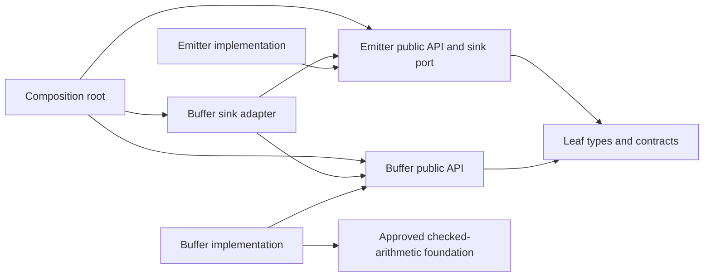

These boundaries implement [CMOD-004][cmod-004], [CMOD-020][cmod-020], [CMOD-021][cmod-021], and
[CMOD-022][cmod-022]. A peer implementation has no include or link dependency on the other peer. The
foundation allowance must name its permitted interface.

---

### Runtime callback flow

At runtime, the emitter invokes its injected port. The adapter translates that call into the
buffer's public operation and returns the provider's result through the port contract. The emitter
does not choose a concrete provider or inspect its representation.

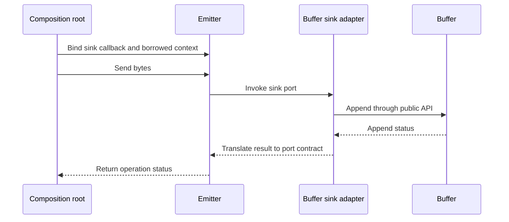

The synchronous call completes before `send` returns. The callback context and provider remain alive
throughout the call. See [CMOD-023][cmod-023], [CMOD-024][cmod-024], [CMOD-025][cmod-025], and
[CMOD-026][cmod-026] for context, lifetime, reentry, and error contracts.

---

<a id="lifecycle-model"></a>

### Lifecycle that every binding must satisfy

Composition creates providers, creates consumers, and binds borrowed contexts. A consumer may call
only while the provider context and function code are alive. Shutdown first prevents new calls, then
drains active work, then destroys the consumer, then releases the provider. Partial construction
unwinds only completed acquisitions. A runtime unbind or plugin unload must prove quiescence;
replacing a function pointer with NULL is not such proof.

In the example, a callback completes synchronously before send returns, and the application destroys
emitter before buffer. The busy flag rejects synchronous reentry. External synchronization is a
precondition for concurrent callers and teardown; the flag is not an atomic lock. The example does
not implement runtime plugin loading, worker threads, SDK installation, or cross-version ABI
negotiation.

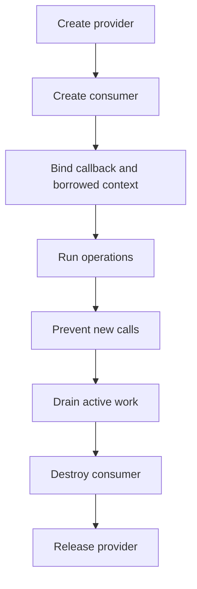

On a construction failure, unwind only the acquisitions that completed. The shutdown order above
keeps the provider alive until the consumer can no longer call it. This is the lifecycle obligation
in [CMOD-021][cmod-021] and [CMOD-024][cmod-024]; a cleared callback pointer alone does not prove
it.

---

### From source to release

Compile each translation unit using its module's declared inputs. Choose the artifact path required
by the target: object files, a relocatable module object, a static archive, or a shared library. The
final link composes the selected artifacts with adapters and application code.

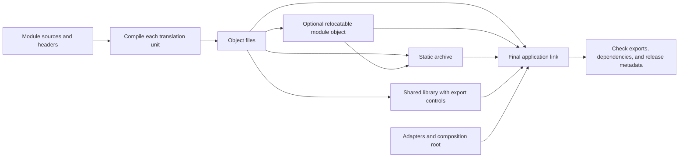

Shared-library objects use the target's required position-independent code settings. Export checks
inspect the actual artifact and selected link mode. See [CMOD-031][cmod-031] through
[CMOD-039][cmod-039] for build stages and [CMOD-061][cmod-061] through [CMOD-065][cmod-065] for
artifact checks.

---

## Architecture controls

<a id="11-minimum-visibility-is-the-primary-rule"></a>
<a id="cmod-001-minimum-visibility-is-the-primary-rule"></a> <a id="cmod-001"></a>

<a id="cmod-001-1-1-minimum-visibility"></a>

### CMOD-001: Minimum Visibility Is the Primary Rule

**Class:** ARCHITECTURE. **Obligation:** project requirement.

Give declarations, includes, types, state, callbacks, and exports the smallest scope their owner
needs. A one-file helper is static; a cross-TU helper is module internal; a public API exists only
for an approved consumer. Minimum visibility is an architecture policy. It is not memory isolation
between native modules in the same process. Automatic variable declaration placement follows
CSTYLE-107; minimum visibility does not permit nested declarations contrary to that rule.

**Related controls:** [CSTYLE-033][c-code-standard-cstyle-033],
[CSTYLE-069][c-code-standard-cstyle-069].

**Complete example:** [worked sources][c-module-architecture-worked-example].

#### Local examples

**Layout example (not executable):**

```text
Need the symbol outside one .c file?
  no  -> static definition in that .c file
  yes -> continue

Need the symbol outside its module?
  no  -> hidden module-internal symbol
  yes -> continue

Need another peer module to name the symbol?
  no  -> keep it out of peer module headers
  yes -> redesign the boundary around callbacks or an adapter

Need the final program or external consumer to link the symbol by name?
  no  -> hide or localize it
  yes -> public API/export contract
```

---

<a id="12-one-module-owns-each-implementation-detail"></a>
<a id="cmod-002-one-module-owns-each-implementation-detail"></a> <a id="cmod-002"></a>

<a id="cmod-002-1-2-single-module-ownership"></a>

### CMOD-002: One Module Owns Each Implementation Detail

**Class:** ARCHITECTURE. **Obligation:** project requirement.

Each implementation detail belongs to one module. A module owns:

- its source files
- its internal headers
- its private and internal symbols
- its state machines
- its storage layout
- its allocation policy for module-owned objects
- its lifecycle rules
- its inbound API
- the callback ports that represent dependencies it consumes
- its module tests
- its export list A peer module must not modify, inspect, allocate, free, or depend on another
  module's internal representation. Ownership does not follow directory proximity. A file in another
  module remains outside the boundary even when both modules live in the same repository. Code in
  the composition layer may include and bind both public module APIs. Peer module code must not
  include or name the other module's implementation.

**Related controls:** [CSTYLE-032][c-code-standard-cstyle-032],
[CSTYLE-082][c-code-standard-cstyle-082].

**Failure scenarios:** [CPIT-005][c-common-pitfalls-cpit-005].

**Complete example:** [worked sources][c-module-architecture-worked-example].

#### Local examples

**Contextual example:**

Architecture/data-flow example; arrows do not establish a memory-protection boundary.

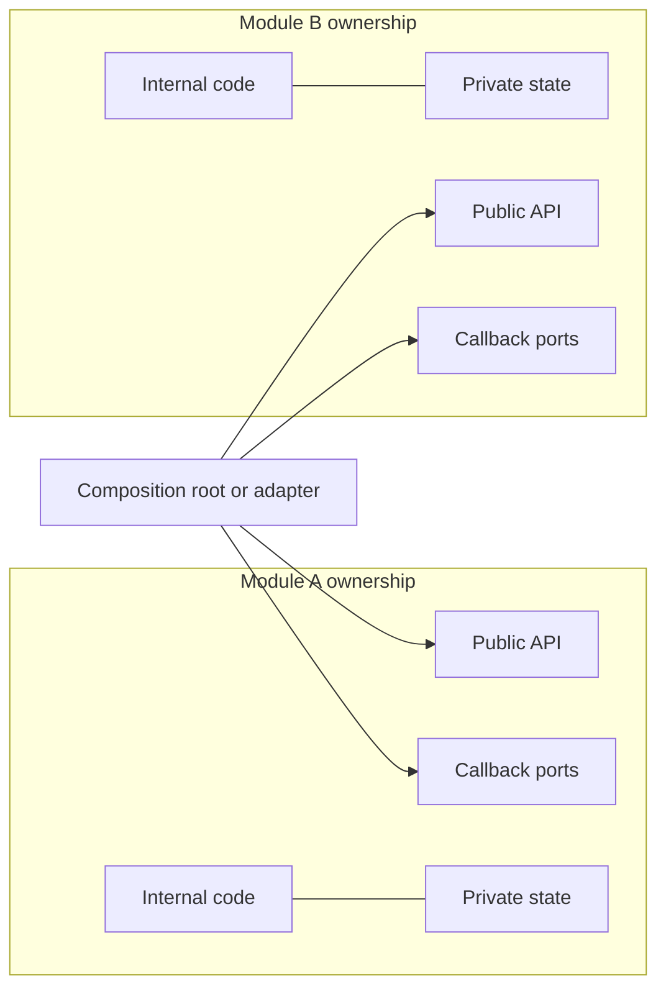

---

<a id="13-peer-modules-communicate-through-callbacks"></a>
<a id="cmod-003-peer-modules-communicate-through-callbacks"></a> <a id="cmod-003"></a>

<a id="cmod-003-1-3-callback-only-peer-communication"></a>

### CMOD-003: Peer Modules Communicate Through Callbacks

**Class:** ARCHITECTURE. **Obligation:** project requirement.

A peer module must not call another peer module through a named link-time symbol. It receives a
compatible function pointer through configuration, creation, binding, or registration and invokes
that pointer. The composition root owns the concrete symbol relationship. Use an adapter when DTOs,
units, errors, ownership, or execution semantics differ.

The original narrow foundation/platform allowances remain governed by CMOD-004, CMOD-050, and
CMOD-062. They do not authorize peer calls or allow a module to reclassify a provider merely to
bypass a callback. Callback-only communication is the project's module-boundary policy, not an ISO C
requirement.

**Related controls:** [CSTYLE-071][c-code-standard-cstyle-071].

**Failure scenarios:** [CPIT-026][c-common-pitfalls-cpit-026],
[CPIT-032][c-common-pitfalls-cpit-032].

**Complete example:** [worked sources][c-module-architecture-worked-example].

#### Local examples

**Noncompliant fragment (do not copy):**

```c
#include "frontend.h"

#include <stdlib.h>

#include "backend.h"

int FRONTEND_process(void)
{
    int ret = EXIT_SUCCESS;

    ret = BACKEND_run();
    if (ret != EXIT_SUCCESS)
    {
        goto function_output;
    }

function_output:
    return ret;
}
```

**Contextual C example:**

```c
typedef int (*frontend_request_cb_t)(void                         *context,
                                     const frontend_request_dto_t *request,
                                     frontend_reply_dto_t         *reply);

typedef struct FrontendCallbacks
{
        void                 *request_context;
        frontend_request_cb_t request;
} frontend_callbacks_t;
```

**Contextual C example:**

```c
int APP_createFrontend(backend_t *backend, frontend_t **frontend)
{
        int ret = EXIT_SUCCESS;

        frontend_callbacks_t callbacks = { 0 };

        if (backend == (backend_t *)(NULL))
        {
                ret = -EINVAL;
                goto function_output;
        }

        if (frontend == (frontend_t **)(NULL))
        {
                ret = -EINVAL;
                goto function_output;
        }

        callbacks.request_context = backend;
        callbacks.request         = BACKEND_handleFrontendRequest;

        ret = FRONTEND_create(frontend, &callbacks);

function_output:
        return ret;
}
```

**Contextual example:**

Architecture/data-flow example; arrows do not establish a memory-protection boundary.

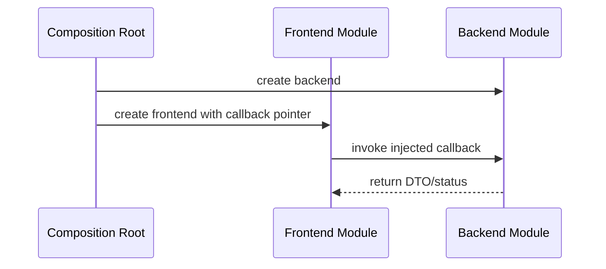

---

<a id="14-compile-modules-in-isolation"></a> <a id="cmod-004-compile-modules-in-isolation"></a>
<a id="cmod-004"></a>

<a id="cmod-004-1-4-isolated-module-compilation"></a>

### CMOD-004: Compile Modules in Isolation

**Class:** ARCHITECTURE. **Obligation:** project requirement.

The build must compile each module without peer-module include paths or peer-module link
dependencies. A module may use its own public/internal headers, the C standard library and approved
platform headers, the project leaf `types.h`, approved boundary DTO/callback contracts, module-local
generated headers, and platform abstractions owned by the module or an approved foundation.

A module target must not depend on another peer module target. Adapters and the composition root may
depend on the public APIs they connect. Inspect actual include dependencies as well as compiler
arguments so relative includes cannot bypass the boundary. Foundation/runtime symbols need the
explicit allowlist required by CMOD-062.

**Related controls:** [CSTYLE-034][c-code-standard-cstyle-034].

**Complete example:** [worked sources][c-module-architecture-worked-example].

#### Local examples

**Contextual example:**

Architecture/data-flow example; arrows do not establish a memory-protection boundary.

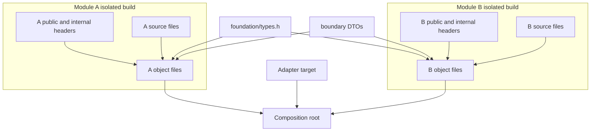

---

<a id="21-module-directory-layout"></a> <a id="cmod-005-module-directory-layout"></a>
<a id="cmod-005"></a>

<a id="cmod-005-2-1-module-directory-layout"></a>

### CMOD-005: Module Directory Layout

**Class:** ARCHITECTURE. **Obligation:** project requirement.

Give each module its own source list, public include directory, internal include directory when
needed, tests, and build description. Keep adapters and composition outside the peers they connect.
The worked project uses `modules/<name>/{inc,src}` with a local CMakeLists. Directory names are not
the authority: the reviewed ownership and dependency graph is.

**Complete example:** [worked sources][c-module-architecture-worked-example].

#### Local examples

**Layout example (not executable):**

```text
backend/
├── CMakeLists.txt
├── backend.version.map
├── inc/
│   └── backend.h
├── src/
│   ├── backend.c
│   ├── backend_data.c
│   ├── backend_process.c
│   └── inc/
│       ├── backend_internal.h
│       ├── backend_data.h
│       └── backend_process.h
└── tests/
    ├── public/
    └── internal/
```

**Layout example (not executable):**

```text
integration/
├── adapters/
│   └── frontend_backend_adapter.c
├── contracts/
│   ├── frontend_request_dto.h
│   └── frontend_reply_dto.h
└── composition/
    └── application_modules.c
```

---

<a id="22-public-internal-and-private-visibility"></a>
<a id="cmod-006-public-internal-and-private-visibility"></a> <a id="cmod-006"></a>

<a id="cmod-006-2-2-visibility-levels"></a>

### CMOD-006: Public, Internal, and Private Visibility

**Class:** ARCHITECTURE. **Obligation:** project requirement.

Public declarations form the supported inbound contract. Internal declarations are shared only among
translation units and owned tests of the same module. Private declarations stay in one translation
unit and use internal linkage. These source-level classes differ from ELF visibility and dynamic
export status; validate each layer rather than inferring one from the spelling of a name.

**Complete example:** [worked sources][c-module-architecture-worked-example].

#### Local examples

**Layout example (not executable):**

```text
public
internal
private
```

**Layout example (not executable):**

```text
<module>/inc/<module>.h
```

**Layout example (not executable):**

```text
<module>/src/inc/*.h
```

**Contextual C example:**

```c
static int backend_validateState(const backend_t *backend)
{
        int ret = EXIT_SUCCESS;

        if (backend == (const backend_t *)(NULL))
        {
                ret = -EINVAL;
                goto function_output;
        }

function_output:
        return ret;
}
```

---

<a id="23-state-ownership"></a> <a id="cmod-007-state-ownership"></a> <a id="cmod-007"></a>

<a id="cmod-007-2-3-state-ownership"></a>

### CMOD-007: State Ownership

**Class:** ARCHITECTURE. **Obligation:** project requirement.

Keep a module's mutable implementation state in module-owned objects. Peers must not inspect or
update its private fields. Use opaque handles and explicitly shared value DTOs. An exposed DTO is a
deliberate data contract, not private state made public. Immutable tables may be shared only as an
approved contract without transferring authority over module internals.

**Complete example:** [worked sources][c-module-architecture-worked-example].

#### Local examples

**Noncompliant fragment (do not copy):**

```c
typedef struct Backend backend_t;
```

**Contextual C example:**

```c
struct Backend
{
        uint32_t state;
        bool     is_ready;
};
```

---

<a id="24-memory-ownership-across-boundaries"></a>
<a id="cmod-008-memory-ownership-across-boundaries"></a> <a id="cmod-008"></a>

<a id="cmod-008-2-4-memory-ownership"></a>

### CMOD-008: Memory Ownership Across Boundaries

**Class:** ARCHITECTURE. **Obligation:** project requirement.

A boundary must state who owns every pointer and how long the pointed object remains valid. Default
callback rules:

- the caller owns input DTO storage
- the callee may read input DTO storage only during the callback
- the callee must not retain an input pointer
- the caller owns output storage that it passes into the callback
- the callback writes only within declared capacities
- pointer ownership does not transfer unless the contract names the transfer
- a module frees only memory that its own allocator contract owns Prefer DTO values with fixed-width
  fields, bounded arrays, spans, IDs, or opaque handles over raw ownership-bearing pointers.

**Related controls:** [CSTYLE-082][c-code-standard-cstyle-082],
[CSTYLE-083][c-code-standard-cstyle-083], [CSTYLE-084][c-code-standard-cstyle-084].

**Failure scenarios:** [CPIT-001][c-common-pitfalls-cpit-001],
[CPIT-002][c-common-pitfalls-cpit-002], [CPIT-003][c-common-pitfalls-cpit-003],
[CPIT-005][c-common-pitfalls-cpit-005], [CPIT-032][c-common-pitfalls-cpit-032],
[CPIT-033][c-common-pitfalls-cpit-033].

**Complete example:** [worked sources][c-module-architecture-worked-example].

#### Local examples

**Layout example (not executable):**

```text
boundary contract says caller allocates DTO; callee borrows during call and
never frees it
```

**Noncompliant fragment (do not copy):**

Layout, diagnostic, or contract example. This block is not executable C.

```text
callee frees caller-owned DTO because ownership was not specified
```

---

<a id="31-headers-must-minimize-includes"></a> <a id="cmod-009-headers-must-minimize-includes"></a>
<a id="cmod-009"></a>

<a id="cmod-009-3-1-minimum-header-includes"></a>

### CMOD-009: Headers Must Minimize Includes

**Class:** ARCHITECTURE. **Obligation:** project requirement.

A header must avoid including another project header. Expose only declarations needed by its public
contract and no transitive convenience includes. Prefer forward declarations when only pointers to
an incomplete type are needed. A source file includes its own concrete dependencies. Only the
leaf-contract exceptions in CMOD-010 may cross header boundaries.

**Related controls:** [CSTYLE-026][c-code-standard-cstyle-026],
[CSTYLE-028][c-code-standard-cstyle-028], [CSTYLE-033][c-code-standard-cstyle-033],
[CSTYLE-034][c-code-standard-cstyle-034].

**Complete example:** [worked sources][c-module-architecture-worked-example].

#### Local examples

**Contextual C example:**

```c
#if !defined(COIL_BACKEND_H)
  #define COIL_BACKEND_H

  #include "types.h"

typedef struct Backend       backend_t;
typedef struct BackendConfig backend_config_t;

int BACKEND_create(backend_t **backend, const backend_config_t *config);

int BACKEND_destroy(backend_t *backend);

#endif
```

**Noncompliant fragment (do not copy):**

```c
#include "database.h"
#include "frontend.h"
#include "logger.h"
#include "network.h"
#include "parser.h"
```

---

<a id="32-allowed-header-to-header-dependencies"></a>
<a id="cmod-010-allowed-header-to-header-dependencies"></a> <a id="cmod-010"></a>

<a id="cmod-010-3-2-header-dependency-exceptions"></a>

### CMOD-010: Allowed Header-to-Header Dependencies

**Class:** ARCHITECTURE. **Obligation:** project requirement.

A project header may include another project header only when it is an approved leaf contract. The
original categories are `types.h`, boundary DTO headers with no module dependencies, boundary
callback-contract headers with no module dependencies, and required C standard headers used to spell
the ABI.

An include exception needs a type-completeness or ABI-spelling reason; convenience does not qualify.
A public module header must not include another module's public or internal header. A foundation
directory is not blanket permission to include its contents.

The example's `compiler_api.h` is the explicitly scoped ABI-annotation leaf for the selected
platform profile: macros only, no provider API or state. Its approval does not permit a general
dependency-aggregating compiler header.

**Complete example:** [worked sources][c-module-architecture-worked-example].

#### Local examples

**Layout example (not executable):**

```text
public header includes only types.h or a leaf DTO/callback contract needed to
spell ABI
```

**Noncompliant fragment (do not copy):**

Layout, diagnostic, or contract example. This block is not executable C.

```text
public module header includes another peer module public header for
convenience
```

---

<a id="33-typesh-is-a-foundation-leaf"></a> <a id="cmod-011-typesh-is-a-foundation-leaf"></a>
<a id="cmod-011"></a>

<a id="cmod-011-3-3-types-header-leaf-policy"></a>

### CMOD-011: `types.h` Is a Foundation Leaf

**Class:** ARCHITECTURE. **Obligation:** project requirement.

A shared `types.h`, if present, contains only widely used scalar/value type definitions and the
minimum standard headers they require. It must contain no service API, callbacks, allocator
interface, mutable state, packing policy, or module-dependent feature logic. Do not introduce
`types.h` when direct standard includes and a narrow status header suffice. Test it alone when the
project has it.

**Related controls:** [CSTYLE-036][c-code-standard-cstyle-036],
[CSTYLE-034][c-code-standard-cstyle-034].

**Complete example:** [worked sources][c-module-architecture-worked-example].

#### Local examples

**Contextual C example:**

```c
#if !defined(COIL_TYPES_H)
  #define COIL_TYPES_H

  #include <stdbool.h>
  #include <stddef.h>
  #include <stdint.h>

typedef int32_t  project_status_t;
typedef uint32_t project_id_t;

#endif
```

---

<a id="34-dto-headers-are-leaf-contracts"></a> <a id="cmod-012-dto-headers-are-leaf-contracts"></a>
<a id="cmod-012"></a>

<a id="cmod-012-3-4-dto-header-policy"></a>

### CMOD-012: DTO Headers Are Leaf Contracts

**Class:** ARCHITECTURE. **Obligation:** project requirement.

Place a deliberately shared DTO in a contract header with no peer implementation dependencies.
Specify units, lengths, capacity, nullability, lifetime, and allowed values. A pointer-bearing DTO
is an in-process contract; neither fixed-width fields nor a `size_t` length make it a portable wire
or cross-architecture ABI. Use a distinct, explicit serializer for wire/persistent data. No hidden
allocation or ownership transfer may be implied by copying a DTO.

**Related controls:** [CSTYLE-036][c-code-standard-cstyle-036],
[CSTYLE-063][c-code-standard-cstyle-063], [CSTYLE-082][c-code-standard-cstyle-082],
[CSTYLE-083][c-code-standard-cstyle-083].

**Failure scenarios:** [CPIT-013][c-common-pitfalls-cpit-013],
[CPIT-029][c-common-pitfalls-cpit-029], [CPIT-032][c-common-pitfalls-cpit-032].

**Complete example:** [worked sources][c-module-architecture-worked-example].

#### Local examples

**Contextual C example:**

```c
#if !defined(COIL_FRONTEND_REQUEST_DTO_H)
  #define COIL_FRONTEND_REQUEST_DTO_H

  #include "types.h"

typedef struct FrontendRequestDto
{
        const uint8_t *payload;
        size_t         payload_size_bytes;
        uint32_t       operation;
        uint32_t       request_id;
} frontend_request_dto_t;

#endif
```

---

<a id="35-callback-contract-headers-are-leaf-contracts"></a>
<a id="cmod-013-callback-contract-headers-are-leaf-contracts"></a> <a id="cmod-013"></a>

<a id="cmod-013-3-5-callback-contract-header-policy"></a>

### CMOD-013: Callback Contract Headers Are Leaf Contracts

**Class:** ARCHITECTURE. **Obligation:** project requirement.

The consumer owns the required operation's port unless an explicitly shared protocol has a separate
owner. Define the exact function-pointer type, borrowed context, and semantics independently of the
concrete provider. The header may include needed DTO/standard leaves. Do not create a v-table with
unrelated capabilities simply to pass a provider object through another name.

**Related controls:** [CSTYLE-071][c-code-standard-cstyle-071].

**Failure scenarios:** [CPIT-026][c-common-pitfalls-cpit-026],
[CPIT-032][c-common-pitfalls-cpit-032].

**Complete example:** [worked sources][c-module-architecture-worked-example].

#### Local examples

**Contextual C example:**

```c
typedef int (*frontend_storage_read_cb_t)(void *context, uint32_t object_id,
                                          void   *buffer,
                                          size_t  buffer_size_bytes,
                                          size_t *read_size_bytes);
```

**Noncompliant fragment (do not copy):**

Layout, diagnostic, or contract example. This block is not executable C.

```text
backend_read_cb_t
postgres_read_cb_t
redis_read_cb_t
```

---

<a id="36-public-headers-must-be-self-contained"></a>
<a id="cmod-014-public-headers-must-be-self-contained"></a> <a id="cmod-014"></a>

<a id="cmod-014-3-6-self-contained-public-headers"></a>

### CMOD-014: Public Headers Must Be Self-Contained

**Class:** ARCHITECTURE. **Obligation:** project requirement.

Compile every public and contract header as the first include in a fresh translation unit, using
only its documented usage requirements. Test each supported configuration that changes the header. A
missing prerequisite is not fixed by reordering the consumer's includes. C++ compatibility is
separately qualified when the project claims it.

**Related controls:** [CSTYLE-034][c-code-standard-cstyle-034].

**Complete example:** [worked sources][c-module-architecture-worked-example].

#### Local examples

**Contextual C example:**

```c
#include "backend.h"
```

---

<a id="37-internal-headers-stay-inside-the-module"></a>
<a id="cmod-015-internal-headers-stay-inside-the-module"></a> <a id="cmod-015"></a>

<a id="cmod-015-3-7-internal-header-boundary"></a>

### CMOD-015: Internal Headers Stay Inside the Module

**Class:** ARCHITECTURE. **Obligation:** project requirement.

A module's internal headers belong below its private include directory, such as `<module>/src/inc`.
Only that module's implementation and owned internal tests may include them. Do not add the
directory to PUBLIC or INTERFACE include paths. Adapters, composition, other modules, and external
consumers use public contracts instead.

**Complete example:** [worked sources][c-module-architecture-worked-example].

#### Local examples

**Layout example (not executable):**

```text
<module>/src/inc/*.h
```

---

<a id="38-include-what-the-translation-unit-uses"></a>
<a id="cmod-016-include-what-the-translation-unit-uses"></a> <a id="cmod-016"></a>

<a id="cmod-016-3-8-direct-translation-unit-includes"></a>

### CMOD-016: Include What the Translation Unit Uses

**Class:** ARCHITECTURE. **Obligation:** project requirement.

An implementation includes its own public header first and directly includes the declarations it
uses. Required standard headers do not become an interface promise merely because another header
includes them. Follow CSTYLE-028. Do not solve missing declarations with local hand-written
prototypes or casts.

**Complete example:** [worked sources][c-module-architecture-worked-example].

#### Local examples

**Contextual C example:**

```c
#include <errno.h>
#include <stdlib.h>

#include "backend.h"
#include "backend_internal.h"
#include "backend_process.h"
#include "frontend_request_dto.h"
```

---

<a id="41-no-explicit-extern-in-project-c-code"></a>
<a id="cmod-017-no-explicit-extern-in-project-c-code"></a> <a id="cmod-017"></a>

<a id="cmod-017-4-1-no-explicit-extern"></a>

### CMOD-017: No Explicit `extern` in Project C Code

**Class:** ARCHITECTURE. **Obligation:** project requirement.

Project-owned C sources and core C headers must not use the `extern` keyword, including on function
declarations. Use normal function prototypes. Their C linkage remains external without the explicit
keyword; symbol and ownership audits still apply.

Do not create cross-translation-unit variables. Put mutable state inside a module-owned object and
pass its opaque handle or context pointer. Cross-TU functions within the same module may use an
owned internal header without an explicit `extern` declaration. Exceptional generated code,
linker-defined symbols, or foreign interfaces must be isolated outside the core and covered by the
reviewed allowlist in CMOD-059.

**Related controls:** [CSTYLE-088][c-code-standard-cstyle-088].

**Complete example:** [worked sources][c-module-architecture-worked-example].

#### Local examples

**Noncompliant fragment (do not copy):**

```c
extern int g_global_state;
extern int BACKEND_run(void);
```

**Contextual C example:**

```c
int BACKEND_run(void);
```

---

<a id="42-no-cross-module-global-objects"></a> <a id="cmod-018-no-cross-module-global-objects"></a>
<a id="cmod-018"></a>

<a id="cmod-018-4-2-no-cross-module-global-objects"></a>

### CMOD-018: No Cross-Module Global Objects

**Class:** ARCHITECTURE. **Obligation:** project requirement.

A module must not publish an object for another module to read or write by name. Use a query
operation on an opaque handle or an injected port instead. For peer-to-peer flow, composition binds
the operation through a callback. The peer must not receive the provider's public symbol as a direct
link dependency.

Use leaf value definitions for constants and private `static const` tables when needed, rather than
a cross-module data symbol. Audit exported data as well as functions; adding `const` does not exempt
an external object from this rule.

**Related controls:** [CSTYLE-082][c-code-standard-cstyle-082],
[CSTYLE-088][c-code-standard-cstyle-088].

**Failure scenarios:** [CPIT-005][c-common-pitfalls-cpit-005].

**Complete example:** [worked sources][c-module-architecture-worked-example].

#### Local examples

**Noncompliant fragment (do not copy):**

```c
extern backend_state_t g_backend_state;
```

**Contextual C example:**

```c
int BACKEND_getStatus(const backend_t *backend, backend_status_dto_t *status);
```

---

<a id="43-c-linkage-bridges-live-outside-core-c-headers"></a>
<a id="cmod-019-c-linkage-bridges-live-outside-core-c-headers"></a> <a id="cmod-019"></a>

<a id="cmod-019-4-3-cpp-linkage-adapter"></a>

### CMOD-019: C++ Linkage Bridges Live Outside Core C Headers

**Class:** ARCHITECTURE. **Obligation:** project requirement.

Core project C headers must not contain `extern "C"` wrappers. A C++ consumer uses a dedicated
compatibility header or adapter outside the core module tree. That bridge owns the C-linkage syntax
and its reviewed allowlist entry.

Keep C-compatible types and calling conventions explicit. A linkage bridge does not make all C23
syntax or project typedef names valid in C++. The supplied example contains no C++ bridge and does
not claim C++ interoperability testing.

**Complete example:** [worked sources][c-module-architecture-worked-example].

#### Local examples

**Layout example (not executable):**

```text
C++ adapter owns extern "C" bridge and includes the C public header
```

**Noncompliant fragment (do not copy):**

Layout, diagnostic, or contract example. This block is not executable C.

```text
core C public header contains C++ classes/templates or C++-only linkage
constructs
```

---

<a id="44-linker-and-assembly-symbols-stay-in-a-boundary-adapter"></a> <a id="cmod-087"></a>

<a id="cmod-087-4-4-linker-assembly-symbol-adapter"></a>

### CMOD-087: Linker and Assembly Symbols Stay in a Boundary Adapter

**Class:** ARCHITECTURE. Apply the scope and requirement words below.

Linker-script and assembly-defined symbols may use explicit `extern` only in one platform boundary
header. Declare an address symbol as an incomplete character array so the declaration does not
pretend that the linker created an ordinary C object of an application type.

The boundary must document whether each symbol represents an address, absolute value, size, or
object; its alignment; its owning linker or assembly source; and the build variants that define it.
Ordinary modules call an adapter such as:

The adapter performs any required conversion and translation-time or link-time validation. A module
must not compare, dereference, or perform arithmetic on the raw symbol directly.

#### Local examples

**Contextual C example:**

This declaration belongs only to a reviewed linker/assembly adapter outside the core tree. It is not
permission to use extern in an ordinary module.

```c
/* Defined by memory.ld; the symbol represents an address, not a C object. */
extern char __heap_start[];
```

**Contextual C example:**

```c
uintptr_t PLATFORM_heapStart(void);
```

---

<a id="51-modules-depend-on-ports-not-providers"></a>
<a id="cmod-020-modules-depend-on-ports-not-providers"></a> <a id="cmod-020"></a>

<a id="cmod-020-5-1-dependency-ports"></a>

### CMOD-020: Modules Depend on Ports, Not Providers

**Class:** ARCHITECTURE. **Obligation:** project requirement.

A module defines the external operations it needs as callback ports. Each port describes required
behavior, not the concrete provider. Composition binds the provider or adapter. Keep scheduling,
failure behavior, lifetime, and backpressure explicit.

Foundation and platform dependencies must meet the original lower-layer approval rules in CMOD-050
and the symbol allowlist in CMOD-062. A module cannot replace a peer port with a direct provider
dependency by changing its directory name.

**Complete example:** [worked sources][c-module-architecture-worked-example].

#### Local examples

**Contextual C example:**

```c
typedef struct ParserCallbacks
{
        void            *emit_context;
        void            *read_context;
        parser_emit_cb_t emit;
        parser_read_cb_t read;
} parser_callbacks_t;
```

---

<a id="52-the-composition-root-owns-binding"></a>
<a id="cmod-021-the-composition-root-owns-binding"></a> <a id="cmod-021"></a>

<a id="cmod-021-5-2-composition-root-binding"></a>

### CMOD-021: The Composition Root Owns Binding

**Class:** ARCHITECTURE. **Obligation:** project requirement.

The composition layer selects implementations, creates module instances, binds ports, and owns
startup/unwind/shutdown ordering. It may name several public APIs. It must keep borrowed contexts
and provider code alive until their consumers are quiescent. Failure during construction unwinds
only resources already acquired, in a valid reverse dependency order.

**Complete example:** [worked sources][c-module-architecture-worked-example].

#### Local examples

**Contextual example:**

Architecture/data-flow example; arrows do not establish a memory-protection boundary.

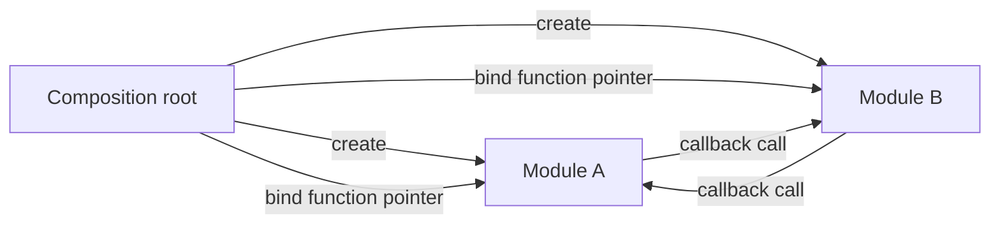

---

<a id="53-adapters-own-semantic-translation"></a>
<a id="cmod-022-adapters-own-semantic-translation"></a> <a id="cmod-022"></a>

<a id="cmod-022-5-3-adapter-ownership"></a>

### CMOD-022: Adapters Own Semantic Translation

**Class:** ARCHITECTURE. **Obligation:** project requirement.

Use an adapter when two modules do not share the same callback signature, DTO, error model, units,
lifecycle, or threading contract. The adapter may:

- include both public module headers
- include the specific DTO headers it translates
- convert one DTO into another
- map error domains
- convert units
- copy data across ownership boundaries
- schedule or serialize callbacks when the integration contract requires it The adapter must not
  include either module's internal headers. Keep adapters small. Integration policy belongs in the
  composition layer, not in module internals.

**Complete example:** [worked sources][c-module-architecture-worked-example].

#### Local examples

**Contextual example:**

Architecture/data-flow example; arrows do not establish a memory-protection boundary.

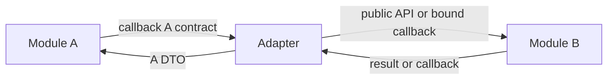

---

<a id="54-callback-context-is-opaque"></a> <a id="cmod-023-callback-context-is-opaque"></a>
<a id="cmod-023"></a>

<a id="cmod-023-5-4-opaque-callback-context"></a>

### CMOD-023: Callback Context Is Opaque

**Class:** ARCHITECTURE. **Obligation:** project requirement.

A callback may receive a `void *context` owned by the binding layer. The consuming module stores and
returns that pointer without interpreting its layout. The consuming module must not:

- cast the context to a peer module struct type
- free the context
- modify the pointed object outside the callback contract
- publish the context through another public interface Only the callback implementation understands
  the context.

**Related controls:** [CSTYLE-071][c-code-standard-cstyle-071],
[CSTYLE-082][c-code-standard-cstyle-082], [CSTYLE-096][c-code-standard-cstyle-096].

**Failure scenarios:** [CPIT-032][c-common-pitfalls-cpit-032].

**Complete example:** [worked sources][c-module-architecture-worked-example].

#### Local examples

**Contextual C example:**

```c
module->request_context = callbacks->request_context;
ret = module->request(module->request_context, request, reply);
```

**Noncompliant fragment (do not copy):**

```c
backend_t *backend = (backend_t *)module->request_context;
backend->private_state = 1;
```

---

<a id="55-callback-lifetime-must-be-explicit"></a>
<a id="cmod-024-callback-lifetime-must-be-explicit"></a> <a id="cmod-024"></a>

<a id="cmod-024-5-5-callback-lifetime"></a>

### CMOD-024: Callback Lifetime Must Be Explicit

**Class:** ARCHITECTURE. **Obligation:** project requirement.

Copy a callback table or retain it only under an explicit table-lifetime contract. In either case,
the target code and borrowed context must outlive all invocations. Before unbind, replacement,
destruction, or dynamic unload, exclude new invocations and drain in-flight calls. A clear-to-NULL
assignment alone is not safe concurrent teardown. Single-threaded APIs must state that external
synchronization covers destruction too.

**Related controls:** [CSTYLE-071][c-code-standard-cstyle-071],
[CSTYLE-082][c-code-standard-cstyle-082], [CSTYLE-084][c-code-standard-cstyle-084].

**Failure scenarios:** [CPIT-001][c-common-pitfalls-cpit-001],
[CPIT-002][c-common-pitfalls-cpit-002], [CPIT-032][c-common-pitfalls-cpit-032].

**Complete example:** [worked sources][c-module-architecture-worked-example].

#### Local examples

**Layout example (not executable):**

```text
create(config with callbacks) -> use -> destroy
```

**Layout example (not executable):**

```text
create -> bind callbacks -> use -> unbind -> destroy
```

---

<a id="56-callback-reentrancy-is-forbidden-by-default"></a>
<a id="cmod-025-callback-reentrancy-is-forbidden-by-default"></a> <a id="cmod-025"></a>

<a id="cmod-025-5-6-callback-reentrancy"></a>

### CMOD-025: Callback Reentrancy Is Forbidden by Default

**Class:** ARCHITECTURE. **Obligation:** project requirement.

A callback must not re-enter its invoking instance unless that instance's contract defines the
behavior. Reject reentry, defer it, or prove a reentrant state machine. A boolean busy flag can
reject synchronous reentry in a single-threaded/external-lock contract; it does not provide thread
safety. Document whether callback code may request shutdown and when it takes effect.

**Related controls:** [CSTYLE-071][c-code-standard-cstyle-071],
[CSTYLE-090][c-code-standard-cstyle-090].

**Complete example:** [worked sources][c-module-architecture-worked-example].

#### Local examples

**Layout example (not executable):**

```text
callback execution -> non-reentrant
```

---

<a id="57-callback-error-semantics-must-match-the-port"></a>
<a id="cmod-026-callback-error-semantics-must-match-the-port"></a> <a id="cmod-026"></a>

<a id="cmod-026-5-7-callback-error-contract"></a>

### CMOD-026: Callback Error Semantics Must Match the Port

**Class:** ARCHITECTURE. **Obligation:** project requirement.

Specify callback success, error domain, output validity, partial side effects, timeouts, retries,
and cancellation. Translate provider-specific failures in the adapter. Do not promise rollback of an
external side effect merely because the consumer returns an error. State idempotency before retrying
a failed operation. The example's buffer adapter is all-or-nothing; that is not assumed for I/O.

**Complete example:** [worked sources][c-module-architecture-worked-example].

#### Local examples

**Layout example (not executable):**

```text
port defines negative error namespace and whether partial output is valid;
adapter maps provider errors explicitly
```

**Noncompliant fragment (do not copy):**

Layout, diagnostic, or contract example. This block is not executable C.

```text
callback returns bool while caller interprets it as errno-style integer
```

---

<a id="61-translation-units-compile-independently"></a>
<a id="cmod-027-translation-units-compile-independently"></a> <a id="cmod-027"></a>

<a id="cmod-027-6-1-independent-translation-units"></a>

### CMOD-027: Translation Units Compile Independently

**Class:** ARCHITECTURE. **Obligation:** project requirement.

Compile each implementation file with the declarations and target settings it needs. Link external
definitions later. A missing function declaration is a compile defect; an unresolved final symbol is
a link defect. Function-pointer binding changes dependency representation but does not remove the
dependency's semantic, lifetime, or execution-time obligations.

**Source context:** [cmake-link][c-common-pitfalls-ref-cmake-link];
[cmake-build][c-common-pitfalls-ref-cmake-build];
[cmake-standard][c-common-pitfalls-ref-cmake-standard].

#### Local examples

**Contextual example:**

Architecture/data-flow example; arrows do not establish a memory-protection boundary.

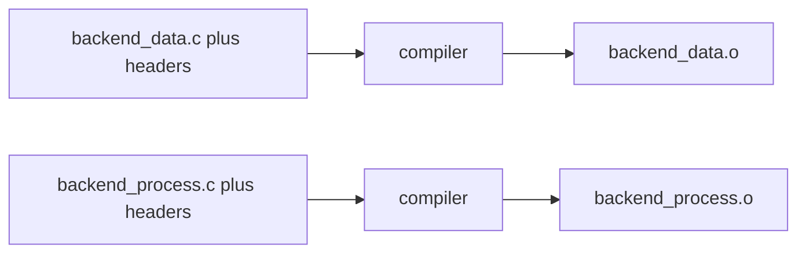

**Contextual example:**

Build/configuration excerpt for the named profile; resolve paths and targets in that project.

```sh
cc -c backend_data.c -o backend_data.o
cc -c backend_process.c -o backend_process.o
```

---

<a id="62-a-module-build-must-succeed-without-peer-headers"></a>
<a id="cmod-028-a-module-build-must-succeed-without-peer-headers"></a> <a id="cmod-028"></a>

<a id="cmod-028-6-2-no-peer-header-build-input"></a>

### CMOD-028: A Module Build Must Succeed Without Peer Headers

**Class:** ARCHITECTURE. **Obligation:** project requirement.

Inspect compile commands and compiler-generated dependency files. Reject relative-path,
generated-header, or transitive inclusion of an unapproved peer header, not only explicit `-I`
paths. Keep a reviewed allowlist for contract, foundation, compiler-runtime, and platform paths.
Test a peer build without the other peer's directories available.

**Source context:** [cmake-link][c-common-pitfalls-ref-cmake-link];
[cmake-build][c-common-pitfalls-ref-cmake-build];
[cmake-standard][c-common-pitfalls-ref-cmake-standard].

#### Local examples

**Layout example (not executable):**

```text
-I.../frontend/inc      while compiling backend
-I.../backend/src/inc   while compiling frontend
```

---

<a id="63-a-module-build-must-not-link-a-peer-module"></a>
<a id="cmod-029-a-module-build-must-not-link-a-peer-module"></a> <a id="cmod-029"></a>

<a id="cmod-029-6-3-no-peer-link-dependency"></a>

### CMOD-029: A Module Build Must Not Link a Peer Module

**Class:** ARCHITECTURE. **Obligation:** project requirement.

A module target must not use a peer module as a private, public, or interface link dependency.

The composition target performs the final combination. Adapters may link or reference the public
APIs of the modules they connect.

**Source context:** [cmake-link][c-common-pitfalls-ref-cmake-link];
[cmake-build][c-common-pitfalls-ref-cmake-build];
[cmake-standard][c-common-pitfalls-ref-cmake-standard].

#### Local examples

**Noncompliant fragment (do not copy):**

Build/configuration excerpt for the named profile; resolve paths and targets in that project.

```cmake
target_link_libraries(frontend PRIVATE backend)
```

---

<a id="64-undefined-peer-symbols-are-a-ci-failure"></a>
<a id="cmod-030-undefined-peer-symbols-are-a-ci-failure"></a> <a id="cmod-030"></a>

<a id="cmod-030-6-4-no-peer-undefined-symbols"></a>

### CMOD-030: Undefined Peer Symbols Are a CI Failure

**Class:** ARCHITECTURE. **Obligation:** project requirement.

For a module artifact, identify external references that are not satisfied within that module or an
approved dependency. `nm -u` on an archive can include references resolved by another member of the
same archive; subtract the module's own definitions before classifying them as external. Reject
every peer-symbol dependency. Also inspect code and relocations where optimization or LTO obscures
names; a prefix scan alone is not a complete architectural proof.

**Source context:** [cmake-link][c-common-pitfalls-ref-cmake-link];
[cmake-build][c-common-pitfalls-ref-cmake-build];
[cmake-standard][c-common-pitfalls-ref-cmake-standard].

#### Local examples

**Noncompliant fragment (do not copy):**

Layout, diagnostic, or contract example. This block is not executable C.

```text
frontend.o
  U BACKEND_run
  T FRONTEND_run
```

**Layout example (not executable):**

```text
frontend.o
  T FRONTEND_run
```

---

<a id="71-tool-ownership-by-build-stage"></a> <a id="cmod-031-tool-ownership-by-build-stage"></a>
<a id="cmod-031"></a>

<a id="cmod-031-7-1-progressive-build-tools"></a>

### CMOD-031: Tool Ownership by Build Stage

**Class:** ARCHITECTURE. **Obligation:** project requirement.

The compiler emits translation units; a partial linker combines relocatable objects; an archiver
packages members; a final linker resolves a program or shared library. Header self-containment tests
compile a translation unit that includes the header. A linker map, export map, archive index, and
dynamic symbol table serve different purposes and are not interchangeable evidence.

**Source context:** [cmake-link][c-common-pitfalls-ref-cmake-link];
[cmake-build][c-common-pitfalls-ref-cmake-build];
[cmake-standard][c-common-pitfalls-ref-cmake-standard].

#### Local examples

**Layout example (not executable):**

```text
compiler       .c -> .o
linker -r      .o + .o -> module.o
ar             .o + .o -> libmodule.a
linker -shared .o + .o -> libmodule.so / module.dll
final linker   main.o + modules/libs/adapters -> app.elf / app.exe
```

---

<a id="72-phase-1-build-object-files"></a> <a id="cmod-032-phase-1-build-object-files"></a>
<a id="cmod-032"></a>

<a id="cmod-032-7-2-object-file-phase"></a>

### CMOD-032: Phase 1: Build Object Files

**Class:** ARCHITECTURE. **Obligation:** project requirement.

Compile each object with its owning module's include paths, macros, dialect, warning policy, and ABI
options. External references may target owned same-module functions and approved
foundation/runtime/platform services. Peer references are not allowed. Record actual compile
commands; global include paths can conceal an invalid dependency even if the target list looks
correct.

**Source context:** [cmake-link][c-common-pitfalls-ref-cmake-link];
[cmake-build][c-common-pitfalls-ref-cmake-build];
[cmake-standard][c-common-pitfalls-ref-cmake-standard].

#### Local examples

**Layout example (not executable):**

```text
backend_data.c      + headers -> backend_data.o
backend_process.c   + headers -> backend_process.o
frontend_data.c     + headers -> frontend_data.o
frontend_process.c  + headers -> frontend_process.o
main.c              + headers -> main.o
```

---

<a id="73-phase-2-build-a-relocatable-module-object"></a>
<a id="cmod-033-phase-2-build-a-relocatable-module-object"></a> <a id="cmod-033"></a>

<a id="cmod-033-7-3-relocatable-module-object"></a>

### CMOD-033: Phase 2: Build a Relocatable Module Object

**Class:** ARCHITECTURE. **Obligation:** project requirement.

Use a partial link such as the platform's relocatable-link mode only when its benefit is explicit.
Preserve needed relocation and export information for the final link. Partial linking does not
automatically hide internal globals and can change dead-code selection granularity. Qualify LTO and
debug behavior before using this representation in a release pipeline.

**Source context:** [cmake-link][c-common-pitfalls-ref-cmake-link];
[cmake-build][c-common-pitfalls-ref-cmake-build];
[cmake-standard][c-common-pitfalls-ref-cmake-standard].

#### Local examples

**Contextual example:**

Architecture/data-flow example; arrows do not establish a memory-protection boundary.

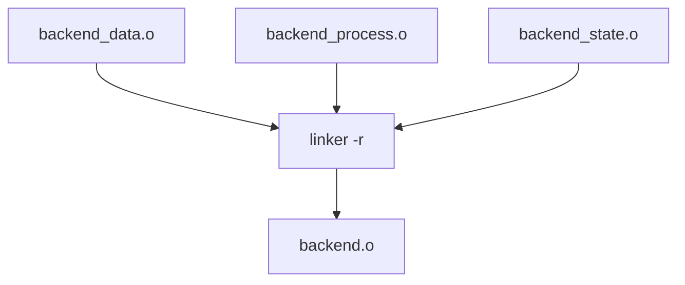

**Contextual example:**

Build/configuration excerpt for the named profile; resolve paths and targets in that project.

```sh
cc -r \
    backend_data.o \
    backend_process.o \
    backend_state.o \
    -o backend.o
```

---

<a id="74-phase-3a-build-a-static-library"></a>
<a id="cmod-034-phase-3a-build-a-static-library"></a> <a id="cmod-034"></a>

<a id="cmod-034-7-4-static-library-phase"></a>

### CMOD-034: Phase 3A: Build a Static Library

**Class:** ARCHITECTURE. **Obligation:** project requirement.

A static library is an archive of object files, not a completed link. It may retain internal global
symbols and unresolved references between its members. Audit its members and allowed external
dependency set. A shared-library version script does not hide symbols inside the archive. The final
consumer still needs the archive's approved link dependencies.

**Source context:** [cmake-link][c-common-pitfalls-ref-cmake-link];
[cmake-build][c-common-pitfalls-ref-cmake-build];
[cmake-standard][c-common-pitfalls-ref-cmake-standard].

#### Local examples

**Layout example (not executable):**

```text
backend_data.o + backend_process.o
        |
        v
       ar
        |
        v
libbackend.a
```

**Contextual example:**

Build/configuration excerpt for the named profile; resolve paths and targets in that project.

```sh
ar rcs libbackend.a backend_data.o backend_process.o
```

---

<a id="75-phase-3b-build-a-linux-shared-library"></a>
<a id="cmod-035-phase-3b-build-a-linux-shared-library"></a> <a id="cmod-035"></a>

<a id="cmod-035-7-5-linux-shared-library-phase"></a>

### CMOD-035: Phase 3B: Build a Linux Shared Library

**Class:** ARCHITECTURE. **Obligation:** project requirement.

For a Linux ELF shared module, compile position-independent code with hidden default visibility and
explicitly mark its supported public declarations. Apply an export allowlist at final shared linking
and inspect the actual dynamic exports. Reject unresolved symbols in an ordinary, non-instrumented
shared build. A host-resolved plugin ABI needs a documented import contract. A sanitizer test
profile may instead resolve instrumentation symbols in the final executable; Clang ASan documents
why `--no-undefined` is inappropriate for that shared test build. Neither exception relaxes the
ordinary release import/export audit.

**Source context:** [gcc-codegen][c-common-pitfalls-ref-gcc-codegen];
[ld-version][c-common-pitfalls-ref-ld-version]; [asan][c-common-pitfalls-ref-asan].

#### Local examples

**Contextual example:**

Build/configuration excerpt for the named profile; resolve paths and targets in that project.

```sh
cc \
    -fPIC \
    -fvisibility=hidden \
    -c backend_data.c \
    -o backend_data.pic.o
```

**Contextual example:**

Build/configuration excerpt for the named profile; resolve paths and targets in that project.

```sh
cc -shared \
    backend_data.pic.o \
    backend_process.pic.o \
    -Wl,--version-script=backend.version.map \
    -Wl,-soname,libbackend.so.1 \
    -o libbackend.so.1.0.0
```

---

<a id="76-phase-3c-build-a-windows-dynamic-library"></a>
<a id="cmod-036-phase-3c-build-a-windows-dynamic-library"></a> <a id="cmod-036"></a>

<a id="cmod-036-7-6-windows-dll-phase"></a>

### CMOD-036: Phase 3C: Build a Windows Dynamic Library

**Class:** ARCHITECTURE. **Obligation:** project requirement.

For Windows DLLs, specify exported functions, import declarations, calling convention,
runtime/allocator compatibility, and the import-library contract. Use explicit export annotations or
a DEF allowlist, not automatic export of all non-static symbols. Compile separate static and DLL
variants when their macros or ABI settings differ. The included compiler adapter sketches these
annotations; Windows execution and DLL loading were not tested in this delivery.

**Source context:** [cmake-link][c-common-pitfalls-ref-cmake-link];
[cmake-build][c-common-pitfalls-ref-cmake-build];
[cmake-standard][c-common-pitfalls-ref-cmake-standard].

#### Local examples

**Layout example (not executable):**

```text
backend objects
      |
      v
shared linker
  |       |
  v       v
backend.dll
libbackend.dll.a or backend.lib
```

**Contextual example:**

Build/configuration excerpt for the named profile; resolve paths and targets in that project.

```sh
x86_64-w64-mingw32-gcc -shared \
    backend_data.o \
    backend_process.o \
    -Wl,--out-implib,libbackend.dll.a \
    -o backend.dll
```

---

<a id="77-phase-4-final-application-link"></a> <a id="cmod-037-phase-4-final-application-link"></a>
<a id="cmod-037"></a>

<a id="cmod-037-7-7-final-application-link"></a>

### CMOD-037: Phase 4: Final Application Link

**Class:** ARCHITECTURE. **Obligation:** project requirement.

The final composition target links the application entry point, isolated module artifacts, adapters,
and approved foundation libraries.

The final link is the first normal stage that needs the complete application symbol graph.

**Source context:** [cmake-link][c-common-pitfalls-ref-cmake-link];
[cmake-build][c-common-pitfalls-ref-cmake-build];
[cmake-standard][c-common-pitfalls-ref-cmake-standard].

#### Local examples

**Contextual example:**

Architecture/data-flow example; arrows do not establish a memory-protection boundary.

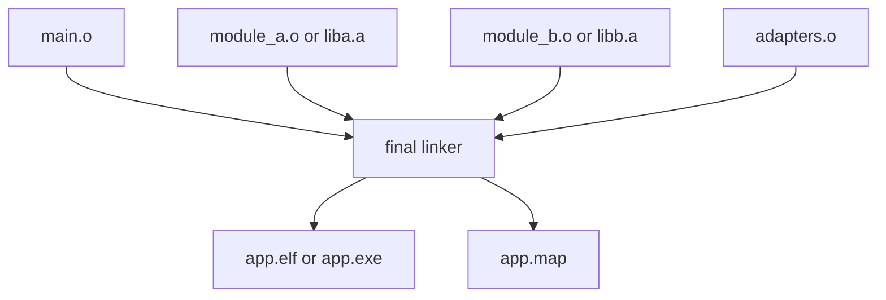

**Contextual example:**

Build/configuration excerpt for the named profile; resolve paths and targets in that project.

```sh
cc \
    main.o \
    adapters.o \
    backend.o \
    frontend.o \
    -Wl,-Map=app.map \
    -o app.elf
```

---

<a id="78-static-library-link-order"></a> <a id="cmod-038-static-library-link-order"></a>
<a id="cmod-038"></a>

<a id="cmod-038-7-8-static-library-link-order"></a>

### CMOD-038: Static Library Link Order

**Class:** ARCHITECTURE. **Obligation:** project requirement.

Static archive resolution can depend on linker semantics and ordering. Represent approved foundation
and third-party dependencies in build targets so the final link receives them. Do not conceal peer
cycles with linker groups. Link-order workarounds for a foreign library belong to its adapter and
must be documented. Callback peers do not make all other archive ordering irrelevant.

**Source context:** [cmake-link][c-common-pitfalls-ref-cmake-link];
[cmake-build][c-common-pitfalls-ref-cmake-build];
[cmake-standard][c-common-pitfalls-ref-cmake-standard].

#### Local examples

**Contextual example:**

Build/configuration excerpt for the named profile; resolve paths and targets in that project.

```sh
cc main.o libconsumer.a libprovider.a -o app.elf
```

---

<a id="79-linker-report-map-and-export-map-are-different-files"></a>
<a id="cmod-039-linker-report-map-and-export-map-are-different-files"></a> <a id="cmod-039"></a>

<a id="cmod-039-7-9-map-file-semantics"></a>

### CMOD-039: Linker Report Map and Export Map Are Different Files

**Class:** ARCHITECTURE. **Obligation:** project requirement.

A report map describes link layout and contributions; an export/version map constrains a shared
object's exposed symbols and, where configured, versions. Use different filenames and review them
for their respective purpose. A nonempty report map is not evidence that an export allowlist was
applied.

**Source context:** [cmake-link][c-common-pitfalls-ref-cmake-link];
[cmake-build][c-common-pitfalls-ref-cmake-build];
[cmake-standard][c-common-pitfalls-ref-cmake-standard].

#### Local examples

**Contextual example:**

Build/configuration excerpt for the named profile; resolve paths and targets in that project.

```sh
-Wl,-Map=app.map
```

**Contextual example:**

Build/configuration excerpt for the named profile; resolve paths and targets in that project.

```sh
-Wl,--version-script=backend.version.map
```

---

<a id="710-reproducible-build-inputs-and-metadata"></a> <a id="cmod-106"></a>

<a id="cmod-106-7-10-reproducible-build-contract"></a>

### CMOD-106: Reproducible Build Inputs and Metadata

**Class:** ARCHITECTURE. Apply the scope and requirement words below.

**Related pitfalls:**

- [CPIT-172: Release artifact changes without a source or toolchain
  change][c-common-pitfalls-cpit-172]

A release profile must define which build inputs may influence the artifact and must remove
accidental dependence on wall-clock time, absolute checkout paths, filesystem enumeration order,
locale, timezone, archive metadata, random seeds, and host-specific generator output.

The build owner must record the toolchain and dependency versions and must use a stable input order.
When generated output needs a source-derived timestamp, use the project reproducible-build
mechanism, such as `SOURCE_DATE_EPOCH`, instead of the build clock. Reproducible Builds documents
stable input order, locale control, and `SOURCE_DATE_EPOCH` for this
purpose.[reproducible-stable-inputs][reproducible-stable-inputs]
[reproducible-source-date-epoch][reproducible-source-date-epoch]

#### Local examples

**Contextual example:**

Build/configuration excerpt for the named profile; resolve paths and targets in that project.

```sh
export LC_ALL=C
export TZ=UTC
export SOURCE_DATE_EPOCH="$(git log -1 --format=%ct)"
cmake -S . -B build -DPROJECT_RELEASE=ON
cmake --build build --target release
```

**Noncompliant fragment (do not copy):**

Build/configuration excerpt for the named profile; resolve paths and targets in that project.

```sh
date > generated/build_timestamp.txt
find src -type f > generated/source_order.txt
```

---

<a id="81-private-functions-use-static"></a> <a id="cmod-040-private-functions-use-static"></a>
<a id="cmod-040"></a>

<a id="cmod-040-8-1-static-private-functions"></a>

### CMOD-040: Private Functions Use `static`

**Class:** ARCHITECTURE. **Obligation:** project requirement.

A function used by one translation unit must use internal linkage. Do not declare a private helper
in a header.

**Related controls:** [CSTYLE-003][c-code-standard-cstyle-003].

#### Local examples

**Contextual C example:**

```c
static int backend_parseLine(const char *line)
{
        int ret = EXIT_SUCCESS;

        if (line == (const char *)(NULL))
        {
                ret = -EINVAL;
                goto function_output;
        }

        /* implementation */

function_output:
        return ret;
}
```

---

<a id="82-module-internal-cross-tu-functions-stay-hidden"></a>
<a id="cmod-041-module-internal-cross-tu-functions-stay-hidden"></a> <a id="cmod-041"></a>

<a id="cmod-041-8-2-hidden-module-internal-functions"></a>

### CMOD-041: Module-Internal Cross-TU Functions Stay Hidden

**Class:** ARCHITECTURE. **Obligation:** project requirement.

Cross-TU internal functions use external linkage only within their owning module and must stay
outside the public dynamic ABI. Keep their prototypes in internal headers and use hidden
visibility/export controls for shared variants. A static archive may still carry those names for its
own final resolution. Optional LTO/localization must not break relocations, debugging, or ABI
checks.

**Source context:** [gcc-codegen][c-common-pitfalls-ref-gcc-codegen];
[ld-version][c-common-pitfalls-ref-ld-version].

#### Local examples

**Layout example (not executable):**

```text
cross-TU module helper lives in internal header and is hidden from final
shared-library export table
```

**Noncompliant fragment (do not copy):**

Layout, diagnostic, or contract example. This block is not executable C.

```text
cross-TU internal helper becomes a public dynamic symbol
```

---

<a id="83-public-symbols-need-an-explicit-export-contract"></a>
<a id="cmod-042-public-symbols-need-an-explicit-export-contract"></a> <a id="cmod-042"></a>

<a id="cmod-042-8-3-explicit-public-export-contract"></a>

### CMOD-042: Public Symbols Need an Explicit Export Contract

**Class:** ARCHITECTURE. **Obligation:** project requirement.

Maintain an explicit set of exported public symbols for each shared ABI. Compare the produced
dynamic symbol table against that set in both directions: no unapproved exports and no missing
required exports. ELF visibility attributes and linker scripts must agree. For Windows, inspect PE
exports. Do not treat all symbols reported by a generic symbol-table command as dynamic exports.

**Source context:** [gcc-codegen][c-common-pitfalls-ref-gcc-codegen];
[ld-version][c-common-pitfalls-ref-ld-version].

#### Local examples

**Contextual example:**

Build/configuration excerpt for the named profile; resolve paths and targets in that project.

```ld
BACKEND_1.0 {
    global:
        BACKEND_create;
        BACKEND_destroy;
        BACKEND_handleFrontendRequest;

    local:
        *;
};
```

---

<a id="84-public-symbol-naming-must-reveal-only-the-public-api"></a>
<a id="cmod-043-public-symbol-naming-must-reveal-only-the-public-api"></a> <a id="cmod-043"></a>

<a id="cmod-043-8-4-symbol-naming-levels"></a>

### CMOD-043: Public Symbol Naming Must Reveal Only the Public API

**Class:** ARCHITECTURE. **Obligation:** project requirement.

Public symbols use the uppercase module prefix defined by CSTYLE-003; internal and private helpers
use its lowercase form. The export manifest, not the spelling alone, determines the dynamic ABI.
Review every new public-looking symbol against the intended API and reject accidental exports. A
private helper still needs `static`.

**Related controls:** [CSTYLE-003][c-code-standard-cstyle-003].

#### Local examples

**Layout example (not executable):**

```text
Public API:
  BACKEND_create
  BACKEND_destroy
  BACKEND_handleFrontendRequest

Internal module API:
  backend_dataLoad
  backend_processStep

Private translation-unit helper:
  static backend_parseLine
```

---

<a id="85-public-api-types-prefer-opaque-handles"></a>
<a id="cmod-044-public-api-types-prefer-opaque-handles"></a> <a id="cmod-044"></a>

<a id="cmod-044-8-5-opaque-public-types"></a>

### CMOD-044: Public API Types Prefer Opaque Handles

**Class:** ARCHITECTURE. **Obligation:** project requirement.

Expose incomplete object types when clients should not depend on representation. The owning module
creates, initializes, and destroys them using its documented storage contract. An opaque handle does
not validate arbitrary pointers and is not a capability security boundary in a shared native address
space. Caller-supplied storage requires a separate qualified alignment/lifetime design.

#### Local examples

**Contextual C example:**

```c
typedef struct Backend backend_t;
```

---

<a id="86-public-apis-have-a-lifecycle-and-deprecation-policy"></a> <a id="cmod-107"></a>

<a id="cmod-107-8-6-public-api-lifecycle-deprecation"></a>

### CMOD-107: Public APIs Have a Lifecycle and Deprecation Policy

**Class:** ARCHITECTURE. Apply the scope and requirement words below.

**Related pitfalls:**

- [CPIT-170: Stable API disappears without a migration window][c-common-pitfalls-cpit-170]

Each public API belongs to a named maturity state such as experimental, unstable, stable,
deprecated, or retired. The project must define which states permit source or ABI breaks, how users
learn about a change, and how long a stable API remains available after deprecation.

A deprecation must identify the replacement, first deprecated release, earliest removal release, and
migration test coverage. Stable API removal requires an approved compatibility decision. Zephyr uses
explicit experimental, unstable, stable, deprecated, and retired states and requires a deprecation
period for stable APIs.[zephyr-api-lifecycle][zephyr-api-lifecycle]

#### Local examples

**Contextual example:**

Build/configuration excerpt for the named profile; resolve paths and targets in that project.

```yaml
DEVICE_read:
  state: stable
  since: 3.0.0
DEVICE_readLegacy:
  state: deprecated
  deprecated_since: 4.2.0
  earliest_removal: 5.0.0
  replacement: DEVICE_read
```

**Noncompliant fragment (do not copy):**

Build/configuration excerpt for the named profile; resolve paths and targets in that project.

```yaml
DEVICE_readLegacy:
  state: removed
  replacement: null
  migration_window: null
```

---

<a id="91-release-artifacts-minimize-discoverable-symbols"></a>
<a id="cmod-045-release-artifacts-minimize-discoverable-symbols"></a> <a id="cmod-045"></a>

<a id="cmod-045-9-1-release-symbol-minimization"></a>

### CMOD-045: Release Artifacts Minimize Discoverable Symbols

**Class:** ARCHITECTURE. **Obligation:** project requirement.

Minimize unnecessary release exports and metadata without removing required runtime, diagnostics,
unwind, or support information. Evaluate hidden visibility, section garbage collection, and LTO
under the target profile. They are different mechanisms and none is a secrecy guarantee. Do not
enable identical-code folding when the product relies on distinct function addresses unless that
reliance is removed or the behavior is qualified.

**Source context:** [gcc-codegen][c-common-pitfalls-ref-gcc-codegen];
[ld-version][c-common-pitfalls-ref-ld-version].

#### Local examples

**Layout example (not executable):**

```text
-fvisibility=hidden
-ffunction-sections
-fdata-sections
-flto
-Wl,--gc-sections
-Wl,--version-script=<module>.version.map
```

---

<a id="92-ship-stripped-release-binaries"></a> <a id="cmod-046-ship-stripped-release-binaries"></a>
<a id="cmod-046"></a>

<a id="cmod-046-9-2-stripped-release-binaries"></a>

### CMOD-046: Ship Stripped Release Binaries

**Class:** ARCHITECTURE. **Obligation:** project requirement.

Where deployment allows stripping, retain matching unstripped artifacts or separate debug files in
controlled engineering storage. Record build identity so crash addresses can be symbolized against
the exact binary. Verify the shipped binary after stripping and signing. Do not strip relocatable
libraries as though they were final executables.

#### Local examples

**Contextual example:**

Build/configuration excerpt for the named profile; resolve paths and targets in that project.

```sh
objcopy --only-keep-debug app.elf app.debug
strip --strip-unneeded app.elf
```

---

<a id="93-do-not-embed-internal-names-without-need"></a>
<a id="cmod-047-do-not-embed-internal-names-without-need"></a> <a id="cmod-047"></a>

<a id="cmod-047-9-3-minimum-binary-identifiers"></a>

### CMOD-047: Do Not Embed Internal Names Without Need

**Class:** ARCHITECTURE. **Obligation:** project requirement.

Avoid shipping unnecessary source paths, build-user paths, debug-only names, and unused diagnostic
strings. Use qualified compiler path-remapping options to avoid embedding host-specific paths.
Preserve diagnostics, unwind data, and identifiers required for safety, support, and incident
response. Stable numeric error IDs may replace implementation-specific text when an internal decoder
and the product diagnostic contract support that choice.

#### Local examples

**Layout example (not executable):**

```text
-ffile-prefix-map=<build-root>=.
-fdebug-prefix-map=<build-root>=.
```

---

<a id="94-reverse-engineering-resistance-does-not-replace-security"></a>
<a id="cmod-048-reverse-engineering-resistance-does-not-replace-security"></a> <a id="cmod-048"></a>

<a id="cmod-048-9-4-no-security-by-symbol-secrecy"></a>

### CMOD-048: Reverse-Engineering Resistance Does Not Replace Security

**Class:** ARCHITECTURE. **Obligation:** project requirement.

The project may reduce binary metadata, symbol names, and public ABI surface. The design must still
assume that an analyst can inspect machine code, memory, control flow, constants, and external
behavior. Do not place secrets, private keys, credentials, trust decisions, or authorization rules
behind symbol hiding as the only control.

#### Local examples

**Layout example (not executable):**

```text
authorization and key protection remain correct even if attacker knows every
symbol and control-flow edge
```

**Noncompliant fragment (do not copy):**

Layout, diagnostic, or contract example. This block is not executable C.

```text
assume hidden function name prevents attacker from reaching privileged
operation
```

---

<a id="95-production-binaries-use-a-named-hardening-profile"></a> <a id="cmod-108"></a>

<a id="cmod-108-9-5-production-binary-hardening-profile"></a>

### CMOD-108: Production Binaries Use a Named Hardening Profile

**Class:** ARCHITECTURE. Apply the scope and requirement words below.

**Related pitfalls:**

- [CPIT-171: Production binary omits an applicable hardening control][c-common-pitfalls-cpit-171]

Each production target must select a reviewed compiler and linker hardening profile for its
operating system, architecture, ABI, and threat model. The profile owns the exact flags and the CI
checks that prove the resulting binary contains the requested protections.

A hosted ELF profile should evaluate fortification, stack protection, stack- clash protection,
PIE/PIC, non-executable stack metadata, full RELRO, and architecture control-flow or branch
protection when the toolchain and target support them. Embedded profiles should map the same goal to
MPU/PMP, execute permissions, stack protection, branch protection, and linker-region policy as
available. OpenSSF documents current GCC and Clang hardening options and their target
constraints.[openssf-hardening][openssf-hardening]

Keep flags in one target-owned build profile:

Do not scatter one-off hardening flags across unrelated targets:

#### Local examples

**Contextual example:**

Build/configuration excerpt for the named profile; resolve paths and targets in that project.

```cmake
add_library(project_hardening INTERFACE)

target_compile_options(
    project_hardening
    INTERFACE
        -fstack-protector-strong
        -fstack-clash-protection
)

target_link_options(
    project_hardening
    INTERFACE
        -Wl,-z,relro
        -Wl,-z,now
        -Wl,-z,noexecstack
)
```

**Noncompliant fragment (do not copy):**

Build/configuration excerpt for the named profile; resolve paths and targets in that project.

```cmake
target_compile_options(module_a PRIVATE -fstack-protector-strong)
target_link_options(module_b PRIVATE -Wl,-z,relro)
```

---

<a id="101-one-target-owns-one-module-build"></a>
<a id="cmod-049-one-target-owns-one-module-build"></a> <a id="cmod-049"></a>

<a id="cmod-049-10-1-module-cmake-target"></a>

### CMOD-049: One Target Owns One Module Build

**Class:** ARCHITECTURE. **Obligation:** project requirement.

Each module CMakeLists owns its source list, public/internal include paths, compile requirements,
and artifact variants. Use target-scoped options and usage requirements. Avoid global include/link
settings that permit unrelated peer access. Build-interface and install-interface paths need
separate handling when packaging an SDK; the example is a build-tree demonstration, not an
installer.

**Source context:** [cmake-link][c-common-pitfalls-ref-cmake-link];
[cmake-build][c-common-pitfalls-ref-cmake-build];
[cmake-standard][c-common-pitfalls-ref-cmake-standard].

**Complete example:** [worked sources][c-module-architecture-worked-example].

#### Local examples

**Contextual example:**

Build/configuration excerpt for the named profile; resolve paths and targets in that project.

```cmake
add_library(backend_obj OBJECT
    src/backend.c
    src/backend_data.c
    src/backend_process.c
)

target_include_directories(backend_obj
    PUBLIC
        ${CMAKE_CURRENT_SOURCE_DIR}/inc
    PRIVATE
        ${CMAKE_CURRENT_SOURCE_DIR}/src/inc
        ${PROJECT_SOURCE_DIR}/foundation/inc
        ${PROJECT_SOURCE_DIR}/integration/contracts
)
```

---

<a id="102-module-targets-do-not-link-peer-modules"></a>
<a id="cmod-050-module-targets-do-not-link-peer-modules"></a> <a id="cmod-050"></a>

<a id="cmod-050-10-2-no-peer-target-link"></a>

### CMOD-050: Module Targets Do Not Link Peer Modules

**Class:** ARCHITECTURE. **Obligation:** project requirement.

A peer module must not appear in `target_link_libraries()` for another peer module, whether the
dependency is PUBLIC, PRIVATE, or INTERFACE.

Allowed module dependencies include approved foundation libraries and platform abstraction libraries
that form a lower architectural layer, as in the supplied baseline. Model those lower layers
explicitly; they are not a shortcut around callback boundaries. CMake propagation keywords do not
grant architectural permission.

**Source context:** [cmake-link][c-common-pitfalls-ref-cmake-link];
[cmake-build][c-common-pitfalls-ref-cmake-build];
[cmake-standard][c-common-pitfalls-ref-cmake-standard].

**Complete example:** [worked sources][c-module-architecture-worked-example].

#### Local examples

**Contextual example:**

Build/configuration excerpt for the named profile; resolve paths and targets in that project.

```cmake
add_library(foo_obj OBJECT ${FOO_SOURCES})
# no target_link_libraries(foo_obj bar)
```

**Noncompliant fragment (do not copy):**

Build/configuration excerpt for the named profile; resolve paths and targets in that project.

```cmake
target_link_libraries(foo PRIVATE bar)
```

---

<a id="103-adapters-are-separate-targets"></a> <a id="cmod-051-adapters-are-separate-targets"></a>
<a id="cmod-051"></a>

<a id="cmod-051-10-3-adapter-cmake-targets"></a>

### CMOD-051: Adapters Are Separate Targets

**Class:** ARCHITECTURE. **Obligation:** project requirement.

Build adapters as their own targets with only the public interfaces they translate. The composition
root also legitimately sees multiple peer APIs. Do not expose internal include paths through an
adapter. Keep a stateless glue adapter small; a stateful scheduler or policy service needs its own
lifecycle and tests rather than being hidden as glue.

**Source context:** [cmake-link][c-common-pitfalls-ref-cmake-link];
[cmake-build][c-common-pitfalls-ref-cmake-build];
[cmake-standard][c-common-pitfalls-ref-cmake-standard].

**Complete example:** [worked sources][c-module-architecture-worked-example].

#### Local examples

**Contextual example:**

Build/configuration excerpt for the named profile; resolve paths and targets in that project.

```cmake
add_library(frontend_backend_adapter OBJECT
    adapters/frontend_backend_adapter.c
)

target_include_directories(frontend_backend_adapter
    PRIVATE
        ${PROJECT_SOURCE_DIR}/frontend/inc
        ${PROJECT_SOURCE_DIR}/backend/inc
        ${PROJECT_SOURCE_DIR}/integration/contracts
        ${PROJECT_SOURCE_DIR}/foundation/inc
)
```

---

<a id="104-build-object-static-and-shared-variants-from-the-same-sources"></a>
<a id="cmod-052-build-object-static-and-shared-variants-from-the-same-sources"></a>
<a id="cmod-052"></a>

<a id="cmod-052-10-4-progressive-cmake-artifacts"></a>

### CMOD-052: Build Object, Static, and Shared Variants From the Same Sources

**Class:** ARCHITECTURE. **Obligation:** project requirement.

Reuse the same source list across object/static/shared variants, but reuse compiled objects only
when PIC, export/import definitions, ABI flags, sanitizer, and LTO settings are compatible. The
example compiles static and shared objects separately. `$<TARGET_OBJECTS:...>` alone supplies
objects, not every usage requirement; model include/compile/link propagation explicitly or link the
object target as intended by the qualified CMake version.

**Source context:** [cmake-link][c-common-pitfalls-ref-cmake-link];
[cmake-build][c-common-pitfalls-ref-cmake-build];
[cmake-standard][c-common-pitfalls-ref-cmake-standard].

**Complete example:** [worked sources][c-module-architecture-worked-example].

#### Local examples

**Contextual example:**

Build/configuration excerpt for the named profile; resolve paths and targets in that project.

```cmake
add_library(backend_static STATIC
    $<TARGET_OBJECTS:backend_obj>
)

set_target_properties(backend_static PROPERTIES
    OUTPUT_NAME backend
)
```

---

<a id="105-shared-targets-apply-export-controls"></a>
<a id="cmod-053-shared-targets-apply-export-controls"></a> <a id="cmod-053"></a>

<a id="cmod-053-10-5-shared-library-export-controls"></a>

### CMOD-053: Shared Targets Apply Export Controls

**Class:** ARCHITECTURE. **Obligation:** project requirement.

Attach shared-library export options to the shared target's link step. Mark an export script as a
link dependency so edits cause relinking. Check the output with the platform's dynamic-export tool.
For versioned releases, add a reviewed SONAME/ABI version policy; the example's unversioned
build-tree library does not promise an installable stable SDK.

**Source context:** [cmake-link][c-common-pitfalls-ref-cmake-link];
[cmake-build][c-common-pitfalls-ref-cmake-build];
[cmake-standard][c-common-pitfalls-ref-cmake-standard].

**Complete example:** [worked sources][c-module-architecture-worked-example].

#### Local examples

**Contextual example:**

Build/configuration excerpt for the named profile; resolve paths and targets in that project.

```cmake
add_library(backend_shared SHARED
    src/backend.c
    src/backend_data.c
    src/backend_process.c
)

set_target_properties(backend_shared PROPERTIES
    C_VISIBILITY_PRESET hidden
    VISIBILITY_INLINES_HIDDEN YES
    OUTPUT_NAME backend
    VERSION 1.0.0
    SOVERSION 1
)

if(UNIX AND NOT APPLE)
    target_link_options(backend_shared PRIVATE
        "LINKER:--version-script=${CMAKE_CURRENT_SOURCE_DIR}/backend.version.map"
    )
endif()
```

---

<a id="111-public-api-tests-use-only-the-public-boundary"></a>
<a id="cmod-054-public-api-tests-use-only-the-public-boundary"></a> <a id="cmod-054"></a>

<a id="cmod-054-11-1-public-api-tests"></a>

### CMOD-054: Public API Tests Use Only the Public Boundary

**Class:** ARCHITECTURE. **Obligation:** project requirement.

A module-isolated public API test includes that module's public headers, approved foundations, and
its port/DTO contracts, never its private headers. Integration tests may include the public
interfaces of several modules because the composition layer owns those tests. Label the distinction:
passing an integration test is not evidence that a peer compiles without the other peer.

**Complete example:** [worked sources][c-module-architecture-worked-example].

#### Local examples

**Contextual C example:**

```c
#include "backend.h"
#include "frontend_request_dto.h"
```

---

<a id="112-internal-tests-belong-to-the-module"></a>
<a id="cmod-055-internal-tests-belong-to-the-module"></a> <a id="cmod-055"></a>

<a id="cmod-055-11-2-internal-module-tests"></a>

### CMOD-055: Internal Tests Belong to the Module

**Class:** ARCHITECTURE. **Obligation:** project requirement.

An internal test may include a module internal header only when the module build owns that test
target. A test for another module must not use that access path.

**Complete example:** [worked sources][c-module-architecture-worked-example].

#### Local examples

**Contextual C example:**

```c
#include "backend_internal.h"
```

---

<a id="113-private-functions-stay-private-during-tests"></a>
<a id="cmod-056-private-functions-stay-private-during-tests"></a> <a id="cmod-056"></a>

<a id="cmod-056-11-3-private-function-testing"></a>

### CMOD-056: Private Functions Stay Private During Tests

**Class:** ARCHITECTURE. **Obligation:** project requirement.

Exercise private helpers through public or owned internal behavior. Do not remove `static` or
install a test-only public symbol to make tests convenient. A behavior that needs independent unit
tests may receive a real internal contract without becoming public. Coverage instrumentation must
not redefine ownership or production ABI.

**Complete example:** [worked sources][c-module-architecture-worked-example].

#### Local examples

**Layout example (not executable):**

```text
test private behavior through public/internal observable contract or same-TU
test technique that does not export helper
```

**Noncompliant fragment (do not copy):**

Layout, diagnostic, or contract example. This block is not executable C.

```text
remove static from private helper so unit test can link it
```

---

<a id="114-callback-ports-need-mocks"></a> <a id="cmod-057-callback-ports-need-mocks"></a>
<a id="cmod-057"></a>

<a id="cmod-057-11-4-callback-port-mocks"></a>

### CMOD-057: Callback Ports Need Mocks

**Class:** ARCHITECTURE. **Obligation:** project requirement.

Inject controlled port implementations and test success, failure, empty input, capacity edges,
missing required callbacks, allowed NULL contexts, retention, and reentry/teardown behavior.
Negative tests may exercise documented rejection paths; they must not execute undefined behavior. A
mock does not prove the real provider meets timing, thread, hardware, or I/O guarantees.

**Complete example:** [worked sources][c-module-architecture-worked-example].

#### Local examples

**Layout example (not executable):**

```text
test binds mock callback/context through the same port contract used in
production
```

**Noncompliant fragment (do not copy):**

Layout, diagnostic, or contract example. This block is not executable C.

```text
test links the real peer module just to satisfy a direct peer symbol
```

---

<a id="121-header-boundary-checks"></a> <a id="cmod-058-header-boundary-checks"></a>
<a id="cmod-058"></a>

<a id="cmod-058-12-1-header-ci-checks"></a>

### CMOD-058: Header Boundary Checks

**Class:** ARCHITECTURE. **Obligation:** project requirement.

Compile every public and boundary-contract header as the first include in a probe. Do the same for
the selected foundation headers, including `types.h` if the project uses it. Exercise each supported
public compile-definition variant. Reject peer public-header dependencies, unrelated transitive
convenience includes, public exposure of internal paths, and adapters including internals. A
macro-only probe may add the harmless declaration allowed by CSTYLE-034.

#### Local examples

**Layout example (not executable):**

```text
CI compiles each public/leaf contract header alone and rejects transitive
include dependence
```

**Noncompliant fragment (do not copy):**

Layout, diagnostic, or contract example. This block is not executable C.

```text
headers are tested only indirectly through the full application build
```

---

<a id="122-extern-checks"></a> <a id="cmod-059-extern-checks"></a> <a id="cmod-059"></a>

<a id="cmod-059-12-2-extern-ci-checks"></a>

### CMOD-059: `extern` Checks

**Class:** ARCHITECTURE. **Obligation:** project requirement.

CI must reject explicit `extern` tokens in project-owned core C source and headers. The only
allowlist covers reviewed generated code or foreign/platform compatibility adapters outside the core
module tree. Core headers cannot gain an `extern "C"` exception; the bridge belongs outside them
under CMOD-019.

Use token-aware inspection so comments and string literals are not mistaken for C keywords. Review
generated and conditional variants separately. This gate enforces the token policy; include-graph,
linkage, object-ownership, and symbol checks remain required and are not replaced by token matching.

**Source context:** [`nm`][c-common-pitfalls-ref-nm]; [`readelf`][c-common-pitfalls-ref-readelf].

#### Local examples

**Contextual example:**

Build/configuration excerpt for the named profile; resolve paths and targets in that project.

```sh
grep -R -n -E '(^|[^A-Za-z0-9_])extern([^A-Za-z0-9_]|$)' \
    modules foundation integration/contracts \
    && exit 1
```

---

<a id="123-include-graph-checks"></a> <a id="cmod-060-include-graph-checks"></a>
<a id="cmod-060"></a>

<a id="cmod-060-12-3-include-graph-ci-checks"></a>

### CMOD-060: Include-Graph Checks

**Class:** ARCHITECTURE. **Obligation:** project requirement.

Generate or inspect the include graph for every qualified variant. Reject peer implementation edges,
peer internal headers, and public exposure of private paths. Distinguish a true contract leaf from
an umbrella carrying dependencies. Simple literal-include scans are useful regression checks but do
not prove all macro-generated or conditionally inactive include paths are valid.

**Source context:** [`nm`][c-common-pitfalls-ref-nm]; [`readelf`][c-common-pitfalls-ref-readelf].

#### Local examples

**Layout example (not executable):**

```text
module A header -> module B header
module A source -> module B header
module A -> module B src/inc
```

**Contextual example:**

Architecture/data-flow example; arrows do not establish a memory-protection boundary.

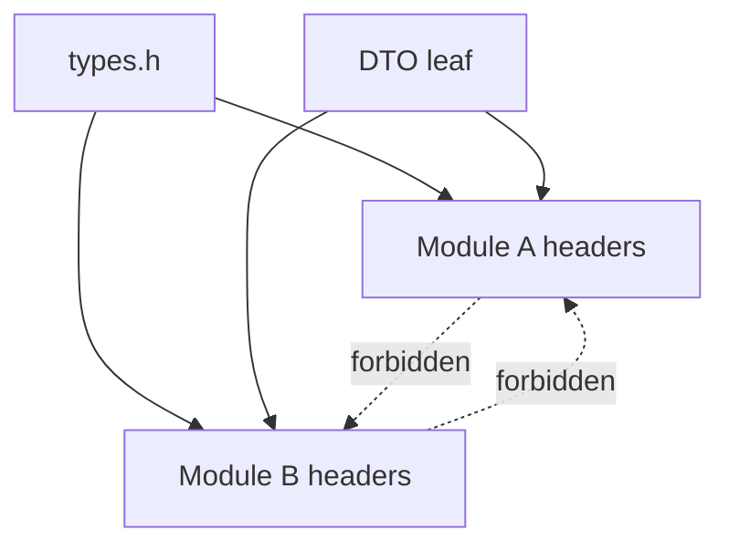

---

<a id="124-link-graph-checks"></a> <a id="cmod-061-link-graph-checks"></a> <a id="cmod-061"></a>

<a id="cmod-061-12-4-link-graph-ci-checks"></a>

### CMOD-061: Link-Graph Checks

**Class:** ARCHITECTURE. **Obligation:** project requirement.

Validate the target graph against the approved peer/foundation/adapter/root classification. Reject
peer-to-peer link edges even when they are PRIVATE or hidden behind an INTERFACE target. Test the
final link too: an apparently valid graph can still omit required runtime or foundation
dependencies.

**Source context:** [`nm`][c-common-pitfalls-ref-nm]; [`readelf`][c-common-pitfalls-ref-readelf].

#### Local examples

**Layout example (not executable):**

```text
module_a_obj ----\
module_b_obj -----+--> composition/app
adapter_obj ------/
```

**Noncompliant fragment (do not copy):**

Layout, diagnostic, or contract example. This block is not executable C.

```text
module_a -> module_b
module_b -> module_a
```

---

<a id="125-undefined-symbol-checks"></a> <a id="cmod-062-undefined-symbol-checks"></a>
<a id="cmod-062"></a>

<a id="cmod-062-12-5-undefined-symbol-ci-checks"></a>

### CMOD-062: Undefined-Symbol Checks

**Class:** ARCHITECTURE. **Obligation:** project requirement.

Inspect object/archive references and account for definitions supplied inside the same module.
Compare remaining external symbols to an exact approved set, including compiler/runtime helpers.
Reject peer APIs regardless of naming. A prefix blacklist is a useful additional check, not a
substitute for ownership classification. Qualify the symbol tool's handling of LTO objects.

**Source context:** [`nm`][c-common-pitfalls-ref-nm]; [`readelf`][c-common-pitfalls-ref-readelf].

#### Local examples

**Contextual example:**

Build/configuration excerpt for the named profile; resolve paths and targets in that project.

```sh
nm -u backend.o
nm -u libbackend.a
readelf -Ws backend.o
```

---

<a id="126-public-export-checks"></a> <a id="cmod-063-public-export-checks"></a>
<a id="cmod-063"></a>

<a id="cmod-063-12-6-public-export-ci-checks"></a>

### CMOD-063: Public Export Checks

**Class:** ARCHITECTURE. **Obligation:** project requirement.

Read ELF dynamic symbols or PE export entries rather than the entire debug or static symbol table.
Normalize version suffixes only under the ABI's versioning policy. Compare names and, where ABI
stability matters, signatures/layouts/version contracts. This example checks exported names; it does
not perform a complete cross-version binary compatibility proof.

**Source context:** [`nm`][c-common-pitfalls-ref-nm]; [`readelf`][c-common-pitfalls-ref-readelf].

#### Local examples

**Contextual example:**

Build/configuration excerpt for the named profile; resolve paths and targets in that project.

```sh
readelf -Ws libbackend.so
objdump -T libbackend.so
```

**Contextual example:**

Build/configuration excerpt for the named profile; resolve paths and targets in that project.

```sh
llvm-readobj --coff-exports backend.dll
llvm-objdump -p backend.dll
```

---

<a id="127-static-archive-symbol-checks"></a> <a id="cmod-064-static-archive-symbol-checks"></a>
<a id="cmod-064"></a>

<a id="cmod-064-12-7-static-archive-symbol-ci-checks"></a>

### CMOD-064: Static Archive Symbol Checks

**Class:** ARCHITECTURE. **Obligation:** project requirement.

Inspect archive members, defined global names, and unresolved external names. Separate
module-internal resolution from external dependencies. Reject leaked public-looking APIs and
unauthorized externally linked data. Internal globals needed between members need not be stripped
before final resolution. No archive is declared hidden merely because a version script exists
nearby.

**Source context:** [`nm`][c-common-pitfalls-ref-nm]; [`readelf`][c-common-pitfalls-ref-readelf].

#### Local examples

**Contextual example:**

Build/configuration excerpt for the named profile; resolve paths and targets in that project.

```sh
ar t libbackend.a
nm -g --defined-only libbackend.a
```

---

<a id="128-release-metadata-checks"></a> <a id="cmod-065-release-metadata-checks"></a>
<a id="cmod-065"></a>

<a id="cmod-065-12-8-release-metadata-ci-checks"></a>

### CMOD-065: Release Metadata Checks

**Class:** ARCHITECTURE. **Obligation:** project requirement.

Inspect actual release outputs for unneeded debug information, full build paths, extra exports, and
sensitive strings. Retain the required diagnostic and symbolization artifacts with the matching
build ID. This is separate from secret scanning, signing, source review, and a security assessment.
An absence of names does not show an absence of secrets.

**Source context:** [`nm`][c-common-pitfalls-ref-nm]; [`readelf`][c-common-pitfalls-ref-readelf].

#### Local examples

**Layout example (not executable):**

```text
CI verifies stripped/debug-prefix-map/reproducibility metadata policy for
release artifact
```

**Noncompliant fragment (do not copy):**

Layout, diagnostic, or contract example. This block is not executable C.

```text
release package contains source paths and full debug metadata by accident
```

---

<a id="129-abi-compatibility-is-a-release-gate"></a> <a id="cmod-109"></a>

<a id="cmod-109-12-9-abi-compatibility-gate"></a>

### CMOD-109: ABI Compatibility Is a Release Gate

**Class:** ARCHITECTURE. Apply the scope and requirement words below.

**Related pitfalls:**

- [CPIT-173: Incompatible ABI change reaches a stable release][c-common-pitfalls-cpit-173]

A module that promises a stable binary ABI must compare the candidate artifact against the supported
baseline before release. The gate must inspect exported symbols and, where the platform exposes
enough debug/type metadata, reachable public type changes. A source-compatible header does not prove
binary compatibility.

On ELF targets, a tool such as libabigail `abidiff` can compare two shared libraries and report ABI
changes, including removed exported symbols and type
changes.[libabigail-abidiff][libabigail-abidiff]

#### Local examples

**Contextual example:**

Build/configuration excerpt for the named profile; resolve paths and targets in that project.

```sh
abidiff artifacts/baseline/libdevice.so artifacts/candidate/libdevice.so
```

**Noncompliant fragment (do not copy):**

Build/configuration excerpt for the named profile; resolve paths and targets in that project.

```sh
nm -D artifacts/candidate/libdevice.so > candidate.symbols
# No baseline comparison occurs.
```

---

<a id="131-no-peer-header-dependency"></a> <a id="cmod-066-no-peer-header-dependency"></a>
<a id="cmod-066"></a>

<a id="cmod-066-13-1-no-peer-header-dependency"></a>

### CMOD-066: No Peer Header Dependency

**Class:** ARCHITECTURE. **Obligation:** project requirement.

Reject a change when one peer module needs another peer module header to compile. Create a callback
port, leaf contract, or adapter instead.

#### Local examples

**Layout example (not executable):**

```text
foo public/internal headers reference only foo + approved leaf contracts
```

**Noncompliant fragment (do not copy):**

Layout, diagnostic, or contract example. This block is not executable C.

```text
foo.h includes bar.h to call peer API
```

---

<a id="132-no-peer-symbol-dependency"></a> <a id="cmod-067-no-peer-symbol-dependency"></a>
<a id="cmod-067"></a>

<a id="cmod-067-13-2-no-peer-symbol-dependency"></a>

### CMOD-067: No Peer Symbol Dependency

**Class:** ARCHITECTURE. **Obligation:** project requirement.

Reject a change when one peer module object contains a direct undefined reference to another peer
module public symbol. Bind the operation as a callback in the composition layer.

#### Local examples

**Layout example (not executable):**

```text
foo artifact communicates through injected port and has no BAR_* undefined
symbol
```

**Noncompliant fragment (do not copy):**

Layout, diagnostic, or contract example. This block is not executable C.

```text
foo.o directly references BAR_process
```

---

<a id="133-no-cross-module-struct-ownership"></a>
<a id="cmod-068-no-cross-module-struct-ownership"></a> <a id="cmod-068"></a>

<a id="cmod-068-13-3-no-cross-module-struct-ownership"></a>

### CMOD-068: No Cross-Module Struct Ownership

**Class:** ARCHITECTURE. **Obligation:** project requirement.

Reject a change when a module:

- allocates another module's private struct
- uses `sizeof` on another module's opaque type
- accesses another module's fields
- embeds another module's private context by value
- frees another module's object without that module's API contract Use an opaque handle or DTO.

#### Local examples

**Layout example (not executable):**

```text
boundary uses DTO/opaque handle; each module allocates/frees its own private
representation
```

**Noncompliant fragment (do not copy):**

Layout, diagnostic, or contract example. This block is not executable C.

```text
module A allocates sizeof(module_b_private_t) and module B later frees it
```

---

<a id="134-no-architecture-through-static-link-order"></a>
<a id="cmod-069-no-architecture-through-static-link-order"></a> <a id="cmod-069"></a>

<a id="cmod-069-13-4-no-architecture-by-link-order"></a>

### CMOD-069: No Architecture Through Static Link Order

**Class:** ARCHITECTURE. **Obligation:** project requirement.

Document every dependency before link ordering is considered. Reject peer cycles; permit approved
acyclic foundation/foreign dependencies with explicit target metadata. Do not use linker groups or
whole-archive mode to hide missing architecture decisions. Review their code-size and dead-code
effects when they are legitimately needed.

#### Local examples

**Layout example (not executable):**

```text
module graph is explicit in composition/binding; static archive order is only
a linker detail for external legacy deps
```

**Noncompliant fragment (do not copy):**

Layout, diagnostic, or contract example. This block is not executable C.

```text
A must precede B in link line because A directly references B, so link order
encodes architecture
```

---

<a id="135-no-header-as-a-dependency-aggregator"></a>
<a id="cmod-070-no-header-as-a-dependency-aggregator"></a> <a id="cmod-070"></a>

<a id="cmod-070-13-5-no-umbrella-dependency-header"></a>

### CMOD-070: No Header as a Dependency Aggregator

**Class:** ARCHITECTURE. **Obligation:** project requirement.

Do not create a module header whose purpose is to include a group of unrelated module headers.

The composition source may include those public headers directly because it owns the integration.

#### Local examples

**Noncompliant fragment (do not copy):**

```c
#if !defined(COIL_PROJECT_ALL_H)
#define COIL_PROJECT_ALL_H

#include "backend.h"
#include "frontend.h"
#include "network.h"
#include "storage.h"

#endif
```

---

<a id="141-compile-time-dependency-shape"></a> <a id="cmod-071-compile-time-dependency-shape"></a>
<a id="cmod-071"></a>

<a id="cmod-071-14-1-reference-compile-graph"></a>

### CMOD-071: Compile-Time Dependency Shape

**Class:** ARCHITECTURE. **Obligation:** project requirement.

The reference compile graph is `buffer -> checked/contracts` and `emitter -> contracts`; neither
peer includes or links the other. The buffer sink adapter and composition see both public APIs.
Contract dependencies remain acyclic. The graph describes permitted build knowledge, not runtime
call order.

**Complete example:** [worked sources][c-module-architecture-worked-example].

#### Local examples

**Contextual example:**

Architecture/data-flow example; arrows do not establish a memory-protection boundary.

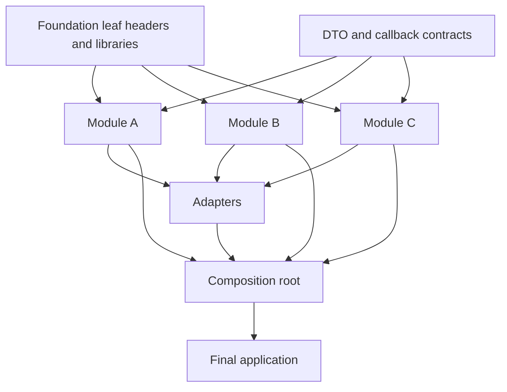

---

<a id="142-runtime-communication-shape"></a> <a id="cmod-072-runtime-communication-shape"></a>
<a id="cmod-072"></a>

<a id="cmod-072-14-2-reference-runtime-graph"></a>

### CMOD-072: Runtime Communication Shape

**Class:** ARCHITECTURE. **Obligation:** project requirement.

The reference runtime path is
`composition -> emitter -> injected write port -> buffer sink adapter -> buffer`. The adapter names
the buffer API; the emitter does not. The binder retains the buffer until the emitter is destroyed.
A runtime cycle would require a separate reentrancy and scheduling decision.

**Complete example:** [worked sources][c-module-architecture-worked-example].

#### Local examples

**Contextual example:**

Architecture/data-flow example; arrows do not establish a memory-protection boundary.

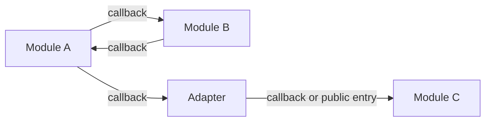

---

<a id="143-progressive-artifact-shape"></a> <a id="cmod-073-progressive-artifact-shape"></a>
<a id="cmod-073"></a>

<a id="cmod-073-14-3-reference-artifact-graph"></a>

### CMOD-073: Progressive Artifact Shape

**Class:** ARCHITECTURE. **Obligation:** project requirement.

The example compiles separate static and shared variants from the same owned sources. Both variants
use the same public behavioral contract and tests. An object/partial-link packaging mode is
described by CMOD-033 and CMOD-077 but is not included in this executed matrix. Artifact packaging
does not replace module ownership or ABI qualification.

**Complete example:** [worked sources][c-module-architecture-worked-example].

#### Local examples

**Contextual example:**

Architecture/data-flow example; arrows do not establish a memory-protection boundary.

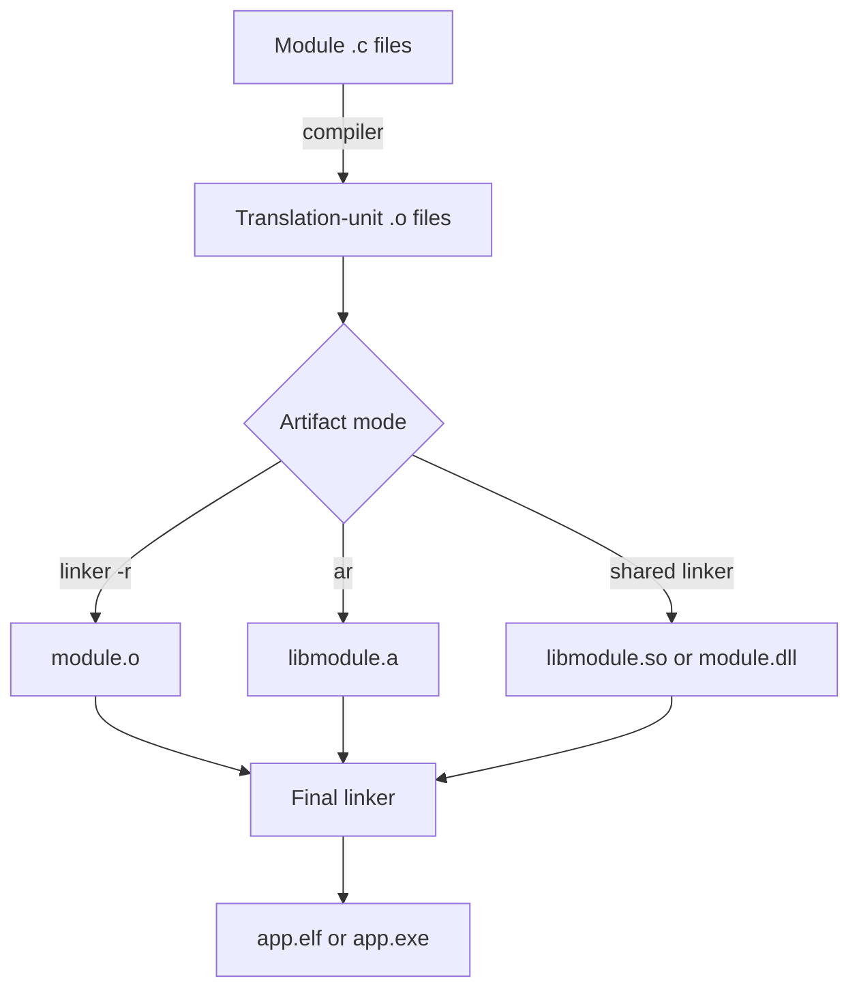

---

<a id="151-where-a-declaration-belongs"></a> <a id="cmod-074-where-a-declaration-belongs"></a>
<a id="cmod-074"></a>

<a id="cmod-074-15-1-declaration-placement"></a>

### CMOD-074: Where a Declaration Belongs

**Class:** ARCHITECTURE. **Obligation:** project requirement.

Place a one-TU declaration in its source; place a same-module cross-TU contract in an internal
header; place a supported inbound operation in the public header; place a consumer dependency port
in its contract header. Place integration translation in the adapter. Do not make a declaration
public only because an unrelated source wants to use it.

#### Local examples

**Layout example (not executable):**

```text
Used by one .c file?
  -> static declaration and definition in that .c file

Used by multiple .c files in one module?
  -> internal header under src/inc

Needed by the composition layer or external consumer?
  -> public module header

Needed by a peer module?
  -> callback port or DTO contract, then composition binding

Needed by two modules with incompatible contracts?
  -> adapter plus explicit DTO translation
```

---

<a id="152-where-a-type-belongs"></a> <a id="cmod-075-where-a-type-belongs"></a>
<a id="cmod-075"></a>

<a id="cmod-075-15-2-type-placement"></a>

### CMOD-075: Where a Type Belongs

**Class:** ARCHITECTURE. **Obligation:** project requirement.

A private context belongs to its module implementation. An opaque handle belongs to its public
header. A shared value DTO belongs to an owned contract leaf; a wire format belongs to a protocol
specification and serializer. A platform-specific representation belongs to its adapter. Move a type
outward only when its new compatibility and ownership obligations are accepted.

#### Local examples

**Layout example (not executable):**

```text
Module implementation detail?
  -> internal header or .c file

Public object identity without public layout?
  -> opaque declaration in module public header

Project-wide scalar foundation type?
  -> types.h after review

Boundary value shared by isolated modules?
  -> leaf DTO contract

Provider-specific implementation type?
  -> provider module only
```

---

<a id="153-where-a-call-belongs"></a> <a id="cmod-076-where-a-call-belongs"></a>
<a id="cmod-076"></a>

<a id="cmod-076-15-3-call-placement"></a>

### CMOD-076: Where a Call Belongs

**Class:** ARCHITECTURE. **Obligation:** project requirement.

A private helper call stays inside its translation unit or module. A peer capability call uses an
injected port. An approved lower-layer utility may be a direct named call. A translation between
peer semantics belongs to an adapter. The composition root chooses concrete implementations and owns
lifetime order.

#### Local examples

**Layout example (not executable):**

```text
Call within one translation unit?
  -> static function

Call across translation units in one module?
  -> internal module function

Call from application/composition into a module?
  -> public API

Call from one peer module toward another capability?
  -> injected callback

Call needs data or semantic conversion?
  -> callback implemented by an adapter
```

---

<a id="161-object-module-mode"></a> <a id="cmod-077-object-module-mode"></a> <a id="cmod-077"></a>

<a id="cmod-077-16-1-object-module-mode"></a>

### CMOD-077: Object Module Mode

**Class:** ARCHITECTURE. **Obligation:** project requirement.

Use a relocatable module object for a modular monolith or embedded application that benefits from
one object per module. Audit the module object because a partial link does not hide every internal
global symbol on its own.

#### Local examples

**Layout example (not executable):**

```text
backend/*.o  -> linker -r -> backend.o
frontend/*.o -> linker -r -> frontend.o
main.o + adapters.o + backend.o + frontend.o -> app.elf
```

---

<a id="162-static-library-mode"></a> <a id="cmod-078-static-library-mode"></a> <a id="cmod-078"></a>

<a id="cmod-078-16-2-static-library-mode"></a>

### CMOD-078: Static Library Mode

**Class:** ARCHITECTURE. **Obligation:** project requirement.

Use a static library for reusable modules that the final application links into one executable. The
archive preserves object-level symbol information. Apply symbol and ownership checks before release.

#### Local examples

**Layout example (not executable):**

```text
backend/*.o  -> ar -> libbackend.a
frontend/*.o -> ar -> libfrontend.a
main.o + adapters.o + libraries -> app.elf
```

---

<a id="163-dynamic-library-mode"></a> <a id="cmod-079-dynamic-library-mode"></a>
<a id="cmod-079"></a>

<a id="cmod-079-16-3-dynamic-library-mode"></a>

### CMOD-079: Dynamic Library Mode

**Class:** ARCHITECTURE. **Obligation:** project requirement.

Use a shared library or DLL when runtime replacement, ABI versioning, process sharing, plugin
loading, or deployment boundaries justify the dynamic ABI. Require:

- hidden default visibility
- explicit export allowlist
- ABI version policy
- symbol audit
- runtime loader test
- stripped release artifact when the platform permits it

#### Local examples

**Layout example (not executable):**

```text
shared module exports allowlisted public ABI and hides internals
```

**Noncompliant fragment (do not copy):**

Layout, diagnostic, or contract example. This block is not executable C.

```text
shared module exports helpers, peer callbacks, and private data symbols by
default
```

---

<a id="171-required-checks-before-merge"></a> <a id="cmod-080-required-checks-before-merge"></a>
<a id="cmod-080"></a>

<a id="cmod-080-17-1-required-ci-gate"></a>

### CMOD-080: Required Checks Before Merge

**Class:** ARCHITECTURE. **Obligation:** project requirement.

A merge must meet the applicable profile: clean compilation, required static analysis, header
self-containment, approved include/link graph, authorized symbol sets, deterministic contract tests,
failure-path tests, and reviewed deviations. Check the restored local policies too: typed `NULL`,
explicit void-pointer conversions, function-entry declarations, single-exit returns, and loop
control. Reject explicit `extern` in the core and peer header or direct-symbol edges.

Release adds production configuration, dependency inventory/exposure review, artifact integrity,
ABI/export review, and target-specific evidence. A skipped or unavailable check is not a pass. The
delivery record states which of these checks were actually executed on the supplied example.

#### Local examples

**Layout example (not executable):**

```text
[ ] public headers compile alone
[ ] types.h compiles alone and remains a foundation leaf
[ ] DTO and callback-contract headers remain leaf contracts
[ ] no module includes another peer module header
[ ] no module reaches another module src/inc path
[ ] no explicit extern exists in core project C code
[ ] no cross-module writable global object exists
[ ] no peer module target links another peer module target
[ ] module artifacts contain no undefined peer-module API symbols
[ ] adapters own all required cross-module type/semantic translation
[ ] private helpers use static
[ ] shared libraries export only symbols in the public ABI allowlist
[ ] static archives contain no accidental public-looking symbols
[ ] release artifacts omit debug metadata that the shipped product does not need
[ ] final linker map is generated for release inspection when the platform supports it
[ ] each external trust boundary has a named validation/authentication/authorization owner
[ ] production variants reject unsafe debug, factory, maintenance, and fallback configuration
[ ] third-party dependencies are inventoried, pinned, and checked against current vulnerability policy
[ ] downloaded/build/update artifacts use approved origin and integrity/authenticity verification
[ ] runtime loader and plugin search paths exclude untrusted writable locations
[ ] security-relevant dependency exposure is reviewed against CVE and CISA KEV inputs
[ ] linker and assembly symbols exist only in the platform boundary adapter
[ ] public headers pass their declared conservative language-profile matrix
[ ] core/library modules emit diagnostics only through the owned diagnostic port
[ ] raw atomics and barriers remain inside reviewed synchronization abstractions
[ ] specialized backends pass reference equivalence and dispatch-selection tests
[ ] performance changes retain the evidence required by CPERF-001
[ ] compiler-warning suppressions are narrow, documented, and owned
[ ] release builds normalize nondeterministic time, locale, path, and input-order metadata
[ ] public APIs carry a declared lifecycle state and deprecation/removal policy
[ ] production targets consume and verify the named compiler/linker hardening profile
[ ] stable shared-library releases pass the ABI compatibility gate against the supported baseline
```

---

<a id="181-core-architecture-summary"></a> <a id="cmod-081-architecture-summary"></a>
<a id="cmod-081"></a>

<a id="cmod-081-18-1-architecture-summary"></a>

### CMOD-081: Core Architecture Summary

**Class:** ARCHITECTURE. **Obligation:** project requirement.

The translation unit owns private helpers. The module owns representation, state, lifecycle, public
behavior, and required ports. Contract owners own shared value/port schemas. Adapters own
conversion. Composition owns binding and system lifetime. Build/release owners qualify artifacts and
preserve evidence. Apply minimum visibility throughout without mistaking it for process isolation.

**Related controls:** [CMOD-001][c-module-architecture-cmod-001],
[CMOD-081][c-module-architecture-cmod-081].

#### Local examples

**Layout example (not executable):**

```text
translation unit
  owns private static helpers

module
  owns implementation, state, internal API, public inbound API, callback ports

boundary contract
  owns narrow DTO and callback types shared across isolated builds

adapter
  owns semantic conversion between module contracts

composition root
  owns concrete module binding and final application graph

release linker
  owns final symbol resolution, export control, dead-code removal, and link map
```

**Layout example (not executable):**

```text
.c + leaf headers
    -> compiler
    -> .o
    -> linker -r / ar / shared linker
    -> module artifact
    -> composition root + adapters + modules
    -> final linker
    -> stripped and audited application artifact
```

---

<a id="191-one-module-owns-each-external-trust-boundary"></a>
<a id="cmod-082-one-module-owns-each-external-trust-boundary"></a> <a id="cmod-082"></a>

<a id="cmod-082-19-1-trust-boundary-ownership"></a>

### CMOD-082: One Module Owns Each External Trust Boundary

**Class:** SECURITY / ARCHITECTURE. **Obligation:** project requirement.

Assign one policy owner to each external ingress or privileged operation. Specify accepted
representation/version, byte/work/time budgets, authentication, object-level authorization,
validation, interpretation, failure behavior, and audit events. Lower-level modules still validate
their own API preconditions. In-process DTOs are not tamper-proof capabilities; a native peer with
memory corruption is not contained merely by this architectural boundary.

**Related controls:** [CSTYLE-059][c-code-standard-cstyle-059],
[CSTYLE-110][c-code-standard-cstyle-110], [CSTYLE-111][c-code-standard-cstyle-111],
[CSTYLE-113][c-code-standard-cstyle-113].

**Failure scenarios:** [CPIT-094][c-common-pitfalls-cpit-094],
[CPIT-105][c-common-pitfalls-cpit-105], [CPIT-110][c-common-pitfalls-cpit-110],
[CPIT-111][c-common-pitfalls-cpit-111], [CPIT-115][c-common-pitfalls-cpit-115].

**Source context:** [authorization][c-common-pitfalls-ref-authorization];
[validation][c-common-pitfalls-ref-validation].

#### Local examples

**Layout example (not executable):**

```text
network request -> protocol/input adapter -> validated DTO -> module API
file/update      -> ingress verifier       -> validated artifact -> owner
IPC/CLI          -> boundary adapter       -> validated command -> owner
```

---

<a id="192-production-security-configuration-is-a-controlled-artifact"></a>
<a id="cmod-083-production-security-configuration-is-a-controlled-artifact"></a>
<a id="cmod-083"></a>

<a id="cmod-083-19-2-production-security-configuration"></a>

### CMOD-083: Production Security Configuration Is a Controlled Artifact

**Class:** SECURITY / ARCHITECTURE. **Obligation:** project requirement.

Production behavior must not depend on a developer remembering to disable an unsafe mode manually.

- production, test, factory, and development variants are explicit build/runtime profiles
- production defaults use the least-privileged valid state
- test/debug bypasses are absent from production when practical; otherwise they require the normal
  authorization policy and are disabled by default
- default credentials and embedded production secrets are forbidden
- security-relevant configuration is validated before activation
- an invalid or missing security setting does not silently select a permissive fallback
- release CI verifies the production configuration profile Configuration ownership belongs to a
  module or composition-layer policy owner; it must not be duplicated across unrelated modules.

**Related controls:** [CSTYLE-107][c-code-standard-cstyle-107],
[CSTYLE-114][c-code-standard-cstyle-114].

**Failure scenarios:** [CPIT-096][c-common-pitfalls-cpit-096],
[CPIT-105][c-common-pitfalls-cpit-105], [CPIT-116][c-common-pitfalls-cpit-116],
[CPIT-120][c-common-pitfalls-cpit-120].

**Source context:** [supply-chain][c-common-pitfalls-ref-supply-chain];
[ssdf][c-common-pitfalls-ref-ssdf].

#### Local examples

**Layout example (not executable):**

```text
production profile disables debug/factory bypasses by default and CI verifies
configuration artifact
```

**Noncompliant fragment (do not copy):**

Layout, diagnostic, or contract example. This block is not executable C.

```text
production behavior depends on operator remembering to unset DEBUG_UNLOCK
```

---

<a id="193-dependency-and-artifact-integrity-is-part-of-module-ownership"></a>
<a id="cmod-084-dependency-and-artifact-integrity-is-part-of-module-ownership"></a>
<a id="cmod-084"></a>

<a id="cmod-084-19-3-dependency-and-artifact-integrity"></a>

### CMOD-084: Dependency and Artifact Integrity Is Part of Module Ownership

**Class:** SECURITY / ARCHITECTURE. **Obligation:** project requirement.

Record each dependency's identity, version, source, license, owner, pin, and shipped exposure.
Verify artifacts against a trust root: a hash obtained from the same untrusted source is not
independent authenticity evidence. Keep an update/removal path, a vulnerability-review cadence, and
provenance/inventory records. Signed firmware/update metadata must include target identity and the
product's anti-rollback policy. API wrapping alone does not make an artifact trustworthy.

**Related controls:** [CSTYLE-029][c-code-standard-cstyle-029],
[CSTYLE-059][c-code-standard-cstyle-059], [CSTYLE-115][c-code-standard-cstyle-115].

**Failure scenarios:** [CPIT-101][c-common-pitfalls-cpit-101],
[CPIT-102][c-common-pitfalls-cpit-102], [CPIT-105][c-common-pitfalls-cpit-105],
[CPIT-117][c-common-pitfalls-cpit-117], [CPIT-118][c-common-pitfalls-cpit-118].

**Source context:** [supply-chain][c-common-pitfalls-ref-supply-chain];
[ssdf][c-common-pitfalls-ref-ssdf].

#### Local examples

**Layout example (not executable):**

```text
dependency has owner, pinned version, approved source, SBOM entry,
integrity/provenance check, CVE/KEV review path
```

**Noncompliant fragment (do not copy):**

Layout, diagnostic, or contract example. This block is not executable C.

```text
build downloads latest.tar.gz from mutable URL with no pin/hash/signature
```

---

<a id="194-privileged-capabilities-stay-with-their-security-owner"></a>
<a id="cmod-085-privileged-capabilities-stay-with-their-security-owner"></a> <a id="cmod-085"></a>

<a id="cmod-085-19-4-privileged-capability-separation"></a>

### CMOD-085: Privileged Capabilities Stay With Their Security Owner

**Class:** SECURITY / ARCHITECTURE. **Obligation:** project requirement.

Give a consumer only the authority its operation needs. The policy owner checks identity, operation,
and concrete resource; adapters must not broaden that authority. Avoid passing unrestricted
filesystem roots, credentials, or network clients for convenience. Native pointers are not an
isolation boundary; use a process, hardware protection, or another enforced boundary where the
threat model requires containment between mutually untrusted components.

**Related controls:** [CSTYLE-110][c-code-standard-cstyle-110],
[CSTYLE-112][c-code-standard-cstyle-112].

**Failure scenarios:** [CPIT-105][c-common-pitfalls-cpit-105],
[CPIT-112][c-common-pitfalls-cpit-112], [CPIT-113][c-common-pitfalls-cpit-113],
[CPIT-114][c-common-pitfalls-cpit-114].

**Source context:** [authorization][c-common-pitfalls-ref-authorization];
[validation][c-common-pitfalls-ref-validation].

#### Local examples

**Layout example (not executable):**

```text
request -> auth boundary -> narrow authorized capability -> module
```

**Layout example (not executable):**

```text
request -> module receives global credential/root handle -> decides everything
```

---

<a id="195-runtime-loaders-and-plugins-are-explicit-trust-boundaries"></a>
<a id="cmod-086-runtime-loaders-and-plugins-are-explicit-trust-boundaries"></a>
<a id="cmod-086"></a>

<a id="cmod-086-19-5-runtime-loader-and-plugin-boundary"></a>

### CMOD-086: Runtime Loaders and Plugins Are Explicit Trust Boundaries

**Class:** SECURITY / ARCHITECTURE. **Obligation:** project requirement.

Centralize component identity, search roots, permissions, authenticity, ABI/version negotiation, and
load/unload policy in a loader owner. Pin the file actually loaded where the platform permits it,
rather than checking one path and later loading a different object. Do not unload code while
callbacks, threads, TLS destructors, or objects may still reference it. Test load failure, wrong
ABI, rejected paths, and teardown on each supported platform.

**Related controls:** [CSTYLE-115][c-code-standard-cstyle-115].

**Failure scenarios:** [CPIT-105][c-common-pitfalls-cpit-105],
[CPIT-118][c-common-pitfalls-cpit-118], [CPIT-121][c-common-pitfalls-cpit-121].

**Source context:** [supply-chain][c-common-pitfalls-ref-supply-chain];
[ssdf][c-common-pitfalls-ref-ssdf].

#### Local examples

**Layout example (not executable):**

```text
loader uses allowlisted path/origin, validates signature/ABI/capability policy
before activation
```

**Noncompliant fragment (do not copy):**

Layout, diagnostic, or contract example. This block is not executable C.

```text
dlopen() searches current working directory or environment-controlled path for
privileged plugin
```

---

<a id="201-public-headers-may-use-a-narrower-language-profile"></a> <a id="cmod-088"></a>

<a id="cmod-088-20-1-public-header-language-profile"></a>

### CMOD-088: Public Headers May Use a Narrower Language Profile

**Class:** ARCHITECTURE. Apply the scope and requirement words below.

A public ABI header may target a more conservative C language version and feature subset than
private implementation files. The module must declare and test the public-header profile separately.

The public profile must define:

- minimum C version and compiler families;
- permitted attributes and compatibility macros;
- integer, enum, alignment, and calling-convention assumptions;
- C/C++ bridge ownership when applicable;
- a self-contained compile matrix for supported consumers.

Implementation-only C23 or compiler features must not leak into a C11 public contract merely because
the owning module can compile them.

#### Local examples

**Layout example (not executable):**

```text
CI compiles public headers with the declared minimum C language/toolchain
baseline
```

**Noncompliant fragment (do not copy):**

Layout, diagnostic, or contract example. This block is not executable C.

```text
implementation builds with C23, but public headers silently require
unsupported compiler extensions
```

---

<a id="202-evolvable-abi-objects-use-opaque-construction"></a> <a id="cmod-089"></a>

<a id="cmod-089-20-2-evolvable-abi-object-lifecycle"></a>

### CMOD-089: Evolvable ABI Objects Use Opaque Construction

**Class:** ARCHITECTURE. Apply the scope and requirement words below.

A public long-lived object expected to evolve should use an incomplete type, module-owned
constructor, and module-owned destructor. Callers must not allocate, copy, or depend on its layout.

The destructor accepts the caller's pointer when clearing that handle is part of the lifecycle
contract. ABI review must define version negotiation for public DTOs that cannot remain opaque.

#### Local examples

**Contextual C example:**

```c
typedef struct Device device_t;

int  DEVICE_create(device_t **device);
void DEVICE_destroy(device_t **device);
```

---

<a id="203-validate-before-externally-visible-mutation"></a> <a id="cmod-090"></a>

<a id="cmod-090-20-3-validate-before-mutation"></a>

### CMOD-090: Validate Before Externally Visible Mutation

**Class:** ARCHITECTURE. Apply the scope and requirement words below.

**Related C standard rules:**

- [`CSTYLE-058`][c-code-standard-cstyle-058]
- [`CSTYLE-059`][c-code-standard-cstyle-059]

**Related pitfalls:**

- [CPIT-143][c-common-pitfalls-cpit-143]

Evaluate every rejectable precondition before the first externally visible state mutation whenever
the operation can be structured that way.

After commit begins, a failure must either roll back to the prior valid state or move the object
into a documented recoverable state. Do not increment counters, publish pointers, write hardware,
consume ownership, or persist partial data and then discover an input condition that could have been
checked first.

#### Local examples

**Layout example (not executable):**

```text
decode -> validate syntax/range/permission/state/capacity -> commit mutation
```

---

<a id="204-library-diagnostics-use-an-injected-port"></a> <a id="cmod-091"></a>

<a id="cmod-091-20-4-library-diagnostic-port"></a>

### CMOD-091: Library Diagnostics Use an Injected Port

**Class:** ARCHITECTURE. Apply the scope and requirement words below.

Library and core modules must not own `stdin`, `stdout`, or `stderr`. They must not call `printf`,
`fprintf`, `puts`, `perror`, or a platform console directly.

Diagnostics flow through a project logging or diagnostic port whose owner defines severity,
formatting, sensitive-data policy, blocking, allocation, thread safety, ISR behavior, and
destination. An application adapter may bind that port to a console, structured log, test recorder,
or no-op sink.

#### Local examples

**Contextual example:**

Consumer-owned callback. No process-wide stdout/stderr ownership or hidden formatting allocation;
the logger binder states blocking/reentrancy and secret-redaction policy.

```c
typedef int (*module_log_cb_t)(void *context, uint32_t event_id,
                               int operation_result);
```

---

<a id="205-synchronization-protocols-hide-raw-atomics"></a> <a id="cmod-092"></a>

<a id="cmod-092-20-5-semantic-synchronization-operations"></a>

### CMOD-092: Synchronization Protocols Hide Raw Atomics

**Class:** ARCHITECTURE. Apply the scope and requirement words below.

Ordinary module logic must consume semantic synchronization operations instead of constructing
memory-order protocols from scattered raw atomics and barriers. The synchronization owner documents:

- protected state and lifetime;
- single-writer or multi-writer assumptions;
- ordering and matching operation;
- progress, blocking, and fairness;
- initialization and teardown;
- architecture and tool validation.

A private helper that requires the caller to hold a lock must use the project's `Locked` naming
suffix and state the exact lock precondition. A public function must not require an unnamed implicit
lock state.

#### Local examples

**Contextual example:**

Consumer-owned port declaration. Its owner defines full/closed states, memory ordering, lifetime and
bounded execution. The consumer does not invent an atomic protocol at the call site.

```c
typedef int (*queue_try_push_cb_t)(void *context, const unsigned char *data,
                                   size_t size_bytes);
```

---

<a id="206-verification-and-hardening-use-named-profiles"></a> <a id="cmod-093"></a>

<a id="cmod-093-20-6-named-language-profiles"></a>

### CMOD-093: Verification and Hardening Use Named Profiles

**Class:** ARCHITECTURE. Apply the scope and requirement words below.

Do not force proof-specific or fault-hardening restrictions onto every ordinary module without a
product requirement. Define named, cumulative profiles:

A profile may prohibit additional language features, restrict object layout, or require dedicated
hardening primitives. Its documentation must state scope, toolchain, proof or threat model,
generated-code checks, and conflicts with ordinary performance rules.

Packed structures, encoded booleans, redundant comparisons, volatile barriers, and unusual control
flow are not general hardening by themselves. Use only the profile-owned primitive whose
machine-code and fault behavior form part of the contract.

#### Local examples

**Layout example (not executable):**

```text
general C -> analyzable C -> formally verifiable C
                         \-> fault-hardened C
```

---

<a id="207-optimized-backends-follow-one-owned-architecture"></a> <a id="cmod-094"></a>

<a id="cmod-094-20-7-specialized-implementation-architecture"></a>

### CMOD-094: Optimized Backends Follow One Owned Architecture

**Class:** ARCHITECTURE. Apply the scope and requirement words below.

An algorithm owner that provides architecture-specific implementations must own:

- one portable reference implementation when practical;
- one stable algorithm contract;
- target-specific source boundaries;
- runtime or build-time feature dispatch;
- differential tests and backend-selection proof;
- unsupported-target fallback;
- benchmark evidence governed by [Performance and microarchitecture
  controls][c-code-standard-performance].

Callers must not select ISA functions directly or duplicate CPU feature tests. The dispatch owner is
the only boundary allowed to bind a specialized backend.

#### Local examples

**Layout example (not executable):**

```text
one operation owns reference C plus AVX2/NEON/etc backends under one semantic
contract
```

**Noncompliant fragment (do not copy):**

Layout, diagnostic, or contract example. This block is not executable C.

```text
each caller chooses a different ISA implementation and duplicates semantics
```

---

<a id="208-compiler-warning-policy-preserves-semantics"></a> <a id="cmod-095"></a>

<a id="cmod-095-20-8-compiler-warning-policy"></a>

### CMOD-095: Compiler Warning Policy Preserves Semantics

**Class:** ARCHITECTURE. Apply the scope and requirement words below.

Treat a compiler warning according to its cause:

- fix code when the warning identifies a defect;
- clarify code when it identifies ambiguous intent;
- suppress or disable it centrally when it is a systematic false positive for an approved construct.

Do not add meaningless casts, dead assignments, unreachable paths, redundant volatile qualification,
or performance regressions solely to silence a warning. Every suppression needs the warning
identifier, tool versions, narrow scope, rationale, and removal condition.

#### Local examples

**Contextual example:**

GCC/Clang build-profile fragment. Other compilers have separately approved flags; a cast inserted
only to hide a warning is not a semantic fix.

```cmake
target_compile_options(module_obj PRIVATE
    -Wall -Wextra -Wpedantic -Werror -Wconversion -Wshadow
)
```

---

<a id="209-hardening-primitives-have-one-security-owner"></a> <a id="cmod-096"></a>

<a id="cmod-096-20-9-hardening-primitive-ownership"></a>

### CMOD-096: Hardening Primitives Have One Security Owner

**Class:** ARCHITECTURE. Apply the scope and requirement words below.

Fault-sensitive state encoding, constant-time comparison, secret erasure, redundant security checks,
hardened copies, and critical MMIO sequencing must come from a security-owned primitive library when
the threat model requires them.

The owner must define:

- threat and fault model;
- encoded-value distance or redundancy property;
- compiler and linker constraints;
- generated-code inspection or fault-injection tests;
- expected side-effect count and order when relevant;
- interaction with optimization and logging.

Duplicating an ordinary C condition does not prove that the compiler emits two independent checks.

#### Local examples

**Layout example (not executable):**

```text
security/hardware owner defines hardened primitive/threat model; ordinary
modules call the primitive
```

**Noncompliant fragment (do not copy):**

Layout, diagnostic, or contract example. This block is not executable C.

```text
each module invents its own duplicated checks and MMIO hardening sequences
```

---

<a id="2010-checkers-enforce-controls-but-do-not-define-them"></a> <a id="cmod-097"></a>

<a id="cmod-097-20-10-checker-diagnostic-authority"></a>

### CMOD-097: Checkers Enforce Controls but Do Not Define Them

**Class:** ARCHITECTURE. Apply the scope and requirement words below.

The written `CSTYLE-*`, `CMOD-*`, and `CPERF-*` controls define project policy. A formatter,
checker, compiler warning, or heuristic analyzer implements a diagnostic approximation. CI must
preserve a narrow documented deviation path for false positives without weakening the governing
rule.

A deviation records the control ID, diagnostic, affected scope, technical rationale, compensating
evidence, owner, and review or expiry date.

#### Local examples

**Contextual example:**

A diagnostic is resolved by fixing the code or by a scoped approved deviation. An empty deviation
field does not itself grant permission.

```c
typedef struct DiagnosticDisposition
{
        const char *rule_id;
        const char *tool_version;
        const char *diagnostic_id;
        const char *evidence_path;
        const char *approved_deviation_id;
} diagnostic_disposition_t;
```

---

<a id="2011-arena-and-pool-lifetimes-are-named-boundaries"></a> <a id="cmod-098"></a>

<a id="cmod-098-20-11-arena-pool-lifetime-boundary"></a>

### CMOD-098: Arena and Pool Lifetimes Are Named Boundaries

**Class:** ARCHITECTURE. Apply the scope and requirement words below.

**Related pitfalls:**

- [CPIT-154][c-common-pitfalls-cpit-154]

An arena, pool, region, or scoped allocator must name the event that ends its lifetime. Every
returned pointer inherits that boundary and must not escape into an object, callback, queue, cache,
or asynchronous operation that can outlive the allocator.

When pool-owned objects acquire non-memory resources, the pool owner must register deterministic
cleanup or prohibit those resources in the pool. Cleanup order, idempotence, callback context,
failure policy, and access to partially destroyed state must be documented. Bulk memory reclamation
does not close file descriptors, unlock mutexes, unregister callbacks, or release device handles.

nginx registers pool cleanup handlers for resources such as file descriptors; [Wireshark][wireshark]
gives allocations explicit packet, file, and application scopes. Both patterns make allocator
lifetime an architecture boundary rather than a hidden property of a raw
pointer.[nginx-development-guide][nginx-development-guide]

#### Local examples

**Contextual example:**

The callback completes before arena reset and retains no pointer. Lifetime ends on the explicit
reset even when the same address is later reused.

```c
ret = consume_in_scope(consumer_context, &borrowed_view);
if (ret != EXIT_SUCCESS)
{
        goto function_output;
}
```

---

<a id="2012-one-compatibility-boundary-owns-platform-feature-selection"></a> <a id="cmod-099"></a>

<a id="cmod-099-20-12-platform-compatibility-boundary"></a>

### CMOD-099: One Compatibility Boundary Owns Platform Feature Selection

**Class:** ARCHITECTURE. Apply the scope and requirement words below.

Platform feature-test macros, compiler probes, system-header ordering quirks, missing declarations,
and fallback definitions belong to one compatibility or platform boundary. Ordinary module files
must consume project abstractions and must not reproduce operating-system or compiler version tests
independently.

Prefer a direct capability probe over a version comparison. A fallback must have the same semantic
contract as the native facility or expose the reduced capability explicitly. [Git][git] similarly
centralizes platform differences and feature macros in a compatibility header before ordinary system
includes.

#### Local examples

**Contextual example:**

Dedicated compatibility header outside the ordinary core include graph; platform-specific
dependencies are not convenience transitive includes.

```c
#if defined(PROJECT_PLATFORM_LINUX)
  #include "platform_linux.h"
#elif defined(PROJECT_PLATFORM_WINDOWS)
  #include "platform_windows.h"
#else
  #error "Select a supported platform profile"
#endif
```

---

<a id="2013-every-supported-configuration-is-a-build-and-test-product"></a> <a id="cmod-100"></a>

<a id="cmod-100-20-13-supported-configuration-matrix"></a>

### CMOD-100: Every Supported Configuration Is a Build-and-Test Product

**Class:** ARCHITECTURE. Apply the scope and requirement words below.

**Related pitfalls:**

- [CPIT-155][c-common-pitfalls-cpit-155]

The project must inventory supported combinations of language profile, compiler, architecture width,
byte order, optimization mode, optional subsystem, threading/preemption mode, allocator, sanitizer,
hardening profile, and static/shared packaging. CI may use pairwise or risk-based reduction, but
every supported conditional branch must be built and its distinctive behavior tested by an owned
matrix entry.

An optional feature needs defined enabled and disabled behavior. Disabled builds must retain type
checking through a compatible stub or a compile-time exclusion at the owning boundary; call sites
must not accumulate divergent `#ifdef` control flow. Linux's submission checklist explicitly calls
for relevant configuration combinations, 32/64-bit and big/little-endian builds, and debug
configurations.[linux-submit-checklist][linux-submit-checklist] SQLite also tests the as-delivered
optimized configuration after coverage instrumentation.[sqlite-testing][sqlite-testing]

#### Local examples

**Layout example (not executable):**

```text
CI covers semantic feature combinations, compilers, build types,
sanitizers/analysis modes relevant to support matrix
```

**Noncompliant fragment (do not copy):**

Layout, diagnostic, or contract example. This block is not executable C.

```text
optional feature is never compiled until customer enables it
```

---

<a id="2014-failure-paths-require-deterministic-fault-injection"></a> <a id="cmod-101"></a>

<a id="cmod-101-20-14-deterministic-fault-injection"></a>

### CMOD-101: Failure Paths Require Deterministic Fault Injection

**Class:** ARCHITECTURE. Apply the scope and requirement words below.

**Related pitfalls:**

- [CPIT-156][c-common-pitfalls-cpit-156]

Each owned boundary that can fail must provide a deterministic test mechanism for relevant failures,
including allocation exhaustion, short or interrupted I/O, dependency rejection, storage corruption,
unavailable hardware, timeout, and partial progress when applicable.

Injection belongs in the allocator, I/O port, callback adapter, MMIO simulator, or other owner;
production logic must not contain ad hoc test branches. Tests must verify returned status, preserved
invariants, cleanup, retry limits, observable diagnostics, and absence of partial external mutation.

Linux asks submitters to inject allocation and subsystem failures. SQLite's test harnesses inject
allocation, I/O, crash, and compound failures and retain the resulting regression cases; its
official forum also describes a custom allocator used for allocation-fault
injection.[linux-submit-checklist][linux-submit-checklist] [sqlite-testing][sqlite-testing]
[sqlite-fault-forum][sqlite-fault-forum]

#### Local examples

**Contextual example:**

Test-only allocator context. The failpoint index is illustrative; declare/zero `fault_state` at
entry and set this field after validation. Verify ownership and cleanup in addition to the expected
error.

```c
fault_state.fail_on_allocation = 2u;
ret                            = invoke_operation(operation_context);
if (ret != -ENOMEM)
{
        ret = -EDOM;
        goto function_output;
}
ret = verify_unchanged(operation_context);
```

---

<a id="2015-verification-evidence-uses-complementary-test-modes"></a> <a id="cmod-102"></a>

<a id="cmod-102-20-15-complementary-verification-evidence"></a>

### CMOD-102: Verification Evidence Uses Complementary Test Modes

**Class:** ARCHITECTURE. Apply the scope and requirement words below.

One coverage number is not a verification strategy. Each module profile must select and justify a
portfolio from:

- requirements-to-test traceability;
- boundary, state-transition, and error-path tests;
- branch or MC/DC evidence where assurance requires it;
- sanitizers and dynamic analysis on supported host configurations;
- fuzzing and malformed-input campaigns at trust boundaries;
- mutation testing for critical decision and test-suite effectiveness;
- power-loss, restart, concurrency, and fault-injection tests where applicable;
- retained regression inputs for every repaired defect.

Coverage instrumentation tests the test suite. Release or as-delivered binaries must also run the
applicable behavioral corpus, because instrumentation and optimization can change generated code.
SQLite documents this distinction and uses branch/MC/DC, mutation, fuzz, malformed-file, OOM,
I/O-error, and delivered configuration testing as complementary
evidence.[sqlite-testing][sqlite-testing]

#### Local examples

**Contextual example:**

Executable commands for the included hosted example. Sanitizers complement, not replace, ordinary
Release tests, target analysis or formal verification.

```sh
cmake -S examples -B build-sanitize -DSAMPLE_SANITIZE=ON
cmake --build build-sanitize
ctest --test-dir build-sanitize --output-on-failure
```

---

<a id="2016-generated-sources-have-reproducible-provenance"></a> <a id="cmod-103"></a>

<a id="cmod-103-20-16-generated-source-provenance"></a>

### CMOD-103: Generated Sources Have Reproducible Provenance

**Class:** ARCHITECTURE. Apply the scope and requirement words below.

**Related pitfalls:**

- [CPIT-157][c-common-pitfalls-cpit-157]

Every generated C or header file must identify its generator, authoritative inputs, regeneration
command, generator/tool version policy, and whether the output is committed. Developers edit the
authoritative input or generator, not the generated output.

CI must regenerate and compare committed output, or generate into the build tree from pinned inputs.
The generated translation unit is still compiled, analyzed, and tested under the same applicable
rules as handwritten code. A generator exception needs the rule ID, narrow reason, and validation
performed on the emitted C. CPython's developer workflow similarly pairs regeneration commands with
checks for generated C API artifacts.[cpython-c-api][cpython-c-api]

#### Local examples

**Contextual example:**

Build manifest fields. Regeneration checks compare real digests; editing generated C without
updating its generating input violates this contract.

```c
typedef struct GeneratedSourceRecord
{
        const char *generator_revision;
        const char *input_digest;
        const char *invocation_record;
        const char *output_digest;
} generated_source_record_t;
```

---

<a id="2017-imported-source-preserves-its-upstream-lineage"></a> <a id="cmod-104"></a>

<a id="cmod-104-20-17-imported-source-lineage"></a>

### CMOD-104: Imported Source Preserves Its Upstream Lineage

**Class:** ARCHITECTURE. Apply the scope and requirement words below.

**Related pitfalls:**

- [CPIT-158][c-common-pitfalls-cpit-158]

Imported or vendored source must record the upstream project, immutable revision, license, import
method, local patch series, update owner, and security-update policy. Keep mechanical formatting or
naming rewrites separate from functional patches. Preserving an upstream style may be approved when
it materially reduces resynchronization risk; the boundary adapter still follows project interfaces.

U-Boot records where imported code came from and its revision, and may preserve the original style
of synchronized subsystems to ease future migration. A local fork without provenance or an update
procedure is an unowned dependency. [u-boot-process][u-boot-process] [u-boot-style][u-boot-style]

#### Local examples

**Layout example (not executable):**

```text
wrap upstream API or contribute/track a maintained patch with explicit
provenance
```

**Noncompliant fragment (do not copy):**

Layout, diagnostic, or contract example. This block is not executable C.

```text
copy a private chunk of upstream implementation into project and silently
diverge
```

---

<a id="2018-lock-preconditions-are-machine-visible-when-practical"></a> <a id="cmod-105"></a>

<a id="cmod-105-20-18-lock-precondition-annotations"></a>

### CMOD-105: Lock Preconditions Are Machine-Visible When Practical

**Class:** ARCHITECTURE. Apply the scope and requirement words below.

**Related pitfalls:**

- [CPIT-159][c-common-pitfalls-cpit-159]

A helper that requires, acquires, releases, excludes, or returns with a lock held must state the
exact lock in its contract. Use project portability macros for compiler thread-safety annotations
where the supported toolchain can check them, and use runtime lock assertions in debug profiles
where appropriate.

The annotation supplements the synchronization design; it does not create ordering or ownership. The
function name retains the `Locked` suffix when the caller must already hold the lock. Open vSwitch
similarly defines portability macros for lock requirements so Clang can diagnose violations while
other compilers receive a compatible declaration.[ovs-coding-style][ovs-coding-style]

#### Local examples

**Layout example (not executable):**

```text
port contract states caller-held locks, ISR/thread context, blocking
allowance, and callback reentrancy
```

**Noncompliant fragment (do not copy):**

Layout, diagnostic, or contract example. This block is not executable C.

```text
callback may sleep from ISR and requires a lock that the interface never
documents
```

---

<a id="cmod-110"></a>

<a id="cmod-110-public-api-documentation-contract"></a>

### CMOD-110: Public Boundary Documentation Is Part of the Header Contract

**Class:** ARCHITECTURE. Apply the scope and requirement words below.

**Related C standard rules:**

- [`CSTYLE-270`][c-code-standard-cstyle-270]

A public header owns the caller-visible contract for every exported function, type, callback, and
constant. The header documents ownership, lifetime, units, nullability, extent, threading context,
and error semantics that cannot be represented by the C type alone.

The implementation may explain algorithms; callers must not need to read it to learn how to use the
API safely.

#### Local examples

**Contextual example:**

Public-header excerpt: document that buffer is caller-owned, the output state on failure,
synchronization, and whether partial reads are valid. Declaration requires the owning opaque type
and standard type headers.

```c
int STORAGE_read(storage_t *storage, uint32_t object_id, unsigned char *buffer,
                 size_t capacity_bytes, size_t *read_bytes);
```

---

<a id="cmod-111"></a>

<a id="cmod-111-mandatory-callback-binding-invariants"></a>

### CMOD-111: Mandatory Callback Invariants Are Established Before Use

**Class:** ARCHITECTURE. Apply the scope and requirement words below.

**Related C standard rules:**

- [`CSTYLE-147`][c-code-standard-cstyle-147]

**Related pitfalls:**

- [CPIT-138][c-common-pitfalls-cpit-138]

`create` or `bind` validates every mandatory callback and context before publishing a usable module
instance. The module contract distinguishes mandatory and optional ports; a successful bind
establishes the invariant used by later calls.

#### Local examples

**Contextual example:**

Constructor-body excerpt after validating config and private state. Bind only after validating the
complete required callback set; the context contract is checked at composition.

```c
if (config->write == (storage_write_cb_t)(NULL))
{
        ret = -EINVAL;
        goto function_output;
}
state->write         = config->write;
state->write_context = config->write_context;
```

---

<a id="cmod-112"></a>

<a id="cmod-112-optimized-backend-reference-oracle"></a>

### CMOD-112: Optimized Backends Have an Independent Reference Oracle

**Class:** ARCHITECTURE. Apply the scope and requirement words below.

**Related C standard rules:**

- [`CSTYLE-226`][c-code-standard-cstyle-226]
- [`CSTYLE-227`][c-code-standard-cstyle-227]

A module that ships architecture-specific, SIMD, assembly, JIT, or otherwise specialized
implementations owns one portable semantic reference where practical. Tests compare specialized
results to that reference rather than accepting the specialized code as its own oracle.

#### Local examples

**Contextual example:**

Test-body fragment. Declare ret, expected and actual at entry; validate both callbacks and their
contexts. Repeat over the allowed length, alignment and aliasing matrix. Matching one output does
not prove general equivalence.

```c
ret = reference(reference_context, data, size_bytes, &expected);
if (ret != EXIT_SUCCESS)
{
        goto function_output;
}
ret = candidate(candidate_context, data, size_bytes, &actual);
if (ret != EXIT_SUCCESS)
{
        goto function_output;
}
if (actual != expected)
{
        ret = -EDOM;
        goto function_output;
}
```

---

<a id="cmod-113"></a>

<a id="cmod-113-dispatch-selection-evidence"></a>

### CMOD-113: Dispatch Tests Prove Which Backend Executed

**Class:** ARCHITECTURE. Apply the scope and requirement words below.

A runtime-dispatch test must verify the selected implementation identity or a test hook that proves
the intended backend ran. Output equality alone can accidentally test the portable fallback while
claiming AVX, NEON, SVE, RVV, or another backend.

#### Local examples

**Contextual example:**

Harness fragment with entry-declared IDs and ret. `selected_backend` reports the implementation that
will execute; unsupported hardware is not silently counted as passing the optimized test.

```c
ret = selected_backend(dispatch_context, &actual_backend_id);
if (ret != EXIT_SUCCESS)
{
        goto function_output;
}
if (actual_backend_id != requested_backend_id)
{
        ret = -ENOTSUP;
        goto function_output;
}
ret = differential_test(test_context);
```

---

<a id="cmod-114"></a>

<a id="cmod-114-isa-feature-test-matrix"></a>

### CMOD-114: ISA and Variable-Vector-Length Coverage Is Explicit

**Class:** ARCHITECTURE. Apply the scope and requirement words below.

Each supported optimized feature level has a named CI/test configuration. Variable- vector-length
implementations run at multiple supported lengths. Unsupported hardware may use emulation where the
emulator is itself part of the documented evidence chain. FFmpeg `checkasm`/FATE provides a mature
model for this kind of matrix.

#### Local examples

**Contextual example:**

Test-plan schema fields, not a completed test result. Each supported combination needs its own
execution evidence.

```json
{
  "required_dimensions": [
    "backend_id", "ISA_features", "OS_vector_state_support",
    "vector_length_bytes", "input_length", "alignment", "aliasing"
  ],
  "unsupported_target_result": "not_executed"
}
```

---

<a id="cmod-115"></a>

<a id="cmod-115-documentation-cross-reference-gate"></a>

### CMOD-115: Documentation and Cross-Reference Gate

**Class:** ARCHITECTURE. Apply the scope and requirement words below.

The documentation build shall fail on structural defects in normative Markdown. At minimum, the gate
checks:

Tool suppressions are scoped and reviewed. Technical vocabulary goes into the project dictionary
rather than disabling spelling/prose analysis for entire documents.

#### Local examples

**Contextual example:**

The included validator describes executable build/link checks. Run the chosen matrix before updating
the delivery evidence.

```sh
python3 examples/tools/validate.py --help
```

---

<a id="cmod-116"></a>

<a id="cmod-116-analysis-deviation-gate"></a>

### CMOD-116: Compiler and Static-Analysis Deviations Are Machine-Readable

**Class:** ARCHITECTURE. Apply the scope and requirement words below.

**Related C standard rules:**

- [`CSTYLE-251`][c-code-standard-cstyle-251]

Every persistent compiler/static-analysis suppression identifies the owning rule or warning,
rationale, scope, owner/module, and where practical an expiry/review trigger. CI rejects
undocumented broad suppressions added to core code.

#### Local examples

**Contextual example:**

Deviation-record shape. The example does not assert that a deviation is approved.

```json
{
  "rule": "CSTYLE-052",
  "scope": "platform/compiler_adapter.h",
  "required_record_fields": [
    "reason", "target", "compiler", "risk", "evidence", "approver"
  ]
}
```

---

<a id="cmod-117"></a>

<a id="cmod-117-stack-usage-gate"></a>

### CMOD-117: Bounded-Stack Profiles Produce Stack-Usage Evidence

**Class:** ARCHITECTURE. Apply the scope and requirement words below.

**Related C standard rules:**

- [`CSTYLE-164`][c-code-standard-cstyle-164]

Kernel, RTOS, ISR, and safety-critical build profiles collect compiler/linker stack- usage evidence
or an equivalent target measurement. CI flags frames/call chains that exceed the profile threshold
for review.

#### Local examples

**Contextual example:**

Command template: replace source/include paths with a real translation unit and its production
flags. Static stack reports do not bound recursion, interrupt nesting or dynamic call depth by
themselves.

```sh
cc -std=c17 -fstack-usage -I include -c source.c -o source.o
```

---

<a id="cmod-118"></a>

<a id="cmod-118-trust-boundary-allocation-failure-policy"></a>

### CMOD-118: Trust-Boundary Allocation Failure Is Recoverable

**Class:** ARCHITECTURE. Apply the scope and requirement words below.

**Related C standard rules:**

- [`CSTYLE-154`][c-code-standard-cstyle-154]

A parser, protocol, guest, plugin, file, or RPC boundary owns the resource limit before it requests
memory. Externally influenced sizes use a bounded, checked, recoverable allocator path. Fatal
allocation policy may exist elsewhere in the process but shall not be reachable merely by requesting
a larger untrusted object.

#### Local examples

**Contextual example:**

Test-only allocator context. The failpoint index is illustrative; declare/zero `fault_state` at
entry and set this field after validation. Verify ownership and cleanup in addition to the expected
error.

```c
fault_state.fail_on_allocation = 2u;
ret                            = invoke_operation(operation_context);
if (ret != -ENOMEM)
{
        ret = -EDOM;
        goto function_output;
}
ret = verify_unchanged(operation_context);
```

---

<a id="cmod-119"></a>

<a id="cmod-119-runtime-dispatch-ownership"></a>

### CMOD-119: Runtime ISA Dispatch Is Centralized and Immutable During Use Unless Synchronized

**Class:** ARCHITECTURE. Apply the scope and requirement words below.

CPU feature detection and backend binding happen in one initialization/dispatch layer. If the
function table can change after publication, the owner defines synchronization and lifetime rules;
otherwise bind once and treat the table as immutable.

#### Local examples

**Contextual example:**

Consumer-owned in-process port. Include <stddef.h> and <stdint.h>. The composition owner validates
ISA/OS prerequisites and publishes a complete table; the table and context remain stable during
calls.

```c
typedef int (*opt_count_cb_t)(void *context, const unsigned char *data,
                              size_t size_bytes, size_t *count_out);

typedef struct OptDispatch
{
        void          *context;
        opt_count_cb_t count;
        uint32_t       selected_backend_id;
} opt_dispatch_t;
```

---

<a id="cmod-120"></a>

<a id="cmod-120-specialization-invalidation-owner"></a>

### CMOD-120: Cached Specialization Has an Invalidation Owner

**Class:** ARCHITECTURE. Apply the scope and requirement words below.

**Related C standard rules:**

- [`CSTYLE-230`][c-code-standard-cstyle-230]

Any JIT, translated block, cached execution plan, or precomputed specialization records which state
it assumes invariant and which module invalidates it when that state changes. No optimization may
cache an assumption whose invalidation owner is unclear.

#### Local examples

**Contextual example:**

Externally synchronized owner fragment. Generation changes cover every assumed invariant; wrap/reuse
is prohibited while an older artifact may exist. invalidate, bind and execute are validated owner
callbacks. Rebinding must not publish a partial artifact.

```c
if (cached_generation != current_generation)
{
        ret = invalidate(cache_context);
        if (ret != EXIT_SUCCESS)
        {
                goto function_output;
        }
        ret = bind(cache_context, current_generation);
        if (ret != EXIT_SUCCESS)
        {
                goto function_output;
        }
}
ret = execute(cache_context);
```

---

<a id="cmod-121"></a>

<a id="cmod-121-partition-before-global-lock-optimization"></a>

### CMOD-121: Partition Ownership Before Optimizing a Global Lock

**Class:** ARCHITECTURE. Apply the scope and requirement words below.

Before replacing a contended lock with a more complex atomic protocol, ask whether the state can be
partitioned by CPU, thread, shard, connection, tenant, or queue owner. Local ownership usually
removes more coherence traffic and proof burden than a cleverer global lock.

#### Local examples

**Contextual example:**

Owning-thread fragment. `local_count` is retained in owner state; ret is local. flush is a validated
injected callback; failure must mean no batch committed, otherwise retain explicit partial progress.
Flush at deadline and shutdown too; batch size is not the only latency bound.

```c
if (local_count == UINT64_MAX)
{
        ret = -ERANGE;
        goto function_output;
}
local_count++;
if (local_count >= flush_threshold)
{
        ret = flush(owner_context, local_count);
        if (ret != EXIT_SUCCESS)
        {
                goto function_output;
        }
        local_count = 0u;
}
```

---

<a id="cmod-122"></a>

<a id="cmod-122-performance-evidence-ownership"></a>

### CMOD-122: Performance Evidence Is Stored With the Optimization Owner

**Class:** ARCHITECTURE. Apply the scope and requirement words below.

A target-specific optimization records benchmark workload, target, compiler, relevant counters, and
fallback assumptions in the module's design/test evidence. CI or a repeatable benchmark harness must
make later regression checks possible; folklore is not an architecture contract.

#### Local examples

**Contextual example:**

Evidence paths must resolve to actual run artifacts. This type is not a completed approval record.

```c
typedef struct OptimizationReview
{
        const char *rule_ids;
        const char *baseline_record;
        const char *candidate_record;
        const char *correctness_log;
        const char *regression_policy;
        const char *rollback_trigger;
        const char *owner;
} optimization_review_t;
```

---

<a id="cmod-123"></a>

<a id="cmod-123-runtime-topology-affinity-owner"></a>

### CMOD-123: Runtime Topology and Affinity Have One Owner

**Class:** ARCHITECTURE. Apply the scope and requirement words below.

**Related pitfalls:**

- [CPIT-175: NUMA-remote hot-state placement][c-common-pitfalls-cpit-175]

NUMA placement, CPU affinity, IRQ routing, device queue affinity, and memory placement shall be
coordinated by one runtime/composition owner when they form one performance contract. Peer modules
may expose requirements or telemetry, but they shall not pin threads or relocate shared memory
independently in ways that can create contradictory topology policy.

#### Local examples

**Contextual example:**

In-process DTO using <stdint.h>. A single runtime/platform owner applies and verifies the plan. The
IDs are platform identifiers; equal numeric IDs across the fields do not imply locality.

```c
typedef struct PlacementPlan
{
        uint32_t cpu_id;
        uint32_t memory_node_id;
        uint32_t irq_cpu_id;
        uint32_t device_node_id;
} placement_plan_t;
```

---

<a id="cmod-124"></a>

<a id="cmod-124-microarchitecture-layout-abi-isolation"></a>

### CMOD-124: Microarchitecture Layout Does Not Leak Into Portable Public ABI

**Class:** ARCHITECTURE. Apply the scope and requirement words below.

Cache-line padding, NUMA-local replicas, prefetch guards, vector-width-specific storage, and other
target-specific layout choices stay behind an opaque or explicitly target-specific boundary. A
portable public DTO or ABI shall not acquire incidental padding or alignment solely because one
optimized backend benefits from it.

#### Local examples

**Contextual example:**

Illustrative private target profile with a 64-byte coherence unit, not a universal constant. Include
<stdalign.h>, <stddef.h>, <stdint.h>. Storage must satisfy alignof(owner_slot_t); ordinary malloc is
not assumed to provide this extended alignment. No remote unsynchronized reads/writes.

```c
#define OPT_PROFILE_CACHE_LINE_BYTES ((size_t)(64U))

typedef struct OwnerSlot
{
        alignas(OPT_PROFILE_CACHE_LINE_BYTES) uint64_t completed_count;
} owner_slot_t;

_Static_assert(sizeof(owner_slot_t) % OPT_PROFILE_CACHE_LINE_BYTES == 0u,
               "array stride must preserve the measured isolation");
```

---

<a id="cmod-125"></a>

<a id="cmod-125-device-dma-cache-maintenance-owner"></a>

### CMOD-125: Device DMA and Cache-Maintenance Policy Has a Hardware Owner

**Class:** ARCHITECTURE. Apply the scope and requirement words below.

**Related pitfalls:**

- [CPIT-190: Partial-line DMA or device streaming transaction][c-common-pitfalls-cpit-190]

A device/platform module owns DMA mapping, cache maintenance, coherent versus non-coherent buffer
policy, transaction alignment requirements, and publication ordering. Ordinary modules exchange
semantic buffers/descriptors and shall not issue ad hoc cache flush/invalidate operations or depend
on undocumented device cache-line geometry.

#### Local examples

**Contextual example:**

A platform-owner descriptor, not a wire format. Include <stddef.h>/<stdint.h>. The mapping contract
defines actual alignment, coherency, cache maintenance, permitted cache-line rounding and ownership
handover. `used_bytes` never authorizes stores into adjacent allocations.

```c
typedef struct DmaBufferView
{
        unsigned char *data;
        size_t         capacity_bytes;
        size_t         used_bytes;
        uint32_t       mapping_id;
} dma_buffer_view_t;
```

---

<a id="cmod-126"></a>

<a id="cmod-126-performance-selection-observability"></a>

### CMOD-126: Performance Dispatch and Topology Decisions Are Observable in Tests

**Class:** ARCHITECTURE. Apply the scope and requirement words below.

**Related pitfalls:**

- [CPIT-188: Nonrepresentative performance profile][c-common-pitfalls-cpit-188]

Tests and benchmark harnesses shall be able to identify the selected optimized backend, relevant
CPU/NUMA placement, and profile/configuration that produced a performance result. A benchmark that
cannot prove which backend or topology executed is not valid evidence for a target-specific
optimization.

#### Local examples

**Contextual example:**

Harness fragment with entry-declared IDs and ret. `selected_backend` reports the implementation that
will execute; unsupported hardware is not silently counted as passing the optimized test.

```c
ret = selected_backend(dispatch_context, &actual_backend_id);
if (ret != EXIT_SUCCESS)
{
        goto function_output;
}
if (actual_backend_id != requested_backend_id)
{
        ret = -ENOTSUP;
        goto function_output;
}
ret = differential_test(test_context);
```

---

<a id="worked-example"></a>

## Appendix A. Complete composition and build example

Combine these files with the [standard's foundation and buffer
sources][c-code-standard-worked-example] and [catalogue test
program][c-common-pitfalls-worked-example]. The accompanying ZIP contains the same files in their
directories. No file is an omitted stub.

The emitter invokes a consumer-owned write port; the adapter calls `BUFFER_append`. The root binds
the provider and unwinds in reverse lifetime order. The host allocator is an intentionally
allocating, non-real-time adapter. Its malloc/`realloc` return pointers use normal C conversion. It
has no global mutable error channel.

The compiler adapter contains the only vendor attribute spellings. The build rejects unqualified
platforms rather than silently selecting a target. Windows macro branches illustrate export/import
spelling but are not a tested Windows build profile. Both maintained peers produce static and shared
ELF variants; public exports are explicit and private foundation helpers stay hidden. The map files
are export allowlists; the CMake `-Map` outputs are link reports.

---

<a id="example-foundation-inc-compiler_api-h"></a>

### `foundation/inc/compiler_api.h`

<!-- example-file: foundation/inc/compiler_api.h -->

```c
/*
 * SPDX-FileCopyrightText: 2026 Rafael V. Volkmer
 * SPDX-License-Identifier: GPL-3.0-only
 */

#if !defined(SAMPLE_COMPILER_API_H)
  #define SAMPLE_COMPILER_API_H

  /* Compiler adapter. Unsupported shared-library targets fail at configure. */
  #if defined(_WIN32)
    #define SAMPLE_EXPORT __declspec(dllexport)
    #define SAMPLE_IMPORT __declspec(dllimport)
  #elif defined(__GNUC__) || defined(__clang__)
    #define SAMPLE_EXPORT __attribute__((visibility("default")))
    #define SAMPLE_IMPORT __attribute__((visibility("default")))
  #else
    #define SAMPLE_EXPORT
    #define SAMPLE_IMPORT
  #endif

  #if defined(BUFFER_SHARED_BUILD)
    #define BUFFER_API SAMPLE_EXPORT
  #elif defined(BUFFER_SHARED_USE)
    #define BUFFER_API SAMPLE_IMPORT
  #else
    #define BUFFER_API
  #endif

  #if defined(EMITTER_SHARED_BUILD)
    #define EMITTER_API SAMPLE_EXPORT
  #elif defined(EMITTER_SHARED_USE)
    #define EMITTER_API SAMPLE_IMPORT
  #else
    #define EMITTER_API
  #endif

#endif
```

---

<a id="example-modules-emitter-inc-emitter_port-h"></a>

### `modules/emitter/inc/emitter_port.h`

<!-- example-file: modules/emitter/inc/emitter_port.h -->

```c
/*
 * SPDX-FileCopyrightText: 2026 Rafael V. Volkmer
 * SPDX-License-Identifier: GPL-3.0-only
 */

#if !defined(SAMPLE_EMITTER_PORT_H)
  #define SAMPLE_EMITTER_PORT_H

  #include <stddef.h>
  #include <stdint.h>

/*
 * Synchronous call in the sender's thread. No retained data pointer.
 * NULL data is valid only when size_bytes is zero. context may be NULL when
 * the provider supports it. The binder owns context and code lifetime.
 * Return PROJECT_OK or a project error. External side effects on failure
 * are provider-specific; the emitter does not retry automatically.
 * The callback must not destroy or re-enter its invoking emitter instance.
 */
typedef int (*emitter_write_fn_t)(void *context, const uint8_t *data,
                                  size_t size_bytes);

typedef struct EmitterPort
{
        void              *context;
        emitter_write_fn_t write;
} emitter_port_t;

#endif
```

---

<a id="example-modules-emitter-inc-emitter-h"></a>

### `modules/emitter/inc/emitter.h`

<!-- example-file: modules/emitter/inc/emitter.h -->

```c
/*
 * SPDX-FileCopyrightText: 2026 Rafael V. Volkmer
 * SPDX-License-Identifier: GPL-3.0-only
 */

#if !defined(SAMPLE_EMITTER_H)
  #define SAMPLE_EMITTER_H

  #include <stddef.h>
  #include <stdint.h>

  #include "compiler_api.h"
  #include "emitter_port.h"
  #include "memory_port.h"

typedef struct Emitter emitter_t;

/*
 * All operations require external synchronization; not ISR/signal-safe.
 * out points to initialized NULL storage and is unchanged on failure.
 * Tables are copied. Their contexts/code outlive the emitter.
 * create allocates the control object. max_payload_bytes must be positive.
 */
EMITTER_API int EMITTER_create(emitter_t **out, const memory_port_t *memory,
                               const emitter_port_t *port,
                               size_t                max_payload_bytes);

/*
 * data is readable for size_bytes; NULL is valid only for zero bytes.
 * No internal allocation. The callback can allocate, block, or fail.
 * Synchronous re-entry is rejected with PROJECT_ERR_BUSY, not serialized.
 */
EMITTER_API int EMITTER_send(emitter_t *emitter, const uint8_t *data,
                             size_t size_bytes);

/* Reject destruction during a callback. NULL handle value is a no-op. */
EMITTER_API int EMITTER_destroy(emitter_t **handle);

#endif
```

---

<a id="example-modules-emitter-src-emitter-c"></a>

### `modules/emitter/src/emitter.c`

<!-- example-file: modules/emitter/src/emitter.c -->

```c
/*
 * SPDX-FileCopyrightText: 2026 Rafael V. Volkmer
 * SPDX-License-Identifier: GPL-3.0-only
 */

#include "emitter.h"

#include <stdbool.h>
#include <stddef.h>
#include <stdint.h>

#include "emitter_port.h"
#include "memory_port.h"
#include "project_status.h"

struct Emitter
{
        memory_port_t  memory;
        emitter_port_t port;
        size_t         max_payload_bytes;
        bool           is_active;
};

int EMITTER_create(emitter_t **out, const memory_port_t *memory,
                   const emitter_port_t *port, size_t max_payload_bytes)
{
        int ret = PROJECT_OK;

        emitter_t *emitter = (emitter_t *)(NULL);

        if ((out == (emitter_t **)(NULL)) ||
            (memory == (const memory_port_t *)(NULL)) ||
            (port == (const emitter_port_t *)(NULL)) ||
            (max_payload_bytes == 0u))
        {
                ret = PROJECT_ERR_INVALID;
                goto function_output;
        }
        if ((*out != (emitter_t *)(NULL)) ||
            (memory->alloc == (memory_alloc_fn_t)(NULL)) ||
            (memory->release == (memory_release_fn_t)(NULL)) ||
            (port->write == (emitter_write_fn_t)(NULL)))
        {
                ret = PROJECT_ERR_INVALID;
                goto function_output;
        }
        emitter = (emitter_t *)memory->alloc(memory->context, sizeof(*emitter));
        if (emitter == (emitter_t *)(NULL))
        {
                ret = PROJECT_ERR_MEMORY;
                goto function_output;
        }
        *emitter = (emitter_t){ .memory            = *memory,
                                .port              = *port,
                                .max_payload_bytes = max_payload_bytes,
                                .is_active         = false };
        *out     = emitter;

function_output:
        return ret;
}

int EMITTER_send(emitter_t *emitter, const uint8_t *data, size_t size_bytes)
{
        int ret = PROJECT_OK;

        if ((emitter == (emitter_t *)(NULL)) ||
            ((data == (const uint8_t *)(NULL)) && (size_bytes != 0u)))
        {
                ret = PROJECT_ERR_INVALID;
                goto function_output;
        }
        if (emitter->is_active)
        {
                ret = PROJECT_ERR_BUSY;
                goto function_output;
        }
        if (size_bytes > emitter->max_payload_bytes)
        {
                ret = PROJECT_ERR_CAPACITY;
                goto function_output;
        }
        emitter->is_active = true;
        ret = emitter->port.write(emitter->port.context, data, size_bytes);
        /* A rejected nested call must not clear the outer call's busy state. */
        emitter->is_active = false;

function_output:
        return ret;
}

int EMITTER_destroy(emitter_t **handle)
{
        int ret = PROJECT_OK;

        memory_port_t memory  = { 0 };
        emitter_t    *emitter = (emitter_t *)(NULL);

        if (handle == (emitter_t **)(NULL))
        {
                ret = PROJECT_ERR_INVALID;
                goto function_output;
        }
        if (*handle == (emitter_t *)(NULL))
        {
                goto function_output;
        }
        emitter = *handle;
        if (emitter->is_active)
        {
                ret = PROJECT_ERR_BUSY;
                goto function_output;
        }
        memory = emitter->memory;
        memory.release(memory.context, emitter);
        *handle = (emitter_t *)(NULL);

function_output:
        return ret;
}
```

---

<a id="example-integration-host_memory-h"></a>

### `integration/host_memory.h`

<!-- example-file: integration/host_memory.h -->

```c
/*
 * SPDX-FileCopyrightText: 2026 Rafael V. Volkmer
 * SPDX-License-Identifier: GPL-3.0-only
 */

#if !defined(SAMPLE_HOST_MEMORY_H)
  #define SAMPLE_HOST_MEMORY_H

  #include "memory_port.h"

/* Hosted libc allocator. No real-time, ISR, or signal-safety guarantee. */
memory_port_t HOST_memory(void);

#endif
```

---

<a id="example-integration-host_memory-c"></a>

### `integration/host_memory.c`

<!-- example-file: integration/host_memory.c -->

```c
/*
 * SPDX-FileCopyrightText: 2026 Rafael V. Volkmer
 * SPDX-License-Identifier: GPL-3.0-only
 */

#include "host_memory.h"

#include <stddef.h>
#include <stdlib.h>

#include "memory_port.h"

static void *host_alloc(void *context, size_t size_bytes)
{
        void *ret = (void *)(NULL);

        (void)context;
        if (size_bytes == 0u)
        {
                goto function_output;
        }
        ret = (void *)malloc(size_bytes);

function_output:
        return ret;
}

/* CSTYLE-057: callback ABI fixes the context/base parameter order. */
// NOLINTNEXTLINE(bugprone-easily-swappable-parameters)
static void *host_resize(void *context, void *base, size_t size_bytes)
{
        void *ret = (void *)(NULL);

        (void)context;
        if ((base == (void *)(NULL)) || (size_bytes == 0u))
        {
                goto function_output;
        }
        /* CBAN-068: hosted adapter preserves base on allocation failure. */
        // NOLINTNEXTLINE(bugprone-unsafe-functions)
        ret = (void *)realloc(base, size_bytes);

function_output:
        return ret;
}

/* CSTYLE-057: callback ABI fixes the context/base parameter order. */
// NOLINTNEXTLINE(bugprone-easily-swappable-parameters)
static void host_release(void *context, void *base)
{
        (void)context;
        free(base);
        goto function_output;

function_output:
        return;
}

memory_port_t HOST_memory(void)
{
        memory_port_t ret = { 0 };

        ret.context = (void *)(NULL);
        ret.alloc   = host_alloc;
        ret.resize  = host_resize;
        ret.release = host_release;
        goto function_output;

function_output:
        return ret;
}
```

---

<a id="example-integration-buffer_sink-h"></a>

### `integration/buffer_sink.h`

<!-- example-file: integration/buffer_sink.h -->

```c
/*
 * SPDX-FileCopyrightText: 2026 Rafael V. Volkmer
 * SPDX-License-Identifier: GPL-3.0-only
 */

#if !defined(SAMPLE_BUFFER_SINK_H)
  #define SAMPLE_BUFFER_SINK_H

  #include <stddef.h>
  #include <stdint.h>

/*
 * context borrows a live buffer_t.
 * The signature exactly matches emitter_write_fn_t.
 * A failed write leaves the buffer unchanged. Lifetime belongs to composition.
 */
int ADAPTER_writeBuffer(void *context, const uint8_t *data, size_t size_bytes);

#endif
```

---

<a id="example-integration-buffer_sink-c"></a>

### `integration/buffer_sink.c`

<!-- example-file: integration/buffer_sink.c -->

```c
/*
 * SPDX-FileCopyrightText: 2026 Rafael V. Volkmer
 * SPDX-License-Identifier: GPL-3.0-only
 */

#include "buffer_sink.h"

#include <stddef.h>
#include <stdint.h>

#include "buffer.h"
#include "project_status.h"

int ADAPTER_writeBuffer(void *context, const uint8_t *data, size_t size_bytes)
{
        int ret = PROJECT_OK;

        buffer_t *buffer = (buffer_t *)(NULL);

        if (context == (void *)(NULL))
        {
                ret = PROJECT_ERR_INVALID;
                goto function_output;
        }
        buffer = (buffer_t *)context;
        ret    = BUFFER_append(buffer, data, size_bytes);

function_output:
        return ret;
}
```

---

<a id="example-integration-main-c"></a>

### `integration/main.c`

<!-- example-file: integration/main.c -->

```c
/*
 * SPDX-FileCopyrightText: 2026 Rafael V. Volkmer
 * SPDX-License-Identifier: GPL-3.0-only
 */

#include <stddef.h>
#include <stdint.h>
#include <stdlib.h>

#include "buffer.h"
#include "buffer_sink.h"
#include "emitter.h"
#include "emitter_port.h"
#include "host_memory.h"
#include "memory_port.h"
#include "project_status.h"

#define APP_PAYLOAD_LIMIT ((size_t)64u)

static const uint8_t app_input[] = { 1u, 2u, 3u };

static int app_verify(const uint8_t *output, size_t written)
{
        int    ret   = PROJECT_OK;
        size_t index = 0u;
        if ((output == (const uint8_t *)(NULL)) ||
            (written != sizeof(app_input)))
        {
                ret = PROJECT_ERR_IO;
                goto function_output;
        }
        for (index = 0u; index < written; index++)
        {
                if (output[index] != app_input[index])
                {
                        ret = PROJECT_ERR_IO;
                        goto function_output;
                }
        }
function_output:
        return ret;
}

int main(void)
{
        int ret = PROJECT_OK;

        uint8_t        output[sizeof(app_input)] = { 0 };
        emitter_port_t port                      = { 0 };
        memory_port_t  memory                    = { 0 };
        buffer_t      *buffer                    = (buffer_t *)(NULL);
        emitter_t     *emitter                   = (emitter_t *)(NULL);
        size_t         written                   = 0u;
        int            cleanup_ret               = PROJECT_OK;

        memory = HOST_memory();
        ret    = BUFFER_create(&buffer, &memory, APP_PAYLOAD_LIMIT);
        if (ret != PROJECT_OK)
        {
                goto function_output;
        }
        port = (emitter_port_t){ .context = buffer,
                                 .write   = ADAPTER_writeBuffer };
        ret  = EMITTER_create(&emitter, &memory, &port, APP_PAYLOAD_LIMIT);
        if (ret != PROJECT_OK)
        {
                goto function_output;
        }
        ret = EMITTER_send(emitter, app_input, sizeof(app_input));
        if (ret != PROJECT_OK)
        {
                goto function_output;
        }
        ret = BUFFER_copy(buffer, output, sizeof(output), &written);
        if (ret != PROJECT_OK)
        {
                goto function_output;
        }
        ret = app_verify(output, written);

function_output:
{
        /* Consumers stop before their callback targets are released. */
        cleanup_ret = EMITTER_destroy(&emitter);
        if (ret == PROJECT_OK)
        {
                ret = cleanup_ret;
        }
        cleanup_ret = BUFFER_destroy(&buffer);
        if (ret == PROJECT_OK)
        {
                ret = cleanup_ret;
        }
        ret = (ret == PROJECT_OK) ? EXIT_SUCCESS : EXIT_FAILURE;
        return ret;
}
}
```

---

<a id="example-cmakelists-txt"></a>

### `CMakeLists.txt`

<!-- example-file: CMakeLists.txt -->

```cmake
cmake_minimum_required(VERSION 3.21)
project(c_policy_example LANGUAGES C)

set(CMAKE_C_STANDARD 23 CACHE STRING "Explicit C language edition")
set(CMAKE_C_STANDARD_REQUIRED ON)
set(CMAKE_C_EXTENSIONS OFF)
set(CMAKE_EXPORT_COMPILE_COMMANDS ON)
option(SAMPLE_SANITIZE "Host AddressSanitizer and UndefinedBehaviorSanitizer" OFF)

if(NOT CMAKE_C_COMPILER_ID MATCHES "GNU|Clang")
    message(FATAL_ERROR "This example build is qualified only for GCC/Clang")
endif()
if(NOT CMAKE_SYSTEM_NAME STREQUAL "Linux")
    message(FATAL_ERROR "This executed example profile is Linux ELF only")
endif()

add_library(sample_build_options INTERFACE)
target_compile_options(sample_build_options INTERFACE
    -Wall -Wextra -Wpedantic -Werror -Wconversion -Wsign-conversion
    -Wshadow -Wstrict-prototypes -Wmissing-prototypes -Wformat=2
    -Wundef -Wvla -Wdeclaration-after-statement -fno-common
)
if(SAMPLE_SANITIZE)
    target_compile_options(sample_build_options INTERFACE
        -fsanitize=address,undefined -fno-omit-frame-pointer
    )
    target_link_options(sample_build_options INTERFACE
        -fsanitize=address,undefined -fno-omit-frame-pointer
    )
endif()

add_library(contracts INTERFACE)
target_include_directories(contracts INTERFACE foundation/inc)

add_library(checked STATIC foundation/src/checked.c)
target_link_libraries(checked PUBLIC contracts PRIVATE sample_build_options)
set_target_properties(checked PROPERTIES
    POSITION_INDEPENDENT_CODE ON C_VISIBILITY_PRESET hidden
)

add_subdirectory(modules/buffer)
add_subdirectory(modules/emitter)

enable_testing()
foreach(variant IN ITEMS static shared)
    add_library(integration_${variant} STATIC
        integration/host_memory.c integration/buffer_sink.c
    )
    target_include_directories(integration_${variant} PUBLIC integration)
    target_link_libraries(integration_${variant}
        PUBLIC buffer_${variant} emitter_${variant} contracts
        PRIVATE sample_build_options
    )
    foreach(program IN ITEMS demo tests)
        if(program STREQUAL "demo")
            set(source integration/main.c)
        else()
            set(source tests/test_main.c)
        endif()
        add_executable(${program}_${variant} ${source})
        target_link_libraries(${program}_${variant}
            PRIVATE integration_${variant} checked sample_build_options
        )
        target_link_options(${program}_${variant} PRIVATE
            "LINKER:-Map,${CMAKE_CURRENT_BINARY_DIR}/${program}_${variant}.map"
        )
        add_test(NAME ${program}_${variant} COMMAND ${program}_${variant})
    endforeach()
endforeach()

add_executable(optimization_tests
    performance/optimization_examples.c performance/test_optimization.c
)
target_include_directories(optimization_tests PRIVATE performance)
target_link_libraries(optimization_tests PRIVATE contracts sample_build_options)
add_test(NAME optimization_tests COMMAND optimization_tests)
```

---

<a id="example-modules-buffer-cmakelists-txt"></a>

### `modules/buffer/CMakeLists.txt`

<!-- example-file: modules/buffer/CMakeLists.txt -->

```cmake
foreach(variant IN ITEMS static shared)
    if(variant STREQUAL "static")
        add_library(buffer_${variant} STATIC src/buffer.c)
    else()
        add_library(buffer_${variant} SHARED src/buffer.c)
        target_compile_definitions(buffer_${variant}
            PRIVATE BUFFER_SHARED_BUILD INTERFACE BUFFER_SHARED_USE
        )
        target_link_options(buffer_${variant} PRIVATE
            "LINKER:--version-script=${CMAKE_CURRENT_SOURCE_DIR}/exports.map"
        )
        # Clang ASan resolves instrumentation in the final executable.
        if(NOT SAMPLE_SANITIZE)
            target_link_options(buffer_${variant} PRIVATE
                "LINKER:--no-undefined"
            )
        endif()
        set_property(TARGET buffer_${variant} APPEND PROPERTY LINK_DEPENDS
            "${CMAKE_CURRENT_SOURCE_DIR}/exports.map"
        )
    endif()
    target_include_directories(buffer_${variant} PUBLIC inc)
    target_link_libraries(buffer_${variant}
        PUBLIC contracts PRIVATE checked sample_build_options
    )
    set_target_properties(buffer_${variant} PROPERTIES
        POSITION_INDEPENDENT_CODE ON C_VISIBILITY_PRESET hidden
    )
endforeach()
```

---

<a id="example-modules-emitter-cmakelists-txt"></a>

### `modules/emitter/CMakeLists.txt`

<!-- example-file: modules/emitter/CMakeLists.txt -->

```cmake
foreach(variant IN ITEMS static shared)
    if(variant STREQUAL "static")
        add_library(emitter_${variant} STATIC src/emitter.c)
    else()
        add_library(emitter_${variant} SHARED src/emitter.c)
        target_compile_definitions(emitter_${variant}
            PRIVATE EMITTER_SHARED_BUILD INTERFACE EMITTER_SHARED_USE
        )
        target_link_options(emitter_${variant} PRIVATE
            "LINKER:--version-script=${CMAKE_CURRENT_SOURCE_DIR}/exports.map"
        )
        # Clang ASan resolves instrumentation in the final executable.
        if(NOT SAMPLE_SANITIZE)
            target_link_options(emitter_${variant} PRIVATE
                "LINKER:--no-undefined"
            )
        endif()
        set_property(TARGET emitter_${variant} APPEND PROPERTY LINK_DEPENDS
            "${CMAKE_CURRENT_SOURCE_DIR}/exports.map"
        )
    endif()
    target_include_directories(emitter_${variant} PUBLIC inc)
    target_link_libraries(emitter_${variant}
        PUBLIC contracts PRIVATE sample_build_options
    )
    set_target_properties(emitter_${variant} PROPERTIES
        POSITION_INDEPENDENT_CODE ON C_VISIBILITY_PRESET hidden
    )
endforeach()
```

---

<a id="example-modules-buffer-exports-map"></a>

### `modules/buffer/exports.map`

<!-- example-file: modules/buffer/exports.map -->

```text
{
    global:
        BUFFER_create;
        BUFFER_resize;
        BUFFER_append;
        BUFFER_copy;
        BUFFER_destroy;
    local: *;
};
```

---

<a id="example-modules-emitter-exports-map"></a>

### `modules/emitter/exports.map`

<!-- example-file: modules/emitter/exports.map -->

```text
{
    global:
        EMITTER_create;
        EMITTER_send;
        EMITTER_destroy;
    local: *;
};
```

---

## Links and references

The three guides share one policy and use stable rule identifiers for cross-references.

- [C Code Standard][c-code-standard]: implementation rules and API restrictions.
- [C Module Architecture][c-module-architecture]: ownership, composition, and builds.
- [Common C Pitfalls][c-common-pitfalls]: failure scenarios and verification designs.
- [Research and link record][c-common-pitfalls-research-record]: source scope and access evidence.

<!-- Document navigation -->

[compile-time-boundaries]: #compile-time-boundaries
[runtime-callback-flow]: #runtime-callback-flow
[lifecycle-model]: #lifecycle-model
[from-source-to-release]: #from-source-to-release
[architecture-controls]: #architecture-controls
[appendix-a-complete-composition-and-build-example]:
  #appendix-a-complete-composition-and-build-example
[cmod-001]: #cmod-001
[cmod-002]: #cmod-002
[cmod-003]: #cmod-003
[cmod-004]: #cmod-004
[cmod-005]: #cmod-005
[cmod-006]: #cmod-006
[cmod-007]: #cmod-007
[cmod-008]: #cmod-008
[cmod-009]: #cmod-009
[cmod-010]: #cmod-010
[cmod-011]: #cmod-011
[cmod-012]: #cmod-012
[cmod-013]: #cmod-013
[cmod-014]: #cmod-014
[cmod-015]: #cmod-015
[cmod-016]: #cmod-016
[cmod-017]: #cmod-017
[cmod-018]: #cmod-018
[cmod-019]: #cmod-019
[cmod-020]: #cmod-020
[cmod-021]: #cmod-021
[cmod-022]: #cmod-022
[cmod-023]: #cmod-023
[cmod-024]: #cmod-024
[cmod-025]: #cmod-025
[cmod-026]: #cmod-026
[cmod-027]: #cmod-027
[cmod-028]: #cmod-028
[cmod-029]: #cmod-029
[cmod-030]: #cmod-030
[cmod-031]: #cmod-031
[cmod-032]: #cmod-032
[cmod-033]: #cmod-033
[cmod-034]: #cmod-034
[cmod-035]: #cmod-035
[cmod-036]: #cmod-036
[cmod-037]: #cmod-037
[cmod-038]: #cmod-038
[cmod-039]: #cmod-039
[cmod-040]: #cmod-040
[cmod-041]: #cmod-041
[cmod-042]: #cmod-042
[cmod-043]: #cmod-043
[cmod-044]: #cmod-044
[cmod-045]: #cmod-045
[cmod-046]: #cmod-046
[cmod-047]: #cmod-047
[cmod-048]: #cmod-048
[cmod-049]: #cmod-049
[cmod-050]: #cmod-050
[cmod-051]: #cmod-051
[cmod-052]: #cmod-052
[cmod-053]: #cmod-053
[cmod-054]: #cmod-054
[cmod-055]: #cmod-055
[cmod-056]: #cmod-056
[cmod-057]: #cmod-057
[cmod-058]: #cmod-058
[cmod-059]: #cmod-059
[cmod-060]: #cmod-060
[cmod-061]: #cmod-061
[cmod-062]: #cmod-062
[cmod-063]: #cmod-063
[cmod-064]: #cmod-064
[cmod-065]: #cmod-065
[cmod-066]: #cmod-066
[cmod-067]: #cmod-067
[cmod-068]: #cmod-068
[cmod-069]: #cmod-069
[cmod-070]: #cmod-070
[cmod-071]: #cmod-071
[cmod-072]: #cmod-072
[cmod-073]: #cmod-073
[cmod-074]: #cmod-074
[cmod-075]: #cmod-075
[cmod-076]: #cmod-076
[cmod-077]: #cmod-077
[cmod-078]: #cmod-078
[cmod-079]: #cmod-079
[cmod-080]: #cmod-080
[cmod-081]: #cmod-081
[cmod-082]: #cmod-082
[cmod-083]: #cmod-083
[cmod-084]: #cmod-084
[cmod-085]: #cmod-085
[cmod-086]: #cmod-086
[cmod-087]: #cmod-087
[cmod-088]: #cmod-088
[cmod-089]: #cmod-089
[cmod-090]: #cmod-090
[cmod-091]: #cmod-091
[cmod-092]: #cmod-092
[cmod-093]: #cmod-093
[cmod-094]: #cmod-094
[cmod-095]: #cmod-095
[cmod-096]: #cmod-096
[cmod-097]: #cmod-097
[cmod-098]: #cmod-098
[cmod-099]: #cmod-099
[cmod-100]: #cmod-100
[cmod-101]: #cmod-101
[cmod-102]: #cmod-102
[cmod-103]: #cmod-103
[cmod-104]: #cmod-104
[cmod-105]: #cmod-105
[cmod-106]: #cmod-106
[cmod-107]: #cmod-107
[cmod-108]: #cmod-108
[cmod-109]: #cmod-109
[cmod-110]: #cmod-110
[cmod-111]: #cmod-111
[cmod-112]: #cmod-112
[cmod-113]: #cmod-113
[cmod-114]: #cmod-114
[cmod-115]: #cmod-115
[cmod-116]: #cmod-116
[cmod-117]: #cmod-117
[cmod-118]: #cmod-118
[cmod-119]: #cmod-119
[cmod-120]: #cmod-120
[cmod-121]: #cmod-121
[cmod-122]: #cmod-122
[cmod-123]: #cmod-123
[cmod-124]: #cmod-124
[cmod-125]: #cmod-125
[cmod-126]: #cmod-126
[links-and-references]: #links-and-references
[module-model-and-applicability]: #module-model-and-applicability

<!-- Companion guides and controls -->

[c-code-standard-performance]: ./c-code-standard.md#performance
[c-code-standard]: ./c-code-standard.md
[c-code-standard-cstyle-003]: ./c-code-standard.md#cstyle-003
[c-code-standard-cstyle-026]: ./c-code-standard.md#cstyle-026
[c-code-standard-cstyle-028]: ./c-code-standard.md#cstyle-028
[c-code-standard-cstyle-029]: ./c-code-standard.md#cstyle-029
[c-code-standard-cstyle-032]: ./c-code-standard.md#cstyle-032
[c-code-standard-cstyle-033]: ./c-code-standard.md#cstyle-033
[c-code-standard-cstyle-034]: ./c-code-standard.md#cstyle-034
[c-code-standard-cstyle-036]: ./c-code-standard.md#cstyle-036
[c-code-standard-cstyle-058]: ./c-code-standard.md#cstyle-058
[c-code-standard-cstyle-059]: ./c-code-standard.md#cstyle-059
[c-code-standard-cstyle-063]: ./c-code-standard.md#cstyle-063
[c-code-standard-cstyle-069]: ./c-code-standard.md#cstyle-069
[c-code-standard-cstyle-071]: ./c-code-standard.md#cstyle-071
[c-code-standard-cstyle-082]: ./c-code-standard.md#cstyle-082
[c-code-standard-cstyle-083]: ./c-code-standard.md#cstyle-083
[c-code-standard-cstyle-084]: ./c-code-standard.md#cstyle-084
[c-code-standard-cstyle-088]: ./c-code-standard.md#cstyle-088
[c-code-standard-cstyle-090]: ./c-code-standard.md#cstyle-090
[c-code-standard-cstyle-096]: ./c-code-standard.md#cstyle-096
[c-code-standard-cstyle-107]: ./c-code-standard.md#cstyle-107
[c-code-standard-cstyle-110]: ./c-code-standard.md#cstyle-110
[c-code-standard-cstyle-111]: ./c-code-standard.md#cstyle-111
[c-code-standard-cstyle-112]: ./c-code-standard.md#cstyle-112
[c-code-standard-cstyle-113]: ./c-code-standard.md#cstyle-113
[c-code-standard-cstyle-114]: ./c-code-standard.md#cstyle-114
[c-code-standard-cstyle-115]: ./c-code-standard.md#cstyle-115
[c-code-standard-cstyle-147]: ./c-code-standard.md#cstyle-147
[c-code-standard-cstyle-154]: ./c-code-standard.md#cstyle-154
[c-code-standard-cstyle-164]: ./c-code-standard.md#cstyle-164
[c-code-standard-cstyle-226]: ./c-code-standard.md#cstyle-226
[c-code-standard-cstyle-227]: ./c-code-standard.md#cstyle-227
[c-code-standard-cstyle-230]: ./c-code-standard.md#cstyle-230
[c-code-standard-cstyle-251]: ./c-code-standard.md#cstyle-251
[c-code-standard-cstyle-270]: ./c-code-standard.md#cstyle-270
[c-code-standard-governance]: ./c-code-standard.md#governance
[c-code-standard-worked-example]: ./c-code-standard.md#worked-example
[c-common-pitfalls]: ./c-common-pitfalls.md
[c-common-pitfalls-catalogue]: ./c-common-pitfalls.md#catalogue
[c-common-pitfalls-cpit-001]: ./c-common-pitfalls.md#cpit-001
[c-common-pitfalls-cpit-002]: ./c-common-pitfalls.md#cpit-002
[c-common-pitfalls-cpit-003]: ./c-common-pitfalls.md#cpit-003
[c-common-pitfalls-cpit-005]: ./c-common-pitfalls.md#cpit-005
[c-common-pitfalls-cpit-013]: ./c-common-pitfalls.md#cpit-013
[c-common-pitfalls-cpit-026]: ./c-common-pitfalls.md#cpit-026
[c-common-pitfalls-cpit-029]: ./c-common-pitfalls.md#cpit-029
[c-common-pitfalls-cpit-032]: ./c-common-pitfalls.md#cpit-032
[c-common-pitfalls-cpit-033]: ./c-common-pitfalls.md#cpit-033
[c-common-pitfalls-cpit-094]: ./c-common-pitfalls.md#cpit-094
[c-common-pitfalls-cpit-096]: ./c-common-pitfalls.md#cpit-096
[c-common-pitfalls-cpit-101]: ./c-common-pitfalls.md#cpit-101
[c-common-pitfalls-cpit-102]: ./c-common-pitfalls.md#cpit-102
[c-common-pitfalls-cpit-105]: ./c-common-pitfalls.md#cpit-105
[c-common-pitfalls-cpit-110]: ./c-common-pitfalls.md#cpit-110
[c-common-pitfalls-cpit-111]: ./c-common-pitfalls.md#cpit-111
[c-common-pitfalls-cpit-112]: ./c-common-pitfalls.md#cpit-112
[c-common-pitfalls-cpit-113]: ./c-common-pitfalls.md#cpit-113
[c-common-pitfalls-cpit-114]: ./c-common-pitfalls.md#cpit-114
[c-common-pitfalls-cpit-115]: ./c-common-pitfalls.md#cpit-115
[c-common-pitfalls-cpit-116]: ./c-common-pitfalls.md#cpit-116
[c-common-pitfalls-cpit-117]: ./c-common-pitfalls.md#cpit-117
[c-common-pitfalls-cpit-118]: ./c-common-pitfalls.md#cpit-118
[c-common-pitfalls-cpit-120]: ./c-common-pitfalls.md#cpit-120
[c-common-pitfalls-cpit-121]: ./c-common-pitfalls.md#cpit-121
[c-common-pitfalls-cpit-138]: ./c-common-pitfalls.md#cpit-138
[c-common-pitfalls-cpit-143]: ./c-common-pitfalls.md#cpit-143
[c-common-pitfalls-cpit-154]: ./c-common-pitfalls.md#cpit-154
[c-common-pitfalls-cpit-155]: ./c-common-pitfalls.md#cpit-155
[c-common-pitfalls-cpit-156]: ./c-common-pitfalls.md#cpit-156
[c-common-pitfalls-cpit-157]: ./c-common-pitfalls.md#cpit-157
[c-common-pitfalls-cpit-158]: ./c-common-pitfalls.md#cpit-158
[c-common-pitfalls-cpit-159]: ./c-common-pitfalls.md#cpit-159
[c-common-pitfalls-cpit-170]: ./c-common-pitfalls.md#cpit-170
[c-common-pitfalls-cpit-171]: ./c-common-pitfalls.md#cpit-171
[c-common-pitfalls-cpit-172]: ./c-common-pitfalls.md#cpit-172
[c-common-pitfalls-cpit-173]: ./c-common-pitfalls.md#cpit-173
[c-common-pitfalls-cpit-175]: ./c-common-pitfalls.md#cpit-175
[c-common-pitfalls-cpit-188]: ./c-common-pitfalls.md#cpit-188
[c-common-pitfalls-cpit-190]: ./c-common-pitfalls.md#cpit-190
[c-common-pitfalls-ref-asan]: ./c-common-pitfalls.md#ref-asan
[c-common-pitfalls-ref-authorization]: ./c-common-pitfalls.md#ref-authorization
[c-common-pitfalls-ref-cmake-build]: ./c-common-pitfalls.md#ref-cmake-build
[c-common-pitfalls-ref-cmake-link]: ./c-common-pitfalls.md#ref-cmake-link
[c-common-pitfalls-ref-cmake-standard]: ./c-common-pitfalls.md#ref-cmake-standard
[c-common-pitfalls-ref-gcc-codegen]: ./c-common-pitfalls.md#ref-gcc-codegen
[c-common-pitfalls-ref-ld-version]: ./c-common-pitfalls.md#ref-ld-version
[c-common-pitfalls-ref-nm]: ./c-common-pitfalls.md#ref-nm
[c-common-pitfalls-ref-readelf]: ./c-common-pitfalls.md#ref-readelf
[c-common-pitfalls-ref-ssdf]: ./c-common-pitfalls.md#ref-ssdf
[c-common-pitfalls-ref-supply-chain]: ./c-common-pitfalls.md#ref-supply-chain
[c-common-pitfalls-ref-validation]: ./c-common-pitfalls.md#ref-validation
[c-common-pitfalls-research-record]: ./c-common-pitfalls.md#research-record
[c-common-pitfalls-worked-example]: ./c-common-pitfalls.md#worked-example
[c-module-architecture]: ./c-module-architecture.md
[c-module-architecture-cmod-001]: ./c-module-architecture.md#cmod-001
[c-module-architecture-cmod-081]: ./c-module-architecture.md#cmod-081
[c-module-architecture-worked-example]: ./c-module-architecture.md#worked-example

<!-- External sources -->

[cpython-c-api]: https://devguide.python.org/developer-workflow/c-api/
[git]: https://github.com/git/git/blob/master/Documentation/CodingGuidelines
[libabigail-abidiff]: https://sourceware.org/libabigail/manual/abidiff.html
[linux-submit-checklist]: https://www.kernel.org/doc/html/latest/process/submit-checklist.html
[nginx-development-guide]: https://nginx.org/en/docs/dev/development_guide.html
[openssf-hardening]:
  https://best.openssf.org/Compiler-Hardening-Guides/Compiler-Options-Hardening-Guide-for-C-and-C%2B%2B.html
[ovs-coding-style]: https://docs.openvswitch.org/en/latest/internals/contributing/coding-style/
[reproducible-source-date-epoch]: https://reproducible-builds.org/docs/source-date-epoch/
[reproducible-stable-inputs]: https://reproducible-builds.org/docs/stable-inputs/
[sqlite-fault-forum]: https://sqlite.org/forum/info/4203b0ca76d3dfd7
[sqlite-testing]: https://sqlite.org/testing.html
[u-boot-process]: https://docs.u-boot.org/en/latest/develop/process.html
[u-boot-style]: https://docs.u-boot.org/en/stable/develop/codingstyle.html
[wireshark]: https://gitlab.com/wireshark/wireshark/-/blob/master/doc/README.wmem
[zephyr-api-lifecycle]: https://docs.zephyrproject.org/latest/develop/api/api_lifecycle.html

<!-- EOF -->
