<!--
SPDX-FileCopyrightText: 2026 Rafael V. Volkmer <rafael.v.volkmer@gmail.com>
SPDX-License-Identifier: GPL-3.0-only
-->

# C module architecture

This document defines ownership, compilation, linking, header, interface, and
symbol-visibility rules for C modules in this project.

The project compiles each module as an independent build unit. One module owns
its implementation, public boundary, private state, callback ports, tests, and
export contract. The project may package the same module sources as relocatable
objects, static libraries, shared libraries, Windows dynamic libraries, or final-application objects.

A module exposes only the symbols, headers, types, data, and binary metadata
required by its runtime contract. Peer modules communicate through injected
callbacks or adapters. They do not gain compile-time access to each other's
implementation.

Symbol hiding and stripping reduce the metadata in release artifacts. Security
controls must assume that an analyst can still inspect machine code, memory,
constants, control flow, and external behavior.

---

## Document relationship

The [C Code Standard](./c-code-standard.md) defines local C syntax, interfaces,
control flow, ownership, concurrency, and safety rules through stable
`CSTYLE-*` controls. [Common C Pitfalls](./c-common-pitfalls.md) catalogs the
failure modes that those controls prevent. This document applies both sets of
controls to module boundaries and adds stable `CMOD-*` architecture rules.
External CWE, OWASP, CAPEC, CISA KEV, CVE, CVSS, and ISO traceability remains
in the pitfall catalog. Architecture rules consume that evidence through stable
`CPIT-*` links instead of duplicating vulnerability records here.

A Data Transfer Object (DTO) carries value data across an approved boundary.

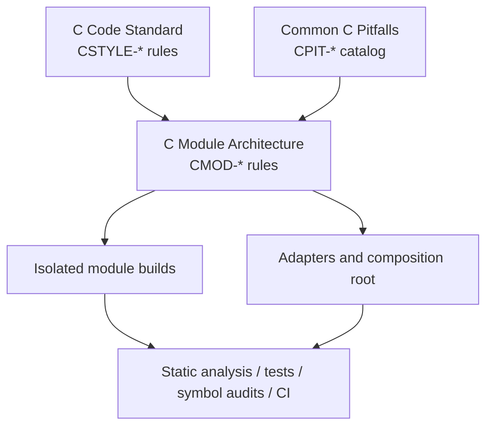

### Code example policy

Preferred and normative C examples in this document follow the
[C Code Standard](./c-code-standard.md). Forbidden examples keep unrelated
coding rules intact when practical, so each example isolates the architecture
violation under review. The pitfall catalog keeps `CPIT-*` examples
noncompliant because those snippets demonstrate failure modes.

---

## 1. Architecture Invariants

### 1.1 Minimum Visibility Is the Primary Rule

**Rule ID:** `CMOD-001-1-1-minimum-visibility`

**Related C standard rules:**

- [`CSTYLE-033-2-2-3-header-content-rules`](./c-code-standard.md#223-header-content-rules)
- [`CSTYLE-069-analyzability`](./c-code-standard.md#analyzability)

Give each declaration, definition, type, include path, callback, DTO, object
file, and exported symbol the smallest scope that satisfies its owner.

Use this decision order:

```text
Need the symbol outside one .c file?
  no  -> static definition in that .c file
  yes -> continue

Need the symbol outside its module?
  no  -> hidden module-internal symbol
  yes -> continue

Need another peer module to name the symbol?
  no  -> keep it out of peer module headers
  yes -> redesign the boundary around callbacks or an adapter

Need the final program or external consumer to link the symbol by name?
  no  -> hide or localize it
  yes -> public API/export contract
```

Release review must flag unnecessary symbols as metadata exposure and
unnecessary dependencies as ownership violations.

---

### 1.2 One Module Owns Each Implementation Detail

**Rule ID:** `CMOD-002-1-2-single-module-ownership`

**Related C standard rules:**

- [`CSTYLE-032-2-2-2-module-cohesion`](./c-code-standard.md#222-module-cohesion)
- [`CSTYLE-082-5-1-6-ownership-rules`](./c-code-standard.md#516-ownership-rules)

**Related pitfalls:**

- [CPIT-005](./c-common-pitfalls.md#cpit-005-ambiguous-ownership)

Each implementation detail belongs to one module.

A module owns:

- its source files
- its internal headers
- its private and internal symbols
- its state machines
- its storage layout
- its allocation policy for module-owned objects
- its lifecycle rules
- its inbound API
- the callback ports that represent dependencies it consumes
- its module tests
- its export list

A peer module must not modify, inspect, allocate, free, or depend on another
module's internal representation.

Ownership does not follow directory proximity. A file in another module remains
outside the boundary even when both modules live in the same repository.

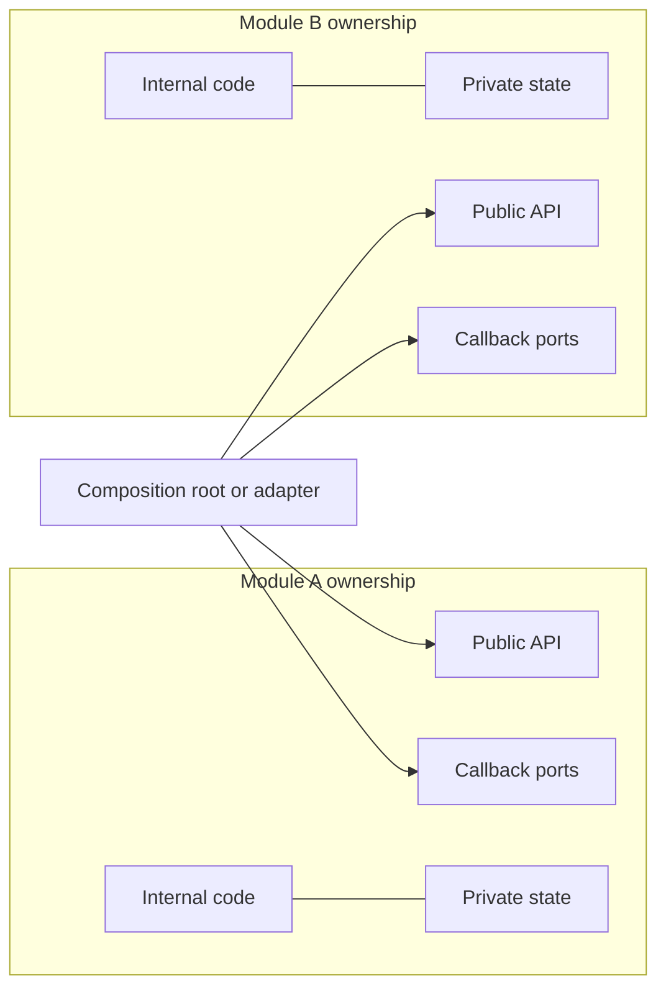

Code in the composition layer may include and bind both public module APIs.
Peer module code must not include or name the other module's implementation.

---

### 1.3 Peer Modules Communicate Through Callbacks

**Rule ID:** `CMOD-003-1-3-callback-only-peer-communication`

**Related C standard rules:**

- [`CSTYLE-071-4-1-12-callback-contracts`](./c-code-standard.md#4112-callback-contracts)

**Related pitfalls:**

- [CPIT-026](./c-common-pitfalls.md#cpit-026-function-pointer-type-mismatch)
- [CPIT-032](./c-common-pitfalls.md#cpit-032-borrowed-pointer-stored-beyond-lifetime)

A peer module must not call another peer module through a named link-time symbol.
The peer receives a function pointer through configuration, creation, binding,
or registration and calls that function pointer.

Forbidden inside a module:

```c
#include "frontend.h"

#include <stdlib.h>

#include "backend.h"

int FRONTEND_process(void)
{
    int ret = EXIT_SUCCESS;

    ret = BACKEND_run();
    if (ret != EXIT_SUCCESS)
        goto function_output;

function_output:
    return ret;
}
```

Preferred module dependency port:

```c
typedef int (*frontend_request_cb_t)(
    void *context,
    const frontend_request_dto_t *request,
    frontend_reply_dto_t *reply
);

typedef struct FrontendCallbacks
{
    void *request_context;
    frontend_request_cb_t request;
} frontend_callbacks_t;
```

The composition root binds the port:

```c
int APP_createFrontend(backend_t *backend, frontend_t **frontend)
{
    int ret = EXIT_SUCCESS;

    frontend_callbacks_t callbacks = { 0 };

    if (backend == (backend_t *)(NULL))
    {
        ret = -EINVAL;
        goto function_output;
    }

    if (frontend == (frontend_t **)(NULL))
    {
        ret = -EINVAL;
        goto function_output;
    }

    callbacks.request_context = backend;
    callbacks.request = BACKEND_handleFrontendRequest;

    ret = FRONTEND_create(frontend, &callbacks);

function_output:
    return ret;
}
```

`frontend` does not contain an undefined reference to
`BACKEND_handleFrontendRequest`. The composition root owns that symbol
relationship.

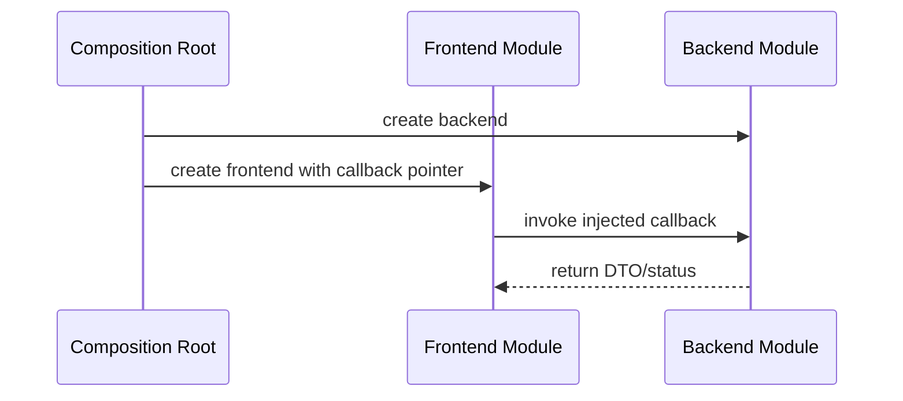

An adapter replaces the direct callback binding when the two sides use different
DTOs or semantics.

---

### 1.4 Compile Modules in Isolation

**Rule ID:** `CMOD-004-1-4-isolated-module-compilation`

**Related C standard rules:**

- [`CSTYLE-034-2-2-4-self-contained-headers`](./c-code-standard.md#224-self-contained-headers)

The build system must compile each module without peer-module include paths and
without peer-module link dependencies.

A module target may depend on:

- its own public headers
- its own internal headers
- the C standard library and approved platform headers
- the project leaf `types.h`, when needed
- approved boundary DTO headers
- approved callback-contract headers
- module-local generated headers
- platform abstraction headers owned by the module or an approved foundation
  layer

A module target must not depend on another peer module target.

Adapters and the composition root may depend on two or more public module APIs.
They sit outside the modules they connect.

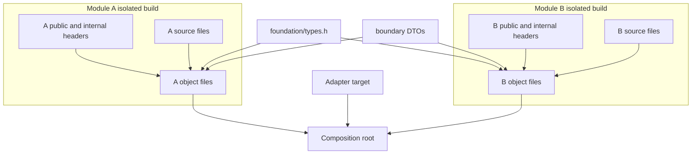

The CI must fail when a module object contains an unresolved symbol whose name
belongs to another peer module namespace.

---

## 2. Module Layout and Ownership

### 2.1 Module Directory Layout

**Rule ID:** `CMOD-005-2-1-module-directory-layout`

Use one build root per module.

```text
backend/
├── CMakeLists.txt
├── backend.version.map
├── inc/
│   └── backend.h
├── src/
│   ├── backend.c
│   ├── backend_data.c
│   ├── backend_process.c
│   └── inc/
│       ├── backend_internal.h
│       ├── backend_data.h
│       └── backend_process.h
└── tests/
    ├── public/
    └── internal/
```

Keep integration code outside both modules:

```text
integration/
├── adapters/
│   └── frontend_backend_adapter.c
├── contracts/
│   ├── frontend_request_dto.h
│   └── frontend_reply_dto.h
└── composition/
    └── application_modules.c
```

The repository may choose different top-level names. The ownership split must
remain visible in the directory tree and the build graph.

---

### 2.2 Public, Internal, and Private Visibility

**Rule ID:** `CMOD-006-2-2-visibility-levels`

Use three source-level visibility classes:

```text
public
internal
private
```

Public declarations form the module's inbound contract and live in:

```text
<module>/inc/<module>.h
```

Internal declarations support multiple translation units from the same module
and live in:

```text
<module>/src/inc/*.h
```

Private declarations stay in one `.c` file and use `static`.

```c
static int backend_validateState(const backend_t *backend)
{
    int ret = EXIT_SUCCESS;

    if (backend == (const backend_t *)(NULL))
    {
        ret = -EINVAL;
        goto function_output;
    }

function_output:
    return ret;
}
```

A symbol should move outward only when the owner proves that the narrower scope
cannot satisfy the use case.

---

### 2.3 State Ownership

**Rule ID:** `CMOD-007-2-3-state-ownership`

A module owns the state that implements its behavior.

Peer modules must not share writable global state, struct fields, storage
layouts, state-machine variables, or mutable singleton objects.

Expose state through:

- opaque handles
- input DTOs
- output DTOs
- callbacks
- explicit query functions used by the composition layer or external consumer

Do not expose the layout of a module context in a public header.

```c
typedef struct Backend backend_t;
```

The module defines the object in an internal header or source file:

```c
struct Backend
{
    uint32_t state;
    bool is_ready;
};
```

---

### 2.4 Memory Ownership Across Boundaries

**Rule ID:** `CMOD-008-2-4-memory-ownership`

**Related C standard rules:**

- [`CSTYLE-082-5-1-6-ownership-rules`](./c-code-standard.md#516-ownership-rules)
- [`CSTYLE-083-5-1-7-caller-owned-dtos`](./c-code-standard.md#517-caller-owned-dtos)
- [`CSTYLE-084-5-1-8-local-memory-lifetime`](./c-code-standard.md#518-local-memory-lifetime)

**Related pitfalls:**

- [CPIT-001](./c-common-pitfalls.md#cpit-001-dangling-pointer)
- [CPIT-002](./c-common-pitfalls.md#cpit-002-use-after-free)
- [CPIT-003](./c-common-pitfalls.md#cpit-003-double-free)
- [CPIT-005](./c-common-pitfalls.md#cpit-005-ambiguous-ownership)
- [CPIT-032](./c-common-pitfalls.md#cpit-032-borrowed-pointer-stored-beyond-lifetime)
- [CPIT-033](./c-common-pitfalls.md#cpit-033-heap-object-points-to-stack-memory)

A boundary must state who owns every pointer and how long the pointed object
remains valid.

Default callback rules:

- the caller owns input DTO storage
- the callee may read input DTO storage only during the callback
- the callee must not retain an input pointer
- the caller owns output storage that it passes into the callback
- the callback writes only within declared capacities
- pointer ownership does not transfer unless the contract names the transfer
- a module frees only memory that its own allocator contract owns

Prefer DTO values with fixed-width fields, bounded arrays, spans, IDs, or opaque
handles over raw ownership-bearing pointers.

---

## 3. Header Architecture

### 3.1 Headers Must Minimize Includes

**Rule ID:** `CMOD-009-3-1-minimum-header-includes`

**Related C standard rules:**

- [`CSTYLE-026-2-1-1-header-inclusion-policy`](./c-code-standard.md#211-header-inclusion-policy)
- [`CSTYLE-028-2-1-3-include-order`](./c-code-standard.md#213-include-order)
- [`CSTYLE-033-2-2-3-header-content-rules`](./c-code-standard.md#223-header-content-rules)
- [`CSTYLE-034-2-2-4-self-contained-headers`](./c-code-standard.md#224-self-contained-headers)

A header must avoid including another project header.

A public header should contain the declarations that a consumer needs and no
transitive convenience includes.

Use forward declarations when the API needs only a pointer to a type.

Prefer:

```c
#if !defined(COIL_BACKEND_H)
#define COIL_BACKEND_H

#include "types.h"

typedef struct Backend backend_t;
typedef struct BackendConfig backend_config_t;

int BACKEND_create(
    backend_t **backend,
    const backend_config_t *config
);

int BACKEND_destroy(backend_t *backend);

#endif
```

Avoid:

```c
#include "database.h"
#include "frontend.h"
#include "logger.h"
#include "network.h"
#include "parser.h"
```

A `.c` file should include the concrete dependencies it uses.

---

### 3.2 Allowed Header-to-Header Dependencies

**Rule ID:** `CMOD-010-3-2-header-dependency-exceptions`

A project header may include another header only when the included file acts as a
leaf contract.

Approved categories:

- `types.h`
- a boundary DTO header with no module dependencies
- a boundary callback-contract header with no module dependencies
- a C standard header required to spell the public ABI when the project does not
  route that type through `types.h`

A public module header must not include another module's public header.

A header include exception needs a reason based on type completeness or ABI
spelling. Convenience does not qualify.

---

### 3.3 `types.h` Is a Foundation Leaf

**Rule ID:** `CMOD-011-3-3-types-header-leaf-policy`

**Related C standard rules:**

- [`CSTYLE-036-2-3-1-explicit-integer-types`](./c-code-standard.md#231-explicit-integer-types)
- [`CSTYLE-034-2-2-4-self-contained-headers`](./c-code-standard.md#224-self-contained-headers)

`types.h` may appear in other headers, so it must stay smaller and more stable
than normal project headers.

A valid `types.h` must:

- include only a small approved set of C standard headers
- contain no module-specific types
- contain no function declarations
- contain no function definitions
- contain no mutable object definitions
- contain no external object declarations
- contain no callbacks
- contain no allocator API
- contain no logging API
- contain no platform service API
- contain no feature-switch logic tied to one module
- contain no third-party headers
- contain no compiler-generated headers
- contain no packing pragmas
- contain no build-order assumptions
- compile as the first project header in an otherwise empty translation unit
- use fixed-width integer types for cross-binary contracts when width matters
- keep ABI-relevant types explicit

A narrow example:

```c
#if !defined(COIL_TYPES_H)
#define COIL_TYPES_H

#include <stdbool.h>
#include <stddef.h>
#include <stdint.h>

typedef int32_t project_status_t;
typedef uint32_t project_id_t;

#endif
```

Do not turn `types.h` into an umbrella header.

---

### 3.4 DTO Headers Are Leaf Contracts

**Rule ID:** `CMOD-012-3-4-dto-header-policy`

**Related C standard rules:**

- [`CSTYLE-036-2-3-1-explicit-integer-types`](./c-code-standard.md#231-explicit-integer-types)
- [`CSTYLE-063-4-1-6-output-buffer-contracts`](./c-code-standard.md#416-output-buffer-contracts)
- [`CSTYLE-082-5-1-6-ownership-rules`](./c-code-standard.md#516-ownership-rules)
- [`CSTYLE-083-5-1-7-caller-owned-dtos`](./c-code-standard.md#517-caller-owned-dtos)

**Related pitfalls:**

- [CPIT-013](./c-common-pitfalls.md#cpit-013-out-of-bounds-write)
- [CPIT-029](./c-common-pitfalls.md#cpit-029-array-to-pointer-decay)
- [CPIT-032](./c-common-pitfalls.md#cpit-032-borrowed-pointer-stored-beyond-lifetime)

A DTO header may cross module build boundaries when both sides need the same wire
or in-process value contract.

A DTO header must:

- include no module public header
- include no module internal header
- include only `types.h` or an approved C standard header
- contain data declarations only
- contain no behavior
- contain no hidden allocator requirement
- state units in field names or comments
- use fixed-width fields for ABI or persistence boundaries
- state buffer capacity and string termination rules
- avoid pointers when a value, ID, offset, span, or fixed-capacity field works

Example:

```c
#if !defined(COIL_FRONTEND_REQUEST_DTO_H)
#define COIL_FRONTEND_REQUEST_DTO_H

#include "types.h"

typedef struct FrontendRequestDto
{
    const uint8_t *payload;
    size_t payload_size_bytes;
    uint32_t operation;
    uint32_t request_id;
} frontend_request_dto_t;

#endif
```

The `payload` field above is borrowed input. The caller keeps the storage
valid for the operation and retains ownership. Any DTO pointer needs an equally
explicit lifetime and ownership contract.

---

### 3.5 Callback Contract Headers Are Leaf Contracts

**Rule ID:** `CMOD-013-3-5-callback-contract-header-policy`

**Related C standard rules:**

- [`CSTYLE-071-4-1-12-callback-contracts`](./c-code-standard.md#4112-callback-contracts)

**Related pitfalls:**

- [CPIT-026](./c-common-pitfalls.md#cpit-026-function-pointer-type-mismatch)
- [CPIT-032](./c-common-pitfalls.md#cpit-032-borrowed-pointer-stored-beyond-lifetime)

A callback-contract header may define function-pointer types and small callback
v-tables that connect a module to a dependency port.

It must not name a concrete provider module unless the contract belongs to a
provider-specific integration boundary.

Prefer consumer-owned port names:

```c
typedef int (*frontend_storage_read_cb_t)(
    void *context,
    uint32_t object_id,
    void *buffer,
    size_t buffer_size_bytes,
    size_t *read_size_bytes
);
```

Avoid provider-coupled names such as:

```text
backend_read_cb_t
postgres_read_cb_t
redis_read_cb_t
```

when the consuming module only needs a storage operation.

---

### 3.6 Public Headers Must Be Self-Contained

**Rule ID:** `CMOD-014-3-6-self-contained-public-headers`

**Related C standard rules:**

- [`CSTYLE-034-2-2-4-self-contained-headers`](./c-code-standard.md#224-self-contained-headers)

Each public header must compile as the first project include in a test translation
unit.

CI test shape:

```c
#include "backend.h"
```

The header must not depend on a prior include, macro, typedef, pragma, platform
header, or include order.

---

### 3.7 Internal Headers Stay Inside the Module

**Rule ID:** `CMOD-015-3-7-internal-header-boundary`

Only source files and internal tests owned by the same module may include:

```text
<module>/src/inc/*.h
```

The build system must not add `src/inc` to a `PUBLIC` or `INTERFACE` include
path.

Another module, adapter, application, or external consumer must not include an
internal header.

---

### 3.8 Include What the Translation Unit Uses

**Rule ID:** `CMOD-016-3-8-direct-translation-unit-includes`

A `.c` file includes the headers that provide the declarations it uses.

Do not rely on a public header to pull a standard or project dependency through a
transitive include.

Preferred order:

```c
#include "backend.h"

#include <errno.h>
#include <stdlib.h>

#include "backend_internal.h"
#include "backend_process.h"
#include "frontend_request_dto.h"
```

Including the module's own public header first catches missing prerequisites in
the public contract.

---

## 4. Explicit `extern` Is Forbidden

### 4.1 No Explicit `extern` in Project C Code

**Rule ID:** `CMOD-017-4-1-no-explicit-extern`

**Related C standard rules:**

- [`CSTYLE-088-6-1-state-visibility`](./c-code-standard.md#61-state-visibility)

Project-owned C source and core C headers must not use the `extern` keyword.

Forbidden:

```c
extern int g_global_state;
extern int BACKEND_run(void);
```

Use a normal function prototype for a public function:

```c
int BACKEND_run(void);
```

C gives that function declaration external linkage without the keyword.

Do not create cross-translation-unit variables. Put mutable state inside a
module-owned object and pass its opaque handle or context pointer.

---

### 4.2 No Cross-Module Global Objects

**Rule ID:** `CMOD-018-4-2-no-cross-module-global-objects`

**Related C standard rules:**

- [`CSTYLE-082-5-1-6-ownership-rules`](./c-code-standard.md#516-ownership-rules)
- [`CSTYLE-088-6-1-state-visibility`](./c-code-standard.md#61-state-visibility)

**Related pitfalls:**

- [CPIT-005](./c-common-pitfalls.md#cpit-005-ambiguous-ownership)

A module must not publish an object for another module to read or write by name.

Forbidden design:

```c
extern backend_state_t g_backend_state;
```

Preferred design:

```c
int BACKEND_getStatus(
    const backend_t *backend,
    backend_status_dto_t *status
);
```

For peer-to-peer flow, the composition layer injects that behavior through a
callback. The peer does not receive the provider's public symbol as a direct
link dependency.

---

### 4.3 C++ Linkage Bridges Live Outside Core C Headers

**Rule ID:** `CMOD-019-4-3-cpp-linkage-adapter`

Core project C headers must not carry `extern "C"` wrappers.

When a C++ consumer needs C linkage, a dedicated C++ compatibility header or
adapter owns that bridge.

This keeps the C contract free from language-consumer policy and preserves the
explicit `extern` ban inside the core module tree.

---

## 5. Callback-Only Module Communication

### 5.1 Modules Depend on Ports, Not Providers

**Rule ID:** `CMOD-020-5-1-dependency-ports`

A module defines the operations it needs as callback ports.

The port must describe the required behavior, not the concrete module that may
satisfy it.

Example:

```c
typedef struct ParserCallbacks
{
    void *emit_context;
    void *read_context;
    parser_emit_cb_t emit;
    parser_read_cb_t read;
} parser_callbacks_t;
```

The parser may run with a file adapter, memory adapter, network adapter, or test
mock without changing the parser target.

---

### 5.2 The Composition Root Owns Binding

**Rule ID:** `CMOD-021-5-2-composition-root-binding`

One composition layer creates modules and binds callback ports.

The composition layer may name public symbols from more than one module.
Peer modules may not.

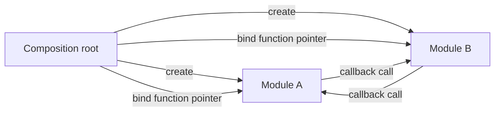

The arrows between modules represent runtime function-pointer calls. The module
object files contain no direct undefined peer-module references.

---

### 5.3 Adapters Own Semantic Translation

**Rule ID:** `CMOD-022-5-3-adapter-ownership`

Use an adapter when two modules do not share the same callback signature, DTO,
error model, units, lifecycle, or threading contract.

The adapter may:

- include both public module headers
- include the specific DTO headers it translates
- convert one DTO into another
- map error domains
- convert units
- copy data across ownership boundaries
- schedule or serialize callbacks when the integration contract requires it

The adapter must not include either module's internal headers.

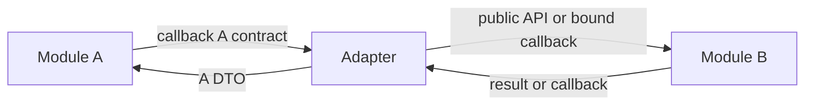

Keep adapters small. Integration policy belongs in the composition layer, not in
module internals.

---

### 5.4 Callback Context Is Opaque

**Rule ID:** `CMOD-023-5-4-opaque-callback-context`

**Related C standard rules:**

- [`CSTYLE-071-4-1-12-callback-contracts`](./c-code-standard.md#4112-callback-contracts)
- [`CSTYLE-082-5-1-6-ownership-rules`](./c-code-standard.md#516-ownership-rules)
- [`CSTYLE-096-6-8-cast-rules`](./c-code-standard.md#68-cast-rules)

**Related pitfalls:**

- [CPIT-032](./c-common-pitfalls.md#cpit-032-borrowed-pointer-stored-beyond-lifetime)

A callback may receive a `void *context` owned by the binding layer.

The consuming module stores and returns that pointer without interpreting its
layout.

The consuming module must not:

- cast the context to a peer module struct type
- free the context
- modify the pointed object outside the callback contract
- publish the context through another public interface

Only the callback implementation understands the context.

---

### 5.5 Callback Lifetime Must Be Explicit

**Rule ID:** `CMOD-024-5-5-callback-lifetime`

**Related C standard rules:**

- [`CSTYLE-071-4-1-12-callback-contracts`](./c-code-standard.md#4112-callback-contracts)
- [`CSTYLE-082-5-1-6-ownership-rules`](./c-code-standard.md#516-ownership-rules)
- [`CSTYLE-084-5-1-8-local-memory-lifetime`](./c-code-standard.md#518-local-memory-lifetime)

**Related pitfalls:**

- [CPIT-001](./c-common-pitfalls.md#cpit-001-dangling-pointer)
- [CPIT-002](./c-common-pitfalls.md#cpit-002-use-after-free)
- [CPIT-032](./c-common-pitfalls.md#cpit-032-borrowed-pointer-stored-beyond-lifetime)

The creator or binder must keep a callback target and its context alive until the
consuming module stops using the port.

A module must provide one of these lifecycle models:

```text
create(config with callbacks) -> use -> destroy
```

or:

```text
create -> bind callbacks -> use -> unbind -> destroy
```

Do not replace a callback table while another thread may invoke it unless the
module contract defines synchronization for that operation.

---

### 5.6 Callback Reentrancy Is Forbidden by Default

**Rule ID:** `CMOD-025-5-6-callback-reentrancy`

**Related C standard rules:**

- [`CSTYLE-071-4-1-12-callback-contracts`](./c-code-standard.md#4112-callback-contracts)
- [`CSTYLE-090-6-3-thread-safety-documentation`](./c-code-standard.md#63-thread-safety-documentation)

A callback must not call back into the same module instance while that module is
inside the original callback path unless the module contract permits reentrancy.

Default assumption:

```text
callback execution -> non-reentrant
```

Use a queue, deferred work item, state transition, or integration scheduler when
a cycle would re-enter the module.

---

### 5.7 Callback Error Semantics Must Match the Port

**Rule ID:** `CMOD-026-5-7-callback-error-contract`

Each callback type must define:

- success value
- error domain
- retry behavior
- timeout behavior when applicable
- partial-output behavior
- whether output fields remain valid after failure

The adapter maps provider-specific errors into the consumer's callback contract.
The consumer must not depend on a provider's private error enum.

---

## 6. Build Isolation

### 6.1 Translation Units Compile Independently

**Rule ID:** `CMOD-027-6-1-independent-translation-units`

The compiler turns each `.c` file and its included headers into one translation
unit and then one object file.

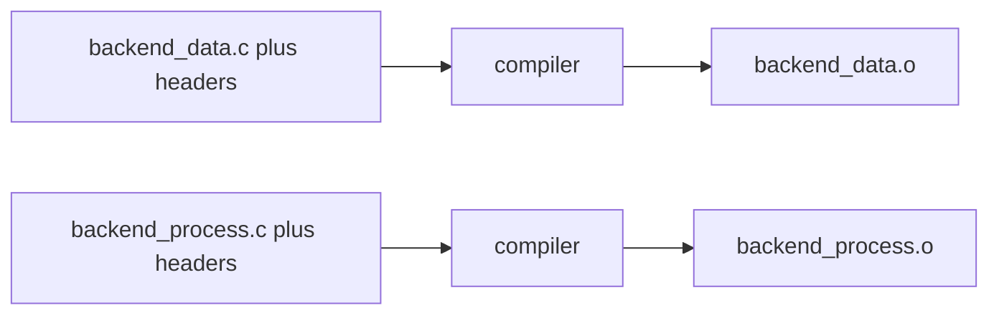

Example:

```sh
cc -c backend_data.c -o backend_data.o
cc -c backend_process.c -o backend_process.o
```

The compiler needs declarations for symbols used by the translation unit. The
linker resolves named external definitions at a later stage.

Callback-only peer communication removes peer-module symbol names from this
resolution path.

---

### 6.2 A Module Build Must Succeed Without Peer Headers

**Rule ID:** `CMOD-028-6-2-no-peer-header-build-input`

A module's compile command must not contain another peer module's `inc` or
`src/inc` directory.

CI should inspect compile commands and fail on patterns such as:

```text
-I.../frontend/inc      while compiling backend
-I.../backend/src/inc   while compiling frontend
```

Foundation and boundary-contract include paths need an explicit allowlist.

---

### 6.3 A Module Build Must Not Link a Peer Module

**Rule ID:** `CMOD-029-6-3-no-peer-link-dependency`

A module target must not use a peer module as a private, public, or interface link
dependency.

Forbidden CMake relationship:

```cmake
target_link_libraries(frontend PRIVATE backend)
```

The composition target performs the final combination.

Adapters may link or reference the public APIs of the modules they connect.

---

### 6.4 Undefined Peer Symbols Are a CI Failure

**Rule ID:** `CMOD-030-6-4-no-peer-undefined-symbols`

Inspect every module-level object or archive.

Forbidden result:

```text
frontend.o
  U BACKEND_run
  T FRONTEND_run
```

Expected peer isolation:

```text
frontend.o
  T FRONTEND_run
```

The callback target appears as data stored in the module state, not as a named
undefined peer symbol.

---

## 7. Progressive Compiling and Linking Flow

### 7.1 Tool Ownership by Build Stage

**Rule ID:** `CMOD-031-7-1-progressive-build-tools`

Use the tools according to their artifact role.

```text
compiler       .c -> .o
linker -r      .o + .o -> module.o
ar             .o + .o -> libmodule.a
linker -shared .o + .o -> libmodule.so / module.dll
final linker   main.o + modules/libs/adapters -> app.elf / app.exe
```

Headers do not compile as independent implementation units. The preprocessor
combines a `.c` file with its included headers before compilation.

---

### 7.2 Phase 1: Build Object Files

**Rule ID:** `CMOD-032-7-2-object-file-phase`

Compile each translation unit into one object file.

```text
backend_data.c      + headers -> backend_data.o
backend_process.c   + headers -> backend_process.o
frontend_data.c     + headers -> frontend_data.o
frontend_process.c  + headers -> frontend_process.o
main.c              + headers -> main.o
```

At this stage, the object may contain unresolved references to the C runtime,
platform services, or callback-independent foundation libraries.

It must not contain unresolved peer-module API references.

---

### 7.3 Phase 2: Build a Relocatable Module Object

**Rule ID:** `CMOD-033-7-3-relocatable-module-object`

A partial link can combine a module's object files into one relocatable object.

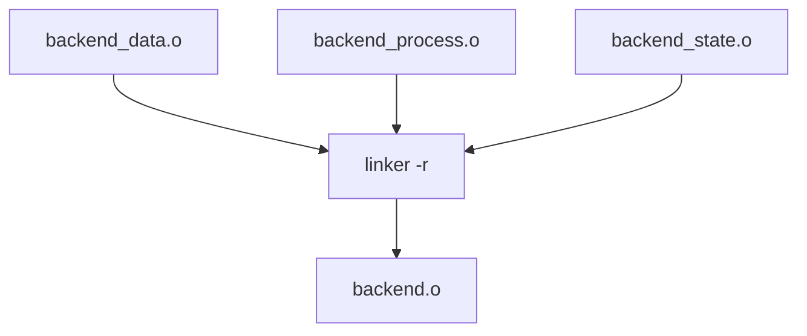

Example:

```sh
cc -r \
    backend_data.o \
    backend_process.o \
    backend_state.o \
    -o backend.o
```

The result remains relocatable. The final linker can consume it later.

A partial link gives CI one artifact for module-level symbol audits.

---

### 7.4 Phase 3A: Build a Static Library

**Rule ID:** `CMOD-034-7-4-static-library-phase`

The archiver can package module objects into a static library.

```text
backend_data.o + backend_process.o
        |
        v
       ar
        |
        v
libbackend.a
```

Example:

```sh
ar rcs libbackend.a backend_data.o backend_process.o
```

`ar` creates an archive. It does not perform a final link and does not consume a
linker version script.

Internal global symbols may remain visible in the archive symbol table. CI must
audit them.

---

### 7.5 Phase 3B: Build a Linux Shared Library

**Rule ID:** `CMOD-035-7-5-linux-shared-library-phase`

Compile shared-library objects with hidden visibility as the default and with
position-independent code.

```sh
cc \
    -fPIC \
    -fvisibility=hidden \
    -c backend_data.c \
    -o backend_data.pic.o
```

Link the shared object with an explicit export script:

```sh
cc -shared \
    backend_data.pic.o \
    backend_process.pic.o \
    -Wl,--version-script=backend.version.map \
    -Wl,-soname,libbackend.so.1 \
    -o libbackend.so.1.0.0
```

Only the declared public API receives dynamic visibility.

---

### 7.6 Phase 3C: Build a Windows Dynamic Library

**Rule ID:** `CMOD-036-7-6-windows-dll-phase`

A Windows dynamic-link library (DLL) build produces the runtime library and,
for normal link workflows, an import library.

```text
backend objects
      |
      v
shared linker
  |       |
  v       v
backend.dll
libbackend.dll.a or backend.lib
```

Windows GNU toolchain example:

```sh
x86_64-w64-mingw32-gcc -shared \
    backend_data.o \
    backend_process.o \
    -Wl,--out-implib,libbackend.dll.a \
    -o backend.dll
```

Do not enable automatic export of every non-static symbol.

---

### 7.7 Phase 4: Final Application Link

**Rule ID:** `CMOD-037-7-7-final-application-link`

The final composition target links the application entry point, isolated module
artifacts, adapters, and approved foundation libraries.

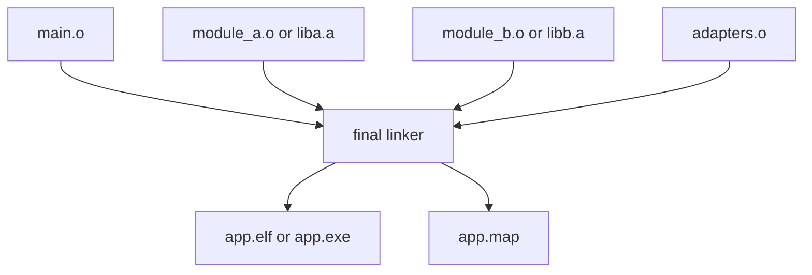

Example:

```sh
cc \
    main.o \
    adapters.o \
    backend.o \
    frontend.o \
    -Wl,-Map=app.map \
    -o app.elf
```

The final link is the first normal stage that needs the complete application
symbol graph.

---

### 7.8 Static Library Link Order

**Rule ID:** `CMOD-038-7-8-static-library-link-order`

Traditional Unix-style static-library resolution may depend on library order.

The callback-only module policy should remove peer-module library dependencies,
so peer library ordering should not encode architecture.

If a legacy or third-party dependency still requires ordered static libraries,
place the consumer before the provider:

```sh
cc main.o libconsumer.a libprovider.a -o app.elf
```

Do not use `--start-group` to hide a new circular dependency between project
modules. A project-module cycle fails architecture review.

---

### 7.9 Linker Report Map and Export Map Are Different Files

**Rule ID:** `CMOD-039-7-9-map-file-semantics`

A linker report map records the final link layout:

```sh
-Wl,-Map=app.map
```

It can contain:

- section layout
- symbol addresses
- object contribution
- discarded sections
- linked libraries
- memory regions

A version/export map controls shared-library exports:

```sh
-Wl,--version-script=backend.version.map
```

Do not treat these two files as interchangeable.

---

## 8. Symbol Visibility and Export Control

### 8.1 Private Functions Use `static`

**Rule ID:** `CMOD-040-8-1-static-private-functions`

**Related C standard rules:**

- [`CSTYLE-003-1-1-2-functions`](./c-code-standard.md#112-functions)

A function used by one translation unit must use internal linkage.

```c
static int backend_parseLine(const char *line)
{
    int ret = EXIT_SUCCESS;

    if (line == (const char *)(NULL))
    {
        ret = -EINVAL;
        goto function_output;
    }

    /* implementation */

function_output:
    return ret;
}
```

Do not declare a private helper in a header.

---

### 8.2 Module-Internal Cross-TU Functions Stay Hidden

**Rule ID:** `CMOD-041-8-2-hidden-module-internal-functions`

A function shared by multiple `.c` files in one module may use external linkage
inside the module build, but the final binary must not export it as part of the
public ABI.

Use:

- internal headers under `src/inc`
- hidden visibility for shared-library builds
- version/export scripts
- `LTO` internalization when the toolchain supports it
- symbol localization when the release flow needs a harder object boundary

Internal names must not use the public API prefix form when that form feeds export
checks.

---

### 8.3 Public Symbols Need an Explicit Export Contract

**Rule ID:** `CMOD-042-8-3-explicit-public-export-contract`

A shared library exports only the symbols listed in its public ABI contract.

ELF example:

```ld
BACKEND_1.0 {
    global:
        BACKEND_create;
        BACKEND_destroy;
        BACKEND_handleFrontendRequest;

    local:
        *;
};
```

The `local: *;` clause closes the default surface.

Windows builds must use a `.def` file, explicit export macro, or equivalent
allowlist. Do not rely on auto-export.

---

### 8.4 Public Symbol Naming Must Reveal Only the Public API

**Rule ID:** `CMOD-043-8-4-symbol-naming-levels`

**Related C standard rules:**

- [`CSTYLE-003-1-1-2-functions`](./c-code-standard.md#112-functions)

Use three naming levels:

```text
Public API:
  BACKEND_create
  BACKEND_destroy
  BACKEND_handleFrontendRequest

Internal module API:
  backend_dataLoad
  backend_processStep

Private translation-unit helper:
  static backend_parseLine
```

A release symbol audit should treat a new `BACKEND_*` symbol as an ABI change
unless the export contract rejects it.

---

### 8.5 Public API Types Prefer Opaque Handles

**Rule ID:** `CMOD-044-8-5-opaque-public-types`

A public header should expose an incomplete type when a consumer does not need
its layout.

```c
typedef struct Backend backend_t;
```

The consumer must not allocate `sizeof(backend_t)`, inspect fields, or copy the
object representation.

Opaque handles reduce ABI coupling and remove internal field names from public
headers.

---

## 9. Binary Surface and Reverse-Engineering Resistance

### 9.1 Release Artifacts Minimize Discoverable Symbols

**Rule ID:** `CMOD-045-9-1-release-symbol-minimization`

The release pipeline must minimize symbol and debug metadata that the runtime does
not need.

For ELF targets, evaluate these controls:

```text
-fvisibility=hidden
-ffunction-sections
-fdata-sections
-flto
-Wl,--gc-sections
-Wl,--version-script=<module>.version.map
```

Keep only public dynamic symbols that the loader or external ABI needs.

For `PE/COFF` targets, use an explicit export allowlist and enable dead-code and
identical-code folding through the selected linker when the platform supports
those options.

---

### 9.2 Ship Stripped Release Binaries

**Rule ID:** `CMOD-046-9-2-stripped-release-binaries`

The release package should ship a stripped binary when deployment, crash
collection, certification, or platform rules permit it.

ELF example:

```sh
objcopy --only-keep-debug app.elf app.debug
strip --strip-unneeded app.elf
```

Store the binary with debug symbols or separate debug symbols in controlled
engineering storage. Do not publish internal debug artifacts with normal release packages.

A shared library keeps the dynamic symbols required by its public ABI even after
stripping.

---

### 9.3 Do Not Embed Internal Names Without Need

**Rule ID:** `CMOD-047-9-3-minimum-binary-identifiers`

Avoid shipping internal file paths, developer paths, build-host paths, assertion
messages with private architecture details, unused format strings, or debug-only
module names.

Use reproducible path mapping where the compiler supports it:

```text
-ffile-prefix-map=<build-root>=.
-fdebug-prefix-map=<build-root>=.
```

Do not remove diagnostics that the product safety, support, or incident-response
contract requires. Use stable numeric error IDs when the runtime does not need an
internal implementation string.

---

### 9.4 Reverse-Engineering Resistance Does Not Replace Security

**Rule ID:** `CMOD-048-9-4-no-security-by-symbol-secrecy`

The project may reduce binary metadata, symbol names, and public ABI surface.
The design must still assume that an analyst can inspect machine code, memory,
control flow, constants, and external behavior.

Do not place secrets, private keys, credentials, trust decisions, or authorization
rules behind symbol hiding as the only control.

---

## 10. CMake Architecture

### 10.1 One Target Owns One Module Build

**Rule ID:** `CMOD-049-10-1-module-cmake-target`

Each module root owns its source list, warning policy, internal include path, and
artifact variants.

Example object target:

```cmake
add_library(backend_obj OBJECT
    src/backend.c
    src/backend_data.c
    src/backend_process.c
)

target_include_directories(backend_obj
    PUBLIC
        ${CMAKE_CURRENT_SOURCE_DIR}/inc
    PRIVATE
        ${CMAKE_CURRENT_SOURCE_DIR}/src/inc
        ${PROJECT_SOURCE_DIR}/foundation/inc
        ${PROJECT_SOURCE_DIR}/integration/contracts
)
```

Do not add another peer module include directory.

---

### 10.2 Module Targets Do Not Link Peer Modules

**Rule ID:** `CMOD-050-10-2-no-peer-target-link`

A peer module must not appear in `target_link_libraries()` for another peer module.

Allowed module dependencies include approved foundation libraries and platform
abstraction libraries that form a lower architectural layer.

The project should model those lower layers as explicit architecture, not as a
shortcut around callback boundaries.

---

### 10.3 Adapters Are Separate Targets

**Rule ID:** `CMOD-051-10-3-adapter-cmake-targets`

Build adapters outside the connected modules.

```cmake
add_library(frontend_backend_adapter OBJECT
    adapters/frontend_backend_adapter.c
)

target_include_directories(frontend_backend_adapter
    PRIVATE
        ${PROJECT_SOURCE_DIR}/frontend/inc
        ${PROJECT_SOURCE_DIR}/backend/inc
        ${PROJECT_SOURCE_DIR}/integration/contracts
        ${PROJECT_SOURCE_DIR}/foundation/inc
)
```

Only the adapter receives both module public include paths.

---

### 10.4 Build Object, Static, and Shared Variants From the Same Sources

**Rule ID:** `CMOD-052-10-4-progressive-cmake-artifacts`

The build may reuse module object files for static or final application targets
when `PIC`, `LTO`, sanitizer, and platform requirements match.

Example:

```cmake
add_library(backend_static STATIC
    $<TARGET_OBJECTS:backend_obj>
)

set_target_properties(backend_static PROPERTIES
    OUTPUT_NAME backend
)
```

For a shared target, compile the sources with the visibility and `PIC` settings
required by that artifact.

---

### 10.5 Shared Targets Apply Export Controls

**Rule ID:** `CMOD-053-10-5-shared-library-export-controls`

ELF example:

```cmake
add_library(backend_shared SHARED
    src/backend.c
    src/backend_data.c
    src/backend_process.c
)

set_target_properties(backend_shared PROPERTIES
    C_VISIBILITY_PRESET hidden
    VISIBILITY_INLINES_HIDDEN YES
    OUTPUT_NAME backend
    VERSION 1.0.0
    SOVERSION 1
)

if(UNIX AND NOT APPLE)
    target_link_options(backend_shared PRIVATE
        "LINKER:--version-script=${CMAKE_CURRENT_SOURCE_DIR}/backend.version.map"
    )
endif()
```

The public export list remains an allowlist.

---

## 11. Testing Policy

### 11.1 Public API Tests Use Only the Public Boundary

**Rule ID:** `CMOD-054-11-1-public-api-tests`

A public API test includes only the module public header and approved leaf
contracts.

```c
#include "backend.h"
#include "frontend_request_dto.h"
```

It must not include `src/inc`.

---

### 11.2 Internal Tests Belong to the Module

**Rule ID:** `CMOD-055-11-2-internal-module-tests`

An internal test may include a module internal header only when the module build
owns that test target.

```c
#include "backend_internal.h"
```

A test for another module must not use that access path.

---

### 11.3 Private Functions Stay Private During Tests

**Rule ID:** `CMOD-056-11-3-private-function-testing`

Test a private `static` helper through a public or internal behavior.

If direct tests need the helper, move the behavior into a module-internal unit
with a real internal contract. Do not remove `static` only for a test harness.

---

### 11.4 Callback Ports Need Mocks

**Rule ID:** `CMOD-057-11-4-callback-port-mocks`

Each dependency port should have tests that inject a mock callback and cover:

- success
- callback failure
- malformed DTO input
- boundary sizes
- missing optional callback
- forbidden null callback for required ports
- context lifetime assumptions
- non-reentrant behavior when the module forbids reentrancy

A mock callback gives the module test isolation without linking the real provider
module.

---

## 12. CI Enforcement

### 12.1 Header Boundary Checks

**Rule ID:** `CMOD-058-12-1-header-ci-checks`

CI must verify:

- each public header compiles in isolation
- `types.h` compiles in isolation
- DTO headers compile in isolation
- callback-contract headers compile in isolation
- public module headers do not include peer module headers
- project headers do not use convenience transitive includes
- internal headers do not appear in public include paths
- adapters do not include module internal headers

---

### 12.2 `extern` Checks

**Rule ID:** `CMOD-059-12-2-extern-ci-checks`

CI must reject explicit `extern` tokens in project-owned core C source and headers,
subject only to a reviewed allowlist for generated code or foreign compatibility
adapters outside the core module tree.

Example token-level check:

```sh
grep -R -n -E '(^|[^A-Za-z0-9_])extern([^A-Za-z0-9_]|$)' \
    modules foundation integration/contracts \
    && exit 1
```

Use a token-aware linter when comments, strings, generated code, or language
mixing make the grep check noisy.

---

### 12.3 Include-Graph Checks

**Rule ID:** `CMOD-060-12-3-include-graph-ci-checks`

CI must build an include graph or inspect compiler dependency files and reject:

```text
module A header -> module B header
module A source -> module B header
module A -> module B src/inc
```

Approved foundation and boundary-contract leaves form an allowlist.

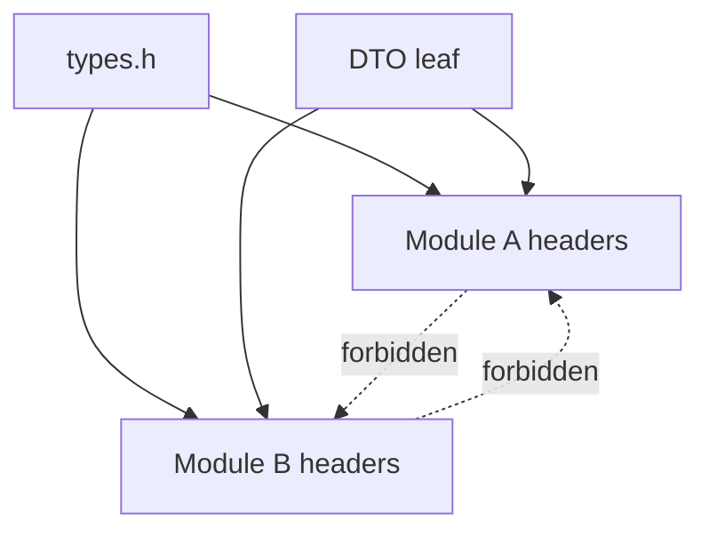

---

### 12.4 Link-Graph Checks

**Rule ID:** `CMOD-061-12-4-link-graph-ci-checks`

CI must reject peer-to-peer target links.

Expected graph:

```text
module_a_obj ----\
module_b_obj -----+--> composition/app
adapter_obj ------/
```

Forbidden graph:

```text
module_a -> module_b
module_b -> module_a
```

---

### 12.5 Undefined-Symbol Checks

**Rule ID:** `CMOD-062-12-5-undefined-symbol-ci-checks`

Inspect module artifacts with `nm`, `readelf`, LLVM tools, or platform equivalents.

Examples:

```sh
nm -u backend.o
nm -u libbackend.a
readelf -Ws backend.o
```

The allowlist may contain compiler runtime, C library, platform ABI, and approved
foundation symbols.

The allowlist must not contain peer module API prefixes.

---

### 12.6 Public Export Checks

**Rule ID:** `CMOD-063-12-6-public-export-ci-checks`

Compare the shared-library export table against the export contract.

ELF:

```sh
readelf -Ws libbackend.so
objdump -T libbackend.so
```

Windows:

```sh
llvm-readobj --coff-exports backend.dll
llvm-objdump -p backend.dll
```

Fail when the binary exports an unlisted symbol or omits a required public symbol.

---

### 12.7 Static Archive Symbol Checks

**Rule ID:** `CMOD-064-12-7-static-archive-symbol-ci-checks`

Inspect static archives:

```sh
ar t libbackend.a
nm -g --defined-only libbackend.a
```

Flag:

- public-looking symbols absent from the public contract
- internal symbols that can become `static`
- module-internal symbols that leak into release objects without need
- compiler-generated or adapter symbols that indicate boundary drift

A static archive cannot rely on a version script for hiding.

---

### 12.8 Release Metadata Checks

**Rule ID:** `CMOD-065-12-8-release-metadata-ci-checks`

The release pipeline should inspect shipped binaries for:

- debug sections
- full source paths
- build-user paths
- unintended symbol tables
- unexpected exported names
- internal module strings that serve no runtime contract

Keep an internal artifact with debug symbols when support or certification needs it.
Ship the reduced artifact.

---

## 13. Architecture Review Rules

### 13.1 No Peer Header Dependency

**Rule ID:** `CMOD-066-13-1-no-peer-header-dependency`

Reject a change when one peer module needs another peer module header to compile.
Create a callback port, leaf contract, or adapter instead.

---

### 13.2 No Peer Symbol Dependency

**Rule ID:** `CMOD-067-13-2-no-peer-symbol-dependency`

Reject a change when one peer module object contains a direct undefined reference
to another peer module public symbol.

Bind the operation as a callback in the composition layer.

---

### 13.3 No Cross-Module Struct Ownership

**Rule ID:** `CMOD-068-13-3-no-cross-module-struct-ownership`

Reject a change when a module:

- allocates another module's private struct
- uses `sizeof` on another module's opaque type
- accesses another module's fields
- embeds another module's private context by value
- frees another module's object without that module's API contract

Use an opaque handle or DTO.

---

### 13.4 No Architecture Through Static Link Order

**Rule ID:** `CMOD-069-13-4-no-architecture-by-link-order`

Do not encode project-module dependencies through static-library ordering or
linker groups.

Callback binding and adapters must make the architecture visible before the final
link stage.

---

### 13.5 No Header as a Dependency Aggregator

**Rule ID:** `CMOD-070-13-5-no-umbrella-dependency-header`

Do not create a module header whose purpose is to include a group of unrelated
module headers.

Forbidden pattern:

```c
#if !defined(COIL_PROJECT_ALL_H)
#define COIL_PROJECT_ALL_H

#include "backend.h"
#include "frontend.h"
#include "network.h"
#include "storage.h"

#endif
```

The composition source may include those public headers directly because it owns
the integration.

---

## 14. Reference Architecture

### 14.1 Compile-Time Dependency Shape

**Rule ID:** `CMOD-071-14-1-reference-compile-graph`

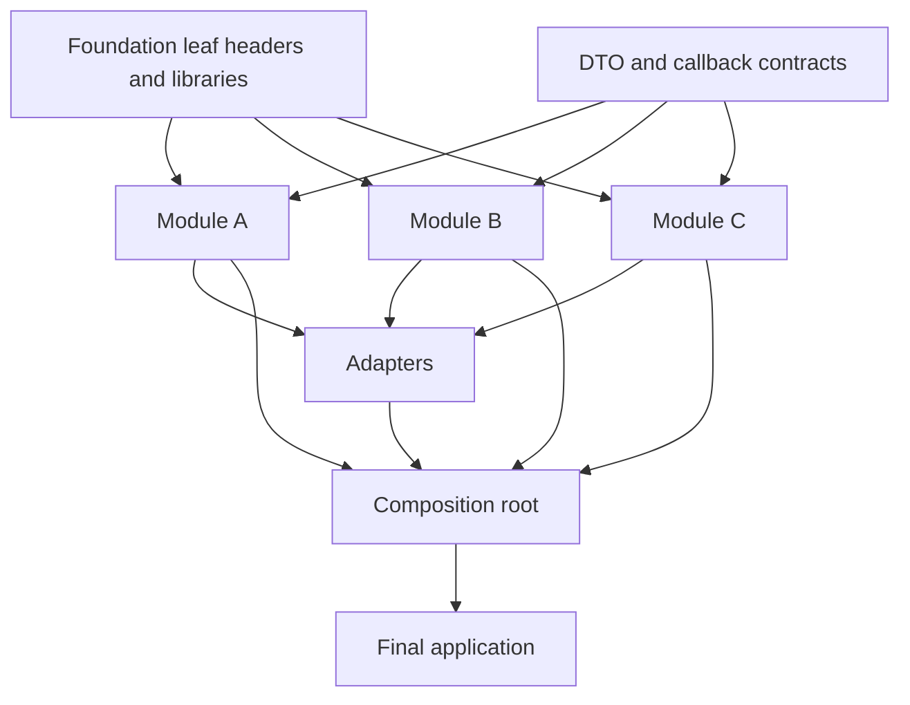

No compile-time edge runs from one peer module into another peer module.

---

### 14.2 Runtime Communication Shape

**Rule ID:** `CMOD-072-14-2-reference-runtime-graph`

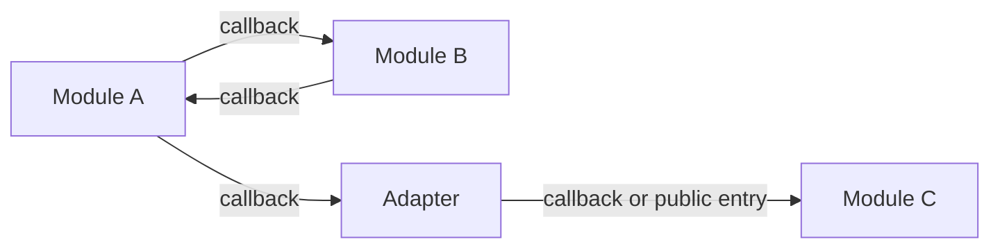

Runtime edges may cross module boundaries through injected function pointers.
Compile-time module edges remain absent.

---

### 14.3 Progressive Artifact Shape

**Rule ID:** `CMOD-073-14-3-reference-artifact-graph`

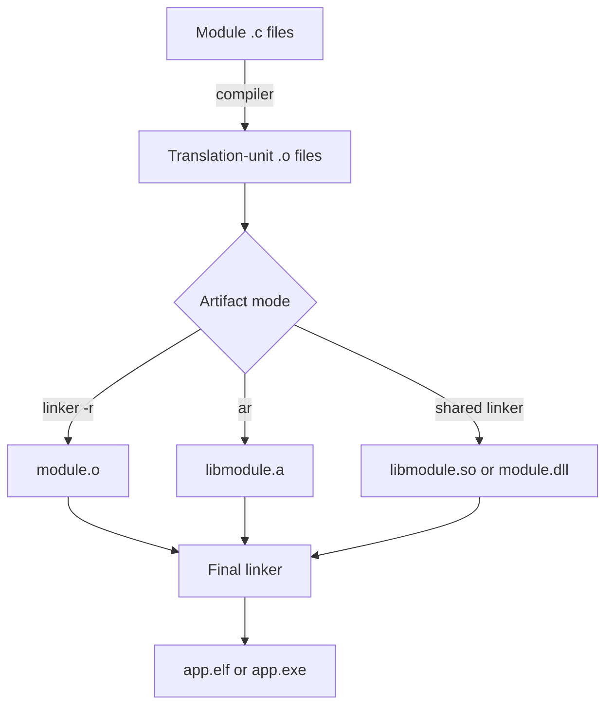

The module source organization does not need to change when the build selects a
different artifact mode.

---

## 15. Practical Decision Table

### 15.1 Where a Declaration Belongs

**Rule ID:** `CMOD-074-15-1-declaration-placement`

```text
Used by one .c file?
  -> static declaration and definition in that .c file

Used by multiple .c files in one module?
  -> internal header under src/inc

Needed by the composition layer or external consumer?
  -> public module header

Needed by a peer module?
  -> callback port or DTO contract, then composition binding

Needed by two modules with incompatible contracts?
  -> adapter plus explicit DTO translation
```

---

### 15.2 Where a Type Belongs

**Rule ID:** `CMOD-075-15-2-type-placement`

```text
Module implementation detail?
  -> internal header or .c file

Public object identity without public layout?
  -> opaque declaration in module public header

Project-wide scalar foundation type?
  -> types.h after review

Boundary value shared by isolated modules?
  -> leaf DTO contract

Provider-specific implementation type?
  -> provider module only
```

---

### 15.3 Where a Call Belongs

**Rule ID:** `CMOD-076-15-3-call-placement`

```text
Call within one translation unit?
  -> static function

Call across translation units in one module?
  -> internal module function

Call from application/composition into a module?
  -> public API

Call from one peer module toward another capability?
  -> injected callback

Call needs data or semantic conversion?
  -> callback implemented by an adapter
```

---

## 16. Recommended Build Modes

### 16.1 Object Module Mode

**Rule ID:** `CMOD-077-16-1-object-module-mode`

Use a relocatable module object for a modular monolith or embedded application
that benefits from one object per module.

```text
backend/*.o  -> linker -r -> backend.o
frontend/*.o -> linker -r -> frontend.o
main.o + adapters.o + backend.o + frontend.o -> app.elf
```

Audit the module object because a partial link does not hide every internal global
symbol on its own.

---

### 16.2 Static Library Mode

**Rule ID:** `CMOD-078-16-2-static-library-mode`

Use a static library for reusable modules that the final application links into
one executable.

```text
backend/*.o  -> ar -> libbackend.a
frontend/*.o -> ar -> libfrontend.a
main.o + adapters.o + libraries -> app.elf
```

The archive preserves object-level symbol information. Apply symbol and ownership
checks before release.

---

### 16.3 Dynamic Library Mode

**Rule ID:** `CMOD-079-16-3-dynamic-library-mode`

Use a shared library or DLL when runtime replacement, ABI versioning, process
sharing, plugin loading, or deployment boundaries justify the dynamic ABI.

Require:

- hidden default visibility
- explicit export allowlist
- ABI version policy
- symbol audit
- runtime loader test
- stripped release artifact when the platform permits it

---

## 17. CI Minimum Gate

### 17.1 Required Checks Before Merge

**Rule ID:** `CMOD-080-17-1-required-ci-gate`

A conforming CI pipeline must reject a change when any condition below fails:

```text
[ ] public headers compile alone
[ ] types.h compiles alone and remains a foundation leaf
[ ] DTO and callback-contract headers remain leaf contracts
[ ] no module includes another peer module header
[ ] no module reaches another module src/inc path
[ ] no explicit extern exists in core project C code
[ ] no cross-module writable global object exists
[ ] no peer module target links another peer module target
[ ] module artifacts contain no undefined peer-module API symbols
[ ] adapters own all required cross-module type/semantic translation
[ ] private helpers use static
[ ] shared libraries export only symbols in the public ABI allowlist
[ ] static archives contain no accidental public-looking symbols
[ ] release artifacts omit debug metadata that the shipped product does not need
[ ] final linker map is generated for release inspection when the platform supports it
[ ] each external trust boundary has a named validation/authentication/authorization owner
[ ] production variants reject unsafe debug, factory, maintenance, and fallback configuration
[ ] third-party dependencies are inventoried, pinned, and checked against current vulnerability policy
[ ] downloaded/build/update artifacts use approved origin and integrity/authenticity verification
[ ] runtime loader and plugin search paths exclude untrusted writable locations
[ ] security-relevant dependency exposure is reviewed against CVE and CISA KEV inputs
```

---

## 18. Summary

Use this section with the [C Code Standard](./c-code-standard.md) and the
[Common C Pitfalls review checklist](./c-common-pitfalls.md#review-checklist).

### 18.1 Architecture Summary

**Rule ID:** `CMOD-081-18-1-architecture-summary`

The project uses this ownership model:

```text
translation unit
  owns private static helpers

module
  owns implementation, state, internal API, public inbound API, callback ports

boundary contract
  owns narrow DTO and callback types shared across isolated builds

adapter
  owns semantic conversion between module contracts

composition root
  owns concrete module binding and final application graph

release linker
  owns final symbol resolution, export control, dead-code removal, and link map
```

The build follows this flow:

```text
.c + leaf headers
    -> compiler
    -> .o
    -> linker -r / ar / shared linker
    -> module artifact
    -> composition root + adapters + modules
    -> final linker
    -> stripped and audited application artifact
```

Minimum visibility governs the architecture. Each module exposes only the
symbols, types, data, headers, and binary metadata required by its runtime
contract.

---

## 19. Security Boundary and Supply-Chain Architecture

These rules extend module ownership to security-sensitive application and supply
chain boundaries. Existing `CMOD-001` through `CMOD-081` IDs remain unchanged.

### 19.1 One Module Owns Each External Trust Boundary

**Rule ID:** `CMOD-082-19-1-trust-boundary-ownership`

**Related C standard rules:**

- [`CSTYLE-059-untrusted-input-validation`](./c-code-standard.md#untrusted-input-validation)
- [`CSTYLE-110-9-2-authentication-and-authorization-gates`](./c-code-standard.md#92-authentication-and-authorization-gates)
- [`CSTYLE-111-9-3-untrusted-structured-input-and-file-ingress`](./c-code-standard.md#93-untrusted-structured-input-and-file-ingress)
- [`CSTYLE-113-9-5-resource-budgets-and-throttling`](./c-code-standard.md#95-resource-budgets-and-throttling)

**Related pitfalls:**

- [CPIT-094](./c-common-pitfalls.md#cpit-094-tainted-size-trusted)
- [CPIT-105](./c-common-pitfalls.md#cpit-105-improper-access-control)
- [CPIT-110](./c-common-pitfalls.md#cpit-110-unrestricted-dangerous-file-upload)
- [CPIT-111](./c-common-pitfalls.md#cpit-111-deserialization-of-untrusted-data)
- [CPIT-115](./c-common-pitfalls.md#cpit-115-unbounded-resource-consumption)

Every external trust boundary has one architectural owner.

Examples include:

```text
network request -> protocol/input adapter -> validated DTO -> module API
file/update      -> ingress verifier       -> validated artifact -> owner
IPC/CLI          -> boundary adapter       -> validated command -> owner
```

The owning boundary must define:

- accepted representation and version
- maximum bytes, elements, nesting, work, and lifetime
- authentication requirement
- authorization/capability requirement
- semantic validation
- destination/output encoding when another interpreter is involved
- failure behavior and audit event policy

Peer modules must consume validated boundary DTOs or capabilities instead of
reimplementing a different security decision for the same ingress path.

---

### 19.2 Production Security Configuration Is a Controlled Artifact

**Rule ID:** `CMOD-083-19-2-production-security-configuration`

**Related C standard rules:**

- [`CSTYLE-107-8-1-variable-initialization`](./c-code-standard.md#81-variable-initialization)
- [`CSTYLE-114-9-6-security-exception-and-fail-closed-behavior`](./c-code-standard.md#96-security-exception-and-fail-closed-behavior)

**Related pitfalls:**

- [CPIT-096](./c-common-pitfalls.md#cpit-096-hardcoded-secret)
- [CPIT-116](./c-common-pitfalls.md#cpit-116-security-misconfiguration-or-active-debug-mode)
- [CPIT-120](./c-common-pitfalls.md#cpit-120-fail-open-or-sensitive-error-disclosure)

Production behavior must not depend on a developer remembering to disable an
unsafe mode manually.

Rules:

- production, test, factory, and development variants are explicit build/runtime
  profiles
- production defaults use the least-privileged valid state
- test/debug bypasses are absent from production when practical; otherwise they
  require the normal authorization policy and are disabled by default
- default credentials and embedded production secrets are forbidden
- security-relevant configuration is validated before activation
- an invalid or missing security setting does not silently select a permissive
  fallback
- release CI verifies the production configuration profile

Configuration ownership belongs to a module or composition-layer policy owner;
it must not be duplicated across unrelated modules.

---

### 19.3 Dependency and Artifact Integrity Is Part of Module Ownership

**Rule ID:** `CMOD-084-19-3-dependency-and-artifact-integrity`

**Related C standard rules:**

- [`CSTYLE-029-2-1-4-external-dependency-wrappers`](./c-code-standard.md#214-external-dependency-wrappers)
- [`CSTYLE-059-untrusted-input-validation`](./c-code-standard.md#untrusted-input-validation)
- [`CSTYLE-115-9-7-loader-and-search-path-safety`](./c-code-standard.md#97-loader-and-search-path-safety)

**Related pitfalls:**

- [CPIT-101](./c-common-pitfalls.md#cpit-101-missing-firmware-signature-check)
- [CPIT-102](./c-common-pitfalls.md#cpit-102-missing-anti-rollback)
- [CPIT-117](./c-common-pitfalls.md#cpit-117-software-supply-chain-dependency-failure)
- [CPIT-118](./c-common-pitfalls.md#cpit-118-untrusted-component-or-plugin-inclusion)

Each third-party dependency, generated tool, downloaded binary, firmware image,
plugin, or release artifact must have an owner and an integrity policy.

The project must maintain, as applicable:

- dependency name, version, source, license, and owning module/tool
- a reproducible lock or pin for build inputs
- a software bill of materials or equivalent inventory for shipped components
- approved source locations
- hash/signature/provenance verification for externally obtained artifacts
- a policy for CVE and CISA KEV review
- an upgrade, replacement, or removal path for unsupported dependencies
- update authenticity and anti-rollback controls for deployed executable content

A wrapper around a library isolates its API. It does not by itself establish
that the library version or artifact is trustworthy.

---

### 19.4 Privileged Capabilities Stay With Their Security Owner

**Rule ID:** `CMOD-085-19-4-privileged-capability-separation`

**Related C standard rules:**

- [`CSTYLE-110-9-2-authentication-and-authorization-gates`](./c-code-standard.md#92-authentication-and-authorization-gates)
- [`CSTYLE-112-9-4-outbound-request-destination-validation`](./c-code-standard.md#94-outbound-request-destination-validation)

**Related pitfalls:**

- [CPIT-105](./c-common-pitfalls.md#cpit-105-improper-access-control)
- [CPIT-112](./c-common-pitfalls.md#cpit-112-missing-authentication-for-critical-function)
- [CPIT-113](./c-common-pitfalls.md#cpit-113-incorrect-authorization-or-user-controlled-object-key)
- [CPIT-114](./c-common-pitfalls.md#cpit-114-server-side-request-forgery)

A peer module should not receive broader authority than the operation it needs.

Prefer:

```text
request -> auth boundary -> narrow authorized capability -> module
```

over:

```text
request -> module receives global credential/root handle -> decides everything
```

Rules:

- the security owner performs authentication and policy lookup
- authorization is checked against the concrete operation and resource
- peer callbacks expose the narrowest capability required by the consumer
- credentials, root handles, unrestricted filesystem objects, and global network
  clients are not passed merely for convenience
- adapters must not broaden authority while translating a DTO or callback

This extends minimum visibility from symbols to runtime authority.

---

### 19.5 Runtime Loaders and Plugins Are Explicit Trust Boundaries

**Rule ID:** `CMOD-086-19-5-runtime-loader-and-plugin-boundary`

**Related C standard rules:**

- [`CSTYLE-115-9-7-loader-and-search-path-safety`](./c-code-standard.md#97-loader-and-search-path-safety)

**Related pitfalls:**

- [CPIT-118](./c-common-pitfalls.md#cpit-118-untrusted-component-or-plugin-inclusion)
- [CPIT-121](./c-common-pitfalls.md#cpit-121-untrusted-search-path-or-environment-controlled-loader)

A module that loads executable components owns a security boundary, not only a
filesystem convenience API.

The loader module must own:

- allowed component identities and versions
- trusted search roots
- file ownership/permission expectations
- authenticity/integrity verification when required
- ABI compatibility checks
- lifecycle and unload policy
- failure behavior

Do not let peer modules call `dlopen`, `LoadLibrary`, script loaders, or an
application plugin loader independently. Route those operations through one
owned adapter so search paths and trust decisions remain consistent.
