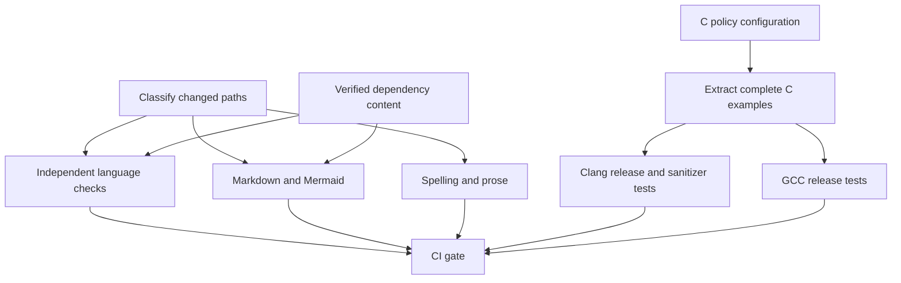

<!--
SPDX-FileCopyrightText: © 2026 Rafael V. Volkmer <rafael.v.volkmer@gmail.com>
SPDX-License-Identifier: GPL-3.0-only
-->

# Coil CI cache plane

Coil separates validation results from reusable dependency content. Independent lint jobs share a
pinned toolchain and content-addressed downloads. Trusted self-hosted runners can use nearby cache
services; GitHub-hosted runners provide the public validation path.

<details>
<summary>Contents</summary>

- [Runner boundary](#runner-boundary)
- [Service configuration](#service-configuration)
- [Cache hierarchy](#cache-hierarchy)
- [Validation graph](#validation-graph)
- [Security controls](#security-controls)
- [Local verification](#local-verification)
- [Links and references](#links-and-references)

</details>

---

## Runner boundary

`pull_request` and `merge_group` jobs use GitHub-hosted runners. Hosted isolation separates proposed
code from the private runner network and its credentials. Push and manual jobs can use the trusted
pool selected by `COIL_CI_RUNNER`. Leaving that repository variable unset selects `ubuntu-24.04`.

Service authentication and network policy enforce cache authorization. Workflow routing supplements
those controls. Issue private cache credentials to trusted runner identities and keep them outside
repository variables and committed files. Workload identity or a managed credential store avoids
static credentials in Kubernetes and VM deployments.

---

## Service configuration

Configure the runner service with its cache endpoints and workload identity:

```text
COIL_CI_CACHE_PLANE_MODE=optional
COIL_CI_TOOL_CACHE_DIR=/var/cache/coil/tools
COIL_CI_S3_CACHE_ENDPOINT=https://silo.ci.internal
COIL_CI_S3_CACHE_BUCKET=coil-ci-cache
COIL_CI_S3_CACHE_PREFIX=coil/cache
COIL_CI_S3_CACHE_REGION=us-east-1
HTTPS_PROXY=http://squid.ci.internal:3128
HTTP_PROXY=http://squid.ci.internal:3128
NO_PROXY=silo.ci.internal,registry.ci.internal,bazel-cache.ci.internal
COIL_CI_OCI_REGISTRY=registry.ci.internal:5000
COIL_CI_BAZEL_REMOTE_CACHE=grpcs://bazel-cache.ci.internal:9092
```

`COIL_CI_CACHE_PLANE_MODE` accepts `disabled`, `optional` or `required`. Required mode demands an
S3-compatible shared cache. OCI, Bazel and Squid have separate roles and requirements.

Remote S3 endpoints require HTTPS. Remote Bazel endpoints require HTTPS or gRPC with TLS. HTTP/gRPC
endpoints without encryption must identify `localhost` or `127.0.0.1` with an explicit port. This
exception supports runner-local services. Credentials use the standard AWS credential chain.

Provision OCI authentication and daemon mirror settings before the runner starts. CI jobs avoid
privileged daemon changes. Use the runner credential store for registry authentication.

---

## Cache hierarchy

The services have distinct data and trust boundaries:

```text
L0  runner-local immutable tool archives
L1  S3-compatible shared archives for trusted runners
H1  GitHub Actions archive cache for hosted runners
S1  OCI registry or mirror for container layers and manifests
S2  Bazel remote cache for build action outputs
E1  Squid for outbound traffic controls and eligible HTTP responses
O1  upstream HTTPS origin
```

The verified-download action checks L0 content before using the shared service or the origin. Hosted
runners without private cache access restore H1 archives. H1, OCI, Bazel and Squid are separate
services; they have separate authorization and integrity requirements.

Archive identities include platform, architecture, tool, version and SHA-256. The S3 key includes
the filename. The action verifies restored and downloaded content against the expected digest. A
shared-cache digest mismatch fails the job. Temporary files use exclusive creation, and verified
content reaches the cache through an atomic rename. Concurrent readers receive complete archives.

Default-branch pushes and manual runs can publish shared archives and Bazel results. PRs, merge
queues and tags have read access without publication rights. Hosted release and tag jobs fetch
verified tool archives from the upstream origin, bypassing H1 restoration and publication.

Use object-store lifecycle expiration with bounded retention. Expire incomplete multipart uploads
through the storage service. OCI retention precedes garbage collection; Distribution garbage
collection requires blocked writes or a registry implementation supporting collection during writes.

Squid preserves end-to-end HTTPS through `CONNECT`; encrypted response bodies remain opaque to its
HTTP cache. Avoid TLS interception for cache hit rates. Use the proxy's supported LRU disk policy
for eligible responses. Put private cache endpoints in `NO_PROXY` to keep their traffic on the
runner network.

The Bazel action generates a temporary rc file with download verification and event-scoped upload
permissions. A Bazel workspace enables `bazel test //...`; without a workspace, CI checks the
integration configuration. For `bazel-remote`, bounded disk storage, LRU eviction and zstd
compression control space usage. NVMe storage near the runners reduces storage and network latency.

---

## Validation graph

Changed-area detection selects independent language and document checks. Integration, release and
manual validation retain the full graph. The final gate rejects failed prerequisites. A cache hit
supplies inputs; test execution determines the result.



Markdown and Mermaid share one runner and one locked npm installation. Their cache contains package
content; installed `node_modules` and generated executables remain outside it. The exact key
includes the lock digest, Node version, operating system and architecture. `npm ci --ignore-scripts`
checks package integrity and prevents dependency install hooks. Proposed changes receive read access
to this cache.

The security job audits the dependency lock without installing packages. Scheduled runs check new
advisories against the current lock. Transitive overrides cover these findings:

- [Template injection][fix-code].
- [Prototype pollution][fix-data].
- [Parser infinite loops][toml-loop].

Upstream pin updates can replace these overrides following a security review.

The Mermaid validator recognizes nested and tilde Markdown fences, `.mmd` files and `.mermaid`
files. It invokes the official parser without Chromium or diagram rendering. A worker enforces
memory and time budgets. File size, diagram size, diagram count and diagnostic size have explicit
limits. Lua handles discovery and orchestration; an embedded adapter calls the Mermaid JavaScript
API.

The example checker extracts 24 complete files into a private directory. Clang release, GCC release
and sanitizer builds share one runner with bounded build parallelism. CTest and clang-tidy execute
for the current source state. Invalid failure fragments stay outside executable tests. Contextual
snippets describe contracts within a surrounding implementation.

Measure runner queue time, setup time, cache source, download time and test time before adding jobs
or cache layers. Compare archive transfer costs with build costs before caching small builds.
Persistent build caches must preserve content addressing, platform separation and trust separation.
Runner-fleet measurements establish the achieved speedup.

---

## Security controls

These project threat associations guide review and testing. They supplement branch protection,
service authorization, credential rotation and runner isolation; they make no claim of an official
equivalence mapping.

- Workflow inputs remain environment values and quoted arguments. Path and output validation reject
  traversal and injected records: [CWE-22][cwe-22], [CWE-78][cwe-78], [CWE-93][cwe-93],
  [CAPEC-88][capec-88], [OWASP CICD-SEC-4][owasp-pipeline].
- Archive digests and npm integrity fields verify restored dependency content. Install hooks stay
  disabled: [CWE-494][cwe-494], [CAPEC-184][capec-184], [OWASP CICD-SEC-9][owasp-integrity].
- Dependency audits and patched transitive dependencies reduce exposure to known vulnerabilities:
  [CWE-1395][cwe-1395], [OWASP CICD-SEC-3][owasp-chain].
- Default-branch publication and hosted proposed-code isolation separate cache writers by trust:
  [CWE-829][cwe-829], [OWASP CICD-SEC-5][owasp-access].
- TLS protects remote cache traffic and artifact redirects. Exceptions without encryption require
  loopback origins: [CWE-319][cwe-319].
- Exclusive temporary-file creation and owned-directory cleanup limit path attacks:
  [CWE-377][cwe-377], [CWE-22][cwe-22].
- Job, transfer, build and parser budgets bound resource use: [CWE-400][cwe-400].
- JSON-encoded diagram errors and credential-free cache summaries protect diagnostic output:
  [CWE-117][cwe-117], [OWASP CI/CD guidance][owasp-ci].

The Lua security suite tests traversal, output injection, malformed identities, cache publication
rights, remote transport and Bazel rc injection. Actionlint and Zizmor inspect the workflow graph.
Mermaid regression checks cover valid, invalid, empty and nested diagrams, plus worker termination.
The example checker requires external references for 208 pitfalls and checks the named source
inventory.

---

## Local verification

Install the locked tools and run the entry points from the repository root. `COIL_CLANG_FORMAT` and
`COIL_CLANG_TIDY` select pinned executables without changing the system installation.

```text
lua tests/lint/ci-policy-test-suite.lua
lua scripts/ci/check_mermaid.lua
lua scripts/ci/check_c.lua
lua scripts/ci/check_doc_examples.lua
```

---

## Links and references

The [GitHub security reference][github-security], [cache security guidance][github-cache] and
[Mermaid API documentation][mermaid-api] describe the platform boundaries used above.

[cwe-22]: https://cwe.mitre.org/data/definitions/22.html
[cwe-78]: https://cwe.mitre.org/data/definitions/78.html
[cwe-93]: https://cwe.mitre.org/data/definitions/93.html
[cwe-117]: https://cwe.mitre.org/data/definitions/117.html
[cwe-319]: https://cwe.mitre.org/data/definitions/319.html
[cwe-377]: https://cwe.mitre.org/data/definitions/377.html
[cwe-400]: https://cwe.mitre.org/data/definitions/400.html
[cwe-494]: https://cwe.mitre.org/data/definitions/494.html
[cwe-829]: https://cwe.mitre.org/data/definitions/829.html
[cwe-1395]: https://cwe.mitre.org/data/definitions/1395.html
[capec-88]: https://capec.mitre.org/data/definitions/88.html
[capec-184]: https://capec.mitre.org/data/definitions/184.html
[owasp-pipeline]:
  https://owasp.org/www-project-top-10-ci-cd-security-risks/CICD-SEC-04-Poisoned-Pipeline-Execution
[owasp-access]:
  https://owasp.org/www-project-top-10-ci-cd-security-risks/CICD-SEC-05-Insufficient-PBAC
[owasp-integrity]:
  https://owasp.org/www-project-top-10-ci-cd-security-risks/CICD-SEC-09-Improper-Artifact-Integrity-Validation
[owasp-chain]:
  https://owasp.org/www-project-top-10-ci-cd-security-risks/CICD-SEC-03-Dependency-Chain-Abuse
[owasp-ci]: https://cheatsheetseries.owasp.org/cheatsheets/CI_CD_Security_Cheat_Sheet.html
[github-security]: https://docs.github.com/en/actions/reference/security/secure-use
[github-cache]:
  https://docs.github.com/en/actions/reference/workflows-and-actions/dependency-caching
[mermaid-api]: https://mermaid.js.org/config/usage
[fix-code]: https://github.com/advisories/GHSA-r5fr-rjxr-66jc
[fix-data]: https://github.com/advisories/GHSA-f23m-r3pf-42rh
[toml-loop]: https://github.com/advisories/GHSA-7w5x-hrqm-74c2
